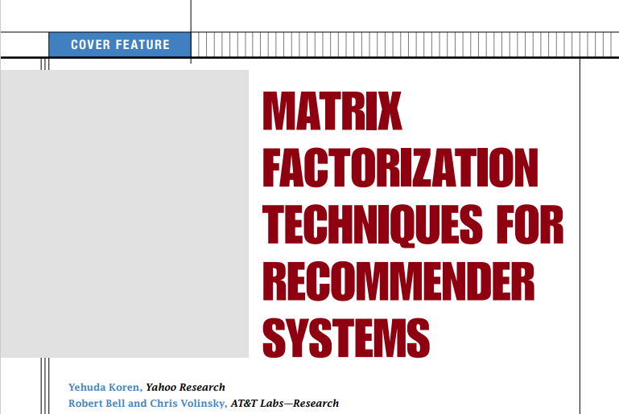

## [2009_IEEE] MATRIX_FACTORIZATION_TECHNIQUES_FOR_RECOMMENDER_SYSTEMS

---

### Abstract
- In Producing product Recomeender System,  
　Matrix Factorization > Classic NN  
　(+) implict feedback  
　(+) temporal effect  
　(+) confidence levels  

---
### Strategies(2)
##### a. Content Filtering: user/item profile
##### b. Collaborative Filtering: relationship user-item interaction
　ㄴ장점: domain free  
　ㄴ단점: cold start problem  
　ㄴArea(2): neighborhood methods  
　　　　　　latent factor models  
=> 일반적으로는 컨텐츠 기반 기술이, 특정 area에는 collaborative filtering 이 정확도가 높음

---
### Methods
explicit feedback(spease) -> + implicit feedback(dense)

---
### Basic Model

$f$: user-item latent factor space   
$q_i \in \mathbb{R}^f$: item vector   
$p_u \in \mathbb{R}^f$: user vector   
  
$$\hat{r}=q_i^Tp_u$$: dot product => user-item interaction   

SVD - user-item rating matrix(sparse)  
　imputation fill - expensive/distort  
　overfitting -> avoid => regularization  

Minimizes the regularized squared error:  
$$min\sum_{(u,i)\in \kappa}(r_{ui}-q_i^Tp_u)+ \lambda (\left \| q_i \right \|^2+\left \| p_u \right \|^2)$$: Error + Regulization  

$\kappa$: set of (u,i) pair  
$r_{ui}$: training set  

---
### Learning Algorithms
##### a. SGD(Stochastic Gradient Descent)
$e_{ui}=r_{ui}-q_i^Tp_u$  
- $q_i \leftarrow q_i + \gamma (e_{ui}*p_u-\lambda *q_i)$  
- $p_u \leftarrow p_u + \gamma (e_{ui}*q_i-\lambda *p_u)$  

##### b. ALS(Alternating least squares)
case1) parallelization -> compute each  
case2) contered on implict data, not sparse  

---
### Adding Biases: 쏠린 데이터 설명 

$b_{ui} = \mu  + b_i+ b_u$   
($\mu$ : global average)  

$\hat{r}_{ui} = \mu+ b_i+ b_u + q_i^Tp_u$  
 = bias + interaction  

$min_{p,q,b}\sum_{(u,i)\in \kappa}(\mu- b_i- b_u - q_i^Tp_u)^2 + \lambda (\left \| q_i \right \|^2+\left \| p_u \right \|^2 + b_u^2 + b_i^2)$  

---
### Additional input sources - cold start problem  
implict feedback - 사용자 행동 데이터   

$N(\mu)$  

$\sum_{i\in N(\mu)} x_i$  

$| N(\mu)|^{-0.5}\sum_{i \in N(\mu)} x_i^{4.5}$  

---
### Temporal Pynamics
effects  
Dynamic(User)  
$b_i(t)$: item's popularity change  
$b_u(t)$: baseline rating change  
$p_u(t)$: perference change  
Static(Itme)  
$q_i$: item characteristics  

---
### Input with varying confidence levels
observed rating $\neq$ same weight/confident  

$c_{ui}$ : confidence   

$[]$

---
