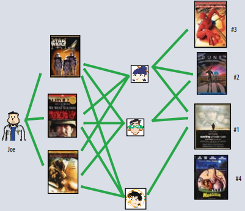
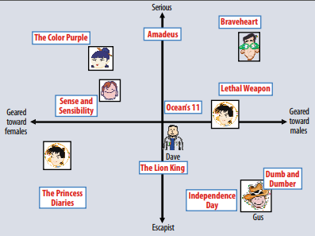

## [2009_IEEE] MATRIX_FACTORIZATION_TECHNIQUES_FOR_RECOMMENDER_SYSTEMS

---

### Abstract
- In Producing product Recomeender System,  
　Matrix Factorization > Classic NN  
　(+) implict feedback  
　(+) temporal effect  
　(+) confidence levels  

---
### 추천 시스템 Strategies(2)
##### a. Content Filtering: user/item profile

##### b. Collaborative Filtering: relationship user-item interaction
* 장점: domain free, generally more accuracy
* 단점: cold start problem  
* Area(2): 
  - neighborhood methods  

- latent factor models  

 

---
### Matrix Factorization Methods
explicit feedback(spease) -> + implicit feedback(dense)
* 강점: 추가 정보를 통합 할 수 있음 
---
### Matrix Factorization Basic Model

* 사용자와 아이템 잠재 요인 공간에 매핑, 상호작용이 공간에서 모델링  
: user-item latent space  
: item vector   
: user vector   
          
: 추정치(dot product) => user-item interaction   

* SVD - user-item rating matrix(sparse)  
　imputation fill - expensive/distort  
　overfitting -> avoid => regularization  
  
* 모델 업데이트    

: (min) Error + Regulization  

: set of (u,i) pair training set

---
### Learning Algorithms
- 위 수식을 minimize 하기 위한 접근법(2)  
##### a. SGD(Stochastic Gradient Descent)
* 에러를 구하고  
  
* 경사를 업데이트  
  
* 강점: 구현 용이성, 빠른 러닝 타임  

##### b. ALS(Alternating least squares)
*  나  모두 미지수이므로 convex 하지 않음  
* 둘 중 하나를 고정하면 convex 하여 풀 수 있음  
* 일반적으로 SGD가 쉽고 빠르지만 ALS 가 유리한 2가지 케이스 존재
  - case1) 병렬화 사용 가능 -> compute each  
  - case2) 암시적 데이터 중심(희소하지 않음)

---
### Adding Biases 
* 상호작용과 관계 없는 변동/쏠림 => 편향/절편  
  - 편향을 식별하여 실제 상호 작용 부분만 모델링 적용  

* Bias 식별:  

: global average
: item bias
: user bias  
  
* 편향을 반영하여 수식 수정 

 = bias + interaction  
* 모델 업데이트  
: (min) Error + Regulization + Bias

---
### Additional Input Sources 
* cold start problem 완화를 위한 추가 정보 소스 
  * +implict feedback

: 사용자 u가 암시적 선호를 표현한 항목 집합 -> 프로파일링  
* item i의 새로운 item factors 집합 
  
* 정규화
  

* domographics 인구통계  
: 사용자 u의 속성 boolean 속성 집합  
* 사용자 관련 속성 집합 

* 수식 업데이트  

: bias + interaction + 사용자 implicit feedback + boolean 속성  

---
### Temporal Pynamics
* time-drifting> [Dynamic(User)] -> evolve -> redefine  
  * Matrix factorization 접근법은 시간 효과 모델링에 적합 -> 정확도 개선   
: item's popularity change  
: baseline rating change  
: perference change  
* [Static(Itme)]  
: item characteristics  

* 수식 업데이트  
: bias + interaction + 사용자 implicit feedback + dynamic prediction rule  

---
### Input with Varying Confidence Levels
* 원인: 외부적 요인, 적대적 사용자, implicit feedback 사용  
* 방안: 예상선호도 + 신뢰도 점수  
  * 신뢰도: 사용 가능한 수치값 => 반복 이벤트로 사용자 의견 반영 가능성 높임  
  * 신뢰 수준별 가중치 부여 
* 모델 업데이트   
: (min) Error + Regulization + Bias + 가중치 부여  

 : confidence   