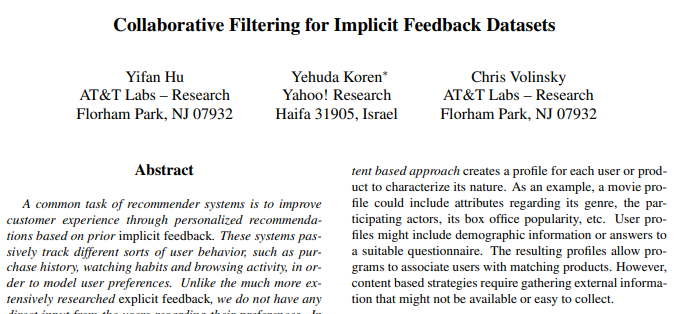

## [2008_IEEE_CFfIFD] Collaborative_Filtering_for_Implicit_Feedback_Datasets

---

### Abstract  
* 추천시스템: prior implicit feedback > personalized > improve UX  
  - 고객 dislike 정보 부족  
* 제안:  
  - 다양한 신뢰수준, 긍/부정 선호도 > 암시적 피드백 추천자 요인 모델   
  - 데이터 크기에 따라 선형 확장 가능한 최적화 절차  

---
### 1. Introduction
* 요구: 개인화된 사용자 취향/요구에 맞는 제품/서비스 추천  
* 기술: 사용자-제품 프로파일링, 관계 찾는것  
* 전략(2)/+조합
  - 컨텐스 기반 접근 방식: 사용자/제품 프로파일(구하기 어려운 explicit feedback 요구)  
  - 협업 필터링: 사용자 간의 관계와 제품 ​​간의 상호 종속성 분석(사용자의 과거 행동-explicit feedback 요구 X)   
      - 결과: 새로운 사용자-아이팀 연관성 식별  
      - 장점: 도메인 free, 컨텐츠 기반 기술이 처리하기 어려운 데이터 측면 처리 가능, 일반적으로 컨텐츠 기반 기술보다 정확  
      - 단점: cold start 
* Input(2)  
  - explicit: high quality, convenience, not always available  
    - 한계: 평가 꺼리거나 수집할 수 없는 상황  
  - implicit: 사용자 행동 추론, 간접 의견  
    - 극복: 사용자가 수집에 승인하면 추가적 피드백 불필요   
* Implicit feedback 특성  
  - 1) No negative feedback: dislike 추론 어려움(결측치와 구분), 근본적인 비대칭  
    - 부정 암시적 피드백 존재할 결측 데이터 처리 필요  
  - 2) inherently noisy  
    -  수동적 추적, 사용자 선호도/동기만 추측(물건을 샀다고 만족을 보장하는건 아님)  
  - 3) 명시적 피드백 수치 = 선호도 | 암시적 피드백 수치 = 신뢰도   
    - 명시적(1~5점), 암시적(행동 빈도-일회성 작업, 반복=> 사용자 의견 반영)(값-신뢰도 비례 보장 X)  
  - 4) 평가를 위한 적절한 조치 필요  
    - 가용성, 다른 item과 경쟁/반복 고려  

---
### 2. Preliminaries  
user: u, v  
item: i, j  
* : observation, user-item association  
  * explicit feedback: item에 대한 user의 선호도 등급  
    * unknown user-item pair - ignore  
  * implicit feedback: user action에 대한 관찰  
    * assign all  variables - 0  

---
### 3 Previous work  
#### 3.1 Neighborhood models - common approach   
* approch  
  * user-oriented: 같은 생각을 가진 사용자의 평가를 기반으로 추정  
  * item-oriented: 유사 항목에 대해 동일한 사용자가 만든 알려진 등급으로 추정   
  * => user < item : 확장성, 정확도 향상, 추론 설명 적합  
    * 선호 item 파악보다 like-mind user 특정이 어려움  
    * 암시적 피드백과 관련하여 단점 공유  
    * 사용자 선호도, 신뢰도 구별할 수 있는 유연성 제공 X  

* : item i에 대해 user u가 관찰하지 않은 값, 인접 항목에 대한 평점의 가중 평균   

*   

  * : item i와 item j의 유사성(Pearson 상관계수 기반)  

  * : item i와 가장 유사한 user u가 평가된 k개 item 이웃 집합  

#### 3.2 Latent factor model - alternative approach  
* 목표: 관찰된 등급을 설명하는 Latent factor를 발견하는것  
* pLSA, neural networks, Latent Dirichlet Allocation

* user-item 관찰 matrix의 SVD(Singular Value Decomposition) 유도 모델  
  * 정확성, 확장성  
  * typical 모델: 각각 연관, user u  item i   
    * 예측: 내적 , parameter estimation(모수추정)  

* explicit feedback regularized 모델(과적합 피하며 관찰 등급 직접 모델링)    

*   

  * 파라미터: SGD 학습  
  * 3.1 Neighborhood model 보다 성능 우수 경향  
  * => implicit feedback 모델로 접근 방식 차용  

---
### 4. Our model

in this section we describe our model for implicit feedback. 
First, we need to formalize the notion of confidence which the rui variables measure. 
To this end, let us introduce a set of binary variables pui, which indicates the preference of user u to item i. 
The pui values are derived by binarizing the rui values:
이 섹션에서는 암시 적 피드백에 대한 모델을 설명합니다.
먼저 rui 변수가 측정하는 신뢰 개념을 공식화해야합니다.
이를 위해 사용자 u가 항목 i에 대한 선호도를 나타내는 이진 변수 pui 세트를 소개하겠습니다.
pui 값은 rui 값을 이진화하여 파생됩니다.

  

In other words, if a user u consumed item i (rui > 0), then we have an indication that u likes i (pui = 1). 
On the other hand, if u never consumed i, we believe no preference (pui = 0). 
However, our beliefs are associated with greatly varying confidence levels. 

즉, 사용자 u가 항목 i를 소비했다면 (rui> 0), u가 i를 좋아한다는 표시를 갖게됩니다 (pui = 1).
반면에 u가 i를 소비하지 않았다면 우리는 선호하지 않는다고 믿습니다 (pui = 0).
그러나 우리의 신념은 매우 다양한 신뢰 수준과 관련이 있습니다.

First, by the nature of the data zero values of pui are associated with low confidence, as not taking any positive action on an item can stem from many other reasons beyond not liking it. 

For example, the user might be unaware of the existence of the item, or unable to consume it due to its price or limited availability.
 In addition, consuming an item can also be the result of factors different from preferring it. 

 첫째, 데이터의 특성상 pui의 0 값은 낮은 신뢰도와 관련이 있습니다. 항목에 대해 긍정적 인 조치를 취하지 않는 것은 그것을 좋아하지 않는 것 이상의 다른 많은 이유에서 기인 할 수 있기 때문입니다.

예를 들어 사용자가 항목의 존재를 인식하지 못하거나 가격 또는 제한된 가용성으로 인해 항목을 소비하지 못할 수 있습니다.
  또한 항목을 소비하는 것은 선호하는 것과 다른 요인의 결과 일 수도 있습니다.

For example, a user may watch a TV show just because she is staying on the channel of the previously watched show. 
Or a consumer may buy an item as gift for someone else, despite not liking the item for himself. 

예를 들어, 사용자는 이전에 시청 한 프로그램의 채널에 머무르기 때문에 TV 프로그램을 시청할 수 있습니다.
또는 소비자는 자신이 좋아하지 않는 상품을 다른 사람에게 선물로 구매할 수 있습니다.

Thus, we will have different confidence levels also among items that are indicated to be preferred by the user. 
In general, as rui grows, we have a stronger indication that the user indeed likes the item. Consequently, we introduce a set of variables, cui, which measure our confidence in observing pui. 
A plausible choice for cui would be:

따라서 사용자가 선호하는 것으로 표시된 항목 간에도 신뢰 수준이 다릅니다.
일반적으로 rui가 성장함에 따라 사용자가 실제로 항목을 좋아한다는 표시가 더 강해집니다. 결과적으로 우리는 pui 관찰에 대한 우리의 신뢰도를 측정하는 일련의 변수 cui를 소개합니다.
cui에 대한 그럴듯한 선택은 다음과 같습니다.

  

*   

*   

* 

*   
  
*   

  

---
### 5. Explaining recommendations

*   

---  
### 6. Experimental study

#### Data description  

*   
*   

#### Evaluation methodology  

*   

*   

#### Evaluation results  

*   

*   

---
### 7. Discussion

min_{x*,y*}\sum_{u,i}c_{ui}(p_{ui}-x_u^T y_i)^2 + \lambda(\sum_u \left \| x_u \right \|^2 + \sum_i \left \| y_i \right \|^2)
x_u = (Y^TC^uY + \lambda I)^{-1}Y^T C^u p(u)
y_i = (X^T C^i X + \lambda I)^{-1} X^T C^i p(i)
c_{ui} = 1 + \alpha log (1 + r_{ui} / \epsilon )

\hat p _{ui} = \sum_{j:r_{uj} > 0}s_{ij}^u c_{uj}

\overline{rank} = \frac{\sum_{u,i} r_{ui}^t rank_{ui}}{\sum_{u,i} r_{ui}^t}

min_{x*,y*}\sum_{u,i}(r_{ui}-x_u^T y_i)^2 + \lambda_1(\sum_u \left \| x_u \right \|^2 + \sum_i \left \| y_i \right \|^2)

min_{x*,y*}\sum_{u,i}(p_{ui}-x_u^T y_i)^2 + \lambda_2(\sum_u \left \| x_u \right \|^2 + \sum_i \left \| y_i \right \|^2)