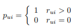

## [2008_IEEE_CFfIFD] Collaborative_Filtering_for_Implicit_Feedback_Datasets

---

### Abstract  
* 추천시스템: prior implicit feedback > personalized > improve UX  
  - 고객 dislike 정보 부족  
* 제안:  
  - 다양한 신뢰수준, 긍/부정 선호도 > 암시적 피드백 추천자 요인 모델   
  - 데이터 크기에 따라 선형 확장 가능한 최적화 절차  

---
### 1. Introduction
* 요구: 개인화된 사용자 취향/요구에 맞는 제품/서비스 추천  
* 기술: 사용자-제품 프로파일링, 관계 찾는것  
* 전략(2)/+조합
  - 컨텐스 기반 접근 방식: 사용자/제품 프로파일(구하기 어려운 explicit feedback 요구)  
  - 협업 필터링: 사용자 간의 관계와 제품 ​​간의 상호 종속성 분석(사용자의 과거 행동-explicit feedback 요구 X)   
      - 결과: 새로운 사용자-아이팀 연관성 식별  
      - 장점: 도메인 free, 컨텐츠 기반 기술이 처리하기 어려운 데이터 측면 처리 가능, 일반적으로 컨텐츠 기반 기술보다 정확  
      - 단점: cold start 
* Input(2)  
  - explicit: high quality, convenience, not always available  
    - 한계: 평가 꺼리거나 수집할 수 없는 상황  
  - implicit: 사용자 행동 추론, 간접 의견  
    - 극복: 사용자가 수집에 승인하면 추가적 피드백 불필요   
* Implicit feedback 특성  
  - 1) No negative feedback: dislike 추론 어려움(결측치와 구분), 근본적인 비대칭  
    - 부정 암시적 피드백 존재할 결측 데이터 처리 필요  
  - 2) inherently noisy  
    -  수동적 추적, 사용자 선호도/동기만 추측(물건을 샀다고 만족을 보장하는건 아님)  
  - 3) 명시적 피드백 수치 = 선호도 | 암시적 피드백 수치 = 신뢰도   
    - 명시적(1~5점), 암시적(행동 빈도-일회성 작업, 반복=> 사용자 의견 반영)(값-신뢰도 비례 보장 X)  
  - 4) 평가를 위한 적절한 조치 필요  
    - 가용성, 다른 item과 경쟁/반복 고려  

---
### 2. Preliminaries  
user: u, v  
item: i, j  
* : observation, user-item association  
  * explicit feedback: item에 대한 user의 선호도 등급  
    * unknown user-item pair - ignore  
  * implicit feedback: user action에 대한 관찰  
    * assign all  variables - 0  

---
### 3 Previous work  
#### 3.1 Neighborhood models - common approach   
* approch  
  * user-oriented: 같은 생각을 가진 사용자의 평가를 기반으로 추정  
  * item-oriented: 유사 항목에 대해 동일한 사용자가 만든 알려진 등급으로 추정   
  * => user < item : 확장성, 정확도 향상, 추론 설명 적합  
    * 선호 item 파악보다 like-mind user 특정이 어려움  
    * 암시적 피드백과 관련하여 단점 공유  
    * 사용자 선호도, 신뢰도 구별할 수 있는 유연성 제공 X  

* : item i에 대해 user u가 관찰하지 않은 값, 인접 항목에 대한 평점의 가중 평균   

*   

  * : item i와 item j의 유사성(Pearson 상관계수 기반)  

  * : item i와 가장 유사한 user u가 평가된 k개 item 이웃 집합  

#### 3.2 Latent factor model - alternative approach  
* 목표: 관찰된 등급을 설명하는 Latent factor를 발견하는것  
* pLSA, neural networks, Latent Dirichlet Allocation

* user-item 관찰 matrix의 SVD(Singular Value Decomposition) 유도 모델  
  * 정확성, 확장성  
  * typical 모델: 각각 연관, user u  item i   
    * 예측: 내적 , parameter estimation(모수추정)  

* explicit feedback regularized 모델(과적합 피하며 관찰 등급 직접 모델링)    

*   

  * 파라미터: SGD 학습  
  * 3.1 Neighborhood model 보다 성능 우수 경향  
  * => implicit feedback 모델로 접근 방식 차용  

---
### 4. Our model

* :  이진화 파생(이진 변수)  
*   
  * user u가 item i를 소비하면 1(선호한다), 소비하지 않으면 0(선호하지 않는다)  
  *  의 낮은 신뢰도
    * 선호도 이외에 다른 요인으로 결과  
    * 같은 값(0/1) 이라도 다른 의미(다른 신뢰수준)  
    * => :  의 신뢰도 측정 변수   
      *   

        * 더 많은 관찰 시 신뢰도 증가(α: 증가율 제어)  

* 목표: user u, item i에 대한 벡터를 찾는것  
  *   

    * 사용자 요인, 항목 요인, 직접 비교할 수 있는 공통 잠재 요인 공간에 매핑()    
  * 선호도 가정 => 내적  
    *   
    * SVD 와 차이점(explicit feedback)  
      * 다양한 신뢰수준 설명해야함  
      * 가능한 모든 (u, i) 쌍 고려 > 관찰 데이터   
  * 비용함수  
    *   

      * (min) 신뢰도(이진 - 예측치) + 규제  
      * m: user 수, n: item 수 (수가 많아 SGD같은 최적화 기술 부적합)  
      * => 효율적 최적화 프로세스 필요  

* 비용함수 user-factors or the item-factors 고정  
  * quadratic > global minimum >> 교대 최소 제곱 최적화 '프로세스' 필요  

* 최적의 프로세스 제안  
  * 1) 모든 user factor 재계산  
    *     

      * Y (n*f matrix): 모든 item factor  
      * : 각 user u,  인 대각행렬 n X n  
      * : 모든 user 선호도 포함 벡터( values)  
      * running time이 input 크기에 선형적(linear)  
  * 2) item 함수 재계산(병렬 방식)
    *   

      * A typical number of sweeps is 10  
      * whole process는 input 크기에 선형적  
  * 추가적인 대안
    *   

---
### 5. Explaining recommendations
* 좋은 추천 + **간략한 설명**  
  * user 신뢰도, 올바른 관점의 추천, 디버깅, 예기치 못한 동작 원인 추적   
  * 설명 제공을 위한 기술(2)  
    * a) 간단함> neighborhood-based(or, “memory-based”): 과거 user 행동 직접 추론  
    * b) 어려움> latent factor models : 과거 user 행동 직접 추상화(추천과 관계 차단됨)  
      * user 요소 대체 - ALS(alternating least squares model)  
        *   
        * item i에 대한 user u의 예측 선호도  에서 user 요소  대체 
        * =>    
          * 간략화  (가중치 f*f 행렬)  
        * user u의 관점에서 item i, j 사이의 가중치 유사성:   

* item i에 대한 user u의 예상 선호도 공식 업데이트  
  *    

    * 잠재 요인 모델을 선형 모델로 축소  

---  
### 6. Experimental study

#### Data description  
#### Evaluation methodology  
#### Evaluation results  

---
### 7. Discussion

이 작업에서 우리는 암시 적 피드백이있는 데이터 세트에 대한 협업 필터링을 연구했는데, 이는 매우 일반적인 상황입니다.
In this work we studied collaborative filtering on datasets with implicit feedback, which is a very common situation. 

우리의 주요 결과 중 하나는 암시 적 사용자 관찰이 두 쌍의 크기로 변환되어야한다는 것입니다.
One of our main findings is that implicit user observations should be transformed into two paired magnitudes: 

선호도 및 신뢰 수준. 즉, 각 사용자-항목 쌍에 대해 입력 데이터에서 사용자가 항목을 좋아하는지 싫어하는지 ( "선호") 추정치를 도출하고이 추정치를 신뢰 수준과 결합합니다.
preferences and confidence levels. In other words, for each user-item pair, we derive from the input data an estimate to whether the user would like or dislike the item (“preference”) and couple this estimate with a confidence level.

이 선호도 신뢰 파티션은 광범위하게 연구 된 명시 적 피드백 데이터 세트와 유사하지 않지만 암시 적 피드백을 분석하는 데 핵심적인 역할을합니다.
This preference-confidence partition has no parallel in the widely studied explicit-feedback datasets, yet serves a key role in analyzing implicit feedback.

우리는 선호도-신뢰성 패러다임을 직접적으로 다루는 잠재 요인 알고리즘을 제공합니다.
We provide a latent factor algorithm that directly addresses the preference-confidence paradigm. 

명시 적 데이터 세트와 달리 여기서 모델은 입력 관찰과 관련이없는 항목을 포함하여 모든 사용자 항목 선호도를 입력으로 가져야합니다 (따라서 선호도가 0임을 암시 함).
Unlike explicit datasets, here the model should take all user-item preferences as an input, including those which are not related to any input observation (thus hinting to a zero preference). 

이는 주어진 관찰이 본질적으로 긍정적 인 선호도에 편향되어있어 사용자 프로필을 잘 반영하지 않기 때문에 매우 중요합니다.
This is crucial, as the given observations are inherently biased towards a positive preference, and thus do not reflect well the user profile. 

그러나 모든 사용자 항목 값을 모델에 대한 입력으로 사용하면 심각한 확장 성 문제가 발생합니다.
However, taking all user-item values as an input to the model raises serious scalability issues 

– 일반적인 사용자가 사용 가능한 항목의 일부에 대해서만 피드백을 제공하기 때문에 이러한 모든 쌍의 수가 입력 크기를 크게 초과하는 경향이 있습니다.
– the number of all those pairs tends to significantly exceed the input size since a typical user would provide feedback only on a small fraction of the available items. 

우리는 모델의 대수적 구조를 활용하여 입력 크기에 따라 선형 적으로 확장되는 알고리즘으로 이어지는 문제를 해결하면서 하위 샘플링에 의존하지 않고 사용자 항목 쌍의 전체 범위를 처리합니다.
We address this by exploiting the algebraic structure of the model, leading to an algorithm that scales linearly with the input size while addressing the full scope of user-item pairs without resorting to any sub-sampling.

알고리즘의 흥미로운 특징은 최종 사용자에게 권장 사항을 설명 할 수 있다는 것입니다. 이는 잠재 요인 모델 중에서 드문 경우입니다.
An interesting feature of the algorithm is that it allows explaining the recommendations to the end user, which is a rarity among latent factor models. 

이것은 잘 알려진 항목 지향 이웃 접근법에 대한 놀랍고 희망적인 통찰력있는 링크를 보여줌으로써 달성됩니다.
This is achieved by showing a surprising and hopefully insightful link into the well known item-oriented neighborhood approach. 

이 알고리즘은 대규모 TV 추천 시스템의 일부로 구현되고 테스트되었습니다.
The algorithm was implemented and tested as a part of a large scale TV recommender system. 

우리의 설계 방법론은 암시 적 피드백 데이터 세트의 고유 한 속성과 계산 확장 성간에 적절한 균형을 찾기 위해 노력합니다.
Our design methodology strives to find a right balance between the unique properties of implicit feedback datasets and computational scalability. 

우리는 현재 계산 복잡성이 증가하는 대신 정확도를 향상시킬 수있는 수정을 모색하고 있습니다.
We are currently exploring modifications with a potential to improve accuracy at the expense of increasing computational complexity. 

예를 들어, 우리 모델에서 우리는 동일한 신뢰 수준으로 0 선호도와 관련된 모든 사용자 항목 쌍을 처리하기로 결정했습니다.
As an example, in our model we decided to treat all user-item pairs associated with a zero preference with the same uniform confidence level. 

대부분의 쌍이 선호도가 0 인 것과 관련되어 있기 때문에이 결정은 많은 계산 노력을 절약했습니다.
Since the vast majority of pairs is associated with a zero preference, this decision saved a lot of computational effort. 

그러나보다 신중한 분석은 항목의 가용성에 따라 이러한 0 값을 다른 신뢰 수준으로 분할합니다.
However, a more careful analysis would split those zero values into different confidence levels, perhaps based on availability of the item. 

TV 추천 예제에서 사용자가 프로그램을 보지 않았다는 사실은 사용자가 어떻게 ( '비정상적인'채널이나 시간대에 있음) 알 수 없거나 다른 좋아하는 프로그램이 있음을 의미 할 수 있습니다. 동시에 또는 사용자가 단순히 관심이 없음.
In our television recommender example, the fact that a user did not watch a program might mean that the user was not aware of the how (it is on an ’unusual’ channel or time of day), or that there is another favorite show on concurrently, or that the user is simply not interested. 

이들 각각은 서로 다른 시나리오에 해당하며 각각 "선호 없음"가정에서 고유 한 신뢰 수준을 보장 할 수 있습니다. 이것은 사용자가 특정 시간에 TV를 시청하는 경향을 다루는 동적 시간 변수를 추가하는 것입니다.
Each of these correspond to different scenarios, and each might warrant a distinctive confidence level in the “no preference” assumption. This leads us to another possible extension of the model – adding a dynamic time variable addressing the tendency of a user to watch TV on certain times. 

마찬가지로, 특정 프로그램 장르가 하루 중 다른 시간대에 더 인기가 있다는 것을 모델링하고 싶습니다.
Likewise, we would like to model that certain program genres are more popular in different times of the day.

이것은 지속적인 연구의 일부이며, 주요 과제는 우수한 계산 확장 성을 유지하면서 모델에 추가 된 유연성을 도입하는 방법 인 것 같습니다.
This is part of an ongoing research, where the main challenge seems to be how to introduce an added flexibility into the model while maintaining its good computational scalability.

마지막으로 표준 학습 및 테스트 설정은 모델이 향후 사용자 행동을 얼마나 잘 예측할 수 있는지 평가하도록 설계되었습니다.
Finally, we note that the standard training and test setup is designed to evaluate how well a model can predict future user behavior. 

그러나 이것은 사용자가 다른 방법으로 구매하거나 소비하지 않았을 수있는 항목을 알려주는 추천 시스템의 목적이 아닙니다.
However, this is not the purpose of a recommender system, which strives to point users to items that they might not have otherwise purchased or consumed.

심층적 인 사용자 연구 및 설문 조사를 사용하지 않고 그 목표를 평가하는 방법을보기는 어렵습니다.
It is difficult to see how to evaluate that objective without using in depth user study and surveying.

우리의 예에서 우리는 재 시청 한 쇼의 "쉬운"사례를 제거하여 방법을 평가함으로써 어떻게 든 새로운 쇼의 사용자 발견을 포착하려는 이상에 가까워 진다고 믿습니다.
In our example, we believe that by evaluating our methods by removing the “easy” cases of re-watched shows, we somehow get closer to the ideal of trying to capture user discovery of new shows.