## [2009_BPR] BPR: Bayesian Personalized Ranking from Implicit Feedback

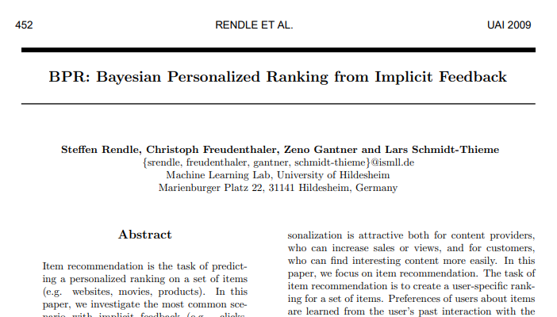

---

### Abstract  
* 항목 추천: item 집합에 대한 개인화 된 순위 예측   
  * implicit feedback 가장 일반적인 시나리오 조사  
    * 방법:  
      * MF(Matrix Factorization)  
      * kNN(Adaptive Knearest Neighbor)  
        * 개인화 된 랭킹 item 예측 ㅇ, *직접 최적화 ranking X*  
* BPR-Opt 제시  
  * Bayesian analysis 파생된 최대 사후 추정(maximum posterior estimator)  
  * => 개인화  된 랭킹에 대한 일반적인 최적화 기준  
  * BPR-Opt 모델 최적화 학습 알고리즘  
    * SGD with bootstrap sampling   

---
### 1. Introduction  
* Personalization recommendation - win-win : content providers + customers  
* **Item Recommendation**  
  * item set에 대한 user-specific ranking 만드는 것  
  * item에 대한 user preference: user-system 과거 상호작용으로 학습  
* scenarios  
  * explicit feedback   
  * implicit feedback: 실제 시나리오, 자동 추적(간접적), 상대적 수집 쉬움  

* 작업(4):    
  * 1) BPR-Opt: 최대 사후 추정기(maximum posterior estimator) 파생  
    - AUROC 최대화와 유사점  
  * 2) LearnBPR: BPR-Opt 최대화를 위한 SGD with Bootstrap sampling  
  * 3) state-of-the-art에 LearnBPR 적용 방법  
  * 4) BPR과 다른 학습 방법 비교  

--- 
### 2 Related Work  
* 가장 인기 있는 모델: kNN (k-nearest neighbor) 협업 필터링
  * 유사성 행렬: 휴리스틱(Pearson 상관 관계)> 모델 파라미터로 학습  
* 최근 인기 있는 모델: MF (Matrix Factorization) - implicit and explicit feedback  
  * 초기: SVD - [한계] overfitting > [극복] WR-MF(Weighted Regularized MF)> negative impact 줄일 수 있음 
* Hofmann - 확률론적 잠재 의미 모델(a probabilistic latent semantic model)
* Schmidt-Thieme - 다중 클래스 문제로 변환> 이진 분류기 집합으로 해결  
  
*▲ 모델 parameters 직접 최적화하지 않음*  
*▼ item 쌍 기반 최적화 순위 도출*  

* 모델 parameters의 offline learning  
  * online learning scenarios로 확장   

* one ranking만 학습(개인화 되지 않음)  
  * BPR 같은 fold-in strategy 사용 가능    
  * 비 협업 모델 순위 학습 관련 작업  
  * One direction은 순열 분포 모델링  
  * SGD 랭킹 모델> 신경망 모델 최적화  

* => 개인 순위별 학습 협업 모델 제안  

--- 
### 3 Personalized Ranking  
* item recommendation: 사용자에게 item ranking list 제공  
  * user implicit behavior: positive  
  * non-observed user-item pairs: negative + missing values  

#### 3.1 Formalization  
```
U: 모든 user 집합  
I: 모든 item 집합  
```
* implicit feedback: S ⊆ U ×I  
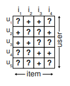  

* 모든 항목의 개인화된 total ranking:    
  - : 총 주문 속성  

* (전체) / (반대칭) / (전이성)   
  * 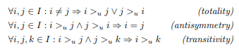  

* 편의를 위한 정의:  
  * 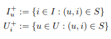  

#### 3.2 Analysis of the problem setting  
* implicit feedback(positive)  
  * remaining: negative + **missing values**   
* 결측치 접근 방안  
  * ignore  
    - typical machine learning model: 학습 할 수 없어짐  

* item 추천자 접근 방식
  * 일반적인 방식  
    *  예측: 사용자 선호도 반영하는 항목에 대한 개인화 된 점수> 점수에 따라 item 정렬> 순위  
  * 기계 학습(ML) 접근 방식  
    * (u, i) ∈ S, S: observed data   
    * positive class label 지정  
    * (U × I) \ S 다른 모든 조합에 negative 지정 
      * 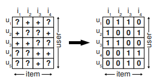  
    * [최적화] S = 1, 나머지 0 예측
    * 문제: 순위를 매겨야 하는 모든 요소((U × I) \ S)가 학습 중 negative feedback 으로 제공되어 순위를 매길 수 없음  
    * 해결: 과적합 방지(규제)  

  * 단일 항목 채점이 아닌 항목 쌍의 순위 최적화  
    * 누락 값 음수 대체보다 문제를 잘 표현  
    * 가정: 관찰 항목 > (선호) > 비 관찰 항목
    * 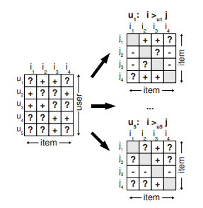  
      * u1이 i1은 보지 않고 i2는 보았으므로 i2를 더 선호한다고 가정  
      * 둘다 보지 않거나 둘다 본 item 간의 선호도는 추론 할 수 없음  
    * 공식화: training data DS : U × I × I  
      *   
      * (u, i, j) ∈ DS : 사용자 u가 j보다 i를 선호한다고 가정  
    * 장점(2):  
      * 훈련 데이터 구성: (positive,  negative) pairs + missing values(infer 대상)  
        * 훈련 데이터 DS와 테스트 데이터 분리  
      * 훈련 데이터 DS로 훈련   
--- 
### 4 Bayesian Personalized Ranking(BPR)  
* 개인화 된 순위를 위한 일반적인 방법  

#### 4.1 BPR Optimization Criterion  

* 개인화 된 순위 찾는 베이지안 공식: 사후 확률 최대화(posterior probability)  
  *   

    * 모든 item i ∈ I
    * Θ: 모델 클래스 매개 변수 벡터  
    * : 개인화 된 총 주문, user u 잠재 선호 구조   
    * 가정:
      * 모든 사용자는 서로 독립적 행동  
      * 특정 사용자 (i, j) 순서가 다른 pairs 순서와 무관
  <br>

* 사용자별 우도 함수() 단일 밀도 곱으로 재정의  
  *   

    * 모든 사용자 u ∈ U 에 대해 결합  
    * δ: indicator function  
    * 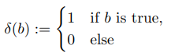  

  <br>

* pair 순서 체계의 전체성과 반대칭성에 의한 단순화  

    *   

<br>

* item j보다 item i를 실제로 선호 할 개별 확률 정의  
  * 속성(전체성 반대칭성 전이성) 충족되어야 함  
    *     

      * σ: logistic sigmoid   
      * : user u, item i, item j 사이 특수 관계 모델 파라미터 변수 벡터 Θ 임의의 실수 함수
        * 관계 모델링 기본 모델 클래스로 위임(MF, adaptive kNN)      
      *  통계적 모델링 가능  

<br>

* 일반 사전 밀도 p(Θ) 도입  
  *    
  
* 알려지지 않은 하이퍼 파라미터 수 줄이기 위해 설정  
  *   

* 개인화 된 순위 BPR-Opt 일반 최적화 기준 도출  
  * 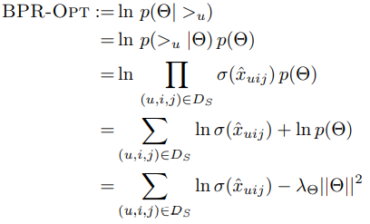  
    * : 모델별 규제 매개변수    


##### 4.1.1 Analogies to AUC optimization
* The AUC per user   
  *   

* AUC 평균  
  *   

* DS 표기법  
  *   
  * : 정규화 상수  
    *   
  * BPR-Opt의 유사: 정규화 상수, 손실함수만 다름  
  * δ (x> 0): Heaviside 함수(계단)와 동일한 미분 X 손실(non-differentiable loss )   
    * 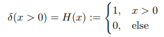  
  * => 미분 가능한 손실 대체: ln σ(x), motivated by MLE   
    * σ 와 유사한 모양의 함수(휴리스틱)  
    * 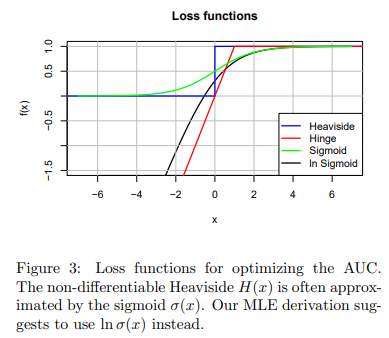  

#### 4.2 BPR Learning Algorithm  
* 미분 가능 > SGD(최적 X)> LearnBPR(SGD + bootstrap) 제안  
  * 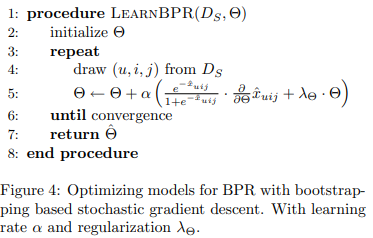  

* **LearnBPR(SGD + bootstrap):** 무작위로 (균일 분포 된) 트리플을 선택하는 SGD 알고리즘  

* user-wise gradient descent vs LearnBPR
  * 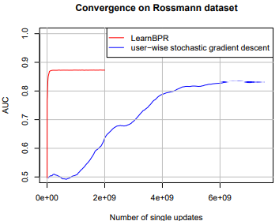  

#### 4.3 Learning models with BPR  
* LearnBPR로 MF kNN 학습 방법  

*   

  * triples (u, i, j) ∈ DS  
  * 모델에 대해 다른 기준으로 최적화함으로 더 나은 순위 기대  
  * 단일 값으로 회귀하지 않고 차이로 분류  

##### 4.3.1 Matrix Factorization  
* 예측 문제를 행렬 추정 문제로 변환  
  *    

    * X: 대상 행렬  
    * W: 순위 행렬  
  * 근사: |U| × k , H : |I| × k  
    * k: 근사치 차원/순위  
  
* 예측공식  
  *     

    * : W의 user u를 설명하는 특징 벡터  
    * : H의 각 행, item i 설명  

* 모델 매개 변수  
  * Θ = (W, H)  
    * 잠재변수: 관찰되지 않은 속성  

* ranking 작업: 사용자가 한 항목을 다른 항목보다 선호하는지 평가하는 작업      
  * BPR-Opt 기준 최적화 > LearnBPR 사용 달성    
    * LearnBPR: 변수 θ에 대한  기울기만 알면 가능   

##### 4.3.2 Adaptive k-Nearest-Neighbor  
* user-item 유사성 측정에 의존(past)  
* item 기반 k-NN 모델  
  *   
  
    * C : I × I : 대칭 항목 상관 / 항목 유사성 행렬  
    * Θ = C : kNN의 모델 매개 변수

* ranking 작업:  
  * BPR-Opt 기준 최적화 > LearnBPR 사용 달성    

--- 
### 5 Relations to other methods  
#### 5.1 Weighted Regularized Matrix Factorization (WR-MF)  
* SVD, minimizes the square-loss> (확장)> 과적합 방지(=규제) + 긍정적 피드백 영향↑(=오류함수 가중치)
* 최적화 기준  
  *   

    * : 튜플 (u, i) 가중치  
  * Hu et al.)  긍정적 피드백 위해 c_ui 추정 추가 데이터 + 나머지 c_ui = 1 설정  
  * Pan et al.) 긍정적 피드백 c_ui = 1 설정 + 나머지 더 낮은 상수 제안  

#### 5.2 Maximum Margin Matrix Factorization(MMMF)  
* Weimer et al.) 서수 순위(ordinal ranking) MMF(최대 마진 MF)  
* ratings - explicit feedback scenarios 위해 설계  
  * 관찰 => rating = 1  
  * 결측 => rating = 0  
  *    

* 최적화 기준
  *   
  * BPR과 차이점: 
    * error functions: hinge loss: smooth, MLE    
      * hinge loss:   
    * 적용: MF에만 적용    

--- 
### 6. Evaluation  
#### 6.1 Datasets  
 * Rossmann, Netflix  
#### 6.2 Evaluation Methodology  
 * Leave one out, AUC  
#### 6.3 Results and Discussion  
* 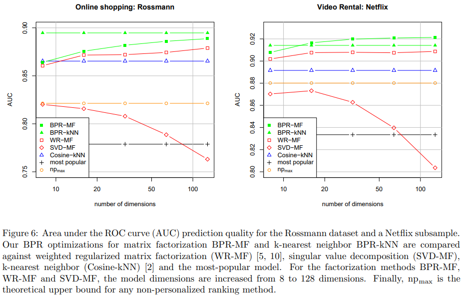   
#### 6.4 Non-personalized ranking  
* 개인화 되지 않은 순위 방식: 모든 사용자가 동일 순위  
* Fig6에  참고  

--- 
### 7. Conclusion  
