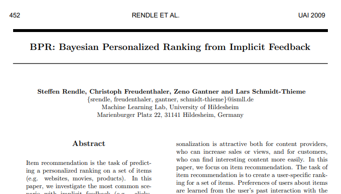
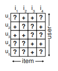
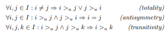
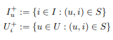
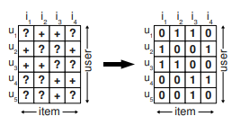
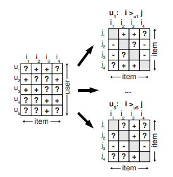

## [2009_UAI_BPR] BPR: Bayesian Personalized Ranking from Implicit Feedback



---

### Abstract  
* 항목 추천: item 집합에 대한 개인화 된 순위 예측   
  * implicit feedback 가장 일반적인 시나리오 조사  
    * 방법:  
      * MF(Matrix Factorization)  
      * kNN(Adaptive Knearest Neighbor)  
        * 개인화 된 랭킹 item 예측 ㅇ, *직접 최적화 ranking X*  
* BPR-Opt 제시  
  * Bayesian analysis 파생된 최대 사후 추정(maximum posterior estimator)  
  * => 개인화  된 랭킹에 대한 일반적인 최적화 기준  
  * BPR-Opt 모델 최적화 학습 알고리즘  
    * SGD with bootstrap sampling   

---
### 1. Introduction  
* Personalization recommendation - win-win : content providers + customers  
* **Item Recommendation**  
  * item set에 대한 user-specific ranking 만드는 것  
  * item에 대한 user preference: user-system 과거 상호작용으로 학습  
* scenarios  
  * explicit feedback   
  * implicit feedback: 실제 시나리오, 자동 추적(간접적), 상대적 수집 쉬움  

* 작업(4):    
  * 1) BPR-Opt: 최대 사후 추정기(maximum posterior estimator) 파생  
    - AUROC 최대화와 유사점  
  * 2) LearnBPR: BPR-Opt 최대화를 위한 SGD with Bootstrap sampling  
  * 3) state-of-the-art에 LearnBPR 적용 방법  
  * 4) BPR과 다른 학습 방법 비교  

--- 
### 2 Related Work  
* 가장 인기 있는 모델: kNN (k-nearest neighbor) 협업 필터링
  * 유사성 행렬: 휴리스틱(Pearson 상관 관계)> 모델 파라미터로 학습  
* 최근 인기 있는 모델: MF (Matrix Factorization) - implicit and explicit feedback  
  * 초기: SVD - [한계] overfitting > [극복] WR-MF(Weighted Regularized MF)> negative impact 줄일 수 있음 
* Hofmann - 확률론적 잠재 의미 모델(a probabilistic latent semantic model)
* Schmidt-Thieme - 다중 클래스 문제로 변환> 이진 분류기 집합으로 해결  
  
*▲ 모델 parameters 직접 최적화하지 않음*  
*▼ item 쌍 기반 최적화 순위 도출*  

* 모델 parameters의 offline learning  
  * online learning scenarios로 확장   

* one ranking만 학습(개인화 되지 않음)  
  * BPR 같은 fold-in strategy 사용 가능    
  * 비 협업 모델 순위 학습 관련 작업  
  * One direction은 순열 분포 모델링  
  * SGD 랭킹 모델> 신경망 모델 최적화  

* => 개인 순위별 학습 협업 모델 제안  

--- 
### 3 Personalized Ranking  
* item recommendation: 사용자에게 item ranking list 제공  
  * user implicit behavior: positive  
  * non-observed user-item pairs: negative + missing values  

#### 3.1 Formalization  
```
U: 모든 user 집합  
I: 모든 item 집합  
```
* implicit feedback: S ⊆ U ×I  
  

* 모든 항목의 개인화된 total ranking:    
  - : 총 주문 속성  

* (전체) / (반대칭) / (전이성)   
  *   

* 편의를 위한 정의:  
  *   

#### 3.2 Analysis of the problem setting  
* implicit feedback(positive)  
  * remaining: negative + **missing values**   
* 결측치 접근 방안  
  * ignore  
    - typical machine learning model: 학습 할 수 없어짐  

* item 추천자 접근 방식
  * 일반적인 방식  
    *  예측: 사용자 선호도 반영하는 항목에 대한 개인화 된 점수> 점수에 따라 item 정렬> 순위  
  * 기계 학습(ML) 접근 방식  
    * (u, i) ∈ S, S: observed data   
    * positive class label 지정  
    * (U × I) \ S 다른 모든 조합에 negative 지정 
      *   
    * [최적화] S = 1, 나머지 0 예측
    * 문제: 순위를 매겨야 하는 모든 요소((U × I) \ S)가 학습 중 negative feedback 으로 제공되어 순위를 매길 수 없음  
    * 해결: 과적합 방지(규제)  

  * 단일 항목 채점이 아닌 항목 쌍의 순위 최적화  
    * 누락 값 음수 대체보다 문제를 잘 표현  
    * 가정: 관찰 항목 > (선호) > 비 관찰 항목
    *   
      * u1이 i1은 보지 않고 i2는 보았으므로 i2를 더 선호한다고 가정  
      * 둘다 보지 않거나 둘다 본 item 간의 선호도는 추론 할 수 없음  
    * 공식화: training data DS : U × I × I  
      *   
      * (u, i, j) ∈ DS : 사용자 u가 j보다 i를 선호한다고 가정  
    * 장점(2):  
      * 훈련 데이터 구성: (positive,  negative) pairs + missing values(infer 대상)  
        * 훈련 데이터 DS와 테스트 데이터 분리  
      * 훈련 데이터 DS로 훈련   
--- 
### 4 Bayesian Personalized Ranking(BPR)  

#### 4.1 BPR Optimization Criterion  

#### 4.2 BPR Learning Algorithm  

#### 4.3 Learning models with BPR  

##### 4.3.1 Matrix Factorization  

##### 4.3.2 Adaptive k-Nearest-Neighbor  
--- 
### 5 Relations to other methods  

#### 5.1 Weighted Regularized Matrix Factorization (WR-MF)  

#### 5.2 Maximum Margin Matrix Factorization(MMMF)  
--- 
### 6. Evaluation  

#### 6.1 Datasets  

#### 6.2 Evaluation Methodology  

#### 6.3 Results and Discussion  

#### 6.4 Non-personalized ranking  
--- 
### 7 Conclusion  

