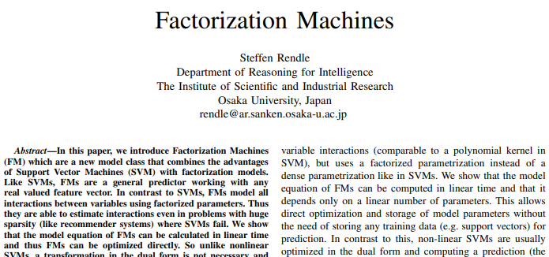

## 2012_IEEE_LARS [LARS: A Location-Aware Recommender System]

---
### Abstract  
* Factorization Machine(FM) = SVM(Support Vector Machine) + Factorization  
  * 인수 분해 된 매개 변수를 사용, 변수 간의 모든 상호 작용 모델링  
    * SVM 문제(huge sparsity) 동작 가능  
  * FM 모델 방정식: 선형 시간으로 계산, 직접 최적화 가능  
    * SVM 비선형 > 이중 형태 변환 필요 없으며, 제원 벡터 없이 직접 추정 됨  

* factorization models: 행렬 분해, 병렬 요인 분석, SVD++, PITF or FPMC  
  * 일반 예측 X, only special input data 작동    

---

### Index Terms 
* factorization machine; sparse data; tensor factorization; support vector machine  

---

### 1. INTRODUCTION  
* CF에서,  

||SVM|factorization machine models|
|---|---|---|
|특징|일반 예측자|모든 중첩 변수 상호 작용 모델링| 
|단점|희소 데이터에서 복잡한(비선형) 커널 공간에서 신뢰할 수 있는 매개변수(‘hyperplanes’) 학습 X |표준 예측 데이터 사용 X 특수 모델 적용 X |
|매개변수화|조밀 한 매개변수화|인수 분해 된 매개변수화|
|최적화|dual form 최적화|매개변수 직접 최적화/저장|
|계산|훈련데이터(support vectors)에 따라 예측 계산|선형 매개 변수 수에만 의존 > 선형 시간으로 계산|

* SVM + factorization machine models = **FM** 장점  
    * 1) SVM이 실패하는 매우 희소한 데이터에서 매개 변수 추정을 허용  
    * 2) 선형 복잡도, primal 에서 최적화, support vectors에 의존 X, 대규모 데이터 세트로 확장  
    * 3) FM은 실제값 feature 벡터와 함께 작동 할 수 있는 일반적인 예측기  
      * 입력 데이터 feature 벡터 정의 > state-of-the-art 모방(biased MF, SVD++, PITF or FPMC)  
