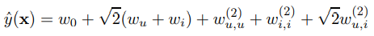

## 2012_IEEE_LARS [LARS: A Location-Aware Recommender System]


---
### Abstract  
* Factorization Machine(FM) = SVM(Support Vector Machine) + Factorization  
  * 인수 분해 된 매개 변수를 사용, 변수 간의 모든 상호 작용 모델링  
    * SVM 문제(huge sparsity) 동작 가능  
  * FM 모델 방정식: 선형 시간으로 계산, 직접 최적화 가능  
    * SVM 비선형 > 이중 형태 변환 필요 없으며, 제원 벡터 없이 직접 추정 됨  

* factorization models: 행렬 분해, 병렬 요인 분석, SVD++, PITF or FPMC  
  * 일반 예측 X, only special input data 작동    

---

### Index Terms 
* factorization machine; sparse data; tensor factorization; support vector machine  

---

### 1. INTRODUCTION  
* CF에서,  

||SVM|factorization machine models|
|---|---|---|
|특징|일반 예측자|모든 중첩 변수 상호 작용 모델링| 
|단점|희소 데이터에서 복잡한(비선형) 커널 공간에서<br>신뢰할 수 있는 매개변수(‘hyperplanes’) 학습 X |표준 예측 데이터 적용 X<br>특수 모델 적용 X |
|매개변수화|조밀 한 매개변수화|인수 분해 된 매개변수화|
|최적화|dual form 최적화|매개변수 직접 최적화/저장|
|계산|훈련데이터(support vectors)에 따라 예측 계산|선형 매개 변수 수에만 의존<br>> 선형 시간으로 계산|


* SVM + factorization machine models = **FM** 장점  
    * 1) SVM이 실패하는 매우 희소한 데이터에서 매개 변수 추정을 허용  
    * 2) 선형 복잡도, primal 에서 최적화, support vectors에 의존 X, 대규모 데이터 세트로 확장  
    * 3) FM은 실제값 feature 벡터와 함께 작동 할 수 있는 일반적인 예측기  
      * 입력 데이터 feature 벡터 정의 > state-of-the-art 모방(biased MF, SVD++, PITF or FPMC)  

### 2. PREDICTION UNDER SPARSITY  
* 가장 일반적인 예측 작업  
  * 
    * : 실수 값 feature 벡터  
    * T: target domain(e.g. T = R for regression or T = {+, −} for classification)  

* 훈련 데이터 세트(pairwise):   
* feature tuple   
  * 순위:  >   
  * 쌍별 순위 관계 비대칭 => 긍정적인 훈련 인스턴스만 사용 충분  

<br>

* x가 매우 희소한 경우 취급  
  * 거의 모든  = 0 인 문제   
  * 이유: 근본적인 문제가 큰 범주 형 변수 도메인을 다루기 때문  

<br>

* m(x): 0이 아닌 요소의 개수  
* : 0이 아닌 요소의 평균 개수  

<br>

#### Example 1) movie review system  
```
사용자 u ∈ U
아이템(영화) i ∈ I 
특정 시간 t ∈ R 
등급 r ∈ {1, 2, 3, 4, 5} 
```
사용자 U = {Alice (A), Bob (B), Charlie (C), . . .}
항목 I = {Titanic (TI), Notting Hill (NH), Star Wars (SW), Star Trek (ST), . . .}

관찰 된 데이터 S = {(A, TI, 2010-1, 5),(A, NH, 2010-2, 3),(A, SW, 2010-4, 1), (B, SW, 2009-5, 4),(B, ST, 2009-8, 5), (C, TI, 2009-9, 1),(C, SW, 2009-12, 5)}

*   
  * S에서 feature 벡터를 생성하는 방법  
  * |U| active user 이진 표시기 변수(파란색): 트랜잭션당 1 active user   
  * |I| active item 이진 표시기 변수(빨간색): 트랜잭션당 1 active item   
  * user 평가한 다른 모든 item에 대한 표시기 변수(노란색) - 정규화(합=1)  
    * 예: user A(Alice)는 TI(Titanic), NH(Notting Hill), SW(Star Wars) 평가  
  * 시간 변수 (녹색): 2009년 1 월 ~ 월단위  
  * (갈색): user가 active item 평가하기 전 평가 한 마지막 영화   

### 3. FACTORIZATION MACHINES(FM)  
#### A. Factorization Machine Model  
##### 1) Model Equation: 
* 2-way FM(d = 2): 변수 간의 모든 단일 및 쌍별 상호 작용 캡처  
  * .PNG)
    * : 전역 편향  
    * : i 번째 변수의 강도  
    * : <vi, vj> i, j 변수 간의 *상호 작용을 인수 분해하여 모델링*   
    * .PNG)
        * 추정해야하는 모델 매개 변수  
    * <·,·>: 크기가 k 인 두 벡터의 내적
    * .PNG)
        * vi행: V내에 k요인 가진 i번째 변수  
    * : factorization 차원 하이퍼파라미터  

##### 2) Expressiveness:  
* 정의 된 양의 행렬 W에 대해 k가 충분히 크다면,  가 되는 행렬 V가 존재    
  * = k가 충분히 크다면, FM이 상호작용행렬 W 표현 가능  
  * 단, 희소, W 추정 충분한 데이터 X => 작은 k 선택    
  * k(FM 표현력) 제한 => 일반화 ↑, W ↑  


##### 3) Parameter Estimation Under Sparsity:  
* sparse settings, 변수 간의 상호 작용을 직접적/독립적 추정, 충분한 데이터 X  
* FM: 상호 작용 매개 변수를 분해 > 독립성을 깨뜨림 > sparse settings에서도 상호작용 추정 가능  

*   
  * target y (rating) 예측을 위한 user A(Alice), item ST(Star Trek) 상호 작용 추정  
  *  변수 모두 0이 아님(직접 추정-> 상호 작용 없음)  
  * : 인수분해 된(factorized) 상호작용 매개변수 => 상호 작용 추정 가능   

  <br>

  * : user B(Bob), user C(Charlie) factor vectors, item SW(Star Wars) 유사한 상호작용  
    * : 유사해야 함  
  * user A(Alice), user C(Charlie) - item TI, SW 서로 다른 상호작용: 다른 factor vectors  
  * user B(Bob)- item TI, ST 유사한 상호작용: 유사한 factor vectors  
  * user A(Alice) 와 item ST 내적(상호작용) > user A(Alice) 와 item SW 내적 : 의미 有(유사)  

##### 4) Computation:  
* .PNG)
  * 모든 쌍별 상호작용 계산,   
    * 재구성 시, 선형 런타임(*Lemma 3.1*)  

###### Lemma 3.1 
* eq (1) 은 선형 시간복잡도  로 재구성 가능    

###### Proof
* 쌍대 상호 작용 분해, 두 변수 직접 의존 모델 매개 변수 X  
  * 

* (sparsity), x 대부분 0(0이 아닌 요소만 계산하면 됨), 시간복잡도   
  * 일반적 추천시스템,     

#### B. Factorization Machines as Predictors FM can be applied to a variety of prediction tasks. 
*  prediction tasks: 회귀, 이진 분류, 순위(Ranking)  

#### C. Learning Factorization Machines
* FM의 모델 매개 변수 학습: SGD  
* FM 모델 기울기: O(1)   
  * .PNG)
* LIB**FM**: SGD 사용, 요소별/쌍별 손실 모두 지원하는 일반 구현  

#### D. d-way Factorization Machine
* 2-way FM > d-way FM 으로 일반화  
  * .PNG)
    * 시간복잡도: , 선형시간으로 계산 가능    
    * l 번째 상호 작용 매개 변수: 모델 매개 변수 + PARAFAC 모델에 의해 분해  
      * .PNG)

#### E. Summary
* FM: 
  * 전체 매개 변수화 된 상호 작용 -> 인수 분해 된 상호 작용  
  * => x(feature 벡터) 모든 상호 작용 모델링  
* 장점(2):  
  * 1) 희소성이 높은 경우도 추정 가능, 관찰되지 않은 상호 작용으로 일반화 가능       
  * 2) 매개 변수의 수, 예측, 학습 시간: 선형  

### IV. FMS VS. SVMS
#### A. SVM model

The model equation of an SVM [6] can be expressed as the dot product between the transformed input x and model parameters w: yˆ(x) = hφ(x), wi, where φ is a mapping from the feature space R n into a more complex space F. 
SVM [6]의 모델 방정식은 변환 된 입력 x와 모델 매개 변수 w 간의 내적으로 표현할 수 있습니다. yˆ (x) = hφ (x), wi, 여기서 φ는 특성 공간 R n에서 다음으로의 매핑입니다. 더 복잡한 공간 F.


The mapping φ is related to the kernel with:
매핑 φ는 다음과 같은 커널과 관련이 있습니다.

* .PNG)

In the following, we discuss the relationships of FMs and SVMs by analyzing the primal form of the SVMs3
.
다음에서는 SVM의 원시 형태를 분석하여 FM과 SVM의 관계를 논의합니다 3
.

1) Linear kernel: The most simple kernel is the linear kernel: Kl(x, z) := 1+hx, zi, which corresponds to the mapping φ(x) := (1, x1, . . . , xn). 
1) 선형 커널 : 가장 간단한 커널은 선형 커널입니다. Kl (x, z) : = 1 + hx, zi, 매핑 φ (x) : = (1, x1,..., xn)에 해당합니다. .


And thus the model equation of a linear SVM can be rewritten as:
따라서 선형 SVM의 모델 방정식을 다음과 같이 다시 작성할 수 있습니다.

* .PNG)

It is obvious that a linear SVM (eq. (7)) is identical to a FM of degree d = 1 (eq. (5)).
선형 SVM (등식 (7))이 d = 1 (등식 (5))의 FM과 동일하다는 것은 분명합니다.


2) Polynomial kernel: The polynomial kernel allows the SVM to model higher interactions between variables. 
2) 다항 커널 : 다항 커널을 사용하면 SVM이 변수 간의 더 높은 상호 작용을 모델링 할 수 있습니다.


It is defined as K(x, z) := (hx, zi + 1)d. 
K (x, z) : = (hx, zi + 1) d로 정의됩니다.


E.g. for d = 2 this corresponds to the following mapping:
예 : d = 2 인 경우 다음 매핑에 해당합니다.

* .PNG)

In practice, SVMs are solved in the dual form and the mapping φ is not performed explicitly. 
실제로 SVM은 이중 형식으로 해결되며 매핑 φ는 명시 적으로 수행되지 않습니다.


Nevertheless, the primal and dual have the same solution (optimum), so all our arguments about the primal hold also for the dual form.
그럼에도 불구하고 원초와 이원은 같은 해 (최적)를 가지고 있으므로 원초에 대한 우리의 모든 주장은 이원 형식에도 적용됩니다.


And so, the model equation for polynomial SVMs can be rewritten as:
따라서 다항식 SVM에 대한 모델 방정식을 다음과 같이 다시 작성할 수 있습니다.

* .PNG)

where the model parameters are:
(공식) (symmetric matrix)
모델 매개 변수는 다음과 같습니다.
(공식) (대칭 행렬)


Comparing a polynomial SVM (eq. (9)) to a FM (eq. (1)), one can see that both model all nested interactions up to degree d = 2. 
다항식 SVM (예 : (9))을 FM (예 : (1))과 비교하면 두 가지 모두 d = 2까지 모든 중첩 상호 작용을 모델링한다는 것을 알 수 있습니다.


The main difference between SVMs and FMs is the parametrization: all interaction parameters wi,j of SVMs are completely independent, e.g. wi,j and wi,l. 
SVM과 FM의 주요 차이점은 매개 변수화입니다. SVM의 모든 상호 작용 매개 변수 wi, j는 완전히 독립적입니다. wi, j 및 wi, l.


In contrast to this the interaction parameters of FMs are factorized and thus hvi , vj i and hvi , vli depend on each other as they overlap and share parameters (here vi).
이와 대조적으로 FM의 상호 작용 매개 변수는 분해되므로 hvi, vj i 및 hvi, vli는 매개 변수가 겹치고 공유하기 때문에 서로 의존합니다 (여기서는 vi).


#### B. Parameter Estimation Under Sparsity
B. 희소성에서 모수 추정


In the following, we will show why linear and polynomial SVMs fail for very sparse problems. 
다음에서는 매우 희소 한 문제로 인해 선형 및 다항식 SVM이 실패하는 이유를 보여줍니다.


We show this for the example of collaborative filtering with user and item indicator variables (see the first two groups (blue and red) in the example of figure 1). 
사용자 및 항목 표시기 변수를 사용한 협업 필터링의 예를 위해이를 보여줍니다 (그림 1의 예에서 처음 두 그룹 (파란색 및 빨간색) 참조).


Here, the feature vectors are sparse and only two elements are non-zero (the active user u and active item i).
여기서 특징 벡터는 희소하고 두 요소 만 0이 아닙니다 (활성 사용자 u 및 활성 항목 i).


1) Linear SVM: For this kind of data x, the linear SVM model (eq. (7)) is equivalent to:
1) 선형 SVM : 이러한 종류의 데이터 x에 대해 선형 SVM 모델 (예 : (7))은 다음과 같습니다.

* .PNG)

Because xj = 1 if and only if j = u or j = i. 
j = u 또는 j = i 인 경우에만 xj = 1이기 때문입니다.


This model corresponds to one of the most basic collaborative filtering models where only the user and item biases are captured. 
이 모델은 사용자 및 항목 편향 만 캡처되는 가장 기본적인 협업 필터링 모델 중 하나에 해당합니다.


As this model is very simple, the parameters can be estimated well even under sparsity.
이 모델은 매우 간단하므로 희소성에서도 모수를 잘 추정 할 수 있습니다.

*   

However, the empirical prediction quality typically is low (see figure 2).
그러나 경험적 예측 품질은 일반적으로 낮습니다 (그림 2 참조).


2) Polynomial SVM: With the polynomial kernel, the SVM can capture higher-order interactions (here between users and items). 
2) 다항식 SVM : 다항식 커널을 사용하면 SVM이 고차 상호 작용 (여기서는 사용자와 항목 간의)을 캡처 할 수 있습니다.


In our sparse case with m(x) = 2, the model equation for SVMs is equivalent to:
m (x) = 2 인 희소 사례에서 SVM에 대한 모델 방정식은 다음과 같습니다.

*   

First of all, wu and w(2)u,u express the same – i.e. one can drop one of them (e.g. w(2)u,u). 
우선, wu와 w (2) u, u는 같은 표현을합니다. 즉, 둘 중 하나를 떨어 뜨릴 수 있습니다 (예 : w (2) u, u).


Now the model equation is the same as for the linear case but with an additional useritem interaction w(2)u,i . 
이제 모델 방정식은 선형 케이스와 동일하지만 추가 사용자 항목 상호 작용 w (2) u, i가 있습니다.


In typical collaborative filtering (CF) problems, for each interaction parameter w(2)u,i there is at most one observation (u, i) in the training data and for cases (u′ , i′) in the test data there are usually no observations at all in the training data. 
일반적인 협업 필터링 (CF) 문제에서 각 상호 작용 매개 변수 w (2) u, i에 대해 훈련 데이터에는 최대 하나의 관측치 (u, i)가 있고 테스트 데이터에는 케이스 (u ', i')가 있습니다. 일반적으로 훈련 데이터에는 전혀 관측치가 없습니다.


For example in figure 1 there is just one observation for the interaction (Alice, Titanic) and non for the interaction (Alice, Star Trek). 
예를 들어 그림 1에는 상호 작용 (Alice, Titanic)에 대한 관측치가 하나만 있고 상호 작용에 대해서는 관찰되지 않습니다 (Alice, Star Trek).


That means the maximum margin solution for the interaction parameters w (2) u,i for all test cases (u, i) are 0 (e.g. w (2) A,ST = 0). 
즉, 모든 테스트 케이스 (u, i)에 대한 상호 작용 매개 변수 w (2) u, i의 최대 마진 솔루션은 0입니다 (예 : w (2) A, ST = 0).


And thus the polynomial SVM can make no use of any 2-way interaction for predicting test examples; so the polynomial SVM only relies on the user and item biases and cannot provide better estimations than a linear SVM.
따라서 다항식 SVM은 테스트 예를 예측하기 위해 양방향 상호 작용을 사용할 수 없습니다. 따라서 다항식 SVM은 사용자 및 항목 편향에만 의존하며 선형 SVM보다 더 나은 추정을 제공 할 수 없습니다.


For SVMs, estimating higher-order interactions is not only an issue in CF but in all scenarios where the data is hugely sparse. 
SVM의 경우 고차 상호 작용을 추정하는 것은 CF뿐만 아니라 데이터가 매우 희소 한 모든 시나리오에서 문제가됩니다.


Because for a reliable estimate of the parameter w(2)i,j of a pairwise interaction (i, j), there must be ‘enough’ cases x ∈ D where xi 6= 0 ∧ xj 6= 0. As soon as either xi = 0 or xj = 0, the case x cannot be used for estimating the parameter w (2) i,j . 
쌍대 상호 작용 (i, j)의 모수 w (2) i, j의 신뢰할 수있는 추정을 위해서는 '충분한'케이스 x ∈ D (xi 6 = 0 ∧ xj 6 = 0)가 있어야합니다. xi = 0 또는 xj = 0 인 경우 x는 매개 변수 w (2) i, j를 추정하는 데 사용할 수 없습니다.


To summarize, if the data is too sparse, i.e. there are too few or even no cases for (i, j), SVMs are likely to fail.
요약하면, 데이터가 너무 희박하면, 즉 (i, j)에 대한 사례가 너무 적거나없는 경우 SVM이 실패 할 가능성이 높습니다.

#### C. Summary

1) The dense parametrization of SVMs requires direct observations for the interactions which is often not given in sparse settings. 
1) SVM의 조밀 한 매개 변수화에는 종종 희소 설정에서 제공되지 않는 상호 작용에 대한 직접적인 관찰이 필요합니다.


Parameters of FMs can be estimated well even under sparsity (see section III-A3).
FM의 매개 변수는 희소성에서도 잘 추정 할 수 있습니다 (섹션 III-A3 참조).


2) FMs can be directly learned in the primal. 
2) FM은 원시에서 직접 학습 할 수 있습니다.


Non-linearSVMs are usually learned in the dual. 
비선형 SVM은 일반적으로 이중으로 학습됩니다.


3) The model equation of FMs is independent of the training data. 
3) FM의 모델 방정식은 훈련 데이터와 무관합니다.


Prediction with SVMs depends on parts of the training data (the support vectors).
SVM을 사용한 예측은 훈련 데이터 (지원 벡터)의 일부에 따라 다릅니다.

### V. FMS VS. OTHER FACTORIZATION MODELS

There is a variety of factorization models, ranging from standard models for m-ary relations over categorical variables (e.g. MF, PARAFAC) to specialized models for specific data and tasks (e.g. SVD++, PITF, FPMC). 
범주 형 변수 (예 : MF, PARAFAC)에 대한 m-ary 관계에 대한 표준 모델부터 특정 데이터 및 작업 (예 : SVD ++, PITF, FPMC)에 대한 특수 모델에 이르기까지 다양한 인수 분해 모델이 있습니다.


Next, we show that FMs can mimic many of these models just by using the right input data (e.g. feature vector x). 
다음으로, 우리는 FM이 올바른 입력 데이터 (예 : 특징 벡터 x)를 사용하여 이러한 많은 모델을 모방 할 수 있음을 보여줍니다.


#### A. Matrix and Tensor Factorization Matrix factorization (MF) is one of the most studied factorization models (e.g. [7], [8], [2]). 
A. 행렬 및 텐서 분해 매트릭스 분해 (MF)는 가장 많이 연구 된 분해 모델 중 하나입니다 (예 : [7], [8], [2]).


It factorizes a relationship between two categorical variables (e.g. U and I). 
두 범주 형 변수 (예 : U 및 I) 간의 관계를 분해합니다.


The standard approach to deal with categorical variables is to define binary indicator variables for each level of U and I (e.g. see fig. 1, first (blue) and second (red) group): 
범주 형 변수를 처리하는 표준 접근 방식은 U 및 I의 각 수준에 대해 이진 지표 변수를 정의하는 것입니다 (예 : 그림 1, 첫 번째 (파란색) 및 두 번째 (빨간색) 그룹 참조).

* .PNG)

A FM using this feature vector x is identical to the matrix factorization model [2] because xj is only non-zero for u and i, so all other biases and interactions drop: 
이 특징 벡터 x를 사용하는 FM은 행렬 분해 모델 [2]과 동일합니다. xj는 u와 i에 대해 0이 아니기 때문에 다른 모든 편향과 상호 작용이 떨어집니다.

* .PNG)

With the same argument, one can see that for problems with more than two categorical variables, FMs includes a nested parallel factor analysis model (PARAFAC) [1] . 
동일한 인수를 사용하면 범주 형 변수가 두 개 이상인 문제의 경우 FM에 중첩 병렬 요인 분석 모델 (PARAFAC)이 포함되어 있음을 알 수 있습니다 [1]. 

#### B. SVD++

For the task of rating prediction (i.e. regression), Koren improves the matrix factorization model to the SVD++ model [2]. 
평가 예측 (즉, 회귀) 작업을 위해 Koren은 행렬 분해 모델을 SVD ++ 모델 [2]로 개선합니다.

A FM can mimic this model by using the following input data x (like in the first three groups of figure 1): 
FM은 다음 입력 데이터 x를 사용하여이 모델을 모방 할 수 있습니다 (그림 1의 처음 세 그룹에서와 같이).

* 

where Nu is the set of all movies the user has ever rated5. AFM (d = 2) would behave the following using this data:
여기서 Nu는 사용자가 평가 한 모든 영화의 집합입니다 5. AFM (d = 2)은이 데이터를 사용하여 다음과 같이 작동합니다.

* 

where the first part is exactly the same as the SVD++ model.
첫 번째 부분은 SVD ++ 모델과 정확히 동일합니다.


But the FM contains also some additional interactions between users and movies Nu as well as basic effects for the movies Nu and interactions between pairs of movies in Nu. 
그러나 FM에는 Nu 영화의 기본 효과와 Nu 영화 쌍 간의 상호 작용뿐만 아니라 사용자와 영화 Nu 간의 추가 상호 작용도 포함되어 있습니다.


#### C. PITF for Tag Recommendation
C. 태그 추천을위한 PITF


The problem of tag prediction is defined as ranking tags for a given user and item combination. 
태그 예측의 문제는 주어진 사용자 및 항목 조합에 대한 순위 태그로 정의됩니다.


That means there are three categorical domains involved: users U, items I and tags T . 
즉, 사용자 U, 항목 I 및 태그 T의 세 가지 범주 도메인이 관련되어 있습니다.


In the ECML/PKDD Discovery Challenge about tag recommendation, a model based on factorizing pairwise interactions (PITF) has achieved the best score [3]. 
태그 추천에 대한 ECML / PKDD Discovery Challenge에서 PITF (factorizing pairwise interaction)에 기반한 모델이 최고 점수를 획득했습니다 [3].


We will show how a FM can mimic this model. 
FM이이 모델을 어떻게 모방 할 수 있는지 보여 드리겠습니다.


A factorization machine with binary indicator variables for the active user u, item i and tag t results in the following model: 
활성 사용자 u, 항목 i 및 태그 t에 대한 이진 표시기 변수가있는 분해 기계는 다음 모델을 생성합니다.

* .PNG)

As this model is used for ranking between two tags tA, tB within the same user/item combination (u, i) [3], both theoptimization and the prediction always work on differences between scores for the cases (u, i, tA) and (u, i, tB). 
이 모델은 동일한 사용자 / 항목 조합 (u, i) [3] 내에서 두 태그 tA, tB 간의 순위를 매기는 데 사용되므로 최적화와 예측은 항상 케이스 (u, i, tA)의 점수 차이에 대해 작동합니다. 및 (u, i, tB).


Thus with optimization for pairwise ranking (like in [5], [3]), the FM model is equivalent to: 
따라서 쌍별 순위에 대한 최적화 ([5], [3]와 같음)를 사용하면 FM 모델은 다음과 같습니다.

* .PNG)

Now the original PITF model [3] and the FM model with binary indicators (eq. (14)) are almost identical. 
이제 원래 PITF 모델 [3]과 이진 표시기가있는 FM 모델 (예 : (14))은 거의 동일합니다.


The only difference is that (i) the FM model has a bias term wt for t and (ii) the factorization parameters for the tags (vt) between the (u, t)- and (i, t)-interaction are shared for the FM model but individual for the original PITF model. 
유일한 차이점은 (i) FM 모델에는 t에 대한 바이어스 항 wt가 있고 (ii) (u, t)-및 (i, t)-상호 작용 사이의 태그 (vt)에 대한 분해 매개 변수가 공유된다는 것입니다. FM 모델이지만 원래 PITF 모델에는 개별적입니다.

*   

Besides this theoretical analysis, figure 3 shows empirically that both models also achieve comparable prediction quality for this task.
이 이론적 분석 외에도 그림 3은 두 모델이이 작업에 대해 비슷한 예측 품질을 달성한다는 것을 경험적으로 보여줍니다.


#### D. Factorized Personalized Markov Chains (FPMC)


The FPMC model [4] tries to rank products in an online shop based on the last purchases (at time t − 1) of the user u.
FPMC 모델 [4]은 사용자 u의 마지막 구매 (시간 t-1)를 기반으로 온라인 상점에서 제품 순위를 지정하려고합니다.


Again just by feature generation, a factorization machine (d = 2) behaves similarly:
다시 기능 생성에 의해서도 분해 기계 (d = 2)는 유사하게 작동합니다.

* .PNG)

where Bu t ⊆ L is the set (‘basket’) of all items a user u has purchased at time t (for details see [4]). 
여기서 Bu t ⊆ L은 사용자 u가 시간 t에 구매 한 모든 항목의 집합 (‘바구니’)입니다 (자세한 내용은 [4] 참조).

Then: (공식)
* 

Like for tag recommendation this model is used and optimized for ranking (here ranking items i) and thus only score differences between (u, iA, t) and (u, iB, t) are used in the prediction and optimization criterion [4]. 
태그 추천과 마찬가지로이 모델은 순위 지정 (여기서는 순위 항목 i)에 사용 및 최적화되므로 (u, iA, t) 및 (u, iB, t) 간의 점수 차이 만 예측 및 최적화 기준에 사용됩니다. [4] .

Thus, all additive terms that do not depend on i vanish and the FM model equation is equivalent to:
따라서 i에 의존하지 않는 모든 덧셈 항은 사라지고 FM 모델 방정식은 다음과 같습니다.

* .PNG)

Now one can see that the original FPMC model [4] and the FM model are almost identical and differ only in the additional item bias wi and the sharing of factorization parameters of the FM model for the items in both the (u, i)- and (i, l)- interaction.
이제 원래의 FPMC 모델 [4]과 FM 모델이 거의 동일하고 (u, i)-두 항목 모두에서 항목에 대한 FM 모델의 인수 분해 매개 변수 공유와 추가 항목 바이어스 wi 만 다릅니다. 및 (i, l)-상호 작용.


#### E. Summary
E. 요약


1) Standard factorization models like PARAFAC or MF are not general prediction models like factorization machines. 
1) PARAFAC 또는 MF와 같은 표준 분해 모델은 분해 기계와 같은 일반적인 예측 모델이 아닙니다.


Instead they require that the feature vector is partitioned in m parts and that in each part exactly one element is 1 and the rest 0. 
대신 특성 벡터가 m 부분으로 분할되고 각 부분에서 정확히 하나의 요소가 1이고 나머지는 0이어야합니다.


2) There are many proposals for specialized factorization models designed for a single task. 
2) 단일 작업을 위해 설계된 특수 분해 모델에 대한 많은 제안이 있습니다.


We have shown that factorization machines can mimic many of the most successful factorization models (including MF, PARAFAC, SVD++, PITF, FPMC) just by feature extraction which makes FM easily applicable in practice.
우리는 Factorization Machine이 FM을 실제로 쉽게 적용 할 수 있도록하는 특징 추출만으로 가장 성공적인 분해 모델 (MF, PARAFAC, SVD ++, PITF, FPMC 포함)을 모방 할 수 있음을 보여주었습니다.

### VI. CONCLUSION AND FUTURE WORK

In this paper, we have introduced factorization machines.

FMs bring together the generality of SVMs with the benefits of factorization models. 
FM은 SVM의 일반 성과 인수 분해 모델의 이점을 결합합니다.


In contrast to SVMs, 
SVM과 달리


(1) FMs are able to estimate parameters under huge sparsity, 
(1) FM은 거대한 희소성에서 매개 변수를 추정 할 수 있습니다.


(2) the model equation is linear and depends only on the model parameters and thus 
(2) 모델 방정식은 선형이며 모델 매개 변수에만 의존하므로


(3) they can be optimized directly in the primal.
(3) 원시에서 직접 최적화 할 수 있습니다.


The expressiveness of FMs is comparable to the one of polynomial SVMs. 
FM의 표현력은 다항식 SVM의 표현과 비슷합니다.


In contrast to tensor factorization models like PARAFAC, FMs are a general predictor that can handle any real valued vector. 
PARAFAC와 같은 텐서 분해 모델과 달리 FM은 실제 값 벡터를 처리 할 수있는 일반적인 예측 변수입니다.


Moreover, simply by using the right indicators in the input feature vector, FMs are identical or very similar to many of the specialized state-of-the-art models that are applicable only for a specific task, among them are biased MF, SVD++, PITF and FPMC.
또한 입력 특성 벡터에서 올바른 표시기를 사용하기 만하면 FM은 특정 작업에만 적용 할 수있는 많은 특수 최신 모델과 동일하거나 매우 유사하며, 그중에는 편향된 MF, SVD ++, PITF 및 FPMC.

