## 2012_LARS [LARS: A Location-Aware Recommender System]

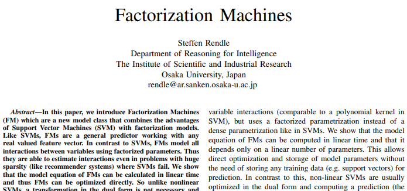

---
### Abstract  
* Factorization Machine(FM) = SVM(Support Vector Machine) + Factorization model   
  * 인수 분해 된 매개 변수를 사용, 변수 간의 모든 상호 작용 모델링  
    * SVM 문제(huge sparsity) 동작 가능  
  * FM 모델 방정식: 선형 시간으로 계산, 직접 최적화 가능  
    * SVM 비선형 > 이중 형태 변환 필요 없으며, 제원 벡터 없이 직접 추정 됨  
    * factorization models: 행렬 분해, 병렬 요인 분석, SVD++, PITF or FPMC  
      * 일반 예측 X, only special input data 작동    

---

### Index Terms 
* factorization machine; sparse data; tensor factorization; support vector machine  

---

### 1. INTRODUCTION  
* CF에서,  

||SVM|factorization machine models|
|---|---|---|
|특징|일반 예측자|모든 중첩 변수 상호 작용 모델링| 
|단점|희소 데이터에서 복잡한(비선형) 커널 공간에서<br>신뢰할 수 있는 매개변수(‘hyperplanes’) 학습 X |표준 예측 데이터 적용 X<br>특수 모델 적용 X |
|매개변수화|조밀 한 매개변수화|인수 분해 된 매개변수화|
|최적화|dual form 최적화|매개변수 직접 최적화/저장|
|계산|훈련데이터(support vectors)에 따라 예측 계산|선형 매개 변수 수에만 의존<br>> 선형 시간으로 계산|


* SVM + factorization machine models = **FM** 장점  
    * 1) SVM이 실패하는 매우 희소한 데이터에서 매개 변수 추정을 허용  
    * 2) 선형 복잡도, primal 에서 최적화, support vectors에 의존 X, 대규모 데이터 세트로 확장  
    * 3) FM은 실제값 feature 벡터와 함께 작동 할 수 있는 일반적인 예측기  
      * 입력 데이터 feature 벡터 정의 > state-of-the-art 모방(biased MF, SVD++, PITF or FPMC)  

---

### 2. PREDICTION UNDER SPARSITY  
* 가장 일반적인 예측 작업  
  *   
    * : 실수 값 feature 벡터   
    
    * T: target domain(e.g. T = R for regression or T = {+, −} for classification)  

* 훈련 데이터 세트(pairwise):   
* feature tuple   
  * 순위:  >   
  * 쌍별 순위 관계 비대칭 => 긍정적인 훈련 인스턴스만 사용 충분  

<br>

* x가 매우 희소한 경우 취급  
  * 거의 모든  = 0 인 문제   
  * 이유: 근본적인 문제가 큰 범주 형 변수 도메인을 다루기 때문  

<br>

* m(x): 0이 아닌 요소의 개수  
* : 0이 아닌 요소의 평균 개수  

<br>

#### Example 1) movie review system  
```
사용자 u ∈ U
아이템(영화) i ∈ I 
특정 시간 t ∈ R 
등급 r ∈ {1, 2, 3, 4, 5} 
```
사용자 U = {Alice (A), Bob (B), Charlie (C), . . .}  
항목 I = {Titanic (TI), Notting Hill (NH), Star Wars (SW), Star Trek (ST), . . .}  

관찰 된 데이터   
S = {(A, TI, 2010-1, 5),(A, NH, 2010-2, 3),(A, SW, 2010-4, 1), (B, SW, 2009-5, 4),(B, ST, 2009-8, 5), (C, TI, 2009-9, 1),(C, SW, 2009-12, 5)}
  
* 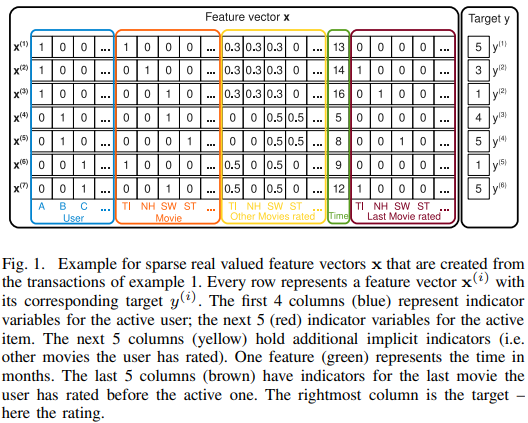  
  * S에서 feature 벡터를 생성하는 방법  
  * |U| active user 이진 표시기 변수(파란색): 트랜잭션당 1 active user   
  * |I| active item 이진 표시기 변수(빨간색): 트랜잭션당 1 active item   
  * user 평가한 다른 모든 item에 대한 표시기 변수(노란색) - 정규화(합=1)  
    * 예: user A(Alice)는 TI(Titanic), NH(Notting Hill), SW(Star Wars) 평가  
  * 시간 변수 (녹색): 2009년 1 월 ~ 월단위  
  * (갈색): user가 active item 평가하기 전 평가 한 마지막 영화   

---

### 3. FACTORIZATION MACHINES(FM)  
#### A. Factorization Machine Model  
##### 1) Model Equation: 
* 2-way FM(d = 2): 변수 간의 모든 단일 및 쌍별 상호 작용 캡처  
  * .PNG)  
    * : 전역 편향  
    * : i 번째 변수의 강도  
    * : <vi, vj> i, j 변수 간의 *상호 작용을 인수 분해하여 모델링*   
    * .PNG)
        * 추정해야하는 모델 매개 변수  
    * <·,·>: 크기가 k 인 두 벡터의 내적
    * .PNG)
        * vi행: V내에 k요인 가진 i번째 변수  
    * : factorization 차원 하이퍼파라미터  

##### 2) Expressiveness:  
* 정의 된 양의 행렬 W에 대해 k가 충분히 크다면,  가 되는 행렬 V가 존재    
  * = k가 충분히 크다면, FM이 상호작용행렬 W 표현 가능  
  * 단, 희소, W 추정 충분한 데이터 X => 작은 k 선택    
  * k(FM 표현력) 제한 => 일반화 ↑, W ↑  


##### 3) Parameter Estimation Under Sparsity:  
* sparse settings, 변수 간의 상호 작용을 직접적/독립적 추정, 충분한 데이터 X  
* FM: 상호 작용 매개 변수를 분해 > 독립성을 깨뜨림 > sparse settings에서도 상호작용 추정 가능  

* 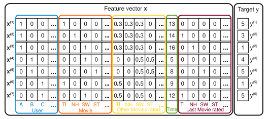  
  * target y (rating) 예측을 위한 user A(Alice), item ST(Star Trek) 상호 작용 추정  
  *  변수 모두 0이 아님(직접 추정-> 상호 작용 없음)  
  * : 인수분해 된(factorized) 상호작용 매개변수 => 상호 작용 추정 가능   

  <br>

  * : user B(Bob), user C(Charlie) factor vectors, item SW(Star Wars) 유사한 상호작용  
    * : 유사해야 함  
  * user A(Alice), user C(Charlie) - item TI, SW 서로 다른 상호작용: 다른 factor vectors  
  * user B(Bob)- item TI, ST 유사한 상호작용: 유사한 factor vectors  
  * user A(Alice) 와 item ST 내적(상호작용) > user A(Alice) 와 item SW 내적 : 의미 有(유사)  

##### 4) Computation:  
* .PNG)
  * 모든 쌍별 상호작용 계산,   
    * 재구성 시, 선형 런타임(*Lemma 3.1*)  

###### Lemma 3.1 
* eq (1) 은 선형 시간복잡도  로 재구성 가능    

###### Proof
* 쌍대 상호 작용 분해, 두 변수 직접 의존 모델 매개 변수 X  
  * 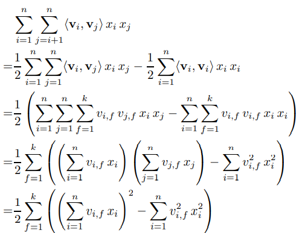

* (sparsity), x 대부분 0(0이 아닌 요소만 계산하면 됨), 시간복잡도   
  * 일반적 추천시스템,     

#### B. Factorization Machines as Predictors FM can be applied to a variety of prediction tasks. 
*  prediction tasks: 회귀, 이진 분류, 순위(Ranking)  

#### C. Learning Factorization Machines
* FM의 모델 매개 변수 학습: SGD  
* FM 모델 기울기: O(1)   
  * .PNG)
* LIB**FM**: SGD 사용, 요소별/쌍별 손실 모두 지원하는 일반 구현  

#### D. d-way Factorization Machine
* 2-way FM > d-way FM 으로 일반화  
  * .PNG)
    * 시간복잡도: , 선형시간으로 계산 가능    
    * l 번째 상호 작용 매개 변수: 모델 매개 변수 + PARAFAC 모델에 의해 분해  
      * .PNG)

#### E. Summary
* FM: 
  * 전체 매개 변수화 된 상호 작용 -> 인수 분해 된 상호 작용  
  * => x(feature 벡터) 모든 상호 작용 모델링  
* 장점(2):  
  * 1) 희소성이 높은 경우도 추정 가능, 관찰되지 않은 상호 작용으로 일반화 가능       
  * 2) 매개 변수의 수, 예측, 학습 시간: 선형  

---

### 4. FMS VS. SVMS
#### A. SVM model
* SVM 모델 방정식: 내적(변환 된 입력 x, 모델 매개 변수 w)   
  *     

    * φ: feature space 에 매핑  
      * φ와 관련있는 커널:  
        * 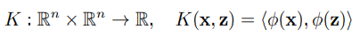  

* SVMs  
  * 1) Linear kernel(선형커널): 가장 간단한 커널
    *   
    * 매핑:   
    * 모델 방정식:
      * .PNG)  
        * 등식 (7) == 등식 (5) (d=1)  
  * 2) Polynomial kernel(다항 커널): SVM이 변수 간의 더 높은 상호 작용을 모델링 가능   
    *   
    * d=2, 매핑: .PNG)  
    * dual form, 매핑 φ는 명시 적으로 수행되지 X   
    <br>

    * the primal solution (optimum) == dual solution (optimum)    
  
    * ∴ primal에 대한 주장이 dual 형식에도 적용됨    
      
    *  모델 방정식:    
      * .PNG)    
        * 모델 매개 변수:  (symmetric matrix 대칭 행렬)    
    
* SVM - FM 주요 차이점: 매개 변수화   
  * SVM: 모든 상호 작용 매개 변수  완전히 독립적  
  * 상호 작용 매개 변수는 분해(factorized),  매개 변수가 겹치고 공유(), 서로 의존  

#### B. Parameter Estimation Under Sparsity
* (Sparsity), linear / polynomial SVMs 실패 이유  
 <br>

* 1) 선형 SVM: 이때 데이터 x에 대해 선형 SVM 모델   
  * .PNG)  
    * j = u or j = i => xj = 1   
      * .PNG)  
        * 사용자 및 항목 편향만 캡처(가장 기본 CF 모델)   
        * 간단 => 희소성에서도 모수 추정 잘함  
  * 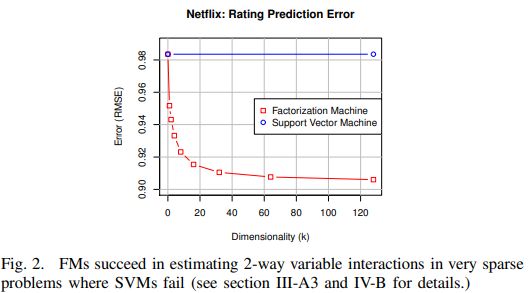  
    * 경험적 예측 품질은 일반적으로 낮음  

* 2) 다항식 SVM: 다항식 커널, 고차 상호 작용 캡처   
  * m(x) = 2, 모델 방정식:  
    * 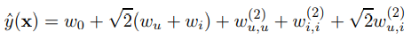    
      *  일 때, 추가 상호작용  존재  
        * 일반적 CF,  에 대하여    
          * train data: (u, i) (최대 하나의) 관측치(일반적으로 관측치 X)   
          * test data: (u', i') 관측치   

  *   
    * active user u / active item i 제외하고 0 
    * user A - itme TI 관측치 하나 존재  
    * user A - itme ST 상호작용 관찰 X;   
    * => 모든 테스트 케이스(u, i)에 대해  최대 마진 해(maximum margin solution) = 0
    
* ∴ 2) 다항식 SVM은 양방향 상호작용(2-way interaction) 사용 X(user-item 편향에만 의존) => 1) 선형 SVM 더 나은 추정 제공     

* 데이터가 너무 희소 = (i, j)에 대한 사례가 너무 적거나 없음 => SVM이 실패 할 가능성 ↑  

#### C. Summary
* 1) SVM dense 매개변수화 > (sparse) 제공 X 상호작용에 대한 direct observations 필요  
  * FM 매개변수는 희소 추정 가능  
* 2) FM primal에서 직접 학습 가능  
  * 비선형 SVM, 대게 dual 학습   
* 3) FM 모델 방정식, 훈련 데이터와 무관  
  * SVM 예측, 훈련 데이터 parts에 의존  

---

### 5. FMS VS. OTHER FACTORIZATION MODELS
* factorization models  
  * 범주형 변수 m-ary 관계 표준 모델(e.g. MF, PARAFAC)  
  * 특정 데이터/작업 특수 모델(e.g. SVD++, PITF, FPMC)  

#### A. Matrix and Tensor Factorization Matrix factorization (MF) is one of the most studied factorization models  
* 범주형 변수(2) 관계 분해  
  *   
    * 이진 지표 변수: U / I (파랑/빨강)  
      * .PNG)
        * : u/i ≠ 0, 다른 모든 편향/상호작용 drop  
    * .PNG)
      * 동일 argument, 범주형 변수 2개 이상, FM 중첩 병렬 요인 분석모델(PARAFAC) 포함됨  

#### B. SVD++
* 예측(회귀)   
  *   
    * 세 그룹: 파랑/빨랑/노랑  
  * 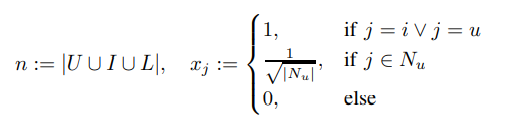  
    * : 사용자 평가 모든 item 집합  
    * FM(d=2), 
      * 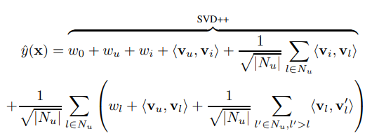  
        * 첫 부분 SVD++ 모델과 동일함  

#### C. PITF for Tag Recommendation
* 태그 예측 문제: user - item 조합에 대한 ranking tags    
* 범주 도메인(3): 사용자 U, 항목 I, 태그 T   
* 태그 추천의 PITF(factorizing pairwise interaction)을 모방한 FM 모델:     
  * .PNG)  
    * 동일 (u, i)에서 태그() 순위   
      *  점수 차이  
  * .PNG)
    * 쌍별 순위 최적화 FM모델   
      * PITF - FM 차이점:  
        * FM: t에 대한 바이어스 항 wt 존재  
        * (u, t) / (i, t) 상호 작용 사이의 태그 () 매개변수 공유 여부; FM 공유, PITF 개별적  

* 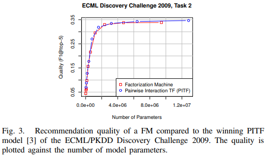  
  * 비슷한 예측 품질 달성  

#### D. Factorized Personalized Markov Chains (FPMC)
* FPMC: 사용자 u의 마지막 구매(시간 t-1) 기반 rank   
* FM(d=2),   
  * .PNG)  
    *  ⊆ L: 사용자 u가 시간 t에 구매한 모든 항목의 집합  
  * 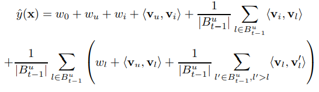
    *  점수 차이로 예측/최적화   
    * i에 의존 X 모든 덧셈한 없앤 FM 모델 방정식:   
      * .PNG)
        * FPMC - FM 차이점:  
          * : 추가 항목 바이어스  
          * (u, i) / (i, l) 상호작용 매개변수 공유  
          
#### E. Summary
* 1) Standard factorization models(PARAFAC, MF), FM과 같은 일반 예측 모델 X  
  * 요구: feature vector m으로 분할, 각 부분 하나의 요소 1 나머지 0  
* 2) 단일작업, 특수 FM 제안: feature extraction> [MF, PARAFAC, SVD++, PITF, FPMC] 모방 가능

---

### 6. CONCLUSION AND FUTURE WORK
* Factorization Machine = SVM + factorization models   
* SVM 차이점  
  * (1) FM은 거대한 희소성에서 매개변수 추정 가능  
  * (2) 모델 방정식: 선형, 모델 매개변수에만 의존  
  * (3) primal 에서 직접 최적화 가능  
---  