## 2012_IEEE_LARS [LARS: A Location-Aware Recommender System]

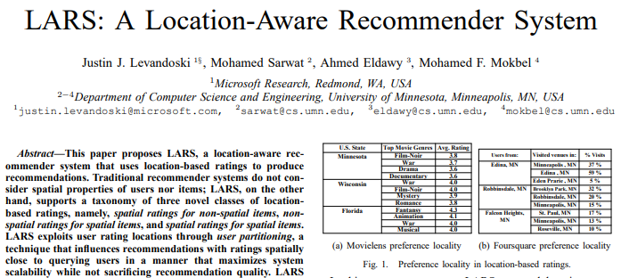

---
### Abstract  
* LARS: 위치 인식 추천 시스템(Location-Aware Recommender System)  
* 위치 기반 rating(3):
  * **3.** 비 공간 항목에 대한 공간 등급(spatial ratings for non-spatial items)  
  * **4.** 공간 항목에 대한 비 공간 등급(non-spatial ratings for spatial items)   
  * **5.** 공간 항목에 대한 공간 등급(spatial ratings for spatial items)  
* 사용자 분할: 사용자 평가 위치를 활용  
* 이동 패널티: 항목 위치를 활용  

---

### 1. INTRODUCTION  
* 기존 추천 시스템: CF  
  * triple (user, rating, item) 트리플(사용자, 등급, 항목)   

* 제안되는 LARS: ratings의 공간적 측면
  * |tuple|구성|추가된 튜플|
    |:---:|---|---|
    |4|(user, **ulocation**, rating, item)|ulocation: 사용자 위치|
    |4|(user, rating, item, **ilocation**)|ilocation: 항목 위치|
    |5|(user, **ulocation**, rating, item, **ilocation**)||
  
#### A. Motivation: A Study of Location-Based Ratings
* datasets: MovieLens, Foursquare  

##### Preference locality 
* 선호 지역: 공간 영역 사용자가 다른 지역을 선호 함(인접 지역의 사용자가 선호하지 X)  

* 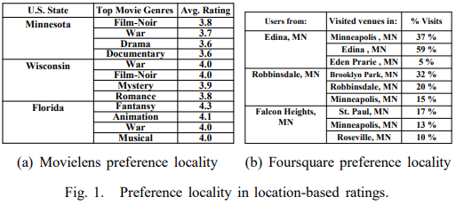  
  * (a) 주별 선호 장르 다름  
    * 영화 선호도가 특정 공간 지역에 고유함    
  * (b) 인접 지역 방문자 장소 선호도   
    * 사용자와 공간적으로 가까운 위치 선호, 추천에 영향    

* *localization: 사용지 포함 공간 영역 내, 고유 선호도 -> 추천 영향*  

##### Travel locality  
* 여행 지역: 사용자 장소 방문 시, 제한된 거리 이동하려는 경향  
  * 추천 후보: 이동 거리가 더 가까운 공간 항목 우선순위   

#### B. Our Contribution: LARS - A Location-Aware Recommender Like traditional recommender systems, LARS suggests k items personalized for a querying user u. 

* 사용자 분할: 선호지역성 활용  
  * (user, ulocation, rating, item)  
  * 적응 형 피라미드 구조(adaptive pyramid structure)  
    * 사용자 위치 속성별 등급, 다른 계층 구조에서 다양한 크기의 공간 영역으로 분할  
    * R 지역에있는 쿼리 사용자의 경우 R에있는 등급만 활용하는 기존 CF 적용  
    * 피라미드의 모든 영역을 유지 여부: 확장성, 지역성 균형(상반되는 요소) => 동적 조정  
* 여행 패널티: 이동 거리 있을수록 패널티  
  * (user, rating, item, ilocation)  
  * 모든 공간 항목 이동 거리 계산X(시스템 리소스)  
    * 목록을 변경할 수 없음을 발견, 조기 종료 쿼리 처리 

* *사용자 분할 및 여행 패널티 기술 개별 or 모두 사용*  
* LARS는 CF 대비 2배 정확 추천 생성  

--- 

### 2. LARS OVERVIEW  
#### A. LARS Query Model  
```
U: 사용자(또는 애플리케이션) ID
K: 숫자 제한                         >       LARS      >      추천 항목 K개
L: 위치
```

#### B. Item-Based Collaborative Filtering  
* 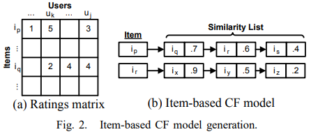  

##### Phase I: Model Building. 
##### Phase II: Recommendation Generation. 

###### Computing Similarity. 
  * Cosine similarity

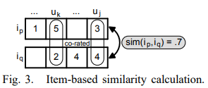  

--- 

### 3. SPATIAL USER RATINGS FOR NON-SPATIAL ITEMS
* tuple(user, **ulocation**, rating, item)  

* 선호 지역성: 사용자 의견이 공간적으로 고유함  

* 요구사항(3):  
  * (1) 지역성: 공간적 이웃 등급에 따라 추천 항목 영향  
  * (2) 확장성: 추천 절차/데이터 구조 사용자 확장  
  * (3) 영향:   영향을 미치는 공간적 이웃 크기 제어 가능  

* 요구사항 충족:  
  * 사용자 분할 기술: 적응형 피라미드 구조(지역성, 확장성, 영향)  

* 적응형 피라미드 구조
  * ulocation: 공간 영역 적응적으로 분할   
  * (쿼리 사용자 공간 영역 내) user, rating, item: CF  

#### A. Data Structure

* 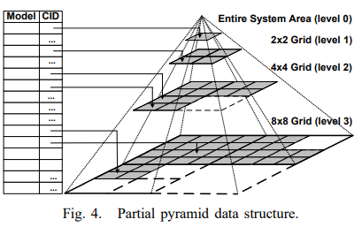  
  * quad-tree  
  * H 레벨: 피라미드 높이로 분해  
    *  동일 면적 그리드 셀로 분할(등가 영역 셀 *cid*)  
  * 셀: (공간정보)사용자 위치 + 공간 등급 -> item 기반 CF 모델 저장  
  * level0(root cell): 전통적인(비 공간적) 항목 기반 CF 모델  
  * 빈 공간: 지역성/확장성 절충 > 셀 병합/분할 > 피라미드의 레벨 불완전  

#### B. Query Processing
* 쿼리 처리 단계(2):  
  * (1) L(사용자 위치): L 포함, 적응 피라미드 가장 낮은 maintained 셀 C 찾음, 해싱 이용    
    * 유지되지 않으면 가장 가까운 ancestor 셀 반환  
  * (2) C(셀): 저장된 모델 사용, 항목 기반 CF > Top-k 추천 항목 생성  
* 스냅샷 쿼리

##### Continuous queries. 
* 연속 쿼리 실행: 전체 평가 > 초기 응답으로 사용자 U에게 추천 재전송  
  * 위치 업데이트: U의 움직임 모니터링  
    * 셀의 경계를 넘지 않으면, 초기 답변 유효
    * 셀의 경계를 넘으면, 새 셀에 대한 추천 쿼리를 재평가 > 마지막 답변 ± 업데이트  

##### Influence level. 
* I 영향 수준: 추천 영향 공간 이웃 크기 제어, 피라미드 수준에 매핑(지도 확대/축소)  
  * 선택적 영향 수준(위치 L, 제한 K) 제외  

#### C. Data Structure Maintenance
* 피라미드 데이터 구조
  * 초기 구축: 모든 위치 기반 등급 사용 > 높이 H의 완전 피라미드 구축 > H 레벨 모든 셀 존재(CF 포함)  
  * 병합 단계: 가장 낮은 수준 h부터 모든 셀 스캔 > 사분면 부모로 병합(지역성 손실 X)  
  * 유지 관리: 새로운 트리플로 인한 업데이트 > 셀 단위 유지 관리(트리거)    

<br>

* 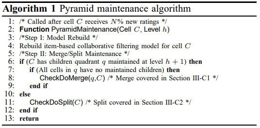  
  * 입력: 셀 C, 레벨 h  
  * Step I: 모델 재구축 및 병합(Model Rebuild)  
    * 셀C에 대한 항목 기반 CF 재빌드  
  * Step II 분할 유지 관리(Merging/Split Maintenance)  
    * 확장성/지역성 절충 > 셀 병합/분할 

* 피라미드 maintenance features:  
  * (1) 완전히 오프라인 수행  
    * 피라미드의 일부 업데이트되는 동안 "이전" 피라미드 셀을 사용 가능  
  * (2) 전체 피라미드를 한 번에 재건 X, 한 번에 하나의 셀만 재건  
  * (3) 피라미드 셀에 N%의 새로운 등급이 추가 된 후에만 수행
  
##### 1) 셀 병합: 레벨 h에서 셀의 전체 사분면을 버리고, 레벨 h-1에서 공통 부모를 사용하는 것
* 병합 된 셀의 항목 기반 CF 모델 폐기 > 저장소 ↓ > 확장성 ↑  
* 더 넓은 공간 영역 캡처 > 덜 고유 한(local) 추천 생성 => 지역성 손상  
* 백분율 계산: 병합 여부 결정  
  * .PNG)  
    * M: 확장성 이득, 지역성 손실 균형을 정의 실수 시스템 매개변수[0,1]  
    * LARS 병합(q 사분면 삭제)  
      * M=0, 기존 CF    
      * M=1, 병합 X  

###### Calculating Locality Loss.  
* 셀 사분면 q를 버릴 때, 고유성의 손실  
* 부모 셀 CP를 사용 > 추천 생성 > 지역성 손실 계산  
* 단계(3): Sample > Compare > Average => 단일 백분율 값을 생성  

###### Calculating scalability gain. 
* 확장성 이득: 스토리지 및 계산 절감  
  * 스토리지 이득(비율) = 병합된 각 자식 셀 크기 합산 / 부모 셀 크기 합  

###### Cost. 
* 모델 재구축 단계보다 적음  

###### Example. 
* 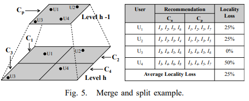  
  * level h: 병합 후보 셀 C1~C4  
  * level h-1: 부모 CP로 병합  

  * 지역성 손실  
    * 샘플링 된 User U1~U4: 위치 자식 Cu /부모 Cp 셀 각각 표시  
        * U1 C1 추천 = {I1, I2, I5, I6}
        * U1 Cp 추천 = {I1, I2, I5, I7}
        * 병합: I6 손실, 지역성 손실 = 25%   
        * U1~U4 지역성 손실 평균 = 25%  

  * 확장성 이득   
    * C1+C2+C3+C4+Cp = 4GB (가정)  
    * C1+C2+C3+C4 = 2GB (가정)  
    * 확장성 이득 = 2/4 = 50%   

  * LARS  
    * M = 0.7 (가정)   
    * (0.3 * 50) < (0.7 * 25) => C1, C2, C3, C4 셀을 CP로 병합하지 않음  

##### 2) 분할: 레벨 h-1의 셀 아래에 피라미드 레벨 h에서 새로운 셀 사분면 생성
* 분할: 지역성 ↑ , 확장성 ↓, 연속 쿼리 처리 부정적인 영향  

* 분할 여부 결정(CheckDoSplit)    
  * .PNG)   

###### Speculative splitting 투기적 분할   
* 4개의 셀의 CF 모델 처음부터 구축 > 지역성 이득 / 확장성 손실을 측정  
* LARS 분할 결정 > 모든 등급 사용, 새로 분할 된 셀에 대한 전체 모델 빌드  

###### Calculating locality gain. 
* *1) 셀 병합* 동일  

###### Calculating scalability loss. 
* 확장성 손실 메트릭 = 예상 크기 합계 / 기존 상위 셀 크기의 합계  

###### Cost. 
*  지역성 이득 + 확장성 손실  

###### Example. 
* *1) 셀 병합* 동일 상황   
* M = 0.7, (0.7 * 25) > (0.3 * 50) => 지역성 이득 >> 확장성 손실 => Cp 4개 셀로 분할  

#### D. Partial Merging and Splitting
##### 1) 부분 병합: 확장성 유지, 더 적은 지역성을 희생, 더 세분화 된 수준에서 부분 병합
*   
  * C3, C4 그대로 두고, C1, C2 셀만 병합 
    * 병합 된 후보 셀 C12가 부모셀 역할(지역성 손실: CF 초기 빌드 => 추가 오버헤드)  
    * 저장 이득 계산 시 C12 제외  

##### 2) 부분 분할: 모든 기술은 동일 유지  
* 구별 가능한 경우(2):  
  * level h 부모가 level h + 1에서 4 개 미만의 셀로 분할  
    * 부분 자식 셀 인식 위한 예측 분할 필요  
  * level h 셀을 개별 셀로 분할, level h + 1 셀은 생성 X  
    * 원래 셀 사분면 줄인 이전 부분 병합 발생  

--- 

### 4. NON-SPATIAL USER RATINGS FOR SPATIAL ITEMS
* tuple(user, rating, item, **ilocation**)    
* 여행 지역성(travel locality): 여행 거리를 기반으로 공간 장소 선택을 제한    
  * 부담스러운 이동 거리 > 이동 패널티    
  * 각 항목까지의 여행 거리를 계산 = 높은 오버 헤드  
    * 조기 종료가 가능한 효율적인 쿼리 처리 기술> 모든 항목 이동 거리 계산 X   

### A. Query Processing
* 여행 페널티 기법: 계산 된 RecScore(u, i) > 순위 > CF > Top-k 추천   
  * .PNG)  
    * P(u, i): u에 대한 i의 표준 항목 기반 CF 예측 등급  
    * TravelPenalty(u, i): 정규화 된 u와 i 사이의 네트워크 이동 거리  

* 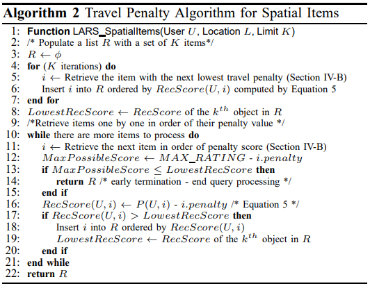  
  * 알고리즘2: 쿼리 처리 알고리즘의 의사 코드, knearest-neighbor 알고리즘    
    * 입력: 쿼리 사용자 ID U, 위치 L, 제한 K   
    * 출력: Top-k 추천 항목 목록 R(이동 패널티가 가장 낮은순)   

#### B. Incremental Travel Penalty Computation  
* 여행 패널티에 따라 항목 점진적 검색 방법(2): (쿼리 처리 효율성 v.s 패널티 정확도)   
  * 1) 증분 KNN: 온라인 방법: 정확한 여행 벌칙을 제공하지만 계산 비용이 많이 듦, KNN
  * 2) 패널티 그리드: 오프라인 휴리스틱 방법: 덜 정확하지만 페널티 검색에 효율적, 미리 계산 된 페널티 그리드(공간 분할)  

---

### 5. SPATIAL USER RATINGS FOR SPATIAL ITEMS
* tuple(user, **ulocation**, rating, item, **ilocation**)    
* LARS 특징: 
  * 사용자 분할 및 여행 패널티: 거의 변경없 사용 가능   
  * 쿼리 처리 프레임 워크 만 약간의 수정이 필요
  * 차이점: 추천 점수 계산에 사용 된 항목 기반 CF 예측 점수가 부분 피라미드 셀에서 CF 모델을 사용하여 생성

---

### 6. EXPERIMENTS
* 데이터 세트: Foursquare, MovieLens, Synthetic  

#### A. Recommendation Quality for Varying Pyramid Levels
* 표준 (비 공간) 항목 기반 CF LARS의 추천 품질 테스트   
```
LARS-T: 이동 패널티만 활성화 된 LARS  
LARS-U: 사용자 분할만 활성화 한 LARS
LARS: 두 기술을 모두 활성화 한 LARS 
```

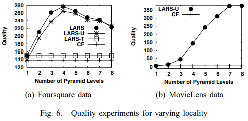  

#### B. Recommendation Quality for Varying Values of k
* 다양한 k 값(권장 응답 크기)에 대해 품질 테스트  

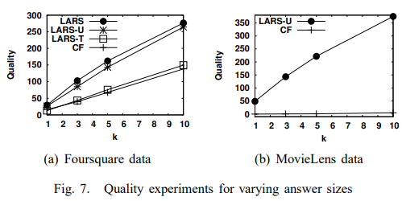  

#### C. Storage Vs. Locality
* 다양한 M이 LARS의 스토리지 및 지역성에 미치는 영향  
```
M = 0: 기존의 협업 필터링
M = 1: 완전한 피라미드 사용
```
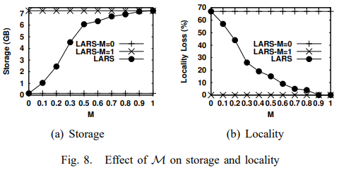  

#### D. Scalability
* ratings에 따른 필요한 스토리지 및 총 유지보수 오버헤드  

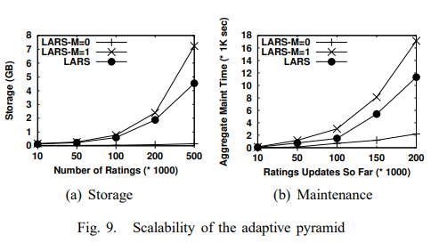  

#### E. Query Processing Performance
* Snapshot queries & Continuous queries  
```
LARS-U: 사용자 파티셔닝 만있는 LARS
LARS-T: 여행 패널티 만있는 LARS
CF: 기존의 협업 필터링
LARS-M = 1: 완전한 피라미드  
```
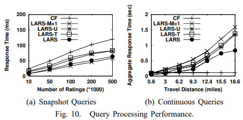  

---