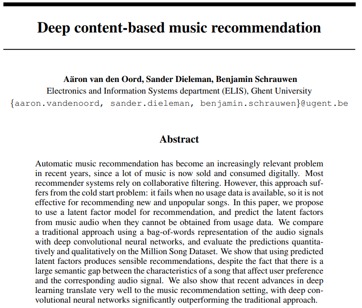
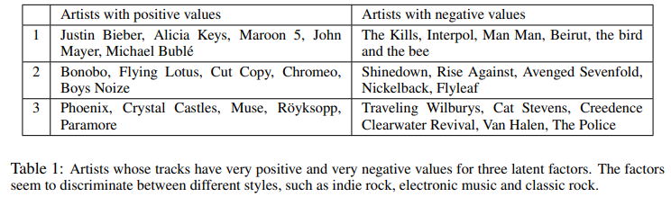
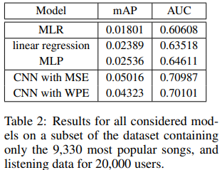
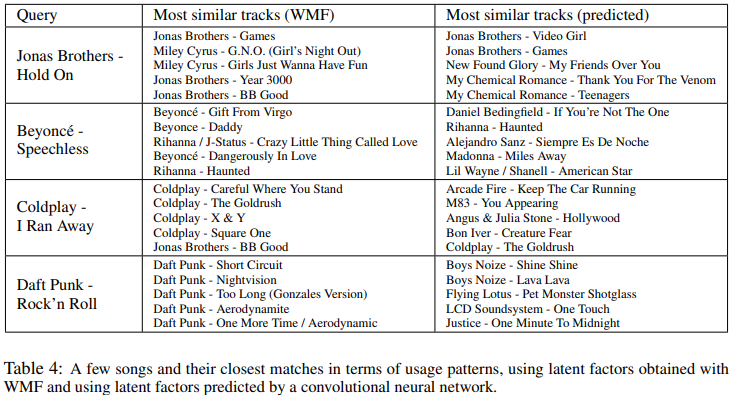
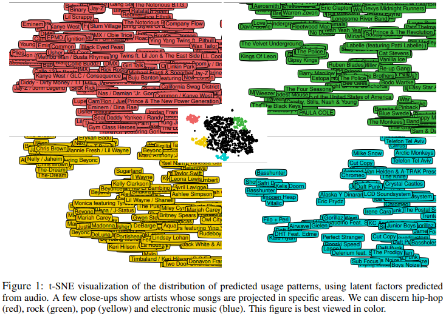

## 2013_DcbmR [Deep content-based music recommendation]

---

### Abstract    

Automatic music recommendation has become an increasingly relevant problem in recent years, since a lot of music is now sold and consumed digitally. 
자동 음악 추천은 현재 많은 음악이 디지털 방식으로 판매되고 소비되기 때문에 최근 몇 년 동안 점점 더 관련성이 높은 문제가되었습니다.

Most recommender systems rely on collaborative filtering. 
대부분의 추천 시스템은 협업 필터링에 의존합니다.

However, this approach suffers from the cold start problem: it fails when no usage data is available, so it is not effective for recommending new and unpopular songs. 
그러나 이러한 접근 방식은 콜드 스타트 ​​문제가 있습니다. 사용 가능한 데이터가 없으면 실패하므로 새롭고 인기없는 노래를 추천하는 데 효과적이지 않습니다.

In this paper, we propose to use a latent factor model for recommendation, and predict the latent factors from music audio when they cannot be obtained from usage data. 
본 논문에서는 추천을 위해 잠재 요소 모델을 사용하고, 사용 데이터에서 얻을 수없는 음악 오디오의 잠재 요소를 예측할 것을 제안한다.

We compare a traditional approach using a bag-of-words representation of the audio signals with deep convolutional neural networks, and evaluate the predictions quantitatively and qualitatively on the Million Song Dataset. 
심층 컨볼 루션 신경망을 사용하여 오디오 신호의 단어 모음 표현을 사용하는 전통적인 접근 방식을 비교하고 Million Song Dataset에서 예측을 정량적, 정 성적으로 평가합니다.

We show that using predicted latent factors produces sensible recommendations, despite the fact that there is alarge semantic gap between the characteristics of a song that affect user preference  and the corresponding audio signal. 
사용자 선호도에 영향을 미치는 노래의 특성과 해당 오디오 신호 사이에 큰 의미 적 차이가 있음에도 불구하고 예측 된 잠재 요소를 사용하면 합리적인 권장 사항이 생성된다는 것을 보여줍니다.

We also show that recent advances in deep learning translate very well to the music recommendation setting, with deep convolutional neural networks significantly outperforming the traditional approach.
또한 최근 딥 러닝의 발전은 음악 추천 설정으로 매우 잘 변환되며 딥 컨볼 루션 신경망은 기존 접근 방식을 크게 능가합니다.

---

### 1. Introduction
In recent years, the music industry has shifted more and more towards digital distribution through online music stores and streaming services such as iTunes, Spotify, Grooveshark and Google Play.
최근 몇 년 동안 음악 산업은 iTunes, Spotify, Grooveshark 및 Google Play와 같은 온라인 음악 상점 및 스트리밍 서비스를 통해 디지털 배포로 점점 더 이동했습니다.

As a result, automatic music recommendation has become an increasingly relevant problem: it allows listeners to discover new music that matches their tastes, and enables online music stores to target their wares to the right audience.
결과적으로 자동 음악 추천은 점점 더 관련성이 높은 문제가되었습니다.이를 통해 청취자는 자신의 취향에 맞는 새로운 음악을 발견 할 수 있고 온라인 음악 상점에서 적절한 청중에게 자신의 제품을 타겟팅 할 수 있습니다.

Although recommender systems have been studied extensively, the problem of music recommendation in particular is complicated by the sheer variety of different styles and genres, as well as social and geographic factors that influence listener preferences. 
추천 시스템이 광범위하게 연구되었지만 특히 음악 추천의 문제는 다양한 스타일과 장르뿐만 아니라 청취자의 선호도에 영향을 미치는 사회적 및 지리적 요인으로 인해 복잡합니다.

The number of different items that can be recommended is very large, especially when recommending individual songs. 
특히 개별 곡을 추천 할 때 추천 할 수있는 항목의 수가 매우 많습니다.

This number can be reduced by recommending albums or artists instead, but this is not always compatible with the intended use of the system (e.g. automatic playlist generation), and it disregards the fact that the repertoire of an artist is rarely homogenous: listeners may enjoy particular songs more than others.
대신 앨범이나 아티스트를 추천하여이 수를 줄일 수 있지만 이는 시스템의 의도 된 용도 (예 : 자동 재생 목록 생성)와 항상 호환되는 것은 아니며 아티스트의 레퍼토리가 거의 동일하지 않다는 사실을 무시합니다. 청취자는 즐길 수 있습니다. 다른 노래보다 더 많은 특정 노래.

Many recommender systems rely on usage patterns: the combinations of items that users have consumed or rated provide information about the users’ preferences, and how the items relate to each other. 
많은 추천 시스템은 사용 패턴에 의존합니다. 사용자가 소비하거나 평가 한 항목의 조합은 사용자의 선호도에 대한 정보를 제공하고 항목이 서로 관련되는 방식을 제공합니다.

This is the collaborative filtering approach. 
이것이 협업 필터링 접근 방식입니다.

Another approach is to predict user preferences from item content and metadata.
또 다른 접근 방식은 항목 콘텐츠 및 메타 데이터에서 사용자 선호도를 예측하는 것입니다.

The consensus is that collaborative filtering will generally outperform content-based recommendation [1]. 
합의 된 점은 협업 필터링이 일반적으로 콘텐츠 기반 권장 사항을 능가한다는 것입니다 [1].

However, it is only applicable when usage data is available. 
단, 사용량 데이터가있는 경우에만 적용됩니다.

Collaborative filtering suffers from the cold start problem: new items that have not been consumed before cannot be recommended. 
협업 필터링은 콜드 스타트 문제로 인해 어려움을 겪습니다. 이전에 소비되지 않은 새 항목은 권장 할 수 없습니다.

Additionally, items that are only of interest to a niche audience are more difficult to recommend because usage data is scarce. 
또한 사용 데이터가 부족하기 때문에 틈새 고객에게만 관심이있는 항목은 추천하기가 더 어렵습니다.

In many domains, and especially in music, they comprise the majority of the available items, because the users’ consumption patterns follow a power law [2]. 
사용자의 소비 패턴이 전력 법칙을 따르기 때문에 많은 영역, 특히 음악에서 사용 가능한 항목의 대부분을 구성합니다 [2].

Content-based recommendation is not affected by these issues.
콘텐츠 기반 권장 사항은 이러한 문제의 영향을받지 않습니다.

#### 1.1 Content-based music recommendation

Music can be recommended based on available metadata: information such as the artist, album and year of release is usually known. 
사용 가능한 메타 데이터를 기반으로 음악을 추천 할 수 있습니다. 일반적으로 아티스트, 앨범 및 출시 연도와 같은 정보가 알려져 있습니다.

Unfortunately this will lead to predictable recommendations. 
불행히도 이것은 예측 가능한 권장 사항으로 이어질 것입니다.

For example, recommending songs by artists that the user is known to enjoy is not particularly useful.
예를 들어 사용자가 좋아하는 것으로 알려진 아티스트의 노래를 추천하는 것은 특별히 유용하지 않습니다.

One can also attempt to recommend music that is perceptually similar to what the user has previously listened to, by measuring the similarity between audio signals [3, 4]. 
오디오 신호 간의 유사성을 측정하여 사용자가 이전에들은 것과 지각 적으로 유사한 음악을 추천 할 수도 있습니다 [3, 4].

This approach requires the definition of a suitable similarity metric. 
이 접근 방식에는 적절한 유사성 메트릭의 정의가 필요합니다.

Such metrics are often defined ad hoc, based on prior knowledge about music audio, and as a result they are not necessarily optimal for the task of music recommendation. 
이러한 메트릭은 종종 음악 오디오에 대한 사전 지식을 기반으로 임시로 정의되며 결과적으로 음악 추천 작업에 반드시 최적 인 것은 아닙니다.

Because of this, some researchers have used user preference data to tune similarity metrics [5, 6].
이 때문에 일부 연구자들은 유사성 메트릭을 조정하기 위해 사용자 선호도 데이터를 사용했습니다 [5, 6].

#### 1.2 Collaborative filtering

Collaborative filtering methods can be neighborhood-based or model-based [7]. 
협업 필터링 방법은 이웃 기반 또는 모델 기반 일 수 있습니다 [7].

The former methods rely on a similarity measure between users or items: they recommend items consumed by other users with similar preferences, or similar items to the ones that the user has already consumed. 
전자의 방법은 사용자 또는 항목 간의 유사성 측정에 의존합니다. 유사한 선호도를 가진 다른 사용자가 소비 한 항목 또는 사용자가 이미 소비 한 항목과 유사한 항목을 권장합니다.

Modelbased methods on the other hand attempt to model latent characteristics of the users and items, which are usually represented as vectors of latent factors. 
반면에 모델 기반 방법은 일반적으로 잠재 요인의 벡터로 표현되는 사용자 및 항목의 잠재 특성을 모델링하려고 시도합니다.

Latent factor models have been very popular ever since their effectiveness was demonstrated for movie recommendation in the Netflix Prize [8].
잠재 요인 모델은 Netflix Prize [8]에서 영화 추천에 대한 효과가 입증 된 이후로 매우 인기가 있습니다.

#### 1.3 The semantic gap in music
1.3 음악의 의미 적 차이

Latent factor vectors form a compact description of the different facets of users’ tastes, and the corresponding characteristics of the items. 
잠재 인자 벡터는 사용자 취향의 다양한 측면과 항목의 해당 특성에 대한 간략한 설명을 구성합니다.

To demonstrate this, we computed latent factors for a small set of usage data, and listed some artists whose songs have very positive and very negative values for each factor in Table 1. 
이를 증명하기 위해 작은 사용 데이터 세트에 대한 잠재 요인을 계산하고 노래가 각 요인에 대해 매우 긍정적이고 매우 부정적인 값을 갖는 일부 아티스트를 표 1에 나열했습니다.

This representation is quite versatile and can be used for other applications besides recommendation, as we will show later (see Section 5.1). 
이 표현은 매우 다양하며 나중에 설명 할 권장 사항 외에 다른 응용 프로그램에도 사용할 수 있습니다 (섹션 5.1 참조).

Since usage data is scarce for many songs, it is often impossible to reliably estimate these factor vectors. 
많은 노래에 대한 사용 데이터가 부족하기 때문에 이러한 요인 벡터를 안정적으로 추정하는 것이 불가능한 경우가 많습니다.

Therefore it would be useful to be able to predict them from music audio content.
따라서 음악 오디오 콘텐츠에서 예측할 수 있으면 유용합니다.

There is a large semantic gap between the characteristics of a song that affect user preference, and the corresponding audio signal. 
사용자 선호도에 영향을 미치는 노래의 특성과 해당 오디오 신호 사이에는 큰 의미 적 차이가 있습니다.

Extracting high-level properties such as genre, mood, instrumentation and lyrical themes from audio signals requires powerful models that are capable of capturing the complex hierarchical structure of music. 
오디오 신호에서 장르, 분위기, 악기 및 서정적 테마와 같은 높은 수준의 속성을 추출하려면 음악의 복잡한 계층 구조를 캡처 할 수있는 강력한 모델이 필요합니다.

Additionally, some properties are impossible to obtain from audio signals alone, such as the popularity of the artist, their reputation and and their location. 
또한 아티스트의 인기, 명성 및 위치와 같은 일부 속성은 오디오 신호만으로는 얻을 수 없습니다.

Researchers in the domain of music information retrieval (MIR) concern themselves with extracting these high-level properties from music. 
음악 정보 검색 (MIR) 분야의 연구자들은 음악에서 이러한 높은 수준의 속성을 추출하는 데 관심이 있습니다.

They have grown to rely on a particular set of engineered audio features, such as mel-frequency cepstral coefficients (MFCCs), which are used as input to simple classifiers or regressors, such as SVMs and linear regression [9]. 
SVM 및 선형 회귀 [9]와 같은 단순 분류기 또는 회귀 자에 대한 입력으로 사용되는 MFCC (mel-frequency cepstral coefficients)와 같은 특정 엔지니어링 오디오 기능 세트에 의존하도록 성장했습니다.

Recently this traditional approach has been challenged by some authors who have applied deep neural networks to MIR problems [10, 11, 12].
최근에 이러한 전통적인 접근 방식은 심층 신경망을 MIR 문제에 적용한 일부 저자에 의해 도전을 받았습니다 [10, 11, 12].

In this paper, we strive to bridge the semantic gap in music by training deep convolutional neural networks to predict latent factors from music audio. 
이 논문에서 우리는 음악 오디오의 잠재 요인을 예측하기 위해 심층 컨볼 루션 신경망을 훈련시켜 음악의 의미 적 격차를 해소하기 위해 노력합니다.

We evaluate our approach on an industrialscale dataset with audio excerpts of over 380,000 songs, and compare it with a more conventional approach using a bag-of-words feature representation for each song. 
우리는 38 만 곡 이상의 오디오 발췌로 산업 규모 데이터 세트에 대한 접근 방식을 평가하고 각 노래에 대한 단어 모음 기능 표현을 사용하는보다 일반적인 접근 방식과 비교합니다.

We assess to what extent it is possible to extract characteristics that affect user preference directly from audio signals, and evaluate the predictions from our models in a music recommendation setting. 
오디오 신호에서 직접 사용자 선호도에 영향을 미치는 특성을 추출 할 수있는 정도를 평가하고 음악 추천 설정에서 모델의 예측을 평가합니다.

---

### 2. The dataset 

The Million Song Dataset (MSD) [13] is a collection of metadata and precomputed audio features for one million contemporary songs. 
Million Song Dataset (MSD) [13]은 현재 백만 곡에 대한 메타 데이터 및 미리 계산 된 오디오 기능 모음입니다.

Several other datasets linked to the MSD are also available, featuring lyrics, cover songs, tags and user listening data. 
가사, 리메이크 곡, 태그 및 사용자 청취 데이터를 특징으로하는 MSD에 연결된 여러 데이터 세트도 사용할 수 있습니다.

This makes the dataset suitable for a wide range of different music information retrieval tasks. 
이로 인해 데이터 세트는 다양한 음악 정보 검색 작업에 적합합니다.

Two linked datasets are of interest for our experiments:
두 개의 연결된 데이터 세트가 실험에 유용합니다.

• The Echo Nest Taste Profile Subset provides play counts for over 380,000 songs in the MSD, gathered from 1 million users. 

The dataset was used in the Million Song Dataset challenge [14] last year.
• Echo Nest Taste Profile Subset은 백만 명의 사용자가 수집 한 MSD에있는 38 만 곡 이상의 노래에 대한 재생 횟수를 제공합니다.

이 데이터 세트는 작년 Million Song Dataset Challenge [14]에서 사용되었습니다.

• The Last.fm dataset provides tags for over 500,000 songs.
• Last.fm 데이터 세트는 500,000 개 이상의 노래에 대한 태그를 제공합니다.

Traditionally, research in music information retrieval (MIR) on large-scale datasets was limited to industry, because large collections of music audio cannot be published easily due to licensing issues.
전통적으로 대규모 데이터 세트에 대한 MIR (Music Information Retrieval) 연구는 라이선스 문제로 인해 대규모 음악 오디오 컬렉션을 쉽게 게시 할 수 없기 때문에 업계로 제한되었습니다.

The authors of the MSD circumvented these issues by providing precomputed features instead of raw audio. 
MSD 작성자는 원시 오디오 대신 미리 계산 된 기능을 제공하여 이러한 문제를 피했습니다.

Unfortunately, the audio features provided with the MSD are of limited use, and the process by which they were obtained is not very well documented. 
안타깝게도 MSD와 함께 제공되는 오디오 기능은 제한적으로 사용되며 이러한 기능을 얻은 프로세스는 잘 문서화되어 있지 않습니다.

The feature set was extended by Rauber et al. [15], but the absence of raw audio data, or at least a mid-level representation, is still an issue.
기능 세트는 Rauber et al. 그러나 원시 오디오 데이터가 없거나 적어도 중간 수준의 표현이 여전히 문제입니다.

However, we were able to attain 29 second audio clips for over 99% of the dataset from 7digital.com. 
그러나 7digital.com에서 데이터 세트의 99 % 이상에 대해 29 초 오디오 클립을 얻을 수있었습니다.

Due to its size, the MSD allows for the music recommendation problem to be studied in a more realistic setting than was previously possible. 
크기 때문에 MSD는 이전에 가능했던 것보다 더 현실적인 환경에서 음악 추천 문제를 연구 할 수 있도록합니다.

It is also worth noting that the Taste Profile Subset is one of the largest collaborative filtering datasets that are publicly available today.
또한 Taste Profile Subset이 오늘날 공개적으로 사용 가능한 가장 큰 협업 필터링 데이터 세트 중 하나라는 점도 주목할 가치가 있습니다.

---

### 3. Weighted matrix factorization

The Taste Profile Subset contains play counts per song and per user, which is a form of implicit feedback. 
Taste Profile Subset에는 암시 적 피드백의 한 형태 인 노래 및 사용자 당 재생 횟수가 포함됩니다.

We know how many times the users have listened to each of the songs in the dataset, but they have not explicitly rated them. 
사용자가 데이터 세트의 각 노래를 몇 번이나 들었는지 알고 있지만 명시 적으로 평가하지는 않았습니다.

However, we can assume that users will probably listen to songs more often if they enjoy them. 
그러나 사용자가 노래를 즐기면 더 자주 듣게 될 것이라고 가정 할 수 있습니다.

If a user has never listened to a song, this can have many causes:
사용자가 노래를 한 번도 듣지 않은 경우 다음과 같은 여러 원인이있을 수 있습니다.

for example, they might not be aware of it, or they might expect not to enjoy it. 
예를 들어, 그들은 그것을 인식하지 못하거나 그것을 즐기지 않을 것이라고 기대할 수 있습니다.

This setting is not compatible with traditional matrix factorization algorithms, which are aimed at predicting ratings. 
이 설정은 등급 예측을 목표로하는 기존의 행렬 분해 알고리즘과 호환되지 않습니다.

We used the weighted matrix factorization (WMF) algorithm, proposed by Hu et al. [16], to learn latent factor representations of all users and items in the Taste Profile Subset. 
Hu 등이 제안한 WMF (Weighted Matrix Factorization) 알고리즘을 사용했습니다. [16], Taste Profile Subset에서 모든 사용자 및 항목의 잠재 요인 표현을 학습합니다.

This is a modified matrix factorization algorithm aimed at implicit feedback datasets. 
이것은 암시 적 피드백 데이터 세트를 목표로하는 수정 된 매트릭스 분해 알고리즘입니다.

Let rui be the play count for user u and song i. 
rui를 사용자 u와 노래 i의 재생 횟수로 지정합니다.

For each user-item pair, we define a preference variable pui and a confidence variable cui (I(x) is the indicator function, α and  are hyperparameters):
각 사용자 항목 쌍에 대해 선호 변수 pui와 신뢰 변수 cui를 정의합니다 (I (x)는 표시기 함수, α이고 하이퍼 파라미터 임).

.PNG)
The preference variable indicates whether user u has ever listened to song i. 
환경 설정 변수는 사용자 u가 노래 i를들은 적이 있는지 여부를 나타냅니다.

If it is 1, we will assume the user enjoys the song. 
1이면 사용자가 노래를 즐긴다 고 가정합니다.

The confidence variable measures how certain we are about this particular preference. 
신뢰 변수는 우리가이 특정 선호도에 대해 얼마나 확신하는지 측정합니다.

It is a function of the play count, because songs with higher play counts are more likely to be preferred. 
재생 횟수가 많은 노래가 선호 될 가능성이 높기 때문에 재생 횟수의 함수입니다.

If the song has never been played, the confidence variable will have a low value, because this is the least informative case.
노래를 한 번도 재생 한 적이없는 경우 정보가 가장 적은 경우이므로 신뢰도 변수 값이 낮습니다.

The WMF objective function is given by:
WMF 목적 함수는 다음과 같이 제공됩니다.
.PNG)

where λ is a regularization parameter, xu is the latent factor vector for user u, and yi is the latent factor vector for song i. 
여기서 λ는 정규화 매개 변수, xu는 사용자 u에 대한 잠재 인자 벡터, yi는 노래 i에 대한 잠재 인자 벡터입니다.

It consists of a confidence-weighted mean squared error term and an L2 regularization term. 
신뢰 가중 평균 제곱 오차 항과 L2 정규화 항으로 구성됩니다.

Note that the first sum ranges over all users and all songs: contrary to matrix factorization for rating prediction, where terms corresponding to user-item combinations for which no rating is available can be discarded, we have to take all possible combinations into account. 
첫 번째 합계는 모든 사용자와 모든 노래에 적용됩니다. 등급 예측을위한 행렬 분해와 달리 등급이없는 사용자 항목 조합에 해당하는 용어를 버릴 수있는 경우 가능한 모든 조합을 고려해야합니다.

As a result, using stochastic gradient descent for optimization is not practical for a dataset of this size. 
결과적으로 최적화를 위해 확률 적 경사 하강 법을 사용하는 것은이 크기의 데이터 세트에 실용적이지 않습니다.

Hu et al. propose an efficient alternating least squares (ALS) optimization method, which we used instead.
Hu et al. 대신 사용한 효율적인 교번 최소 제곱 (ALS) 최적화 방법을 제안합니다.

---

### 4. Predicting latent factors from music audio 

Predicting latent factors for a given song from the corresponding audio signal is a regression problem. 
해당 오디오 신호에서 주어진 노래의 잠재 요인을 예측하는 것은 회귀 문제입니다.

It requires learning a function that maps a time series to a vector of real numbers. 
시계열을 실수 벡터에 매핑하는 함수를 학습해야합니다.

We evaluate two methods to achieve this: one follows the conventional approach in MIR by extracting local features from audio signals and aggregating them into a bag-of-words (BoW) representation. 
이를 달성하기 위해 두 가지 방법을 평가합니다. 하나는 오디오 신호에서 로컬 특징을 추출하고이를 BoW (bag-of-words) 표현으로 집계하여 MIR의 기존 접근 방식을 따릅니다.

Any traditional regression technique can then be used to map this feature representation to the factors. 
그런 다음 기존 회귀 기법을 사용하여이 특징 표현을 요인에 매핑 할 수 있습니다.

The other method is to use a deep convolutional network. 
다른 방법은 심층 컨볼 루션 네트워크를 사용하는 것입니다.

Latent factor vectors obtained by applying WMF to the available usage data are used as ground truth to train the prediction models. 
사용 가능한 사용 데이터에 WMF를 적용하여 얻은 잠재 인자 벡터는 예측 모델을 훈련하기위한 지상 진실로 사용됩니다.

It should be noted that this approach is compatible with any type of latent factor model that is suitable for large implicit feedback datasets. 
이 접근 방식은 대규모 암시 적 피드백 데이터 세트에 적합한 모든 유형의 잠재 요인 모델과 호환된다는 점에 유의해야합니다.

We chose to use WMF because an efficient optimization procedure exists for it.
효율적인 최적화 절차가 있기 때문에 WMF를 사용하기로 선택했습니다.

#### 4.1 Bag-of-words representation

Many MIR systems rely on the following feature extraction pipeline to convert music audio signals into a fixed-size representation that can be used as input to a classifier or regressor [5, 17, 18, 19, 20]:
많은 MIR 시스템은 음악 오디오 신호를 분류기 또는 회귀 자에 대한 입력으로 사용할 수있는 고정 크기 표현으로 변환하기 위해 다음 기능 추출 파이프 라인에 의존합니다 [5, 17, 18, 19, 20].

• Extract MFCCs from the audio signals. 
• 오디오 신호에서 MFCC를 추출합니다.

We computed 13 MFCCs from windows of 1024 audio frames, corresponding to 23 ms at a sampling rate of 22050 Hz, and a hop size of 512 samples. 
우리는 1024 오디오 프레임의 창에서 13 개의 MFCC를 계산했는데, 이는 22050Hz의 샘플링 속도와 512 개 샘플의 홉 크기에서 23ms에 해당합니다.

We also computed first and second order differences, yielding 39 coefficients in total.
또한 1 차와 2 차 차이를 계산하여 총 39 개의 계수를 산출했습니다.

• Vector quantize the MFCCs. 
• 벡터는 MFCC를 양자화합니다.

We learned a dictionary of 4000 elements with the K-means algorithm and assigned all MFCC vectors to the closest mean.
K- 평균 알고리즘을 사용하여 4000 개 요소 사전을 학습하고 모든 MFCC 벡터를 가장 가까운 평균에 할당했습니다.

• Aggregate them into a bag-of-words representation. 
• 단어 모음 표현으로 집계합니다.

For every song, we counted how many times each mean was selected. 
모든 노래에 대해 각 평균이 선택된 횟수를 세었습니다.

The resulting vector of counts is a bag-of-words feature representation of the song.
결과적인 카운트 벡터는 노래의 단어 모음 기능 표현입니다.

We then reduced the size of this representation using PCA (we kept enough components to retain 95% of the variance) and used linear regression and a multilayer perceptron with 1000 hidden units on top of this to predict latent factors. 
그런 다음 PCA를 사용하여이 표현의 크기를 줄이고 (분산의 95 %를 유지하기에 충분한 구성 요소를 유지함) 선형 회귀와 1000 개의 은닉 유닛이있는 다층 퍼셉트론을 사용하여 잠재 요인을 예측했습니다.

We also used it as input for the metric learning to rank (MLR) algorithm [21], to learn a similarity metric for content-based recommendation. 
또한 MLR (metric learning to rank) 알고리즘 [21]의 입력으로 사용하여 콘텐츠 기반 추천에 대한 유사성 메트릭을 학습했습니다.

This was used as a baseline for our music recommendation experiments, which are described in Section 5.2.
이는 섹션 5.2에 설명 된 음악 추천 실험의 기준으로 사용되었습니다.

#### 4.2 Convolutional neural networks

Convolutional neural networks (CNNs) have recently been used to improve on the state of the art in speech recognition and large-scale image classification by a large margin [22, 23]. 
컨볼 루션 신경망 (CNN)은 최근 음성 인식 및 대규모 이미지 분류의 최첨단 기술을 크게 향상시키는 데 사용되었습니다 [22, 23].

Three ingredients seem to be central to the success of this approach:
이 접근 방식의 성공에는 세 가지 요소가 핵심적인 것 같습니다.

• Using rectified linear units (ReLUs) [24] instead of sigmoid nonlinearities leads to faster convergence and reduces the vanishing gradient problem that plagues traditional neural networks with many layers.
• Parallellization is used to speed up training, so that larger models can be trained in a reasonable amount of time. 
• 시그 모이 드 비선형 성 대신 ReLU (rectified linear unit) [24]를 사용하면 수렴 속도가 빨라지고 레이어가 많은 기존 신경망을 괴롭히는 소실 기울기 문제가 줄어 듭니다.
• 병렬화는 훈련 속도를 높이는 데 사용되므로 더 큰 모델을 적절한 시간에 훈련시킬 수 있습니다.

We used the Theano library [25] to take advantage of GPU acceleration.
GPU 가속을 활용하기 위해 Theano 라이브러리 [25]를 사용했습니다.

• A large amount of training data is required to be able to fit large models with many parameters. 
• 매개 변수가 많은 대형 모델에 적합하려면 많은 양의 훈련 데이터가 필요합니다.

The MSD contains enough training data to be able to train large models effectively. 
MSD에는 대규모 모델을 효과적으로 훈련 할 수있는 충분한 훈련 데이터가 포함되어 있습니다.

We have also evaluated the use of dropout regularization [26], but this did not yield any significant improvements.
또한 dropout regularization [26]의 사용을 평가했지만 이로 인해 큰 개선이 이루어지지 않았습니다.

We first extracted an intermediate time-frequency representation from the audio signals to use as input to the network. 
먼저 오디오 신호에서 중간 시간-주파수 표현을 추출하여 네트워크에 대한 입력으로 사용했습니다.

We used log-compressed mel-spectrograms with 128 components and the same window size and hop size that we used for the MFCCs (1024 and 512 audio frames respectively).
128 개의 구성 요소와 MFCC (각각 1024 및 512 오디오 프레임)에 사용한 것과 동일한 창 크기 및 홉 크기가있는 로그 압축 된 멜-스펙트로 그램을 사용했습니다.

The networks were trained on windows of 3 seconds sampled randomly from the audio clips. 
네트워크는 오디오 클립에서 무작위로 샘플링 된 3 초의 창에서 훈련되었습니다.

This was done primarily to speed up training. 
이것은 주로 훈련 속도를 높이기 위해 수행되었습니다.

To predict the latent factors for an entire clip, we averaged over the predictions for consecutive windows.
전체 클립의 잠재 요인을 예측하기 위해 연속 창에 대한 예측을 평균했습니다.

Convolutional neural networks are especially suited for predicting latent factors from music audio, because they allow for intermediate features to be shared between different factors, and because their hierarchical structure consisting of alternating feature extraction layers and pooling layers allows them to operate on multiple timescales.
컨볼 루션 신경망은 음악 오디오의 잠재 요인을 예측하는 데 특히 적합합니다. 왜냐하면 중간 기능을 서로 다른 요인간에 공유 할 수 있고 기능 추출 레이어와 풀링 레이어를 번갈아 사용하는 계층 구조를 통해 여러 시간 척도에서 작동 할 수 있기 때문입니다.

#### 4.3 Objective functions 

Latent factor vectors are real-valued, so the most straightforward objective is to minimize the mean squared error (MSE) of the predictions. 
잠재 인자 벡터는 실수 값이므로 가장 간단한 목표는 예측의 평균 제곱 오차 (MSE)를 최소화하는 것입니다.

Alternatively, we can also continue to minimize the weighted prediction error (WPE) from the WMF objective function. 
또는 WMF 목적 함수에서 WPE (가중 예측 오차)를 계속 최소화 할 수도 있습니다.

Let yi be the latent factor vector for song i, obtained with WMF, and y0i the corresponding prediction by the model. 
yi를 WMF로 얻은 노래 i에 대한 잠재 인자 벡터이고 y0i를 모델에 의한 해당 예측이라고 가정합니다.

The objective functions are then (θ represents the model parameters):
.PNG)
목적 함수는 다음과 같습니다 (θ는 모델 매개 변수를 나타냄).

---

### 5. Experiments
#### 5.1 Versatility of the latent factor representation

To demonstrate the versatility of the latent factor vectors, we compared them with audio features in a tag prediction task. 
잠재 인자 벡터의 다양성을 입증하기 위해 태그 예측 작업의 오디오 기능과 비교했습니다.

Tags can describe a wide range of different aspects of the songs, such as genre, instrumentation, tempo, mood and year of release.
태그는 장르, 악기, 템포, 분위기 및 출시 연도와 같은 노래의 다양한 측면을 설명 할 수 있습니다.

We ran WMF to obtain 50-dimensional latent factor vectors for all 9,330 songs in the subset, and trained a logistic regression model to predict the 50 most popular tags from the Last.fm dataset for each song. 
WMF를 실행하여 하위 집합의 모든 9,330 곡에 대한 50 차원 잠재 인자 벡터를 얻고 각 노래의 Last.fm 데이터 세트에서 가장 인기있는 50 개의 태그를 예측하는 로지스틱 회귀 모델을 훈련했습니다.

We also trained a logistic regression model on a bag-of-words representation of the audio signals, which was first reduced in size using PCA (see Section 4.1). 
우리는 또한 오디오 신호의 bag-of-words 표현에 대한 로지스틱 회귀 모델을 훈련 시켰는데, 이는 PCA를 사용하여 처음 크기가 축소되었습니다 (섹션 4.1 참조).

We used 10-fold crossvalidation and computed the average area under the ROC curve (AUC) across all tags. 
10 겹 교차 검증을 사용하고 모든 태그에서 ROC 곡선 아래의 평균 면적 (AUC)을 계산했습니다.

This resulted in an average AUC of 0.69365 for audio-based prediction, and 0.86703 for prediction based on the latent factor vectors.
그 결과 오디오 기반 예측의 경우 평균 AUC가 0.69365이고 잠재 인자 벡터를 기반으로 한 예측의 경우 0.86703이되었습니다.

#### 5.2 Latent factor prediction: quantitative evaluation
5.2 잠재 인자 예측 : 정량적 평가

To assess quantitatively how well we can predict latent factors from music audio, we used the predictions from our models for music recommendation. 
음악 오디오의 잠재 요인을 얼마나 잘 예측할 수 있는지 정량적으로 평가하기 위해 음악 추천을 위해 모델의 예측을 사용했습니다.

For every user u and for every song i in the test set, we computed the score xTuyi, and recommended the songs with the highest scores first. 
모든 사용자 u와 테스트 세트의 모든 노래 i에 대해 점수 xTuyi를 계산하고 점수가 가장 높은 노래를 먼저 추천했습니다.

Asmentioned before, we also learned a song similarity metric on the bag-of-words representation using metric learning to rank. 
앞서 언급했듯이 우리는 순위를 매기기 위해 메트릭 학습을 사용하여 bag-of-words 표현에 대한 노래 유사성 메트릭도 배웠습니다.

In this case, scores for a given user are computed by averaging similarity scores across all the songs that the user has listened to.
이 경우 특정 사용자의 점수는 사용자가들은 모든 노래의 유사성 점수를 평균하여 계산됩니다.

The following models were used to predict latent factor vectors:
잠재 인자 벡터를 예측하기 위해 다음 모델이 사용되었습니다.

• Linear regression trained on the bag-of-words representation described in Section 4.1.
• A multi-layer perceptron (MLP) trained on the same bag-of-words representation.
• A convolutional neural network trained on log-scaled mel-spectrograms to minimize the mean squared error (MSE) of the predictions.
• The same convolutional neural network, trained to minimize the weighted prediction error(WPE) from the WMF objective instead.
• 섹션 4.1에 설명 된 bag-of-words 표현에 대해 훈련 된 선형 회귀.
• 동일한 bag-of-words 표현에 대해 훈련 된 다층 퍼셉트론 (MLP).
• 예측의 평균 제곱 오차 (MSE)를 최소화하기 위해 로그 스케일 된 멜-스펙트로 그램에서 훈련 된 컨벌루션 신경망.
• 대신 WMF 목표에서 가중 예측 오차 (WPE)를 최소화하도록 훈련 된 동일한 컨벌루션 신경망.

For our initial experiments, we used a subset of the dataset containing only the 9,330 most popular songs, and listening data for only 20,000 users. 
초기 실험에서는 9,330 개의 가장 인기있는 노래와 20,000 명의 사용자에 대한 청취 데이터 만 포함 된 데이터 세트의 하위 집합을 사용했습니다.

We used 1,881 songs for testing. 
테스트를 위해 1,881 곡을 사용했습니다.

For the other experiments, we used all available data: we used all songs that we have usage data for and that we were able to download an audio clip for (382,410 songs and 1 million users in total, 46,728 songs were used for testing).
다른 실험에서는 사용 가능한 모든 데이터를 사용했습니다. 사용 데이터가 있고 오디오 클립을 다운로드 할 수있는 모든 노래를 사용했습니다 (382,410 곡, 총 사용자 100 만 명, 테스트에 46,728 곡 사용).

We report the mean average precision (mAP, cut off at 500 recommendations per user) and the area under the ROC curve (AUC) of the predictions. 
평균 평균 정밀도 (mAP, 사용자 당 권장 사항 500 개에서 잘림)와 예측의 ROC 곡선 아래 영역 (AUC)을보고합니다.

We evaluated all models on the subset, using latent factor vectors with 50 dimensions. 
50 개 차원의 잠재 인자 벡터를 사용하여 부분 집합의 모든 모델을 평가했습니다.

We compared the convolutional neural network with linear regression on the bag-of-words representation on the full dataset as well, using latent factor vectors with 400 dimensions. 
컨벌루션 신경망과 전체 데이터 세트의 단어 모음 표현에 대한 선형 회귀를 400 차원의 잠재 인자 벡터를 사용하여 비교했습니다.

Results are shown in Tables 2 and 3 respectively.
결과는 각각 표 2 및 3에 나와 있습니다.

On the subset, predicting the latent factors seems to outperform the metric learning approach. 
하위 집합에서 잠재 요인을 예측하는 것은 메트릭 학습 접근 방식을 능가하는 것으로 보입니다.

Using an MLP instead of linear regression results in a slight improvement, but the limitation here is clearly the bag-of-words feature representation. 
선형 회귀 대신 MLP를 사용하면 약간의 개선이 이루어 지지만 여기서 한계는 분명히 bag-of-words 기능 표현입니다.

Using a convolutional neural network results in another large increase in performance. 
컨볼 루션 신경망을 사용하면 성능이 크게 향상됩니다.

Most likely this is because the bag-of-words representation does not reflect any kind of temporal structure.
아마도 이것은 bag-of-words 표현이 어떤 종류의 시간적 구조도 반영하지 않기 때문입니다.

Interestingly, the WPE objective does not result in improved performance. 
흥미롭게도 WPE 목표는 성능 향상을 가져 오지 않습니다.

Presumably this is because the weighting causes the importance of the songs to be proportional to their popularity. 
아마도 이것은 가중치로 인해 노래의 중요성이 인기에 비례하기 때문일 것입니다.

In other words, the model will be encouraged to predict latent factor vectors for popular songs from the training set very well, at the expense of all other songs.
즉, 모델은 다른 모든 노래를 희생시키면서 훈련 세트에서 인기있는 노래에 대한 잠재 인자 벡터를 매우 잘 예측하도록 권장됩니다.

On the full dataset, the difference between the bag-ofwords approach and the convolutional neural network is much more pronounced. 
전체 데이터 세트에서 bag-ofwords 접근 방식과 컨볼 루션 신경망 간의 차이가 훨씬 더 두드러집니다.

Note that we did not train an MLP on this dataset due to the small difference in performance with linear regression on the subset. 
하위 집합에 대한 선형 회귀와의 성능 차이가 작기 때문에이 데이터 세트에서 MLP를 훈련하지 않았습니다.

We also included results for when the latent factor vectors are obtained from usage data. 
또한 사용 데이터에서 잠재 인자 벡터를 얻은 경우에 대한 결과도 포함했습니다.

This is an upper bound to what is achievable when predicting them from content. 
이는 콘텐츠에서 예측할 때 달성 할 수있는 것의 상한선입니다.

There is a large gap between our best result and this theoretical maximum, but this is to be expected: as we mentioned before, many aspects of the songs that influence user preference cannot possibly be extracted from audio signals only. 
최상의 결과와 이론적 최대 값 사이에는 큰 차이가 있지만 이는 예상 할 수 있습니다. 앞에서 언급했듯이 사용자 선호도에 영향을 미치는 노래의 많은 측면은 오디오 신호에서만 추출 할 수 없습니다.

In particular, we are unable to predict the popularity of the songs, which considerably affects the AUC and mAP scores.
특히 AUC 및 mAP 점수에 큰 영향을 미치는 곡의 인기도를 예측할 수 없습니다.

#### 5.3 Latent factor prediction: qualitative evaluation
5.3 잠재 인자 예측 : 정 성적 평가

Evaluating recommender systems is a complex matter, and accuracy metrics by themselves do not provide enough insight into whether the recommendations are sound. 
추천 시스템을 평가하는 것은 복잡한 문제이며 정확도 메트릭 자체만으로는 추천이 올바른지에 대한 충분한 통찰력을 제공하지 못합니다.

To establish this, we also performed some qualitative experiments on the subset. 
이를 설정하기 위해 하위 집합에 대해 몇 가지 정 성적 실험을 수행했습니다.

For each song, we searched for similar songs by measuring the cosine similarity between the predicted usage patterns. 
각 노래에 대해 예측 된 사용 패턴 간의 코사인 유사성을 측정하여 유사한 노래를 검색했습니다.

We compared the usage patterns predicted using the latent factors obtained with WMF (50 dimensions), with those using latent factors predicted with a convolutional neural network. 
WMF (50 차원)로 얻은 잠재 인자를 사용하여 예측 한 사용 패턴과 컨벌루션 신경망으로 예측 한 잠재 인자를 사용하여 예측 한 사용 패턴을 비교했습니다.

A few songs and their closest matches according to both models are shown in Table 4. 
두 모델에 따른 몇 곡과 가장 가까운 곡이 표 4에 나와 있습니다.

When the predicted latent factors are used, the matches are mostly different, but the results are quite reasonable in the sense that the matched songs are likely to appeal to the same audience. 
예측 된 잠재 요인을 활용하면 경기가 대부분 다르지만 일치하는 곡이 같은 청중에게 어필 할 가능성이 높다는 점에서 결과는 상당히 합리적이다.

Furthermore, they seem to be a bit more varied, which is a useful property for recommender systems.
더욱이 그것들은 좀 더 다양해 보이는데, 이것은 추천 시스템에 유용한 속성입니다.

Following McFee et al. [5], we also visualized the distribution of predicted usage patterns in two dimensions using t-SNE [27]. 
McFee et al. [5], t-SNE를 사용하여 예측 된 사용 패턴의 분포를 2 차원으로 시각화했습니다 [27].

A few close-ups are shown in Figure 1. 
그림 1에는 몇 가지 클로즈업이 나와 있습니다.

Clusters of songs that appeal to the same audience seem to be preserved quite well, even though the latent factor vectors for all songs were predicted from audio.
모든 노래의 잠재 요소 벡터가 오디오에서 예측 되었음에도 불구하고 동일한 청중에게 호소하는 노래 모음은 꽤 잘 보존 된 것 같습니다.

---

### 6. Related work

Many researchers have attempted to mitigate the cold start problem in collaborative filtering by incorporating content-based features. 
많은 연구자들이 콘텐츠 기반 기능을 통합하여 협업 필터링의 콜드 스타트 ​​문제를 완화하려고 시도했습니다.

We review some recent work in this area of research. 
이 연구 분야의 최근 연구를 검토합니다.

Wang et al. [28] extend probabilistic matrix factorization (PMF) [29] with a topic model prior on the latent factor vectors of the items, and apply this model to scientific article recommendation. 
Wang et al. [28] 항목의 잠재 인자 벡터에 앞서 주제 모델로 PMF (probabilistic matrix factorization) [29]를 확장하고이 모델을 과학 논문 추천에 적용합니다.

Topic proportions obtained from the content of the articles are used instead of latent factors when no usage data is available. 
사용 데이터가없는 경우 기사 내용에서 얻은 주제 비율이 잠재 요인 대신 사용됩니다.

The entire system is trained jointly, allowing the topic model and the latent space learned by matrix factorization to adapt to each other. 
전체 시스템은 공동으로 훈련되어 매트릭스 분해로 학습 된 주제 모델과 잠재 공간이 서로 적응할 수 있습니다.

Our approach is sequential instead: we first obtain latent factor vectors for songs for which usage data is available, and use these to train a regression model. 
대신 우리의 접근 방식은 순차적입니다. 먼저 사용 데이터를 사용할 수있는 노래에 대한 잠재 인자 벡터를 얻고이를 사용하여 회귀 모델을 훈련합니다.

Because we reduce the incorporation of content information to a regression problem, we are able to use a deep convolutional network.
회귀 문제에 대한 콘텐츠 정보의 통합을 줄이기 때문에 심층 컨볼 루션 네트워크를 사용할 수 있습니다.

McFee et al. [5] define an artist-level content-based similarity measure for music learned from a sample of collaborative filter data using metric learning to rank [21]. 
McFee et al. [5] 랭크를위한 메트릭 학습을 사용하여 협업 필터 데이터 샘플에서 학습 한 음악에 대한 아티스트 수준의 콘텐츠 기반 유사성 측정을 정의합니다 [21].

They use a variation on the typical bag-of-words approach for audio feature extraction (see section 4.1). 
그들은 오디오 특징 추출을 위해 전형적인 bag-of-words 접근법의 변형을 사용합니다 (섹션 4.1 참조).

Their results corroborate that relying on usage data to train the model improves content-based recommendations. 
그들의 결과는 모델을 훈련하기 위해 사용 데이터에 의존하는 것이 콘텐츠 기반 권장 사항을 개선한다는 것을 입증합니다.

For audio data they used the CAL10K dataset, which consists of 10,832 songs, so it is comparable in size to the subset of the MSD that we used for our initial experiments. 
오디오 데이터의 경우 10,832 곡으로 구성된 CAL10K 데이터 세트를 사용했기 때문에 초기 실험에 사용한 MSD의 하위 집합과 크기가 비슷합니다.

Weston et al. [17] investigate the problem of recommending items to a user given another item as a query, which they call ‘collaborative retrieval’. 
Weston et al. [17] 다른 항목이 쿼리로 주어지면 사용자에게 항목을 추천하는 문제를 조사합니다.이를 '협업 검색'이라고합니다.

They optimize an item scoring function using a ranking loss and describe a variant of their method that allows for content features to be incorporated. 
순위 손실을 사용하여 항목 점수 기능을 최적화하고 콘텐츠 기능을 통합 할 수있는 방법의 변형을 설명합니다.

They also use the bag-of-words approach to extract audio features and evaluate this method on a large proprietary dataset. 
그들은 또한 bag-of-words 접근 방식을 사용하여 오디오 기능을 추출하고 대규모 독점 데이터 세트에서이 방법을 평가합니다.

They find that combining collaborative filtering and content-based information does not improve the accuracy of the recommendations over collaborative filtering alone.
그들은 협업 필터링과 콘텐츠 기반 정보를 결합한다고해서 협업 필터링만으로는 권장 사항의 정확성이 향상되지 않는다는 것을 알게되었습니다.

Both McFee et al. and Weston et al. optimized their models using a ranking loss. 
McFee et al. 및 Weston et al. 순위 손실을 사용하여 모델을 최적화했습니다.

We have opted to use quadratic loss functions instead, because we found their optimization to be more easily scalable. 
대신 2 차 손실 함수를 사용하기로 결정했습니다. 최적화가 더 쉽게 확장 가능하다는 것을 알았 기 때문입니다.

Using a ranking loss instead is an interesting direction of future research, although we suspect that this approach may suffer from the same problems as the WPE objective (i.e. popular songs will have an unfair advantage).
순위 손실을 대신 사용하는 것은 향후 연구의 흥미로운 방향이지만,이 접근 방식은 WPE 목표와 동일한 문제 (즉, 인기있는 노래가 불공정 한 이점을 가질 수 있음)를 겪을 수 있다고 생각합니다.

---

### 7. Conclusion

In this paper, we have investigated the use of deep convolutional neural networks to predict latent factors from music audio when they cannot be obtained from usage data. 
이 논문에서는 사용 데이터에서 얻을 수없는 음악 오디오의 잠재 요인을 예측하기 위해 심층 컨볼 루션 신경망을 사용하는 방법을 조사했습니다.

We evaluated the predictions by using them for music recommendation on an industrial-scale dataset. 
우리는 산업 규모의 데이터 세트에서 음악 추천에 사용하여 예측을 평가했습니다.

Even though a lot of characteristics of songs that affect user preference cannot be predicted from audio signals, the resulting recommendations seem to be sensible. 
사용자 선호도에 영향을 미치는 노래의 많은 특성은 오디오 신호로 예측할 수 없지만 결과적으로 추천하는 것은 합리적인 것 같습니다.

We can conclude that predicting latent factors from music audio is a viable method for recommending new and unpopular music.
음악 오디오의 잠재 요인을 예측하는 것이 새롭고 인기없는 음악을 추천하는 실행 가능한 방법이라는 결론을 내릴 수 있습니다.

We also showed that recent advances in deep learning translate very well to the music recommendation setting in combination with this approach, with deep convolutional neural networks significantly outperforming a more traditional approach using bag-of-words representations of audio signals. 
또한 최근 딥 러닝의 발전은 이러한 접근 방식과 결합하여 음악 추천 설정으로 매우 잘 변환된다는 것을 보여주었습니다. 심층 컨볼 루션 신경망은 오디오 신호의 단어 모음 표현을 사용하는보다 전통적인 접근 방식을 훨씬 능가합니다.

This bag-of-words representation is used very often in MIR, and our results indicate that a lot of research in this domain could benefit significantly from using deep neural networks.
이 bag-of-words 표현은 MIR에서 매우 자주 사용되며, 우리의 결과는이 영역의 많은 연구가 심층 신경망을 사용하여 상당한 이점을 얻을 수 있음을 나타냅니다.

---