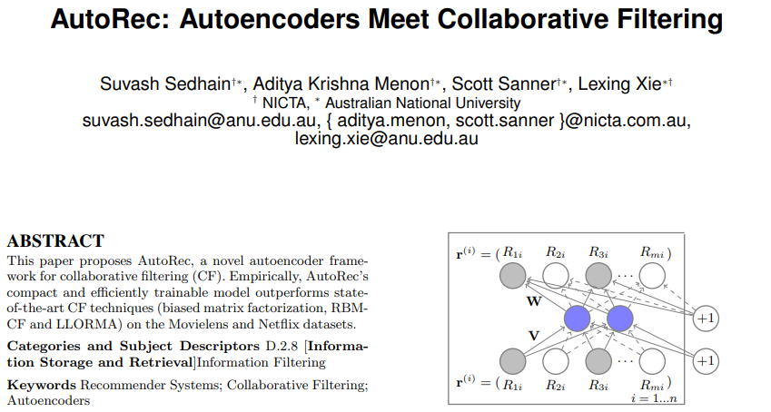
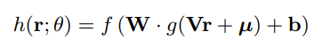
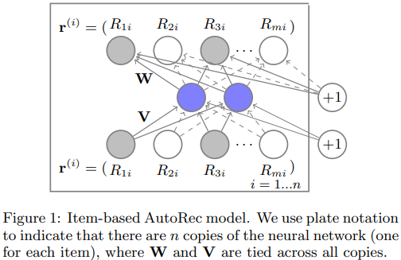
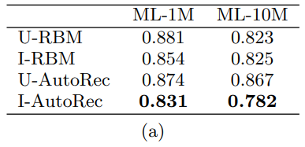
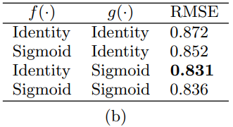
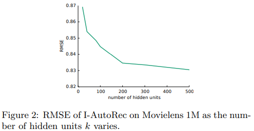
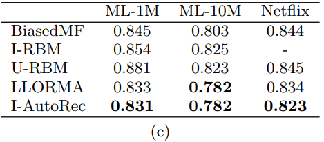

## 2015_CECS_AutoRec [AutoRec: Autoencoders Meet Collaborative Filtering]

---
### ABSTRACT  
* AutoRec: CF 위한 새로운 autoencoder 프레임워크   

#### Keywords   
* Recommender Systems; Collaborative Filtering; Autoencoders   

---
### 1. INTRODUCTION
* CF: item에 대한 user 선호도 > personalised recommendations     
  * matrix factorisation, neighbourhood models  
* AutoRec: autoencoder paradigm 기반 CF  
  * 주장: representational, computational 이점 존재   

---
### 2. THE AUTOREC MODEL  
* user item rating 행렬  
  * : user-item rating matrix  
  * m: user; u ∈ U = {1 . . . m}; 부분 관측 벡터      
  * n: item; i ∈ I = {1. . . n}; 부분 관측 벡터        

* item-based/user-based autoencoder  
  * input  > project(저차원 잠재(은닉)공간) >  reconstruct(출력공간) > 누락된 등급 예측(추천)    

* 오토인코더  
  * .PNG)  
    * S:  벡터 set   
    *    
    * h(r; θ):  의 재구성  
      * 
        * f(·), g(·): 활성화 함수    
        * θ = {W, V, µ, b}; 변환 , 바이어스     
  * 목표: 단일 k-차원 은닉층 있는 auto-associative neural network    
    * θ: backpropagation 학습    

* item-based AutoRec model(I-AutoRec)  
  *   
  * .PNG) 변경사항(2):  
    * 벡터 set(  ) 등식(1)에 적용  
    * 1) (matrix factorisation & RBM)  부분적 관찰(입력/가중치 역전파 하는 동안만 업데이트)    
    * 2) 과적합 방지를 위한 매개변수 정규화  
  * 관찰된 ratings(shaded nodes), 입력() 업데이트 된 가중치 solid 연결  
  * objective function(규제강도 λ > 0)  
    * .PNG)  
      * : 관찰된 등급 기여도만 고려   

* User-based AutoRec model(U-AutoRec)  
  *  작업 파생  
  * 2mk + m + k 파라미터 추정 필요  
  * user-item 예측 등급   
    * .PNG)  
      * : 학습된 매개변수  

* RBM-CF(RBM 기반 CF) v.s AutoRec  
  * 1) generative model v.s discriminative model     
  * 2) 파라미터 추정; maximising log likelihood v.s minimises RMSE  
  * 3) contrastive divergence v.s gradient-based backpropagation(더 빠름)  
  * 4) discrete ratings 적용 v.s agnostic to r  
* matrix factorisation v.s AutoRec  
  * 1) (user-item) embed shared latent space v.s (items) embeds  into latent space  
  * 2) linear latent representation v.s 활성화 함수 g(·) > non-linear latent representation  

---
### 3. EXPERIMENTAL EVALUATION  
* datasets: Movielens, Netflix   
* models: AutoRec, RBM-CF, Biased Matrix Factorisation(BiasedMF),  Local Low-Rank Matrix Factorisation(LLORMA)  

* average RMSE  
  * 95% confidence intervals: ±0.003 이하  

* 규제 강도: λ ∈ {0.001, 0.01, 0.1, 1, 100, 1000}  
* 잠재 차원: k ∈ {10, 20, 40, 80, 100, 200, 300, 400, 500}  

* autoencoders objective: non-convexity    
* 최적화 알고리즘: L-BFGS, RProp(빠름) => RProp 사용   

*   
  * 성능: I-AutoRec > RBM   

*   
  * f(·): identity,. g(·): sigmoid     

*   
  * 은닉 유닛 수에 따른 성능  
  
*   
  * AutoRec 지속적으로 성능 우수  

---