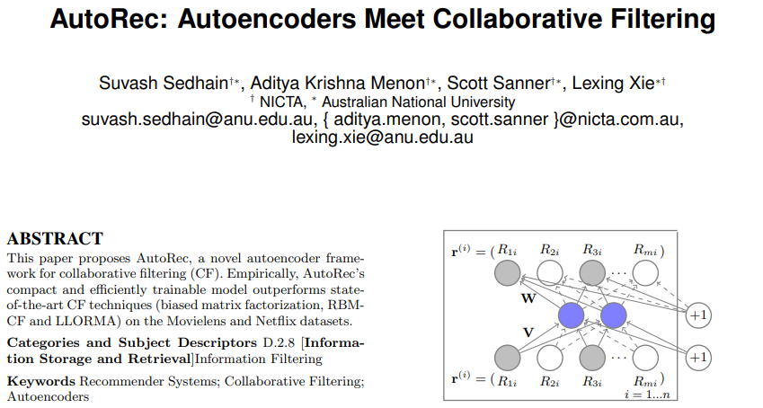
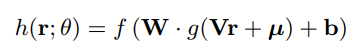
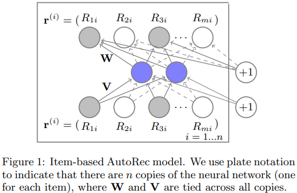
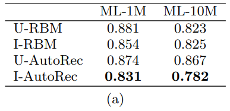
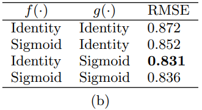
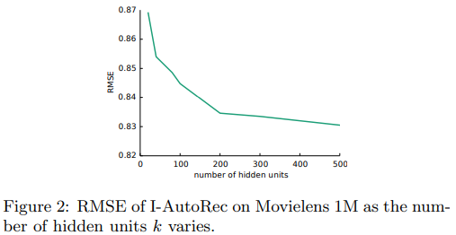

## 2015_CECS_AutoRec [AutoRec: Autoencoders Meet Collaborative Filtering]

---
### ABSTRACT  
* AutoRec: CF 위한 새로운 autoencoder 프레임워크   

Empirically, AutoRec’s compact and efficiently trainable model outperforms stateof-the-art CF techniques (biased matrix factorization, RBMCF and LLORMA) on the Movielens and Netflix datasets.
경험적으로 AutoRec의 작고 효율적으로 학습 가능한 모델은 Movielens 및 Netflix 데이터 세트에서 최첨단 CF 기술 (편향 행렬 분해, RBMCF 및 LLORMA)을 능가합니다.

#### Categories and Subject Descriptors  
* D.2.8 [Information Storage and Retrieval]Information Filtering   
#### Keywords   
* Recommender Systems; Collaborative Filtering; Autoencoders  

---
### 1. INTRODUCTION
* CF: item에 대한 user 선호도 > personalised recommendations     
  * matrix factorisation, neighbourhood models  
* AutoRec: autoencoder paradigm 기반 CF  
  * 주장: representational, computational 이점 존재   

---
### 2. THE AUTOREC MODEL
* user item rating 행렬  
  * $ R ∈ \matr?? R ^{m × n}  $
In rating-based collaborative filtering, we have m users, n items, and a partially observed user-item rating matrix R ∈ R m×n. 
등급 기반 협업 필터링에는 m 명의 사용자, n 개의 항목 및 부분적으로 관찰 된 사용자 항목 등급 행렬 R ∈ R m × n이 있습니다.

Each user u ∈ U = {1 . . . m} can be represented by a partially observed vector r (u) = (Ru1, . . . Run) ∈ Rn.
각 사용자 u ∈ U = {1. . . m}은 부분적으로 관측 된 벡터 r (u) = (Ru1,... Run) ∈ Rn으로 나타낼 수 있습니다.

Similarly, each item i ∈ I = {1 . . . n} can be represented by a partially observed vector r (i) = (R1i, . . . Rmi) ∈ Rm.
마찬가지로 각 항목 i ∈ I = {1. . . n}은 부분적으로 관측 된 벡터 r (i) = (R1i,... Rmi) ∈ Rm으로 나타낼 수 있습니다.

Our aim in this work is to design an item-based (user-based) autoencoder which can take as input each partially observed r(i)(r(u)), project it into a low-dimensional latent (hidden) space, and then reconstruct r(i)(r(u)) in the output space to predict missing ratings for purposes of recommendation.
이 작업의 목표는 부분적으로 관찰 된 각 r (i) (r (u))를 입력으로 받아 저 차원 잠복 (숨겨진) 공간에 투영 할 수있는 항목 기반 (사용자 기반) 자동 인코더를 설계하는 것입니다. 그런 다음 출력 공간에서 r (i) (r (u))를 재구성하여 추천 목적으로 누락 된 등급을 예측합니다.

Formally, given a set S of vectors in Rd, and some k ∈ N+, an autoencoder solves 
공식적으로, Rd의 벡터 세트 S와 k ∈ N +가 주어지면 오토 인코더는

.PNG)

where h(r; θ) is the reconstruction of input r ∈ Rd
여기서 h (r; θ)는 입력 r ∈ Rd의 재구성입니다.

* 
  * f(·), g(·): 활성화 함수  
  * θ = {W, V, µ, b} (변환), W ∈ Rd × k, V ∈ Rk × d 및 바이어스 µ ∈Rk, b ∈ Rd  

Here, θ = {W, V, µ, b} for transformations W ∈ Rd×k, V ∈ Rk×d, and biases µ ∈Rk, b ∈ Rd. 
여기서 θ = {W, V, µ, b} 변환 W ∈ Rd × k, V ∈ Rk × d 및 바이어스 µ ∈Rk, b ∈ Rd.

* 목표: 단일 k-차원 은닉층 있는 auto-associative neural network    
* θ: backpropagation 핛브  

The item-based AutoRec model, shown in Figure 1, applies an autoencoder as per Equation 1 to the set of vectors {r(i)}ni=1, with two important changes. 
그림 1에 표시된 항목 기반 AutoRec 모델은 두 가지 중요한 변경 사항과 함께 벡터 세트 {r (i)} ni = 1에 방정식 1에 따라 자동 인코더를 적용합니다.

First, we account for the fact that each r(i) is partially observed by only updating during backpropagation those weights that are associated with observed inputs, as is common in matrix factorisation and RBM approaches. 
첫째, 행렬 분해 및 RBM 접근법에서 일반적으로 관찰 된 입력과 관련된 가중치를 역 전파하는 동안에 만 업데이트함으로써 각 r (i)가 부분적으로 관찰된다는 사실을 설명합니다.

Second, we regularise the learned parameters so as to prevent overfitting on the observed ratings.
둘째, 관찰 된 등급에 대한 과적 합을 방지하기 위해 학습 된 매개 변수를 정규화합니다.

Formally, the objective function for the Item-based AutoRec (I-AutoRec) model is, for regularisation strength λ > 0,
공식적으로 항목 기반 AutoRec (I-AutoRec) 모델의 목적 함수는 정규화 강도 λ> 0에 대해

.PNG)

$ ||\cdot||_O^2 $ 

where || · ||2 O means that we only consider the contribution of observed ratings. 
어디 || · || 2 O는 관찰 된 등급의 기여도 만 고려함을 의미합니다.

User-based AutoRec (U-AutoRec) is derived by working with {r(u)}m u=1. 
사용자 기반 AutoRec (U-AutoRec)는 {r (u)} m u = 1로 작업하여 파생됩니다.

In total, I-AutoRec requires the estimation of 2mk + m + k parameters. 
전체적으로 I-AutoRec에는 2mk + m + k 매개 변수의 추정이 필요합니다.

Given learned parameters ˆθ, I-AutoRec’s predicted rating for user u and item i is
학습 된 매개 변수 ˆθ가 주어지면 사용자 u 및 항목 i에 대한 I-AutoRec의 예측 등급은 다음과 같습니다.

.PNG)

Figure 1 illustrates the model, with shaded nodes corresponding to observed ratings, and solid connections corresponding to weights that are updated for the input r(i).
그림 1은 관찰 된 등급에 해당하는 음영 처리 된 노드와 입력 r (i)에 대해 업데이트 된 가중치에 해당하는 솔리드 연결이있는 모델을 보여줍니다.

AutoRec is distinct to existing CF approaches. 
AutoRec은 기존 CF 접근 방식과 다릅니다.

Compared to the RBM-based CF model (RBM-CF) [4], there are several differences. 
RBM 기반 CF 모델 (RBM-CF) [4]과 비교하면 몇 가지 차이점이 있습니다.

First, RBM-CF proposes a generative, probabilistic model based on restricted Boltzmann machines, while AutoRec is a discriminative model based on autoencoders. 
첫째, RBM-CF는 제한된 Boltzmann 기계를 기반으로 한 생성 적 확률 모델을 제안하는 반면 AutoRec은 자동 인코더를 기반으로 한 차별적 모델입니다.

Second, RBM-CF estimates parameters by maximising log likelihood, while AutoRec directly minimises RMSE, the canonical performance in rating prediction tasks. 
둘째, RBM-CF는 로그 가능성을 최대화하여 매개 변수를 추정하는 반면 AutoRec은 평가 예측 작업의 표준 성능 인 RMSE를 직접 최소화합니다.

Third, training RBM-CF requires the use of contrastive divergence, whereas training AutoRec requires the comparatively faster gradient-based backpropagation. 
셋째, RBM-CF를 훈련하려면 대비 발산을 사용해야하는 반면 AutoRec를 훈련하려면 상대적으로 더 빠른 기울기 기반 역 전파가 필요합니다.

Finally, RBM-CF is only applicable for discrete ratings, and estimates a separate set of parameters for each rating value.
마지막으로 RBM-CF는 개별 등급에만 적용되며 각 등급 값에 대해 별도의 매개 변수 집합을 추정합니다.

For r possible ratings, this implies nkr or (mkr) parameters for user- (item-) based RBM. 
r 가능한 등급의 경우 이는 사용자 (항목) 기반 RBM에 대한 nkr 또는 (mkr) 매개 변수를 의미합니다.

AutoRec is agnostic to r and hence requires fewer parameters. 
AutoRec은 r과 무관하므로 더 적은 매개 변수가 필요합니다.

Fewer parameters enables AutoRec to have less memory footprint and less prone to overfitting. 
매개 변수가 적을수록 AutoRec은 메모리 풋 프린트를 줄이고 과적 합 가능성을 줄일 수 있습니다.

Compared to matrix factorisation (MF) approaches, which embed both users and items into a shared latent space, the item-based AutoRec model only embeds items into latent space. 
사용자와 항목을 공유 잠재 공간에 포함시키는 매트릭스 분해 (MF) 접근 방식과 비교하여 항목 기반 AutoRec 모델은 항목을 잠재 공간에만 포함합니다.

Further, while MF learns a linear latent representation, AutoRec can learn a nonlinear latent representation through activation function g(·).
또한 MF가 선형 잠재 표현을 학습하는 동안 AutoRec은 활성화 함수 g (·)를 통해 비선형 잠재 표현을 학습 할 수 있습니다.

---
### 3. EXPERIMENTAL EVALUATION

In this section, we evaluate and compare AutoRec with RBM-CF [4], Biased Matrix Factorisation [1] (BiasedMF), and Local Low-Rank Matrix Factorisation (LLORMA) [2] on the Movielens 1M, 10M and Netflix datasets. 
이 섹션에서는 Movielens 1M, 10M 및 Netflix 데이터 세트에서 AutoRec을 RBM-CF [4], Biased Matrix Factorisation [1] (BiasedMF) 및 Local Low-Rank Matrix Factorisation (LLORMA) [2]과 평가하고 비교합니다.

Following [2], we use a default rating of 3 for test users or items without training observations. 
[2]에 따라, 우리는 훈련 관찰이없는 테스트 사용자 또는 항목에 대해 기본 등급 3을 사용합니다.

We split the data into random 90%–10% train-test sets, and hold out 10% of the training set for hyperparamater tuning. 
데이터를 무작위 90 % ~ 10 % 훈련 테스트 세트로 분할하고 하이퍼 파라 마터 조정을위한 훈련 세트의 10 %를 보유합니다.

We repeat this splitting procedure 5 times and report average RMSE. 
이 분할 절차를 5 회 반복하고 평균 RMSE를보고합니다.

95% confidence intervals on RMSE were ±0.003 or less in each experiment. 
RMSE에 대한 95 % 신뢰 구간은 각 실험에서 ± 0.003 이하였습니다.

For all baselines, we tuned the regularisation strength λ ∈ {0.001, 0.01, 0.1, 1, 100, 1000} and the appropriate latent dimension k ∈ {10, 20, 40, 80, 100, 200, 300, 400, 500}.
모든 기준선에 대해 정규화 강도 λ ∈ {0.001, 0.01, 0.1, 1, 100, 1000} 및 적절한 잠재 차원 k ∈ {10, 20, 40, 80, 100, 200, 300, 400, 500}을 조정했습니다. .

A challenge training autoencoders is non-convexity of the objective. 
도전 훈련 오토 인코더는 목표의 비 볼록성입니다.

We found resilient propagation (RProp) [3] to give comparable performance to L-BFGS, while being much faster. 
우리는 L-BFGS에 필적하는 성능을 제공하면서 훨씬 더 빠른 복원력 전파 (RProp) [3]를 발견했습니다.

Thus, we use RProp for all subsequent experiments: 
따라서 모든 후속 실험에 RProp을 사용합니다.

Which is better, item- or user-based autoencoding with RBMs or AutoRec? Table 1a shows item-based (I-) methods for RBM and AutoRec generally perform better; 
RBM 또는 AutoRec을 사용하는 더 나은 항목 또는 사용자 기반 자동 인코딩은 무엇입니까? 표 1a는 RBM 및 AutoRec에 대한 항목 기반 (I-) 방법이 일반적으로 더 나은 성능을 보여줍니다.

this is likely since the average number of ratings per item is much more than those per user; high variance in the number of user ratings leads to less reliable prediction for user-based methods. 
항목 당 평균 평점 수가 사용자 당 평점보다 훨씬 많기 때문일 수 있습니다. 사용자 평가 수의 변동이 높으면 사용자 기반 방법에 대한 예측의 신뢰성이 떨어집니다.

I-AutoRec outperforms all RBM variants.
I-AutoRec은 모든 RBM 변형을 능가합니다.

How does AutoRec performance vary with linear and nonlinear activation functions f(·), g(·)? Table 1b indicates that nonlinearity in the hidden layer (via g(·)) is critical for good performance of I-AutoRec, indicating its potential advantage over MF methods. 
AutoRec 성능은 선형 및 비선형 활성화 함수 f (·), g (·)에 따라 어떻게 달라 집니까? 표 1b는 은닉 계층 (g (·)을 통한)의 비선형 성이 I-AutoRec의 우수한 성능에 중요하며 MF 방법에 비해 잠재적 인 이점을 나타냅니다.

Replacing sigmoids with Rectified Linear Units (ReLU) performed worse. 
시그 모이 드를 ReLU (Rectified Linear Unit)로 대체하면 성능이 더 나빠졌습니다.

All other AutoRec experiments use identity f(·) and sigmoid g(·) functions.
다른 모든 AutoRec 실험은 식별 f (·) 및 시그 모이 드 g (·) 함수를 사용합니다.

How does performance of AutoRec vary with the number of hidden units? In Figure 2, we evaluate the performance of AutoRec model as the number of hidden units varies.
은닉 유닛 수에 따라 AutoRec의 성능이 어떻게 달라 집니까? 그림 2에서는 은닉 유닛 수가 달라짐에 따라 AutoRec 모델의 성능을 평가합니다.

We note that performance steadily increases with the number of hidden units, but with diminishing returns.
은닉 유닛의 수에 따라 성능이 꾸준히 증가하지만 수익은 감소합니다.

All other AutoRec experiments use k = 500.
다른 모든 AutoRec 실험은 k = 500을 사용합니다.

How does AutoRec perform against all baselines?
AutoRec은 모든 기준에 대해 어떻게 수행됩니까?

Table 1c shows that AutoRec consistently outperforms all baselines, except for comparable results with LLORMA on Movielens 10M. 
표 1c는 Movielens 10M에서 LLORMA와 비교 한 결과를 제외하고는 AutoRec이 모든 기준선보다 지속적으로 성능이 우수하다는 것을 보여줍니다.

Competitive performance with LLORMA is of interest, as the latter involves weighting 50 different local matrix factorization models, whereas AutoRec only uses a single latent representation via a neural net autoencoder.
LLORMA의 경쟁 성능은 관심이 있습니다. LLORMA는 50 개의 서로 다른 로컬 매트릭스 인수 분해 모델에 가중치를 부여하는 반면 AutoRec은 신경망 자동 인코더를 통해 단일 잠재 표현 만 사용합니다.

Do deep extensions of AutoRec help? We developed a deep version of I-AutoRec with three hidden layers of (500, 250, 500) units, each with a sigmoid activation. 
AutoRec의 심층 확장이 도움이됩니까? 우리는 각각 시그 모이 드 활성화가있는 (500, 250, 500) 유닛의 3 개의 은닉 레이어가있는 I-AutoRec의 심층 버전을 개발했습니다.

We used greedy pretraining and then fine-tuned by gradient descent.
탐욕스러운 사전 훈련을 사용한 다음 경사 하강 법으로 미세 조정했습니다.

On Movielens 1M, RMSE reduces from 0.831 to 0.827 indicating potential for further improvement via deep AutoRec.
Movielens 1M에서 RMSE는 0.831에서 0.827로 감소하여 Deep AutoRec을 통해 추가 개선 가능성을 나타냅니다.

---