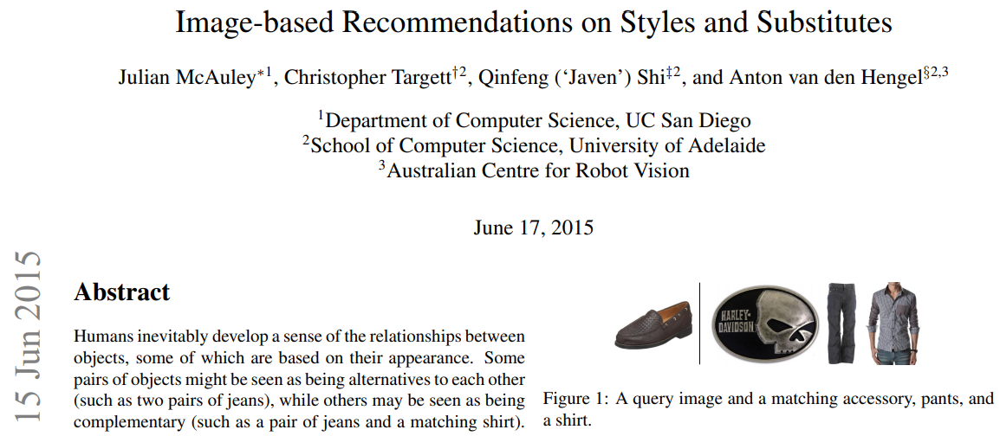
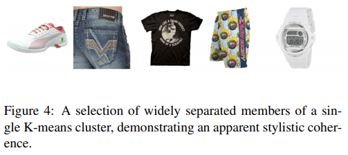

## 2015_IRSS [Image-based Recommendations on Styles and Substitutes]

---

### Abstract
* 선택 요소: **appearance**(objects 간 관계, 상호작용)       
* object pairs: 대안(청바지 A-청바지B), 보완(청바지-어울리는 셔츠)   
* 접근: 가능한 가장 큰 데이터 세트 캡처 > 내부 시각적 관계 > 확장 가능한 방법 개발
  * 시각적 관계에 대한 인간의 개념을 발견   

---

### 1. Introduction
* 한 쌍의 객체 간 시각적 관계에 대한 인간 개념(human notion) 모델링  
* (기존) visual style of places objects[individual appearances] > [influence] visual attributes of another  

* 개체간 상위 수준 관계 모델 포함(시각적 유사성 계산 포함 X)  
  *   
    * 상업적 응용: 사용자가 이미 관심을 보인 다른 항목을 기반 항목 추천    
      * 메타 데이터, 리뷰, 이전 구매 패턴 분석 구축  
        * 문제: cold-start problem, 인간의 시각적 선호도를 모델링     
             
* 인간 개념을 모델링   
  * 한 쌍의 객체: 본질적 연결 X, 인간의 개념만 존재(다른 쌍보다 적합)  
  * 접근방식: 수작업 레이블 이미지 활용      
* 레이블 작업: 대부분 적은 데이터세트 > 과적합 피하기 위한 작업 필요   
  * 작업 노력 ↑ => 수동 주석 작업 X 제안   
    * 제안: 조금만 관련 있어도(loosely related) 더 큰 데이터 세트에서 작동하는 소스를 찾는것    

#### 1.1 A visual dataset of styles and substitutes
* Amazon 웹 스토어 기반 데이터 세트 개발  
  * Styles and Substitutes 데이터 셋  
    *   
      * 관계: 호환성(‘compatibility’) 개념(2): 대체/보완  
      * 관계 카테고리(4)  
        * 1) X봄 > Y봄 (대체 가능하거나 noise)    
        * 2) X봄 > Y삼 (대체 가능하거나 noise)     
        * 3) X삼 > Y삼 (보완) 
        * 4) X+Y 동시에 삼 (보완)   
      * => 코사인 유사성에 따른 순위로 수집 가능, 외관이 아닌 기능 위주 공동 구매       

#### 1.2 Related work

#### 1.3 A visual and relational recommender system
* 프로세스: 시각적 / 관계형 추천 시스템  
  * 일반 추천(메타데이터, 리뷰) > object 외관 기반    

---

### 2. The Model
* notation  
  *    

* 객체 > 다른 객체 시각적 appearance 대한 선호 표현 방법   
  * 데이터 양에 따라 확장 되는 모델  
  * $ x \in \mathbb R^F $: F차원 feature 벡터  
  * $ r_{ij} \in R $: objects i/j 관계 세트(관계 카테고리 중 하나에 속함)  
* 목표: 거리변환 파라미터($ d(x_i, x_j) $) 학습  
  * d(·,·): $ P (r_{ij \in R}), -d(x_i, x_j) $ 단조 증가 하기 위해 찾음  

##### Distances and probabilities
* 거리와 확률을 연관시키기 위해 shifted sigmoid 함수 사용   
  * .PNG)  
  *   
    * cast logistic regression    
* item i/j 거리: (c; 예측 정확도 최대화 위해 미정)  
  * $ d(x_i, x_j) = c $: 확률 0.5     
  * $ d(x_i, x_j) > c $: 0.5 ↑      
  * $ d(x_i, x_j) > c $: 0.5 ↓      

* 잠재적(potential) 거리 함수 세트  
  * Weighted nearest neighbor: 특정 관계와 관련된 특정 차원 학습  
    * .PNG)  
  * Mahalanobis transform: 객체간 시각적 유사성 모델링 > feature 차원마다 강조 다름 제한   
    * Mahalanobis 거리 > 이미지 특징을 연결 > 서로 다른 특성 차원 관련(호환)  
    * .PNG)  
      * M: full rank p.s.d. matrix(positive symmetric definite): 과적합 위험, 실용성 ↓ >   
      * $ M \simeq YY^T $ 근사(Y: 차원 F x K 행렬):   
        * .PNG)  

#### 2.1 Style space
* .PNG)  
  * features $ x_i, x_j $ 저차원 임베딩 생성(Style space)  
  * K차원 벡터 $ s_i = x_iY $(Y: 시각적 유사 X, 관련 객체가 가깝게 식별)      
    * .PNG)  

#### 2.2 Personalizing styles to individual users  
* 모델 + 각 개별 사용자가 중요하다고 생각하는 스타일의 차원 학습 => 개념 개인화   

* 개인화 된 거리 함수: 사용자 u - 항목 i/j 거리 측정  
  * .PNG)
    * $ D^{(u)}: K \times K$: diagonal(positive semidefinite) matrix  
    * $ D_{kk}^{(u)} $: 사용자u가 k번째 스타일 차원에 대해 '관심'있는 정도   

In practice we fit a U × K matrix X such that D(u) kk = Xuk. 
실제로 우리는 D (u) kk = Xuk가되도록 U × K 행렬 X를 맞 춥니 다.

Much like the simplification in (eq. 5), the distance dY,u(xi, xj ) can be conveniently written In other words, Xu is a personalized weighting of the projected style-space dimensions.
(식 5)의 단순화와 매우 유사하게 거리 dY, u (xi, xj)는 다음과 같이 편리하게 쓸 수 있습니다.
as 
.PNG)

즉, Xu는 투영 된 스타일 공간 차원의 개인화 된 가중치입니다.

The construction in (eq. 6 and 7) only makes sense if there are users associated with each edge in our dataset, which is not true of the four graph types we have presented so far. 
(eq. 6 및 7)의 구성은 데이터 세트의 각 에지와 관련된 사용자가있는 경우에만 의미가 있으며 지금까지 제시 한 네 가지 그래프 유형에는 해당되지 않습니다.

Thus to study the issue of user personalization we make use of our rating and review data (see Table 1). 
따라서 사용자 개인화 문제를 연구하기 위해 평가 및 리뷰 데이터를 사용합니다 (표 1 참조).

From this we sample a dataset of triples (i,j,u) of products i and j that were both purchased by user u (i.e., u reviewed them both). 
이로부터 우리는 사용자 u가 구매 한 제품 i와 j의 트리플 (i, j, u) 데이터 세트를 샘플링합니다 (즉, u가 둘 다 검토 함).

We describe this further when we outline our experimental protocol in Section 4.1.
섹션 4.1에서 실험 프로토콜을 설명 할 때이를 더 자세히 설명합니다.

#### 2.3 Features

Features are calculated from the original images using the Caffe deep learning framework [11]. 
특징은 Caffe 딥 러닝 프레임 워크를 사용하여 원본 이미지에서 계산됩니다 [11].

In particular, we used a Caffe reference model3 with 5 convolutional layers followed by 3 fully-connected layers, which has been pre-trained on 1.2 million ImageNet (ILSVRC2010) images. 
특히, 우리는 120 만 ImageNet (ILSVRC2010) 이미지에 대해 사전 학습 된 5 개의 컨볼 루션 레이어와 3 개의 완전 연결 레이어가있는 Caffe 참조 모델 3을 사용했습니다.

We use the output of FC7, the second fully-connected layer, which results in a feature vector of length F = 4096. 
두 번째 완전 연결 계층 인 FC7의 출력을 사용하여 길이 F = 4096의 특성 벡터를 생성합니다.

---

### 3. Training
Since we have defined a probability associated with the presence (or absence) of each relationship, we can proceed by maximizing the likelihood of an observed relationship set R. 
3. 훈련
각 관계의 존재 (또는 부재)와 관련된 확률을 정의 했으므로 관찰 된 관계 집합 R의 가능성을 최대화하여 진행할 수 있습니다.

In order to do so we randomly select a negative set Q = {rij |rij ∈/ R} such that |Q| = |R| and optimize the log likelihood 
그렇게하기 위해 무작위로 음의 집합 Q = {rij | rij ∈ / R}을 선택하여 | Q | = | R | 로그 가능성 최적화
.PNG)
Learning then proceeds by optimizing l(Y,c|R, Q) over both Y and c which we achieve by gradient ascent. 
그런 다음 기울기 상승으로 달성 한 Y와 c에 대해 l (Y, c | R, Q)를 최적화하여 학습을 진행합니다.

We use (hybrid) L-BFGS, a quasi-Newton method for non-linear optimization of problems with many variables [21]. 
우리는 많은 변수가있는 문제의 비선형 최적화를 위해 준 뉴턴 방법 인 (하이브리드) L-BFGS를 사용합니다 [21].

Likelihood (eq. 8) and derivative computations can be na¨ıvely parallelized over all pairs rij ∈ R ∪ Q. 
가능성 (등식 8) 및 미분 계산은 모든 쌍 rij ∈ R ∪ Q에 대해 순진하게 병렬화 될 수 있습니다.

Training on our largest dataset (Amazon books) with a rank K = 100 transform required around one day on a 12 core machine. 
가장 큰 데이터 세트 (Amazon 책)에 대한 교육 (랭크 K = 100 변환)은 12 코어 머신에서 하루 정도 필요합니다.

---

### 4. Experiments
We compare our model against the following baselines: 
다음 기준과 모델을 비교합니다.

We compare against Weighted Nearest Neighbor (WNN) classification, as is described in Section 1.3. 
섹션 1.3에 설명 된대로 WNN (Weighted Nearest Neighbor) 분류와 비교합니다.

We also compare against a method we label Category Tree (CT); CT is based on using Amazon’s detailed category tree directly (which we have collected for Clothing data, and use for later experiments), which allows us to assess how effective an image-based classification approach could be, if it were perfect. 
우리는 또한 카테고리 트리 (CT)라는 레이블을 붙인 방법과 비교합니다. CT는 Amazon의 세부 카테고리 트리를 직접 사용 (의류 데이터를 위해 수집하고 이후 실험에 사용)을 기반으로하므로 이미지 기반 분류 접근 방식이 완벽하다면 얼마나 효과적인지 평가할 수 있습니다.

We then compute a matrix of coocurrences between categories from the training data, and label two products (a,b) as ‘related’ if the category of b belongs to one of the top 50% of most commonly linked categories for products of category a. 
그런 다음 훈련 데이터에서 범주 간 동시성 행렬을 계산하고 b 범주가 범주 a의 제품에 대해 가장 일반적으로 연결된 범주의 상위 50 % 중 하나에 속하면 두 제품 (a, b)을 '관련됨'으로 표시합니다. .

Nearest neighbor results (calculated by optimizing a threshold on the `2 distance using the training data) were not significantly better than random, and have been suppressed for brevity. 
최근 접 이웃 결과 (훈련 데이터를 사용하여`2 거리에 대한 임계 값을 최적화하여 계산 됨)는 무작위보다 현저히 나아지지 않았으며 간결성을 위해 억제되었습니다.

Comparison against non-visual baselines As a non-visual comparison, we trained topic models on the reviews of each product (i.e., each document di is the set of reviews of the product i) and fit weighted nearest neighbor classifiers of the form 

.PNG)

where θi and θj are topic vectors derived from the reviews of the products i and j. 
비 시각적 기준에 대한 비교 비 시각적 비교로서, 우리는 각 제품의 리뷰에 대한 주제 모델을 훈련시키고 (즉, 각 문서 di는 제품 i의 리뷰 집합입니다) 양식의 가중 최근 접 이웃 분류기에 적합합니다.

여기서 θi 및 θj는 제품 i 및 j의 리뷰에서 파생 된 주제 벡터입니다.

In other words, we simply adapted our WNN baseline to make use of topic vectors rather than image features.
다시 말해, 우리는 단순히 이미지 특징보다는 주제 벡터를 사용하도록 WNN 기준선을 조정했습니다.

We used a 100-dimensional topic model trained using Vowpal Wabbit [8]. 
우리는 Vowpal Wabbit [8]을 사용하여 훈련 된 100 차원 주제 모델을 사용했습니다.

However, this baseline proved not to be competitive against the alternatives described above (e.g. only 60% accuracy on our largest dataset, ‘Books’). 
그러나이 기준은 위에서 설명한 대안에 비해 경쟁력이없는 것으로 입증되었습니다 (예 : 가장 큰 데이터 세트 인 'Books'에서 정확도가 60 %에 불과 함).

One explanation may simply be that is is difficult to effectively train topic models at the 1M+ document scale; another explanation is simply that the vast majority of products have few reviews. 
한 가지 설명은 단순히 1M 이상의 문서 규모에서 주제 모델을 효과적으로 교육하기 어렵다는 것입니다. 또 다른 설명은 대부분의 제품에 대한 리뷰가 거의 없다는 것입니다.

Not surprisingly, the number of reviews per product follows a power-law, e.g. for Men’s Clothing: 
당연히 제품 당 리뷰 수는 멱 법칙을 따릅니다. 남성 의류 :

This issue is in fact exacerbated in our setting, as to predict a relationship between products we require both to have reliable feature representations, which will be true only if both products have several reviews. 
이 문제는 실제로 제품 간의 관계를 예측하기 위해 두 제품 모두 신뢰할 수있는 기능 표현을 필요로하며, 이는 두 제품 모두 여러 리뷰가있는 경우에만 해당됩니다.

Although we believe that predicting such relationships using text is a promising direction of future research (and one we are exploring), we simply wish to highlight the fact that there appears to be no ‘silver bullet’ to predict such relationships using text, primarily due to the ‘cold start’ issue that arises due to the long tail of obscure products with little text associated with them. 
텍스트를 사용하여 이러한 관계를 예측하는 것이 미래 연구의 유망한 방향이라고 생각하지만 (그리고 우리가 탐구중인), 텍스트를 사용하여 이러한 관계를 예측하는 데 '실버 총알'이 없다는 사실을 강조하고 싶습니다. 관련 텍스트가 거의없는 모호한 제품의 긴 꼬리로 인해 발생하는 '콜드 스타트'문제에 대한 것입니다.

Indeed, this is a strong argument in favor of building predictors based on visual features, since images are available even for brand new products which are yet to receive even a single review.
실제로 이것은 아직 단 한 번의 리뷰도받지 못한 새로운 제품에도 이미지를 사용할 수 있기 때문에 시각적 기능을 기반으로 예측 변수를 구축하는 데 유리한 강력한 주장입니다.

#### 4.1 Experimental protocol

We split the dataset into its top-level categories (Books, Movies, Music, etc.) and further split the Clothing category into second-level categories (Men’s, Women’s, Boys, Girls, etc.). 
데이터 세트를 최상위 카테고리 (도서, 영화, 음악 등)로 나누고 의류 카테고리를 두 번째 수준 카테고리 (남성, 여성, 소년, 소녀 등)로 더 분할했습니다.

We focus on results from a few representative subcategories. 
우리는 몇 가지 대표적인 하위 범주의 결과에 중점을 둡니다.

Complete code for all experiments and all baselines is available online.
모든 실험 및 모든 기준에 대한 완전한 코드는 온라인으로 제공됩니다.

For each category, we consider the subset of relationships from R that connect products within that category. 
각 범주에 대해 해당 범주 내의 제품을 연결하는 R의 관계 하위 집합을 고려합니다.

After generating random samples of non-relationships, we separate R and Q into training, validation, and test sets (80/10/10%, up to a maximum of two million training relationships). 
비 관계의 무작위 샘플을 생성 한 후 R과 Q를 훈련, 검증 및 테스트 세트로 분리합니다 (80 / 10 / 10 %, 최대 2 백만 개의 훈련 관계).

Although we do not fit hyperparameters (and therefore do not make use of the validation set), we maintain this split in case it proves useful to those wishing to benchmark their algorithms on this data. 
하이퍼 파라미터에 적합하지 않지만 (따라서 검증 세트를 사용하지 않음),이 데이터에 대한 알고리즘을 벤치마킹하려는 사람들에게 유용하다고 입증되는 경우이 분할을 유지합니다.

While we did experiment with simple `2 regularizers, we found ourselves blessed with a sufficient overabundance of data that overfitting never presented an issue (i.e., the validation error was rarely significantly higher than the training error). 
우리는 간단한`2 정규화기로 실험을했지만 과적 합이 문제를 일으키지 않았던 충분한 데이터가 충분한 축복을 받았다는 것을 알았습니다 (즉, 검증 오류가 훈련 오류보다 거의 높지 않음).

To be completely clear, our protocol consists of the following: 
명확히하기 위해 우리의 프로토콜은 다음과 같이 구성됩니다.

1. Each category and graph type forms a single experiment (e.g. predict ‘bought together’ relationships for Women’s clothing).

2. Our goal is to distinguish relationships from non-relationships (i.e., link prediction). 
Relationships are identified when our predictor (eq. 1) outputs P(rij ∈ R) > 0.5.

3. We consider all positive relationships and a random sample of non-relationships (i.e., ‘distractors’) of equal size. 
Thus the performance of a random classifier is 50% for all experiments.

4. All results are reported on the test set. 
Results on a selection of top-level categories are shown in Table 4, with further results for clothing data shown in Table 

5. Recall when interpreting these results that the learned model has reference to the object images only. 
It is thus estimating the existence of a specified form of relationship purely on the basis of appearance.
1. 각 카테고리 및 그래프 유형은 하나의 실험을 형성합니다 (예 : 여성 의류에 대한 '함께 구매'관계 예측).

2. 우리의 목표는 관계와 비 관계 (즉, 링크 예측)를 구별하는 것입니다.
예측 변수 (식 1)가 P (rij ∈ R)> 0.5를 출력하면 관계가 식별됩니다.

3. 우리는 모든 긍정적 인 관계와 같은 크기의 비 관계 (즉, '산만하는 사람')의 무작위 표본을 고려합니다.
따라서 임의 분류기의 성능은 모든 실험에서 50 %입니다.

4. 모든 결과는 테스트 세트에보고됩니다.
선택한 최상위 범주에 대한 결과는 표 4에 나와 있으며 의류 데이터에 대한 추가 결과는 표에 나와 있습니다.

5. 이러한 결과를 해석 할 때 학습 된 모델이 대상 이미지 만 참조한다는 사실을 상기하십시오.
따라서 순전히 외모에 기초하여 특정 형태의 관계의 존재를 추정합니다.

In every case the proposed method outperforms both the category-based method and weighted nearest neighbor, and the increase from K = 10 to K = 100 uniformly improves performance. 
모든 경우에 제안 된 방법은 범주 기반 방법과 가중 최근 접 이웃 모두보다 성능이 우수하며 K = 10에서 K = 100으로 증가하면 성능이 균일하게 향상됩니다.

Interestingly, the performance on compliments vs. substitutes is approximately the same. 
흥미롭게도 칭찬과 대용품의 성과는 거의 동일합니다.

The extent to which the K = 100 results improve upon the WNN results may be seen as an indication of the degree to which visual similarity between images fails to capture a more complex human visual notion of which objects might be seen as being substitutes or compliments for each other. 
WNN 결과에서 K = 100 결과가 향상되는 정도는 이미지 간의 시각적 유사성이 어떤 대상이 대체물 또는 칭찬으로 보일 수 있는지에 대한 더 복잡한 인간의 시각적 개념을 포착하지 못하는 정도를 나타내는 것으로 볼 수 있습니다. 서로.

This distinction is smallest for ‘Books’ and greatest for ‘Clothing Shoes and Jewelery’ as might be expected. 
이 구분은 예상대로 '책'에서 가장 작고 '의류 신발 및 보석'에서 가장 큽니다.

We have no ground truth relating the true human visual preference for pairs of objects, of course, and thus evaluate above against our dataset. 
물론 개체 쌍에 대한 실제 인간의 시각적 선호도와 관련된 근거가 없으므로 데이터 세트에 대해 위에서 평가합니다.

This has the disadvantage that the dataset contains all of the Amazon recommendations, rather than just those based on decisions made by humans on the basis of object appearance. 
이것은 데이터 세트에 객체 모양을 기반으로 인간이 내린 결정에 기반한 것이 아니라 모든 Amazon 권장 사항이 포함되어 있다는 단점이 있습니다.

This means that in addition to documenting the performance of the proposed method, the results may also be taken to indicate the extent to which visual factors impact upon the decisions of Amazon customers. 
즉, 제안 된 방법의 성능을 문서화하는 것 외에도 결과를 통해 Amazon 고객의 결정에 시각적 요인이 영향을 미치는 정도를 나타낼 수도 있습니다.

The comparison across categories is particularly interesting. 
카테고리 간 비교는 특히 흥미 롭습니다.

It is to be expected that appearance would be a significant factor in Clothing decisions, but it was not expected that the purchase of Books. 
외모가 의복 결정에 중요한 요소가 될 것으로 예상되지만 책 구입은 예상되지 않았습니다.

One possible interpretation of this effect might be that customers have preferences for particular genres of books and that individual genres have characteristic styles of covers. 
이 효과에 대한 한 가지 가능한 해석은 고객이 특정 장르의 책에 대한 선호도를 가지고 있고 개별 장르가 독특한 스타일의 표지를 가지고 있다는 것입니다.

4.2 Personalized recommendations

Finally we evaluate the ability of our model to personalize copurchasing recommendations to individual users, that is we examine the effect of the user personalization term in (eqs. 6 and 7). 
마지막으로 개별 사용자에게 공동 구매 추천을 개인화하는 모델의 능력을 평가합니다. 즉, 사용자 개인화 기간의 효과를 조사합니다 (식 6 및 7).

Here we do not use the graphs from Tables 4 and 5, since those are ‘population level’ graphs which are not annotated in terms of the individual users who co-purchased and cobrowsed each pair of products. 
여기서는 표 4와 5의 그래프를 사용하지 않습니다. 이는 각 제품 쌍을 공동 구매하고 공동 검색 한 개별 사용자 측면에서 주석이 추가되지 않은 '인구 수준'그래프이기 때문입니다.

Instead for this task we build a dataset of co-purchases from products that users have reviewed. 
대신이 작업을 위해 사용자가 검토 한 제품의 공동 구매 데이터 세트를 작성합니다.

That is, we build a dataset of tuples of the form (i,j,u) for pairs of products i and j that were purchased by user u. 
즉, 사용자 u가 구매 한 제품 i 및 j 쌍에 대해 (i, j, u) 형식의 튜플 데이터 세트를 빌드합니다.

We train on users with at least 20 purchases, and randomly sample 50 co-purchases and 50 non-co-purchases from each user in order to build a balanced dataset. 
20 개 이상의 구매가있는 사용자에 대해 교육하고 균형 잡힌 데이터 세트를 구축하기 위해 각 사용자로부터 50 개의 공동 구매와 50 개의 비 공동 구매를 무작위로 샘플링합니다.

Results are shown in Table 3; here we see that the addition of a user personalization term yields a small but significant improvement when predicting co-purchases (similar results on other categories withheld for brevity).
결과는 표 3에 제시되어있다; 여기에서 사용자 개인화 용어를 추가하면 공동 구매를 예측할 때 작지만 상당한 개선이 이루어집니다 (간결성을 위해 다른 카테고리에 대한 유사한 결과는 보류 됨).

---

### 5. Visualizing Style Space

Recall that each image is projected into ‘style-space’ by the transformation si = xiY, and note that the fact that it is based on pairwise distances alone means that the embedding is invariant under isomorphism. 
각 이미지는 si = xiY 변환에 의해 '스타일 공간'으로 투영된다는 점을 상기하고, 이것이 쌍 단위 거리만을 기반으로한다는 사실은 임베딩이 동형 하에서 불변임을 의미합니다.

That is, applying rotations, translations, or reflections to si and sj will preserve their distance in (eq. 5). 
즉, si와 sj에 회전, 평행 이동 또는 반사를 적용하면 거리가 (eq. 5)에서 유지됩니다.

In light of these factors we perform k-means clustering on the K dimensional embedded coordinates of the data in order to visualize the effect of the embedding. 
이러한 요소를 고려하여 임베딩의 효과를 시각화하기 위해 데이터의 K 차원 임베디드 좌표에 k- 평균 클러스터링을 수행합니다.

Figure 3 shows images whose projections are close to the centers of a set of selected representative clusters for Men’s and Women’s clothing (using a model trained on the ‘also viewed’ graph with K = 100). 
그림 3은 남성 및 여성 의류에 대해 선택된 대표 클러스터 세트의 중심에 가까운 투영 이미지를 보여줍니다 (K = 100 인 '또한 본'그래프에서 학습 된 모델 사용).

Naturally items cluster around colors and shapes (e.g. shoes, t-shirts, tank tops, watches, jewelery), but more subtle characterizations exist as well. 
당연히 항목은 색상과 모양 (예 : 신발, 티셔츠, 탱크 탑, 시계, 보석류) 주변에 모여 있지만 더 미묘한 특성도 존재합니다.

For instance, leather boots are separated from ugg (that is sheep skin) boots, despite the fact that the visual differences are subtle. 
예를 들어, 가죽 부츠는 시각적 차이가 미묘하다는 사실에도 불구하고 어그 (즉 양가죽) 부츠와 구분됩니다.

This is presumably because these items are preferred by different sets of Amazon users. 
이는 아마도 이러한 항목이 다른 Amazon 사용자 집합에 의해 선호되기 때문일 것입니다.

Watches cluster into different color profiles, face shapes, and digital versus analogue. 
시계는 다양한 색상 프로필, 얼굴 모양, 디지털 대 아날로그로 클러스터됩니다.

Other clusters cross multiple categories, for instance we find clusters of highlycolorful items, items containing love hearts, and items containing animals. 
다른 클러스터는 여러 범주에 걸쳐 있습니다. 예를 들어 매우 다채로운 항목, 사랑의 마음을 포함하는 항목 및 동물이 포함 된 항목의 클러스터를 찾습니다.

Figure 4 shows a set of images which project to locations that span a cluster.
그림 4는 클러스터에 걸쳐있는 위치에 투영되는 이미지 세트를 보여줍니다.

Although performance is admittedly not outstanding for a category such as books, it is somewhat surprising that an accuracy of even 70% can be achieved when predicting book co-purchases. 
책과 같은 카테고리에서 성능이 뛰어나지는 않지만 책 공동 구매를 예측할 때 70 %의 정확도를 얻을 수 있다는 것은 다소 놀랍습니다.

Figure 5 visualizes a few examples of stylespace clusters derived from Books data. 
그림 5는 Books 데이터에서 파생 된 스타일 공간 클러스터의 몇 가지 예를 시각화합니다.

Here it seems that there is at least some meaningful information in the cover of a book to predict which products might be purchased together— children’s books, self-help books, romance novels, and comics (for example) all seem to have characteristic visual features which are identified by our model.
여기에서는 함께 구매할 수있는 제품을 예측하기 위해 책 표지에 의미있는 정보가 적어도 몇 가지있는 것 같습니다. 아동 도서, 자조 책, 로맨스 소설, 만화 (예 :) 모두 특징적인 시각적 특징이있는 것 같습니다. 우리 모델로 식별됩니다.

In Figure 6 we show how our model can be used to navigate between related items—here we randomly select two items that are unlikely to be co-browsed, and find a low cost path between them as measured by our learned distance measure. 
그림 6에서는 모델을 사용하여 관련 항목 사이를 탐색하는 방법을 보여줍니다. 여기서는 공동 탐색 할 가능성이없는 두 항목을 무작위로 선택하고 학습 된 거리 측정으로 측정 한 항목 사이의 저렴한 경로를 찾습니다.

Subjectively, the model identifies visually smooth transitions between the source and the target items.
주관적으로 모델은 소스와 대상 항목 사이의 시각적으로 부드러운 전환을 식별합니다.

Figure 7 provides a visualization of the embedding of Boys clothing achieved by setting K = 2 (on co-browsing data).
그림 7은 K = 2 (공동 브라우징 데이터에서)로 설정하여 달성 한 Boys 의류 임베딩의 시각화를 제공합니다.

Sporting shoes drift smoothly toward slippers and sandals, and underwear drifts gradually toward shirts and coats.
운동화는 슬리퍼와 샌들쪽으로 부드럽게 드리프트하고 속옷은 셔츠와 코트쪽으로 서서히 드리프트합니다.

---

### 6. Generating Recommendations

We here demonstrate that the proposed model can be used to generate recommendations that might be useful to a user of a web store. 
여기에서는 제안 된 모델을 사용하여 웹 스토어 사용자에게 유용 할 수있는 권장 사항을 생성 할 수 있음을 보여줍니다.

Given a query item (e.g. a product a user is currently browsing, or has just purchased), our goal is to recommend a selection of other items that might complement it. 
쿼리 항목 (예 : 사용자가 현재 탐색 중이거나 방금 구매 한 제품)이 주어지면이를 보완 할 수있는 다른 항목을 추천하는 것이 목표입니다.

For example, if a user is browsing pants, we might want to recommend a shirt, shoes, or accessories that belong to the same style. 
예를 들어 사용자가 바지를 탐색하는 경우 동일한 스타일에 속하는 셔츠, 신발 또는 액세서리를 추천 할 수 있습니다.

Here, Amazon’s rich and detailed category hierarchy can help us. 
여기에서 Amazon의 풍부하고 상세한 카테고리 계층 구조가 도움이 될 수 있습니다.

For categories such as women’s or men’s clothing, we might define an ‘outfit’ as a combination of pants, a top, shoes, and an accessory (we do this for the sake of demonstration, though far more complex combinations are possible—our category tree for clothing alone has hundreds of nodes). 
여성용 또는 남성용 의류와 같은 카테고리의 경우 '의상'을 바지,상의, 신발 및 액세서리의 조합으로 정의 할 수 있습니다 (더 복잡한 조합이 가능하지만 데모를 위해이 작업을 수행합니다. 옷 나무에만 수백 개의 노드가 있습니다).

Then, given a query item our goal is simply to select items from each of these categories that are most likely to be connected based on their visual style. 
그런 다음 쿼리 항목이 주어지면 우리의 목표는 단순히 시각적 스타일을 기반으로 연결될 가능성이 가장 높은 각 범주에서 항목을 선택하는 것입니다.

Specifically, given a query item xq, for each category C (represented as a set of item indices), we generate recommendations according to
특히 쿼리 항목 xq가 주어지면 각 범주 C (항목 색인 집합으로 표시됨)에 대해 다음에 따라 권장 사항을 생성합니다.

.PNG)

i.e., the minimum distance according to our measure (eq. 4) amongst objects belonging to the desired category. 
즉, 원하는 범주에 속하는 물체 사이의 측정 (식 4)에 따른 최소 거리입니다.

Examples of such recommendations are shown in Figures 1 and 8, with randomly chosen queries from women’s and men’s clothing. 
이러한 권장 사항의 예는 여성 및 남성 의류에서 무작위로 선택된 쿼리와 함께 그림 1과 8에 나와 있습니다.

Generally speaking the model produces apparently reasonable recommendations, with clothes in each category usually being of a consistent style. 
일반적으로 모델은 일반적으로 일관된 스타일의 각 카테고리의 옷과 함께 합리적인 권장 사항을 생성합니다.

---

### 7. Outfits in The Wild

An alternate application of the model is to make assessments about outfits (or otherwise combinations of items) that we observe ‘in the wild’. 
모델의 또 다른 적용은 우리가 '야생에서'관찰하는 의상 (또는 기타 항목의 조합)에 대한 평가를하는 것입니다.

That is, to the extent that the tastes and preferences of Amazon customers reflect the zeitgeist of society at large, this can be seen as a measurement of whether a candidate outfit is well coordinated visually.
즉, 아마존 고객의 취향과 선호도가 전반적으로 사회의 시대 정신을 반영하는 한 후보 의상이 시각적으로 잘 조화되어 있는지를 측정 한 것으로 볼 수있다.

To assess this possibility, we have built two small datasets of real outfits, one consisting of twenty-five outfits worn by the hosts of Top Gear (Jeremy Clarkson, Richard Hammond, and James May), and another consisting of seventeen ‘before’ and ‘after’ pairs of outfits from participants on the television show What Not to Wear (US seasons 9 and 10). 
이 가능성을 평가하기 위해 우리는 Top Gear의 호스트 (Jeremy Clarkson, Richard Hammond, James May)가 착용 한 25 개의 의상으로 구성된 실제 의상의 두 개의 작은 데이터 세트를 구축했으며, 다른 하나는 17 개의 'before'및 TV 쇼 What Not to Wear (미국 시즌 9 및 10) 참가자의 '애프터'의상.

For each outfit, we cropped each clothing item from the image, and then used Google’s reverse image search to identify images of similar items (examples are shown in Figure 9).
각 의상에 대해 이미지에서 각 의류 항목을 자른 다음 Google의 역 이미지 검색을 사용하여 유사한 항목의 이미지를 식별했습니다 (예는 그림 9에 표시됨).

Next we rank outfits according to the average log-likelihood of their pairs of components being related using a model trained on Men’s/Women’s co-purchases (we take the average so that there is no bias toward outfits with more or fewer components).
다음으로 남성 / 여성 공동 구매에 대해 학습 된 모델을 사용하여 관련 구성 요소 쌍의 평균 로그 가능성에 따라 의상 순위를 매 깁니다 (구성 요소가 많거나 적은 의상에 대한 편견이 없도록 평균을 취합니다).

All outfits have at least two items. 
모든 의상에는 최소 2 개의 아이템이 있습니다.

Figure 9 shows the most and least coordinated outfits on Top Gear; here we find considerable separation between the level of coordination for each presenter; Richard Hammond is typically the least coordinated, James May the most, while Jeremy Clarkson wears a combination of highly coordinated and highly uncoordinated outfits.
그림 9는 Top Gear에서 가장 많이 그리고 가장 적게 조정 된 의상을 보여줍니다. 여기서 우리는 각 발표자에 대한 조정 수준 사이에 상당한 분리를 발견했습니다. Richard Hammond는 일반적으로 가장 덜 코디네이터, James May가 가장 많은 반면 Jeremy Clarkson은 높은 코디네이터와 코디되지 않은 의상의 조합을 입습니다.

A slightly more quantitative evaluation comes from the television show What Not to Wear: here participants receive an ‘outfit makeover’, hopefully meaning that their made-over outfit is more coordinated than the original. 
TV 쇼 What Not to Wear에서 약간 더 정량적 인 평가가 나옵니다. 여기에서 참가자들은 '의상 화장'을 받게되는데, 이는 그들이 만든 옷이 원래 옷보다 더 잘 조화되어 있다는 것을 의미합니다.

Examples of participants before and after their makeover, along with the change in log likelihood are shown in Figure 10. 
로그 가능성의 변화와 함께 화장 전후 참가자의 예가 그림 10에 나와 있습니다.

Indeed we find that made-over outfits have a higher log likelihood in 12 of the 17 cases we observed (p ' 7%; log-likelihoods are normalized to correct any potential bias due to the number of components in the outfit). 
실제로 우리가 관찰 한 17 개 케이스 중 12 개에서 만든 의상이 로그 가능성이 더 높다는 것을 발견했습니다 (p '7 %; 의상의 구성 요소 수로 인한 잠재적 편향을 수정하기 위해 로그 가능성이 정규화 됨).

This is an important result, as it provides external (albeit small) validation of the learned model which is independent of our dataset.
이것은 우리의 데이터 세트와 독립적 인 학습 된 모델의 외부 (작지만) 검증을 제공하기 때문에 중요한 결과입니다.

---

### 8. Conclusion

We have shown that it is possible to model the human notion of what is visually related by investigation of a suitably large dataset, even where that information is somewhat tangentially contained therein. 
우리는 적절하게 큰 데이터 세트를 조사함으로써 시각적으로 관련된 것에 대한 인간의 개념을 모델링 할 수 있음을 보여주었습니다. 심지어 그 정보가 그 안에 다소 접선 적으로 포함되어있는 경우에도 마찬가지입니다.

We have also demonstrated that the proposed method is capable of modeling a variety of visual relationships beyond simple visual similarity. 
또한 제안 된 방법은 단순한 시각적 유사성을 넘어 다양한 시각적 관계를 모델링 할 수 있음을 입증했습니다.

Perhaps what distinguishes our method most is thus its ability to model what makes items complementary. 
아마도 우리의 방법을 가장 구별하는 것은 항목을 보완하는 것을 모델링하는 능력 일 것입니다.

To our knowledge this is the first attempt to model human preference for the appearance of one object given that of another in terms of more than just the visual similarity between the two. 
우리가 아는 한 이것은 둘 사이의 시각적 유사성 이상의 측면에서 다른 객체의 모양에 대한 인간의 선호도를 모델링하려는 첫 번째 시도입니다.

It is almost certainly the first time that it has been attempted directly and at this scale.
이 규모로 직접 시도한 것은 거의 확실합니다.

We also proposed visual and relational recommender systems as a potential problem of interest to the information retrieval community, and provided a large dataset for their training and evaluation. 
또한 정보 검색 커뮤니티가 관심을 가질만한 잠재적 인 문제로 시각 및 관계형 추천 시스템을 제안하고 교육 및 평가를위한 대규모 데이터 세트를 제공했습니다.

In the process we managed to figure out what not to wear, how to judge a book by its cover, and to show that James May is more fashionable than Richard Hammond. 
그 과정에서 우리는 무엇을 입지 말아야하는지, 표지로 책을 판단하는 방법을 파악하고, James May가 Richard Hammond보다 더 유행한다는 것을 보여주었습니다.

---