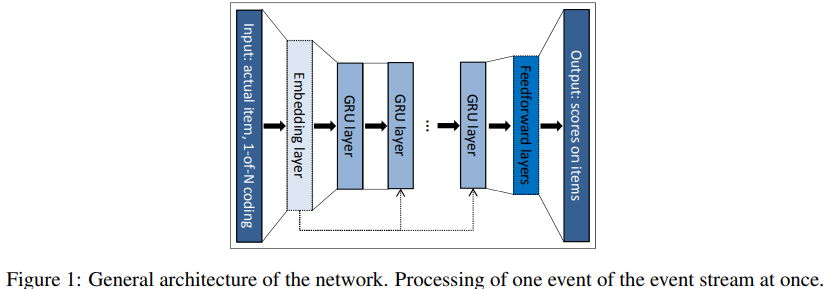
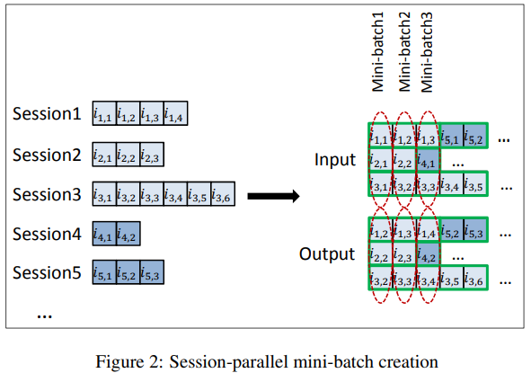
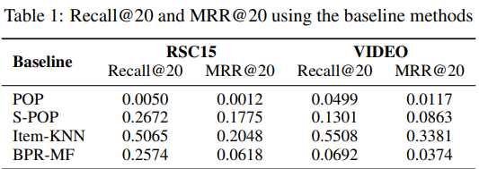
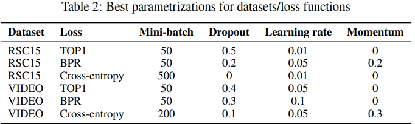
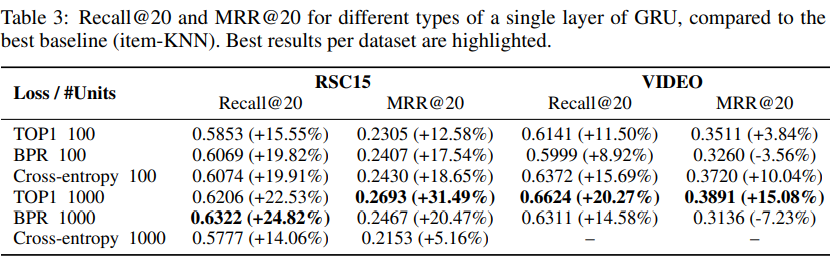

## 2015_SBRRNN [SESSION-BASED RECOMMENDATIONS WITH RECURRENT NEURAL NETWORKS]

---

### ABSTRACT
* RS + RNN(Recurrent Neural Network)  
* short session-based data  
  * matrix factorization 성능 ↓  
  * item-to-item recommendations(similar items)  
  * whole session modeling  

---

### 1. INTRODUCTION
* 세션 기반 특성(session-based traits)    

* 추천 시스템 일반적인 방법:  
  * 요인 모델(factor models): 희소 사용자-항목 상호작용 행렬 > 각 항목/사용자 d차원 벡터 세트로 분해  
    * 사용자 프로필 X > 세션 기반 추천 적용 어려움  
  * **이웃 방법**(neighborhood methods): 항목(사용자) 간 유사성 계산 의존  
    * 세션(사용자 프로필)에서 항목 동시 발생 기반  

* RNN: Sequential data modeling  
  * 세션기반 추천: 클릭 스트림(이전 클릭 의존 다음 클릭 예측); 훈련시간; 확장성 중요  

---

### 2. RELATED WORK
#### 2.1 SESSION-BASED RECOMMENDATION
* 추천시스템 방법: 사용자 식별자 / 사용자 프로필에 초점  
  * matrix factorization method  
  * neighborhood models  
  * item-to-item recommendation approach: missing user profile 해결
    * similarity matrix; 자주 함께 클릭 항목 ≒ 유사   
      * 마지막 클릭만 고려; 과거 클릭 정보 무시   
  * Markov Decision Processes(MDP): 순차 확률적 결정 문제 모델  
    * four-tuple <S, A, Rwd, tr> = <상태집합, actions set, 보상함수, 상태전환함수>  
    * simplest MPDs: first order Markov chains(항목 간 전환 확률 기반 계산)   
    * 세션 기반 추천 적용 시 문제: 가능한 모든 사용자 선택 시퀀스 포함, 상태 공간 빠르게 관리 X  
      
* GFF(General Factorization Framework) 확장 버전: 세션 데이터 RS 사용 가능  
  * 세션 모델링: 이벤트 합계  
  * 잠재 표현(2): 항목 자체, 항목을 세션의 일부 > 세션 부분 항목 표현의 feature 벡터 평균(세션 내 순서 고려 X)  

#### 2.2 DEEP LEARNING IN RECOMMENDERS
* CF를 위한 RBM(Restricted Boltzmann Machines): 구조화되지 않은 콘텐츠(음악/이미지) features 추출
* convolutional deep network: 음악 파일 > feature 추출 > factor 모델 사용    

--- 

### 3. RECOMMENDATIONS WITH RNNS
* Recurrent Neural Networks: 가변 길이 시퀀스 데이터를 모델링  
  * feed-forward deep model 차이점: 네트워크 구성 단위: internal hidden state  

* Standard RNNs hidden state(h) 업데이트하는 함수  
  *  (1)  
    * g: 평활 & 경계 지정 함수; 시간 t 단위 입력    
    * 입력: (현재 상태) > 출력: 시퀀스 다음 요소 확률 분포  

* Gated Recurrent Unit(GRU): 사라지는 경사 문제 해결 목표; RNN 보다 정교  
  * hidden state 업데이트 시기/ 양 학습  
  * GRU activation: 이전 활성화와 후보 활성화() 간 선형 보간(linear interpolation)  
    *  (2)
        * 업데이트 게이트  
            *  (3)  
        * 후보 활성화 함수  
            *  (4)  
        * 리셋 게이트  
          *  (5)  

#### 3.1 CUSTOMIZING THE GRU MODEL
* 세션 기반 추천 모델: GRU-based RNN   
  * network 입력: 세션 실제 상태 > 출력: 세션 다음 이벤트 항목  
    * 세션 상태:  
      * 실제 이벤트 항목  
        * **1-of-N encoding**: 입력 벡터 길이=항목 수; 활성 항목 해당 1 - 나머지 0; *성능 ↑*  
      * 지금까지 세션의 이벤트  
        * 표현 가중 합계; 일찍 발생 이벤트 - 할인  
    * 안정성: 입력 벡터 정규화  

* (시계열 이벤트) 단일 이벤트 표현 전체 아키텍처    
  *   
    * 출력: 항목 예측 선호도(각 항목 세션에서 다음 항목이 될 가능성)   

##### 3.1.1 SESSION-PARALLEL MINI-BATCHES
* 자연어 처리를 위한 RNN: 연속 미니 배치(in-sequence mini-batches)    
* 세션 병렬 미니 배치(session-parallel mini-batches) 사용  
  * 세션 순서 생성  
  * 첫 번째 미니 배치 입력 구성(첫 번째 X세션/첫 번째 이벤트 > 활성 세션 2번째 이벤트)  
  * 두 번째 미니 배치(두 번째 이벤트)  
  * 세션 종료, 사용 가능한 다음 세션  
  * *세션(독립 간주); 전환 발생 > 적절한 숨김 상태 reset*  
  *   

##### 3.1.2 SAMPLING ON THE OUTPUT
* RS: 항목 수 많을때 유용하나, 실제 사용 어렵 > 샘플링 & 하위 집합 점수 계산(일부 가중치 업데이트)  
* 인기 기반 샘플링: 인기도 비례 아이템 샘플링  
  * 미니 배치 다른 훈련 예제 항목: 부정적인 예제로 사용  
  * 장점: 시간 절약(샘플링을 건너 뜀), 코드 복잡도 ↓   

##### 3.1.3 RANKING LOSS
* 순위 학습 접근 방식  
  * Ranking: 
    * pointwise: 서로 독립 항목 점수 / 순위 추정; 손실: 관련 항목의 순위 ↓  
    * **pairwise**: 점수 / 긍정/부정 항목 쌍 순위 비교; 손실: 긍정 항목 순위 < 부정 항목 순위  
    * listwise: 모든 항목 점수/순위 > 완벽한 순서와 비교    
  * 정렬: 계산 비용 ↑; 사용 ↓  

* pairwise ranking loss(2):   
  * BPR(Bayesian Personalized Ranking): matrix factorization; 긍정/부정 항목 점수 비교 > 평균(손실)    
    *   
    
      * : 표본 크기  

      * : 세션의 주어진 지점에서 항목 k에 대한 점수  

      * i: 원하는 항목(세션의 다음 항목)  
      * j: 음의 샘플  
  * TOP1: (고안) 관련 항목의 상대적 순위에 대한 정규화 된 근사치;    
    * 관련 항목의 상대적 순위  
      *   
      * I{·}: sigmoid; 근사  
    * 최적화: 파라미터 수정> i 점수 ↑  
    * 긍정 -> 부정 작용 > 점수 ↑ (불안정 경향)   
      * (+) regularization: 부정 ≒ 0   
    * 최종 손실 함수  
      *   

--- 

### 4. EXPERIMENTS
* dataset: RecSys Challenge 20151(RSC15), OTT 비디오 서비스 플랫폼(VIDEO)  
* 평가 지표:  
  * recall@20: 상위 20 개 항목 중 원하는 항목이 있는 사례의 비율(실제 순위 고려 X)   
  * MRR@20(Mean Reciprocal Rank): 원하는 항목의 상호 순위 평균  

#### 4.1 BASELINES
* baselines 비교    
  * POP: 가장 인기 항목 항상 추천; 인기도 예측기  
  * S-POP: 현재 세션 가장 인기있는 항목   
    * Ties: global popularity values 사용  
    * 반복성 높은 도메인 ↑  
  * **Item-KNN**: 실제 항목과 유사한 항목 추천; 정규화(거의 방문 X & 우연히 높은 유사성 피하기 위해)   
    * 유사성: 세션 벡터 간 코사인 유사성(세션 내 두 항목 동시 발생 횟수 / 개별 항목 발생 세션 수의 곱의 제곱근)  
  * BPR-MF: matrix factorization methods; pairwise ranking 목적함수 최적화(SGD)  
    * 추천 항목 - 지금까지 세션 항목 간 feature 벡터 유사성 평균  
* 기준선에 대한 결과  
  *   
    * item-KNN approach 우세  

#### 4.2 PARAMETER & STRUCTURE OPTIMIZATION
* best performing parametrizations  
  *   
    * Weight matrices 초기화: [-x, x]; 균일; 난수  
    * adagrad; 단일 계층 GRU; 1-of-N 인코딩  
    * 손실 함수:  
        * pointwise ranking based losses: 교차 엔트로피/MRR 최적화; (+regularization) 불안정  
        * pairwise ranking-based losses: 성능 좋음  
    * 출력 레이어 활성화 함수: tanh  

#### 4.3 RESULTS
* 최고 성능 네트워크 결과   
  *    

* *새로운 사용자 / 항목 자주 소개 > 추천 시스템 자주 재교육*  
---
