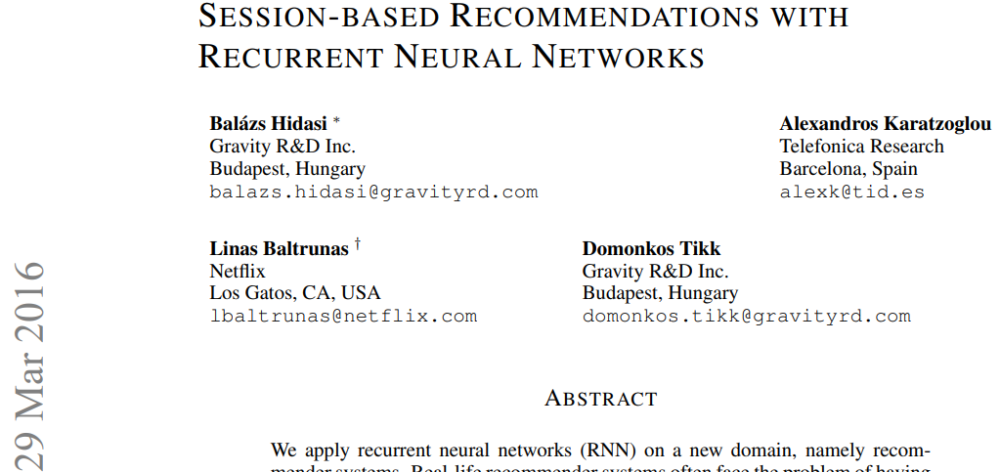

## 2015_SBRRNN [SESSION-BASED RECOMMENDATIONS WITH RECURRENT NEURAL NETWORKS]

---

### ABSTRACT
We apply recurrent neural networks (RNN) on a new domain, namely recommender systems. 
새로운 도메인, 즉 추천 시스템에 RNN (Recurrent Neural Network)을 적용합니다.

Real-life recommender systems often face the problem of having to base recommendations only on short session-based data (e.g. a small sportsware website) instead of long user histories (as in the case of Netflix). 
실제 추천 시스템은 종종 긴 사용자 기록 (Netflix의 경우) 대신 짧은 세션 기반 데이터 (예 : 소규모 스포츠웨어 웹 사이트)에만 추천을해야하는 문제에 직면합니다.

In this situation the frequently praised matrix factorization approaches are not accurate. 
이 상황에서 자주 칭찬받는 행렬 분해 접근법은 정확하지 않습니다.

This problem is usually overcome in practice by resorting to item-to-item recommendations, i.e. recommending similar items. 
이 문제는 일반적으로 항목 간 권장 사항, 즉 유사한 항목을 권장함으로써 실제로 극복됩니다.

We argue that by modeling the whole session, more accurate recommendations can be provided. 
우리는 전체 세션을 모델링함으로써보다 정확한 권장 사항을 제공 할 수 있다고 주장합니다.

We therefore propose an RNNbased approach for session-based recommendations. 
따라서 세션 기반 권장 사항에 대한 RNN 기반 접근 방식을 제안합니다.

Our approach also considers practical aspects of the task and introduces several modifications to classic RNNs such as a ranking loss function that make it more viable for this specific problem. 
우리의 접근 방식은 또한 작업의 실제적인 측면을 고려하고이 특정 문제에 대해 더 실행 가능하게 만드는 순위 손실 함수와 같은 클래식 RNN에 대한 몇 가지 수정 사항을 도입합니다.

Experimental results on two data-sets show marked improvements over widely used approaches.
두 데이터 세트에 대한 실험 결과는 널리 사용되는 접근 방식에 비해 현저한 개선을 보여줍니다.

---

### 1. INTRODUCTION

Session-based recommendation is a relatively unappreciated problem in the machine learning and recommender systems community. 
세션 기반 추천은 기계 학습 및 추천 시스템 커뮤니티에서 상대적으로 인정받지 못하는 문제입니다.

Many e-commerce recommender systems (particularly those of small retailers) and most of news and media sites do not typically track the user-id’s of the users that visit their sites over a long period of time. 
많은 전자 상거래 추천 시스템 (특히 소규모 소매 업체의 시스템)과 대부분의 뉴스 및 미디어 사이트는 일반적으로 오랜 기간 동안 사이트를 방문하는 사용자의 사용자 ID를 추적하지 않습니다.

While cookies and browser fingerprinting can provide some level of user recognizability, those technologies are often not reliable enough and moreover raise privacy concerns. 
쿠키와 브라우저 핑거 프린팅은 일정 수준의 사용자 인식을 제공 할 수 있지만 이러한 기술은 종종 충분히 신뢰할 수 없으며 개인 정보 보호 문제를 야기합니다.

Even if tracking is possible, lots of users have only one or two sessions on a smaller e-commerce site, and in certain domains (e.g. classified sites) the behavior of users often shows session-based traits. 
추적이 가능하더라도 많은 사용자가 소규모 전자 상거래 사이트에서 한두 개의 세션 만 가지고 있으며 특정 도메인 (예 : 분류 된 사이트)에서 사용자의 행동은 종종 세션 기반 특성을 나타냅니다.

Thus subsequent sessions of the same user should be handled independently. 
따라서 동일한 사용자의 후속 세션은 독립적으로 처리되어야합니다.

Consequently, most session-based recommendation systems deployed for e-commerce are based on relatively simple methods that do not make use of a user profile e.g. itemto-item similarity, co-occurrence, or transition probabilities. 
결과적으로 전자 상거래를 위해 배치 된 대부분의 세션 기반 추천 시스템은 사용자 프로필을 사용하지 않는 비교적 간단한 방법을 기반으로합니다. 항목 간 유사성, 동시 발생 또는 전환 가능성.

While effective, those methods often take only the last click or selection of the user into account ignoring the information of past clicks.
효과적이지만 이러한 방법은 종종 마지막 클릭 또는 사용자의 선택 만 고려하여 과거 클릭 정보를 무시합니다.

The most common methods used in recommender systems are factor models (Koren et al., 2009; Weimer et al., 2007; Hidasi & Tikk, 2012) and neighborhood methods (Sarwar et al., 2001; Koren, 2008). 
추천 시스템에서 사용되는 가장 일반적인 방법은 요인 모델 (Koren et al., 2009; Weimer et al., 2007; Hidasi & Tikk, 2012)과 이웃 방법 (Sarwar et al., 2001; Koren, 2008)입니다.

Factor models work by decomposing the sparse user-item interactions matrix to a set of d dimensional vectors one for each item and user in the dataset. 
요인 모델은 희소 사용자-항목 상호 작용 행렬을 데이터 세트의 각 항목 및 사용자에 대해 하나씩 d 차원 벡터 세트로 분해하여 작동합니다.

The recommendation problem is then treated as a matrix completion/reconstruction problem whereby the latent factor vectors are then used to fill the missing entries by e.g. taking the dot product of the corresponding user–item latent factors. 
추천 문제는 매트릭스 완성 / 재 구축 문제로 취급되어 잠재 인자 벡터를 사용하여 누락 된 항목을 예를 들어 다음과 같이 채 웁니다. 해당 사용자 항목 잠복 인자의 내적을 취합니다.

Factor models are hard to apply in session-based recommendation due to the absence of a user profile. 
요인 모델은 사용자 프로필이 없기 때문에 세션 기반 추천에 적용하기 어렵습니다.

On the other hand, neighborhood methods, which rely on computing similarities between items (or users) are based on co-occurrences of items in sessions (or user profiles).
반면에 항목 (또는 사용자) 간의 유사성을 계산하는 데 의존하는 이웃 방법은 세션 (또는 사용자 프로필)에서 항목의 동시 발생을 기반으로합니다.

Neighborhood methods have been used extensively in session-based recommendations.
이웃 방법은 세션 기반 권장 사항에서 광범위하게 사용되었습니다.

The past few years have seen the tremendous success of deep neural networks in a number of tasks such as image and speech recognition (Russakovsky et al., 2014; Hinton et al., 2012) where unstructured data is processed through several convolutional and standard layers of (usually rectified linear) units. 
지난 몇 년 동안 이미지 및 음성 인식 (Russakovsky et al., 2014; Hinton et al., 2012)과 같은 여러 작업에서 심층 신경망이 엄청난 성공을 거두었습니다. 여기서 비정형 데이터는 여러 컨볼 루션 및 표준 레이어를 통해 처리됩니다. (일반적으로 정류 된 선형) 단위.

Sequential data modeling has recently also attracted a lot of attention with various flavors of RNNs being the model of choice for this type of data. 
순차 데이터 모델링은 최근 이러한 유형의 데이터에 대해 선택되는 모델이되는 다양한 RNN 유형으로 인해 많은 관심을 끌었습니다.

Applications of sequence modeling range from test-translation to conversation modeling to image captioning.
시퀀스 모델링의 적용 범위는 테스트 번역에서 대화 모델링, 이미지 캡션에 이르기까지 다양합니다.

While RNNs have been applied to the aforementioned domains with remarkable success little attention, has been paid to the area of recommender systems. 
앞서 언급 한 도메인에 RNN이 괄목할만한 성공을 거두었지만 추천 시스템 영역에는 거의 관심을 기울이지 않았습니다.

In this work we argue that RNNs can be applied to session-based recommendation with remarkable results, we deal with the issues that arise when modeling such sparse sequential data and also adapt the RNN models to the recommender setting by introducing a new ranking loss function suited to the task of training these models. 
이 작업에서 우리는 RNN을 놀라운 결과로 세션 기반 추천에 적용 할 수 있다고 주장하고, 이러한 희소 순차 데이터를 모델링 할 때 발생하는 문제를 처리하고 적합한 새로운 순위 손실 함수를 도입하여 추천자 설정에 RNN 모델을 적용합니다. 이러한 모델을 교육하는 작업에.

The session-based recommendation problem shares some similarities with some NLP-related problems in terms of modeling as long as they both deals with sequences. 
세션 기반 추천 문제는 둘 다 시퀀스를 다루는 한 모델링 측면에서 일부 NLP 관련 문제와 일부 유사점을 공유합니다.

In the session-based recommendation we can consider the first item a user clicks when entering a web-site as the initial input of the RNN, we then would like to query the model based on this initial input for a recommendation. 
세션 기반 추천에서 우리는 사용자가 웹 사이트에 들어갈 때 클릭하는 첫 번째 항목을 RNN의 초기 입력으로 고려할 수 있습니다. 그런 다음 추천에 대한이 초기 입력을 기반으로 모델을 쿼리하려고합니다.

Each consecutive click of the user will then produce an output (a recommendation) that depends on all the previous clicks. 
사용자가 연속적으로 클릭 할 때마다 이전의 모든 클릭에 의존하는 출력 (권장 사항)이 생성됩니다.

Typically the item-set to choose from in recommenders systems can be in the tens of thousands or even hundreds of thousands. 
일반적으로 추천 시스템에서 선택할 수있는 항목 세트는 수만 또는 수십만 일 수 있습니다.

Apart from the large size of the item set, another challenge is that click-stream datasets are typically quite large thus training time and scalability are really important. 
항목 세트의 큰 크기 외에도 또 다른 문제는 클릭 스트림 데이터 세트가 일반적으로 상당히 크기 때문에 교육 시간과 확장 성이 정말 중요하다는 것입니다.

As in most information retrieval and recommendation settings, we are interested in focusing the modeling power on the top-items that the user might be interested in, to this end we use ranking loss function to train the RNNs.
대부분의 정보 검색 및 추천 설정에서와 같이 사용자가 관심을 가질 수있는 상위 항목에 모델링 능력을 집중하는 데 관심이 있습니다.이를 위해 순위 손실 기능을 사용하여 RNN을 훈련합니다.

---

### 2. RELATED WORK
#### 2.1 SESSION-BASED RECOMMENDATION

Much of the work in the area of recommender systems has focused on models that work when a user identifier is available and a clear user profile can be built. 
추천 시스템 분야의 많은 작업은 사용자 식별자를 사용할 수 있고 명확한 사용자 프로필을 만들 수있을 때 작동하는 모델에 초점을 맞추 었습니다.

In this setting, matrix factorization methods and neighborhood models have dominated the literature and are also employed on-line. 
이 설정에서 매트릭스 분해 방법과 이웃 모델이 문헌을 지배했으며 온라인에서도 사용됩니다.

One of the main approaches that is employed in session-based recommendation and a natural solution to the problem of a missing user profile is the item-to-item recommendation approach (Sarwar et al., 2001; Linden et al., 2003) in this setting an item to item similarity matrix is precomputed from the available session data, that is items that are often clicked together in sessions are deemed to be similar. 
세션 기반 추천에 사용되는 주요 접근 방식 중 하나이며 누락 된 사용자 프로필 문제에 대한 자연스러운 해결책은 다음의 항목 간 추천 접근 방식입니다 (Sarwar et al., 2001; Linden et al., 2003). 이 설정은 항목 대 항목 유사성 매트릭스를 사용 가능한 세션 데이터에서 미리 계산됩니다. 즉, 세션에서 자주 함께 클릭되는 항목은 유사한 것으로 간주됩니다.

This similarity matrix is then simply used during the session to recommend the most similar items to the one the user has currently clicked. 
이 유사성 매트릭스는 세션 중에 사용자가 현재 클릭 한 항목과 가장 유사한 항목을 추천하는 데 사용됩니다.

While simple, this method has been proven to be effective and is widely employed. 
이 방법은 간단하지만 효과가 입증되었으며 널리 사용되고 있습니다.

While effective, these methods are only taking into account the last click of the user, in effect ignoring the information of the past clicks.
효과적이기는하지만 이러한 방법은 사용자의 마지막 클릭 만 고려하며 사실상 과거 클릭의 정보는 무시합니다.

A somewhat different approach to session-based recommendation are Markov Decision Processes(MDPs) (Shani et al., 2002). 
세션 기반 추천에 대한 다소 다른 접근 방식은 Markov Decision Processes (MDP)입니다 (Shani et al., 2002).

MDPs are models of sequential stochastic decision problems. 
MDP는 순차 확률 적 결정 문제의 모델입니다.

An MDP is defined as a four-tuple hS, A, Rwd, tri where S is the set of states, A is a set of actions Rwd is a reward function and tr is the state-transition function. 
MDP는 4- 튜플 hS, A, Rwd, tri로 정의됩니다. 여기서 S는 상태 집합, A는 일련의 작업입니다. Rwd는 보상 함수, tr은 상태 전환 함수입니다.

In recommender systems actions can be equated with recommendations and the simplest MPDs are essentially first order Markov chains where the next recommendation can be simply computed on the basis of the transition probability between items. 
추천 시스템에서 행동은 추천과 동일시 될 수 있으며 가장 단순한 MPD는 본질적으로 1 차 Markov 체인으로, 다음 추천은 항목 간의 전환 확률을 기반으로 간단히 계산할 수 있습니다.

The main issue with applying Markov chains in session-based recommendation is that the state space quickly becomes unmanageable when trying to include all possible sequences of user selections.
세션 기반 권장 사항에서 Markov 체인을 적용하는 주요 문제는 가능한 모든 사용자 선택 시퀀스를 포함하려고 할 때 상태 공간을 빠르게 관리 할 수 없게된다는 것입니다.

The extended version of the General Factorization Framework (GFF) (Hidasi & Tikk, 2015) is capable of using session data for recommendations. 
GFF (General Factorization Framework)의 확장 버전 (Hidasi & Tikk, 2015)은 권장 사항에 세션 데이터를 사용할 수 있습니다.

It models a session by the sum of its events. 
이벤트의 합계로 세션을 모델링합니다.

It uses two kinds of latent representations for items, one represents the item itself, the other is for representing the item as part of a session. 
항목에 대해 두 종류의 잠재 표현을 사용합니다. 하나는 항목 자체를 나타내고 다른 하나는 항목을 세션의 일부로 나타내는 것입니다.

The session is then represented as the average of the feature vectors of part-of-a-session item representation. 
그런 다음 세션은 세션 부분 항목 표현의 특징 벡터의 평균으로 표현됩니다.

However, this approach does not consider any ordering within the session.
그러나이 접근 방식은 세션 내 순서를 고려하지 않습니다.

#### 2.2 DEEP LEARNING IN RECOMMENDERS

One of the first related methods in the neural networks literature where the use of Restricted Boltzmann Machines (RBM) for Collaborative Filtering (Salakhutdinov et al., 2007). 
협업 필터링을 위해 RBM (Restricted Boltzmann Machines)을 사용하는 신경망 문헌의 첫 번째 관련 방법 중 하나입니다 (Salakhutdinov et al., 2007).

In this work an RBM is used to model user-item interaction and perform recommendations. 
이 작업에서 RBM은 사용자 항목 상호 작용을 모델링하고 권장 사항을 수행하는 데 사용됩니다.

This model has been shown to be one of the best performing Collaborative Filtering models. 
이 모델은 최고 성능의 협업 필터링 모델 중 하나 인 것으로 나타났습니다.

Deep Models have been used to extract features from unstructured content such as music or images that are then used together with more conventional collaborative filtering models. 
Deep Models는 음악이나 이미지와 같은 구조화되지 않은 콘텐츠에서 기능을 추출하는 데 사용되어 더 전통적인 협업 필터링 모델과 함께 사용됩니다.

In Van den Oord et al. (2013) a convolutional deep network is used to extract feature from music files that are then used in a factor model. 
Van den Oord et al. (2013) 컨볼 루션 딥 네트워크를 사용하여 음악 파일에서 특징을 추출한 다음 요인 모델에 사용합니다.

More recently Wang et al. (2015) introduced a more generic approach whereby a deep network is used to extract generic content-features from any types of items, these features are then incorporated in a standard collaborative filtering model to enhance the recommendation performance. 
최근에 Wang et al. (2015)는 심층 네트워크를 사용하여 모든 유형의 항목에서 일반 콘텐츠 기능을 추출하는 더 일반적인 접근 방식을 도입했으며, 이러한 기능은 추천 성능을 향상시키기 위해 표준 협업 필터링 모델에 통합되었습니다.

This approach seems to be particularly useful in settings where there is not sufficient user-item interaction information. 
이 접근 방식은 사용자 항목 상호 작용 정보가 충분하지 않은 설정에서 특히 유용합니다.

--- 

### 3. RECOMMENDATIONS WITH RNNS

Recurrent Neural Networks have been devised to model variable-length sequence data. 
Recurrent Neural Networks는 가변 길이 시퀀스 데이터를 모델링하기 위해 고안되었습니다.

The main difference between RNNs and conventional feedforward deep models is the existence of an internal hidden state in the units that compose the network. 
RNN과 기존 피드 포워드 딥 모델의 주요 차이점은 네트워크를 구성하는 단위에 내부 숨겨진 상태가 있다는 것입니다.

Standard RNNs update their hidden state h using the following update function: 
표준 RNN은 다음 업데이트 기능을 사용하여 숨겨진 상태 h를 업데이트합니다.

ht = g(Wxt + Uht−1) (1)

Where g is a smooth and bounded function such as a logistic sigmoid function xt is the input of the unit at time t. 
여기서 g는 로지스틱 시그 모이 드 함수와 같은 평활하고 경계가 지정된 함수 xt는 시간 t에서의 단위 입력입니다.

An RNN outputs a probability distribution over the next element of the sequence, given its current state ht.
RNN은 현재 상태 ht가 주어지면 시퀀스의 다음 요소에 대한 확률 분포를 출력합니다.

A Gated Recurrent Unit (GRU) (Cho et al., 2014) is a more elaborate model of an RNN unit that aims at dealing with the vanishing gradient problem. 
GRU (Gated Recurrent Unit) (Cho et al., 2014)는 소실 기울기 문제를 처리하는 것을 목표로하는 RNN 장치의보다 정교한 모델입니다.

GRU gates essentially learn when and by how much to update the hidden state of the unit. 
GRU 게이트는 기본적으로 장치의 숨겨진 상태를 업데이트 할시기와 양을 학습합니다.

The activation of the GRU is a linear interpolation between the previous activation and the candidate activation hˆt:
GRU의 활성화는 이전 활성화와 후보 활성화 사이의 선형 보간입니다.

ht = (1 − zt)ht−1 + zthˆt (2)

where the update gate is given by:
업데이트 게이트는 다음과 같이 제공됩니다.

zt = σ(Wzxt + Uzht−1) (3)

while the candidate activation function hˆt is computed in a similar manner:
후보 활성화 함수 hˆt는 비슷한 방식으로 계산됩니다.

hˆt = tanh (Wxt + U(rt  ht−1)) (4)

and finaly the reset gate rt is given by:
마지막으로 리셋 게이트 rt는 다음과 같이 제공됩니다.

rt = σ(Wrxt + Urht−1) (5)

#### 3.1 CUSTOMIZING THE GRU MODEL

We used the GRU-based RNN in our models for session-based recommendations. 
세션 기반 권장 사항을 위해 모델에서 GRU 기반 RNN을 사용했습니다.

The input of the network is the actual state of the session while the output is the item of the next event in the session.
네트워크의 입력은 세션의 실제 상태이고 출력은 세션의 다음 이벤트 항목입니다.

The state of the session can either be the item of the actual event or the events in the session so far. 
세션의 상태는 실제 이벤트의 항목이거나 지금까지 세션의 이벤트 일 수 있습니다.

In the former case 1-of-N encoding is used, i.e. the input vector’s length equals to the number of items and only the coordinate corresponding to the active item is one, the others are zeros. 
전자의 경우 1-of-N 인코딩이 사용됩니다. 즉, 입력 벡터의 길이는 항목 수와 같고 활성 항목에 해당하는 좌표 만 1이고 나머지는 0입니다.

The latter setting uses a weighted sum of these representations, in which events are discounted if they have occurred earlier. 
후자의 설정은 이러한 표현의 가중 합계를 사용하며 이벤트가 더 일찍 발생한 경우 할인됩니다.

For the stake of stability, the input vector is then normalized. 
안정성을 위해 입력 벡터가 정규화됩니다.

We expect this to help because it reinforces the memory effect: the reinforcement of very local ordering constraints which are not well captured by the longer memory of RNN. 
우리는 이것이 메모리 효과를 강화하기 때문에 도움이 될 것으로 기대합니다 : RNN의 더 긴 메모리로 잘 포착되지 않는 매우 로컬 순서 제약의 강화.

We also experimented with adding an additional embedding layer, but the 1-of-N encoding always performed better.
우리는 또한 추가 임베딩 레이어를 추가하는 실험을했지만, 1-of-N 인코딩이 항상 더 나은 성능을 발휘했습니다.

The core of the network is the GRU layer(s) and additional feedforward layers can be added between the last layer and the output. 
네트워크의 핵심은 GRU 계층이며 마지막 계층과 출력 사이에 추가 피드 포워드 계층을 추가 할 수 있습니다.

The output is the predicted preference of the items, i.e. the likelihood of being the next in the session for each item.
출력은 항목의 예측 된 선호도, 즉 각 항목의 세션에서 다음 항목이 될 가능성입니다.

When multiple GRU layers are used, the hidden state of the previous layer is the input of the next one. 
여러 GRU 계층이 사용되는 경우 이전 계층의 숨겨진 상태가 다음 계층의 입력입니다.

The input can also be optionally connected to GRU layers deeper in the network, as we found that this improves performance. 
입력은 또한 선택적으로 네트워크의 더 깊은 GRU 계층에 연결될 수 있습니다. 이것이 성능을 향상시키는 것으로 나타났습니다.

See the whole architecture on Figure 1, which depicts the representation of a single event within a time series of events.
시계열 이벤트 내에서 단일 이벤트의 표현을 보여주는 그림 1의 전체 아키텍처를 참조하십시오.

Since recommender systems are not the primary application area of recurrent neural networks, we modified the base network to better suit the task. 
추천 시스템은 순환 신경망의 주요 응용 분야가 아니므로 작업에 더 적합하도록 기본 네트워크를 수정했습니다.

We also considered practical points so that our solution could be possibly applied in a live environment.
또한 실제 환경에서 솔루션을 적용 할 수 있도록 실용적인 포인트도 고려했습니다.

##### 3.1.1 SESSION-PARALLEL MINI-BATCHES
3.1.1 세션 병렬 미니 배치

RNNs for natural language processing tasks usually use in-sequence mini-batches. 
자연어 처리 작업을위한 RNN은 일반적으로 연속 미니 배치를 사용합니다.

For example it is common to use a sliding window over the words of sentences and put these windowed fragments next to each other to form mini-batches. 
예를 들어, 문장의 단어 위에 슬라이딩 윈도우를 사용하고 이러한 윈도우 조각을 나란히 놓아 미니 배치를 형성하는 것이 일반적입니다.

This does not fit our task, because 
이것은 우리의 임무에 맞지 않습니다.

(1) the length of sessions can be very different, even more so than that of sentences: some sessions consist of only 2 events, while others may range over a few hundreds; 

(2) our goal is to capture how a session evolves over time, so breaking down into fragments would make no sense. 
(1) 세션의 길이는 문장의 길이보다 훨씬 더 다양 할 수 있습니다. 일부 세션은 2 개의 이벤트로만 구성되고 다른 세션은 수백 개에 달할 수 있습니다.

(2) 우리의 목표는 시간이 지남에 따라 세션이 어떻게 진화하는지 캡처하는 것이므로 조각으로 나누는 것은 의미가 없습니다.

Therefore we use session-parallel mini-batches. 
따라서 세션 병렬 미니 배치를 사용합니다.

First, we create an order for the sessions. 
먼저 세션 순서를 생성합니다.

Then, we use the first event of the first X sessions to form the input of the first mini-batch (the desired output is the second events of our active sessions). 
그런 다음 첫 번째 X 세션의 첫 번째 이벤트를 사용하여 첫 번째 미니 배치의 입력을 구성합니다 (원하는 출력은 활성 세션의 두 번째 이벤트입니다).

The second mini-batch is formed from the second events and so on. 
두 번째 미니 배치는 두 번째 이벤트 등으로 구성됩니다.

If any of the sessions end, the next available session is put in its place.
세션이 종료되면 사용 가능한 다음 세션이 그 자리에 놓입니다.

Sessions are assumed to be independent, thus we reset the appropriate hidden state when this switch occurs. 
세션은 독립적 인 것으로 간주되므로이 전환이 발생하면 적절한 숨김 상태를 재설정합니다.

See Figure 2 for more details.
자세한 내용은 그림 2를 참조하십시오.

##### 3.1.2 SAMPLING ON THE OUTPUT

Recommender systems are especially useful when the number of items is large. 
추천 시스템은 항목 수가 많을 때 특히 유용합니다.

Even for a mediumsized webshop this is in the range of tens of thousands, but on larger  hundreds of thousands of items or even a few millions. 
중간 규모의 웹샵의 경우에도 수만 개의 범위에 있지만 더 큰 수십만 개의 항목 또는 수백만 개의 항목이 있습니다.

Calculating a score for each item in each step would make the algorithm scale with the product of the number of items and the number of events. 
각 단계의 각 항목에 대한 점수를 계산하면 항목 수와 이벤트 수의 곱으로 알고리즘이 확장됩니다.

This would be unusable in practice. 
이것은 실제로 사용할 수 없습니다.

Therefore we have to sample the output and only compute the score for a small subset of the items. 
따라서 출력을 샘플링하고 항목의 작은 하위 집합에 대한 점수 만 계산해야합니다.

This also entails that only some of the weights will be updated. 
또한 일부 가중치 만 업데이트됩니다.

Besides the desired output, we need to compute scores for some negative examples and modify the weights so that the desired output is highly ranked. 
원하는 출력 외에도 일부 부정적인 예에 ​​대한 점수를 계산하고 원하는 출력의 순위가 높게 지정되도록 가중치를 수정해야합니다.

The natural interpretation of an arbitrary missing event is that the user did not know about the existence of the item and thus there was no interaction. 
임의의 누락 이벤트에 대한 자연스러운 해석은 사용자가 항목의 존재를 몰랐기 때문에 상호 작용이 없다는 것입니다.

However there is a low probability that the user did know about the item and chose not to interact, because she disliked the item. 
그러나 사용자가 항목에 대해 알고 상호 작용하지 않기로 선택했을 가능성이 낮습니다.

The more popular the item, the more probable it is that the user knows about it, thus it is more likely that a missing event expresses dislike. 
인기가 높을수록 사용자가 알고있을 가능성이 높으므로 누락 된 이벤트가 싫어함을 표현할 가능성이 더 높습니다.

Therefore we should sample items in proportion of their popularity. 
따라서 인기도에 비례하여 아이템을 샘플링해야합니다.

Instead of generating separate samples for each training example, we use the items from the other training examples of the mini-batch as negative examples.
각 훈련 예제에 대해 별도의 샘플을 생성하는 대신 미니 배치의 다른 훈련 예제 항목을 부정적인 예제로 사용합니다.

The benefit of this approach is that we can further reduce computational times by skipping the sampling. 
이 접근 방식의 이점은 샘플링을 건너 뛰어 계산 시간을 더 줄일 수 있다는 것입니다.

Additionally, there are also benefits on the implementation side from making the code less complex to faster matrix operations. 
또한 코드를 덜 복잡하게 만드는 것에서 더 빠른 매트릭스 작업에 이르기까지 구현 측면에서도 이점이 있습니다.

Meanwhile, this approach is also a popularity-based sampling, because the likelihood of an item being in the other training examples of the mini-batch is proportional to its popularity.
한편,이 접근 방식은 미니 배치의 다른 훈련 예제에 항목이있을 가능성이 인기도에 비례하기 때문에 인기 기반 샘플링이기도합니다.

##### 3.1.3 RANKING LOSS

The core of recommender systems is the relevance-based ranking of items. 
추천 시스템의 핵심은 항목의 관련성 기반 순위입니다.

Although the task can also be interpreted as a classification task, learning-to-rank approaches (Rendle et al., 2009; Shi et al., 2012; Steck, 2015) generally outperform other approaches. 
이 작업은 분류 작업으로도 해석 될 수 있지만 순위 학습 접근 방식 (Rendle et al., 2009; Shi et al., 2012; Steck, 2015)은 일반적으로 다른 접근 방식을 능가합니다.

Ranking can be pointwise, pairwise or listwise. 
순위는 포인트, 페어 또는리스트 방식 일 수 있습니다.

Pointwise ranking estimates the score or the rank of items independently of each other and the loss is defined in a way so that the rank of relevant items should be low. 
포인트 별 순위는 서로 독립적으로 항목의 점수 또는 순위를 추정하고 손실은 관련 항목의 순위가 낮아야하는 방식으로 정의됩니다.

Pairwise ranking compares the score or the rank of pairs of a positive and a negative item and the loss enforces that the rank of the positive item should be lower than that of the negative one. 
쌍별 순위는 점수 또는 긍정적 인 항목과 부정적인 항목 쌍의 순위를 비교하고 손실은 긍정적 인 항목의 순위가 부정적인 항목의 순위보다 낮아야합니다.

Listwise ranking uses the scores and ranks of all items and compares them to the perfect ordering. 
Listwise 순위는 모든 항목의 점수와 순위를 사용하여 완벽한 순서와 비교합니다.

As it includes sorting, it is usually computationally more expensive and thus not used often. 
정렬이 포함되어 있으므로 일반적으로 계산 비용이 더 많이 들고 자주 사용되지 않습니다.

Also, if there is only one relevant item – as in our case – listwise ranking can be solved via pairwise ranking. 
또한 관련 항목이 하나만있는 경우-우리의 경우-목록 별 순위는 쌍별 순위를 통해 해결할 수 있습니다.

We included several pointwise and pairwise ranking losses into our solution. 
솔루션에 몇 가지 포인트 별 및 쌍별 순위 손실을 포함했습니다.

We found that pointwise ranking was unstable with this network (see Section 4 for more comments). 
이 네트워크에서는 포인트 별 순위가 불안정하다는 것을 발견했습니다 (더 많은 의견은 섹션 4 참조).

Pairwise ranking losses on the other hand performed well. 
반면에 Pairwise 순위 손실은 잘 수행되었습니다.

We use the following two.
다음 두 가지를 사용합니다.

• BPR: Bayesian Personalized Ranking (Rendle et al., 2009) is a matrix factorization method that uses pairwise ranking loss. 
• BPR : Bayesian Personalized Ranking (Rendle et al., 2009)은 쌍별 순위 손실을 사용하는 행렬 분해 방법입니다.

It compares the score of a positive and a sampled negative item. 
긍정적 인 항목과 샘플링 된 부정적인 항목의 점수를 비교합니다.

Here we compare the score of the positive item with several sampled items and use their average as the loss. 
여기서 우리는 긍정적 인 항목의 점수를 여러 표본 항목과 비교하고 그 평균을 손실로 사용합니다.

The loss at a given point in one session is defined as: 
한 세션에서 주어진 지점에서의 손실은 다음과 같이 정의됩니다.

Ls =−1NS·PNSj=1 log (σ (ˆrs,i − rˆs,j )), 

where NS is the sample size, rˆs,k is the score on item k at the given point of the session, i is the desired item (next item in the session) and j are the negative samples.
여기서 NS는 표본 크기, rˆs, k는 세션의 주어진 지점에서 항목 k에 대한 점수, i는 원하는 항목 (세션의 다음 항목), j는 음의 샘플입니다.

• TOP1: This ranking loss was devised by us for this task. 
• TOP1 :이 순위 손실은이 작업을 위해 우리가 고안했습니다.

It is the regularized approximation of the relative rank of the relevant item. 
관련 항목의 상대적 순위에 대한 정규화 된 근사치입니다.

The relative rank of the relevant item is given by 1NS·PNSj=1 I{rˆs,j > rˆs,i}. 
관련 항목의 상대적 순위는 1NS · PNSj = 1 I {rˆs, j> rˆs, i}로 주어집니다.

We approximate I{·} with a sigmoid. 
시그 모이 드로 I {·}를 근사합니다.

Optimizing for this would modify parameters so that the score for i would be high. 
이를 최적화하면 매개 변수가 수정되어 i의 점수가 높아집니다.

However this is unstable as certain positive items also act as negative examples and thus scores tend to become increasingly higher. 
그러나 특정 긍정적 인 항목도 부정적인 사례로 작용하여 점수가 점점 높아지는 경향이 있으므로 불안정합니다.

To avoid this, we want to force the scores of the negative examples to be around zero. 
이를 방지하기 위해 부정적인 예제의 점수를 0에 가깝게 만들고 싶습니다.

This is a natural expectation towards the scores of negative items. 
이것은 부정적인 항목의 점수에 대한 자연스러운 기대입니다.

Thus we added a regularization term to the loss. 
따라서 손실에 정규화 항을 추가했습니다.

It is important that this term is in the same range as the relative rank and acts similarly to it. 
이 용어는 상대 순위와 동일한 범위에 있고 이와 유사하게 작동하는 것이 중요합니다.

The final loss function is as follows: 
최종 손실 함수는 다음과 같습니다.

Ls = NS·PNSj=1 σ (ˆrs,j − rˆs,i) + σ

--- 

### 4. EXPERIMENTS

We evaluate the proposed recursive neural network against popular baselines on two datasets. 
제안 된 재귀 신경망을 두 데이터 세트의 인기있는 기준선에 대해 평가합니다.

The first dataset is that of RecSys Challenge 20151. 
첫 번째 데이터 세트는 RecSys Challenge 20151의 데이터입니다.

This dataset contains click-streams of an ecommerce site that sometimes end in purchase events. 
이 데이터 세트에는 때때로 구매 이벤트로 끝나는 전자 상거래 사이트의 클릭 스트림이 포함되어 있습니다.

We work with the training set of the challenge and keep only the click events. 
우리는 챌린지의 교육 세트와 협력하고 클릭 이벤트 만 유지합니다.

We filter out sessions of length 1. 
길이가 1 인 세션을 필터링합니다.

The network is trained on ∼ 6 months of data, containing 7,966,257 sessions of 31,637,239 clicks on 37,483 items. 
네트워크는 37,483 개 항목에 대한 31,637,239 개의 클릭으로 구성된 7,966,257 회의 세션을 포함하는 ~ 6 개월의 데이터에 대해 학습되었습니다.

We use the sessions of the subsequent day for testing. 
다음 날의 세션을 테스트에 사용합니다.

Each session is assigned to either the training or the test set, we do not split the data mid-session. 
각 세션은 교육 또는 테스트 세트에 할당되며 세션 중간에 데이터를 분할하지 않습니다.

Because of the nature of collaborative filtering methods, we filter out clicks from the test set where the item clicked is not in the train set. 
협업 필터링 방법의 특성으로 인해 클릭 한 항목이 학습 세트에없는 테스트 세트에서 클릭을 필터링합니다.

Sessions of length one are also removed from the test set. 
길이가 1 인 세션도 테스트 세트에서 제거됩니다.

After the preprocessing we are left with 15,324 sessions of 71,222 events for the test set. 
전처리 후 테스트 세트에 대한 71,222 개 이벤트의 15,324 개 세션이 남습니다.

This dataset will be referred to as RSC15.
이 데이터 세트를 RSC15라고합니다.

The second dataset is collected from a Youtube-like OTT video service platform. 
두 번째 데이터 세트는 Youtube와 유사한 OTT 비디오 서비스 플랫폼에서 수집됩니다.

Events of watching a video for at least a certain amount of time were collected. 
일정 시간 이상 영상을 본 이벤트가 수집되었습니다.

Only certain regions were subject to this collection that lasted for somewhat shorter than 2 months. 
2 개월보다 다소 짧은 기간 동안 지속되는 특정 지역 만이 컬렉션의 대상이되었습니다.

During this time item-to-item recommendations were provided after each video at the left side of the screen. 
이 기간 동안 화면 왼쪽의 각 비디오 후에 항목 별 권장 사항이 제공되었습니다.

These were provided by a selection of different algorithms and influenced the behavior of the users. 
이들은 다양한 알고리즘의 선택에 의해 제공되었으며 사용자의 행동에 영향을 미쳤습니다.

Preprocessing steps are similar to that of the other dataset with the addition of filtering out very long sessions as they were probably generated by bots. 
전처리 단계는 아마도 봇에 의해 생성 된 매우 긴 세션을 필터링하는 추가 기능을 추가하여 다른 데이터 세트의 단계와 유사합니다.

The training data consists of all but the last day of the aforementioned period and has ∼ 3 million sessions of ∼ 13 million watch events on 330 thousand videos. 
훈련 데이터는 앞서 언급 한 기간의 마지막 날을 제외한 모든 것으로 구성되며 330,000 개의 동영상에 대해 ∼ 1,300 만 건의 시청 이벤트가있는 세션이 약 300 만 회입니다.

The test set contains the sessions of the last day of the collection period and has ∼ 37 thousand sessions with ∼ 180 thousand watch events. 
테스트 세트에는 수집 기간의 마지막 날 세션이 포함되어 있으며 ∼ 18 만 건의 시청 이벤트가있는 ∼ 37 만 회의 세션이 있습니다.

This dataset will be referred to as VIDEO.
이 데이터 세트를 VIDEO라고합니다.

The evaluation is done by providing the events of a session one-by-one and checking the rank of the item of the next event. 
평가는 세션의 이벤트를 하나씩 제공하고 다음 이벤트 항목의 순위를 확인하여 수행됩니다.

The hidden state of the GRU is reset to zero after a session finishes. 
GRU의 숨김 상태는 세션이 완료된 후 0으로 재설정됩니다.

Items are ordered in descending order by their score and their position in this list is their rank. 
항목은 점수에 따라 내림차순으로 정렬되며이 목록에서 항목의 순위가 순위입니다.

With RSC15, all of the 37,483 items of the train set were ranked. 
RSC15를 사용하면 열차 세트의 모든 37,483 항목이 순위가 매겨졌습니다.

However, this would have been impractical with VIDEO, due to the large number of items. 
그러나 이것은 많은 항목으로 인해 VIDEO에서는 비실용적이었습니다.

There we ranked the desired item against the most popular 30,000 items. 
거기에서 우리는 가장 인기있는 30,000 개 항목에 대해 원하는 항목을 순위 화했습니다.

This has negligible effect on the evaluations as rarely visited items often get low scores. 
거의 방문하지 않는 항목은 종종 낮은 점수를 받기 때문에 이는 평가에 미미한 영향을 미칩니다.

Also, popularity based pre-filtering is common in practical recommender systems.
또한 인기 기반 사전 필터링은 실제 추천 시스템에서 일반적입니다.

As recommender systems can only recommend a few items at once, the actual item a user might pick should be amongst the first few items of the list. 
추천 시스템은 한 번에 몇 개의 항목 만 추천 할 수 있으므로 사용자가 선택할 수있는 실제 항목은 목록의 처음 몇 개 항목에 속해야합니다.

Therefore, our primary evaluation metric is recall@20 that is the proportion of cases having the desired item amongst the top-20 items in all test cases. 
따라서 우리의 기본 평가 지표는 모든 테스트 사례에서 상위 20 개 항목 중 원하는 항목이있는 사례의 비율 인 회상 @ 20입니다.

Recall does not consider the actual rank of the item as long as it is amongst the top-N. 
Recall은 상위 N 위에 속하는 한 항목의 실제 순위를 고려하지 않습니다.

This models certain practical scenarios well where there is no highlighting of recommendations and the absolute order does not matter. 
이는 권장 사항의 강조 표시가없고 절대 순서가 중요하지 않은 특정 실제 시나리오를 잘 모델링합니다.

Recall also usually correlates well with important online KPIs, such as click-through rate (CTR)(Liu et al., 2012; Hidasi & Tikk, 2012). 
회상도는 일반적으로 클릭률 (CTR)과 같은 중요한 온라인 KPI 와도 잘 연관되어 있습니다 (Liu et al., 2012; Hidasi & Tikk, 2012).

The second metric used in the experiments is MRR@20 (Mean Reciprocal Rank). 
실험에 사용 된 두 번째 측정 항목은 MRR @ 20 (평균 상호 순위)입니다.

That is the average of reciprocal ranks of the desired items. 
이는 원하는 항목의 상호 순위 평균입니다.

The reciprocal rank is set to zero if the rank is above 20. 
순위가 20보다 크면 상호 순위가 0으로 설정됩니다.

MRR takes into account the rank of the item, which is important in cases where the order of recommendations matter (e.g. the lower ranked items are only visible after scrolling).
MRR은 항목의 순위를 고려하며 이는 추천 순서가 중요한 경우에 중요합니다 (예 : 낮은 순위 항목은 스크롤 한 후에 만 ​​표시됨).

#### 4.1 BASELINES

We compare the proposed network to a set of commonly used baselines.
제안 된 네트워크를 일반적으로 사용되는 기준선 세트와 비교합니다.

• POP: Popularity predictor that always recommends the most popular items of the training set. 
• POP : 트레이닝 세트 중 가장 인기있는 항목을 항상 추천하는 인기도 예측기입니다.

Despite its simplicity it is often a strong baseline in certain domains.
단순함에도 불구하고 특정 도메인에서는 종종 강력한 기준이됩니다.

• S-POP: This baseline recommends the most popular items of the current session. 
• S-POP :이 기준은 현재 세션에서 가장 인기있는 항목을 권장합니다.

The recommendation list changes during the session as items gain more events. 
항목이 더 많은 이벤트를 얻음에 따라 세션 중에 추천 목록이 변경됩니다.

Ties are broken up using global popularity values. 
동점은 글로벌 인기도 값을 사용하여 분리됩니다.

This baseline is strong in domains with high repetitiveness.
이 기준은 반복성이 높은 도메인에서 강력합니다.

• Item-KNN: Items similar to the actual item are recommended by this baseline and similarity is defined as the cosine similarity between the vector of their sessions, i.e. it is the number of co-occurrences of two items in sessions divided by the square root of the product of the numbers of sessions in which the individual items are occurred. 
• Item-KNN :이 기준선에서 실제 항목과 유사한 항목을 권장하며 유사성은 세션 벡터 간의 코사인 유사성으로 정의됩니다. 즉, 세션에서 두 항목의 동시 발생 수를 제곱근으로 나눈 값입니다. 개별 항목이 발생한 세션 수의 곱.

Regularization is also included to avoid coincidental high similarities of rarely visited items. 
거의 방문하지 않는 항목의 우연히 높은 유사성을 피하기 위해 정규화도 포함됩니다.

This baseline is one of the most common item-to-item solutions in practical systems, that provides recommendations in the “others who viewed this item also viewed these ones” setting. 
이 기준은 실제 시스템에서 가장 일반적인 항목 대 항목 솔루션 중 하나이며 "이 항목을 본 다른 사용자도 이러한 항목을 본"설정에서 권장 사항을 제공합니다.

Despite of its simplicity it is usually a strong baseline (Linden et al., 2003; Davidson et al., 2010). 
단순성에도 불구하고 일반적으로 강력한 기준선입니다 (Linden et al., 2003; Davidson et al., 2010).

• BPR-MF: BPR-MF (Rendle et al., 2009) is one of the commonly used matrix factorization methods. 
• BPR-MF : BPR-MF (Rendle et al., 2009)는 일반적으로 사용되는 매트릭스 분해 방법 중 하나입니다.

It optimizes for a pairwise ranking objective function (see Section 3) via SGD. 
SGD를 통해 쌍별 순위 목적 함수 (섹션 3 참조)를 최적화합니다.

Matrix factorization cannot be applied directly to session-based recommendations, because the new sessions do not have feature vectors precomputed. 
행렬 분해는 새 세션에 미리 계산 된 특징 벡터가 없기 때문에 세션 기반 권장 사항에 직접 적용 할 수 없습니다.

However we can overcome this by using the average of item feature vectors of the items that had occurred in the session so far as the user feature vector. 
그러나 우리는 사용자 특징 벡터까지 세션에서 발생한 항목의 항목 특징 벡터의 평균을 사용하여이를 극복 할 수 있습니다.

In other words we average the similarities of the feature vectors between a recommendable item and the items of the session so far.
즉, 추천 항목과 지금까지 세션 항목 간의 특징 벡터 유사성을 평균화합니다.

Table 1 shows the results for the baselines. 
표 1은 기준선에 대한 결과를 보여줍니다.

The item-KNN approach clearly dominates the other methods.
항목 -KNN 접근 방식은 분명히 다른 방법을 지배합니다.

#### 4.2 PARAMETER & STRUCTURE OPTIMIZATION
4.2 매개 변수 및 구조 최적화
 
 
We optimized the hyperparameters by running 100 experiments at randomly selected points of the parameter space for each dataset and loss function. 
각 데이터 세트 및 손실 함수에 대해 매개 변수 공간에서 무작위로 선택된 지점에서 100 개의 실험을 실행하여 초 매개 변수를 최적화했습니다.

The best parametrization was further tuned by individually optimizing each parameter. 
최상의 매개 변수화는 각 매개 변수를 개별적으로 최적화하여 추가로 조정되었습니다.

The number of hidden units was set to 100 in all cases. 
모든 경우에 은닉 유닛 수는 100 개로 설정되었습니다.

The best performing parameters were then used with hidden layers of different sizes. 
그런 다음 가장 성능이 좋은 매개 변수를 다양한 크기의 숨겨진 레이어와 함께 사용했습니다.

The optimization was done on a separate validation set. 
최적화는 별도의 검증 세트에서 수행되었습니다.

Then the networks were retrained on the training plus the validation set and evaluated on the final test set.
그런 다음 훈련과 검증 세트에서 네트워크를 재 훈련하고 최종 테스트 세트에서 평가했습니다.

The best performing parametrizations are summarized in table 2. 
가장 성능이 좋은 매개 변수화는 표 2에 요약되어 있습니다.

Weight matrices were initialized by random numbers drawn uniformly from [−x, x] where x depends on the number of rows and columns of the matrix. 
가중치 행렬은 [-x, x]에서 균일하게 그려진 난수로 초기화되었습니다. 여기서 x는 행렬의 행과 열 수에 따라 달라집니다.

We experimented with both rmsprop (Dauphin et al., 2015) and adagrad (Duchi et al., 2011). 
rmsprop (Dauphin et al., 2015)과 adagrad (Duchi et al., 2011)를 모두 실험했습니다.

We found adagrad to give better results.
우리는 더 나은 결과를 제공하는 adagrad를 발견했습니다.

We briefly experimented with other units than GRU. 
우리는 GRU가 아닌 다른 장치로 간단히 실험했습니다.

We found both the classic RNN unit and LSTM to perform worse.
우리는 고전적인 RNN 장치와 LSTM 모두 성능이 더 나쁘다는 것을 발견했습니다.

We tried out several loss functions. 
몇 가지 손실 함수를 시도했습니다.

Pointwise ranking based losses, such as cross-entropy and MRR optimization (as in Steck (2015)) were usually unstable, even with regularization. 
교차 엔트로피 및 MRR 최적화 (Steck (2015)에서와 같이)와 같은 포인트 별 순위 기반 손실은 일반적으로 정규화를 사용해도 불안정했습니다.

For example cross-entropy yielded only 10 and 6 numerically stable networks of the 100 random runs for RSC15 and VIDEO respectively. 
예를 들어, 교차 엔트로피는 각각 RSC15 및 VIDEO에 대해 100 개의 무작위 실행 중 10 개 및 6 개의 수치 적으로 안정적인 네트워크를 산출했습니다.

We assume that this is due to independently trying to achieve high scores for the desired items and the negative push is small for the negative samples. 
이것은 원하는 항목에 대해 높은 점수를 얻기 위해 독립적으로 시도하기 때문이며 부정적인 샘플에 대해서는 부정적인 영향이 적다고 가정합니다.

On the other hand pairwise ranking-based losses performed well. 
반면에 쌍별 순위 기반 손실은 잘 수행되었습니다.

We found the ones introduced in Section 3 (BPR and TOP1) to perform the best.
우리는 섹션 3 (BPR 및 TOP1)에서 소개 한 것들이 최고의 성과를내는 것을 발견했습니다.

Several architectures were examined and a single layer of GRU units was found to be the best performer. 
여러 아키텍처를 조사한 결과 단일 계층의 GRU 장치가 최고의 성능을 발휘하는 것으로 확인되었습니다.

Adding addition layers always resulted in worst performance w.r.t. both training loss and recall and MRR measured on the test set. 
추가 레이어를 추가하면 항상 최악의 성능 w.r.t. 훈련 손실과 회상 및 MRR 모두 테스트 세트에서 측정되었습니다.

We assume that this is due to the generally short lifespan of the sessions not requiring multiple time scales of different resolutions to be properly represented. 
이는 일반적으로 세션의 수명이 짧기 때문에 다른 해상도의 여러 시간 척도를 적절하게 표현할 필요가 없기 때문이라고 가정합니다.

However the exact reason of this is unknown as of yet and requires further research.
그러나 정확한 이유는 아직 알려지지 않았으며 추가 연구가 필요합니다.

Using embedding of the items gave slightly worse results, therefore we kept the 1-of-N encoding.
항목 임베딩을 사용하면 결과가 약간 더 나빠 졌으므로 1-of-N 인코딩을 유지했습니다.

Also, putting all previous events of the session on the input instead of the preceding one did not result in additional accuracy gain; which is not surprising as GRU – like LSTM – has both long and short term memory. 
또한 세션의 모든 이전 이벤트를 이전 이벤트 대신 입력에 배치해도 추가 정확도가 향상되지 않았습니다. LSTM과 같은 GRU는 장단기 메모리를 모두 가지고 있기 때문에 놀라운 일이 아닙니다.

Adding additional feed-forward layers after the GRU layer did not help either. 
GRU 계층 이후에 추가 피드 포워드 계층을 추가해도 도움이되지 않았습니다.

However increasing the size of the GRU layer improved the performance. 
그러나 GRU 계층의 크기를 늘리면 성능이 향상되었습니다.

We also found that it is beneficial to use tanh as the activation function of the output layer.
또한 tanh를 출력 레이어의 활성화 함수로 사용하는 것이 유익하다는 것을 발견했습니다.

#### 4.3 RESULTS

Table 3 shows the results of the best performing networks. 
표 3은 최고 성능의 네트워크 결과를 보여줍니다.

Cross-entropy for the VIDEO data with 1000 hidden units was numerically unstable and thus we present no results for that scenario.
1000 개의 은닉 유닛이있는 VIDEO 데이터에 대한 교차 엔트로피는 수치 적으로 불안정하여 해당 시나리오에 대한 결과를 제공하지 않습니다.

The results are compared to the best baseline (item-KNN). 
결과는 최상의 기준 (항목 -KNN)과 비교됩니다.

We show results with 100 and 1000 hidden units. 
숨겨진 유닛이 100 개 및 1000 개인 결과를 표시합니다.

The running time depends on the parameters and the dataset. 
실행 시간은 매개 변수와 데이터 세트에 따라 다릅니다.

Generally speaking the difference in runtime between the smaller and the larger variant is not too high on a GeForce GTX Titan X GPU and the training of the network can be done in a few hours2. 
일반적으로 더 작은 변형과 더 큰 변형 사이의 런타임 차이는 GeForce GTX Titan X GPU에서 너무 높지 않으며 네트워크 훈련은 몇 시간 안에 완료 될 수 있습니다 2.

On CPU, the smaller network can be trained in a practically acceptable timeframe. 
CPU에서 소규모 네트워크는 실질적으로 허용되는 시간 내에 훈련 될 수 있습니다.

Frequent retraining is often desirable for recommender systems, because new users and items are introduced frequently.
새로운 사용자와 항목이 자주 소개되기 때문에 추천 시스템에는 자주 재교육하는 것이 바람직합니다.

The GRU-based approach has substantial gain over the item-KNN in both evaluation metrics on both datasets, even if the number of units is 1003. 
GRU 기반 접근 방식은 단위 수가 1003 개이더라도 두 데이터 세트의 두 평가 측정 항목에서 항목 KNN보다 상당한 이득을 얻습니다.

Increasing the number of units further improves the results for pairwise losses, but the accuracy decreases for cross-entropy. 
단위 수를 늘리면 쌍별 손실에 대한 결과가 더욱 향상되지만 교차 엔트로피의 경우 정확도가 감소합니다.

Even though cross-entropy gives better results with 100 hidden units, the pairwise loss variants surpass these results as the number of units increase. 
교차 엔트로피가 100 개의 은닉 유닛으로 더 나은 결과를 제공하더라도, 쌍별 손실 변형은 유닛 수가 증가함에 따라이 결과를 능가합니다.

Although, increasing the number of units increases the training times, we found that it was not too expensive to move from 100 units to 1000 on GPU. 
단위 수를 늘리면 학습 시간이 늘어나지 만 GPU에서 100 단위에서 1000 단위로 이동하는 것이 너무 비싸지 않다는 것을 발견했습니다.

Also, the cross-entropy based loss was found to be numerically unstable as the result of the network individually trying to increase the score for the target items, while the negative push is relatively small for the other items..
또한 네트워크가 개별적으로 대상 항목에 대한 점수를 높이려고 시도한 결과 교차 엔트로피 기반 손실이 수치 적으로 불안정한 반면 다른 항목에 대한 부정적인 푸시는 상대적으로 적다는 사실이 밝혀졌습니다.

Therefore we suggest using any of the two pairwise losses. 
따라서 두 쌍의 손실 중 하나를 사용하는 것이 좋습니다.

The TOP1 loss performs slightly better on these two datasets, resulting in ∼ 20 − 30% accuracy gain over the best performing baseline.
TOP1 손실은이 두 데이터 세트에서 약간 더 나은 성능을 발휘하여 최상의 성능 기준에 비해 약 20-30 %의 정확도를 얻습니다.

---

### 5. CONCLUSION & FUTURE WORK

In this paper we applied a kind of modern recurrent neural network (GRU) to new application domain: recommender systems. 
이 논문에서 우리는 새로운 애플리케이션 도메인 인 추천 시스템에 일종의 현대 순환 신경망 (GRU)을 적용했습니다.

We chose the task of session based recommendations, because it is a practically important area, but not well researched. 
우리는 세션 기반 추천 작업을 선택했습니다. 이는 실질적으로 중요한 영역이지만 잘 조사되지 않았기 때문입니다.

We modified the basic GRU in order to fit the task better by introducing session-parallel mini-batches, mini-batch based output sampling and ranking loss function. 
세션 병렬 미니 배치, 미니 배치 기반 출력 샘플링 및 순위 손실 기능을 도입하여 작업에 더 잘 맞도록 기본 GRU를 수정했습니다.

We showed that our method can significantly outperform popular baselines that are used for this task. 
우리는 우리의 방법이이 작업에 사용되는 인기있는 기준을 훨씬 능가 할 수 있음을 보여주었습니다.

We think that our work can be the basis of both deep learning applications in recommender systems and session based recommendations in general.
우리의 작업은 추천 시스템의 딥 러닝 애플리케이션과 일반적으로 세션 기반 추천의 기초가 될 수 있다고 생각합니다.

Our immediate future work will focus on the more thorough examination of the proposed network.
우리의 당장 향후 작업은 제안 된 네트워크를보다 철저히 조사하는 데 초점을 맞출 것입니다.

We also plan to train the network on automatically extracted item representation that is built on content of the item itself (e.g. thumbnail, video, text) instead of the current input.
또한 현재 입력 대신 항목 자체의 콘텐츠 (예 : 썸네일, 비디오, 텍스트)에 구축 된 자동으로 추출 된 항목 표현에 대해 네트워크를 훈련시킬 계획입니다.

---