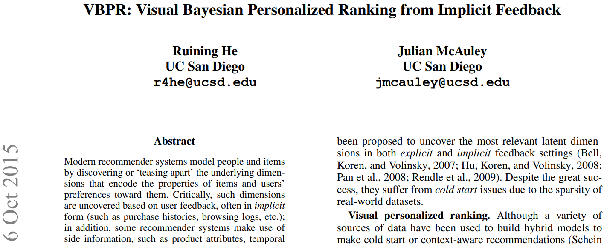
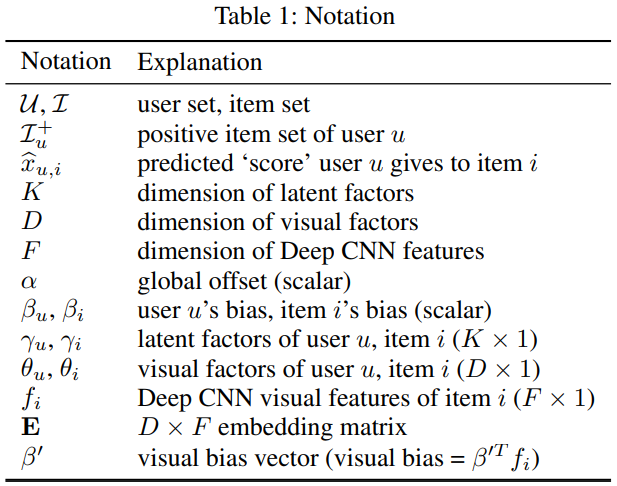
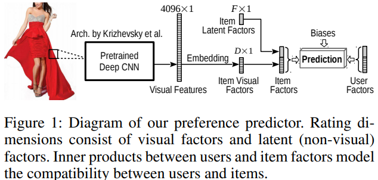
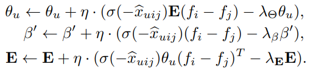
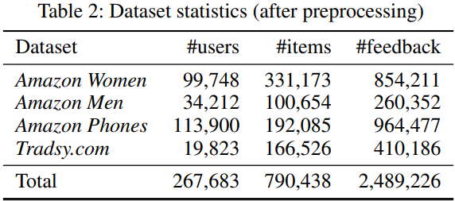
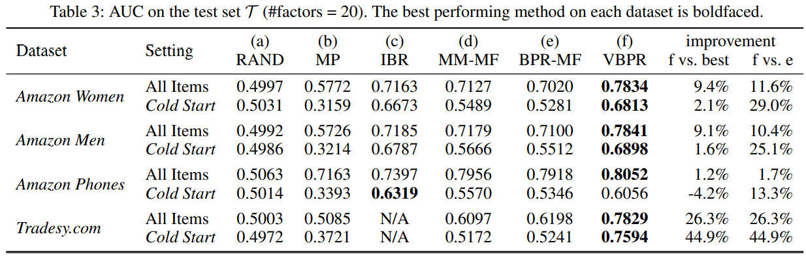
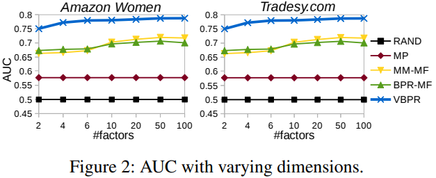
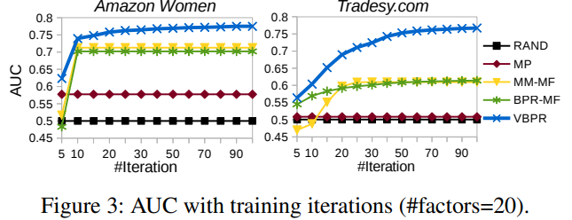
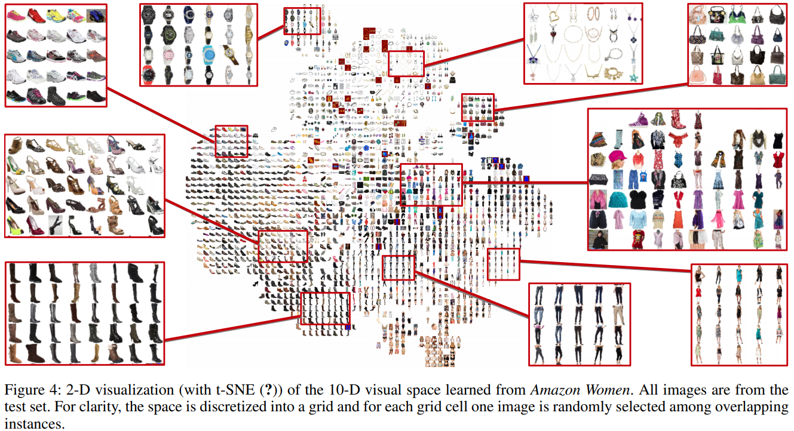

## 2015_VBPR [VBPR: Visual Bayesian Personalized Ranking from Implicit Feedback]

---

### Abstract
* 항목의 속성/사용자의 선호도 > 인코딩 > 차원을 발견/분리 > 모델링   
  * 차원: 사용자 암시적 피드백을 기반  
  * 부가정보: 제품 속성, 시간 정보, 리뷰 텍스트 등  
  * 개인화 추천/순위 방법 누락된 중요 feature: **항목의 visual appearance**     
* 제안: visual signals > scalable factorization model  
  * (pre-trained) deep networks: 시각적 features 추출  
  * additional layer: user 피드백 변화 설명하는 시각적 차원 파악  
  * => 개인화 된 순위 RS 성능 ↑; cold-start ​​문제 완화; 의견 영향 미치는 시각적 차원 질적 분석  

---

### Introduction
#### Visual personalized ranking. 
* 목표: 시각적 차원(의견) 발견 > 시각적 선호 모델이 개인별 순위 성능 향상 여부  
  * 제안: 암시적 피드백 데이터세트; 개인화 된 순위 지정 작업; 시각적 features 통합 모델  

* 대규모 데이터세트 확장 > MF(Matrix Factorization) 도입: 시각적 신호 사람 의견 예측 변수에 통합  
* BPR(Bayesian Personalized Ranking): 시각적 요인을 발견  
* 발견한 시각적 평가 공간 시각화 및 효과 입증 새로운 실제 데이터세트에 대한 실험  

---

### Related Work
#### Visual Features. 
* Deep Convolutional Neural Networks(Deep CNN)  
  * 전이학습: 큰 데이터 세트 훈련 된 CNN 일반화 > 다른 데이터 세트 적용 가능  

---

### VBPR: Visual Bayesian Personalized Ranking 
* 시각적 개인화 순위 모델(VBPR) 구축  
  * 시각적 차원  잠재(비 시각적) 차원 동시 발견  
* 표기법    
  * 

#### Problem Formulation
* 시나리오: 사용자 암시적 피드백 순위 학습  
* : 사용자 u 명시적 긍정 피드백 항목 집합   
* 목표: 각 사용자에게 아직 피드백 제공하지 않은 항목의 개인화 순위 생성  

#### Preference Predictor 
* 선호도 예측기: MF 기반(Matrix Factorization)  
  * .PNG)  
    * α: 전역 오프셋  
    * :사용자, 항목 편향  
    * : 사용자, 항목 잠재 인자 설명 K 차원 벡터  
    * : 내적; 사용자 u - 항목 i 사이 '호환성(compatibility)'; 사용자 잠재  '선호'가 제품 '속성' 일치하는 정도를 인코딩   
      * 문제: cold(cool)항목 존재 > 잠재적 차원 추정하기에 관측치가 적음    
      * 완화: 명시적 features 사용(보조 신호 제공)  
* 제안: rating 차원 구분(visual factors - non-visual/latent factors)  
  * 
* 확장된 예측자 형식  
  * .PNG)  
    * : new D차원 시각적 factors  
    * 내적: u-i 사이 시각적 상호 작용(사용자 u가 각 D 시각적 차원에 끌리는 정도)  
* 임베딩: 모든 항목 동일 임베딩 행렬 공유 > 학습 매개변수의 수 ↓ > 효율적  

* 최종 예측 모델  
  * .PNG)   

#### Model Learning Using BPR 
* Bayesian Personalized Ranking(BPR): SGD; 쌍별 ranking 최적화 프레임워크  
* DS: training set; 트리플(u, i, j): 사용자 u - 긍정 피드백 표현 item i & 관찰되지 않는 item j   
  * .PNG)  
    * Θ: 매개 변수 벡터  
    * : 트리플(u, i, j)의 구성 요소 간 관계 매개 변수화 Θ의 임의 함수  
* 최적화 기준: 개인화 ranking(BPR-OPT)  
  * .PNG)  
    * σ: 로지스틱(시그모이드) 함수  
    * : 모델 별 regularization hyperparameter  
* BPR-MF(Matrix Factorization) 선호도 예측; SGD    
  * .PNG)  
    * 트리플(u, i, j)이 DS에서 샘플링  
    * 학습 알고리즘 매개 변수 업데이트  
      * .PNG)  
        * η: 학습률  
* 제안된 모델의 BPR-MF 대비 업데이트 매개변수 세트(2):    
  * (a) 비 시각적 매개변수  
    * BPR-MF 동일 형식 업데이트  
  * (b) 새로 도입 된 시각적 매개변수  
    *   
      * : hyperparameter; 임베딩 행렬 E regularize  

#### Scalability
* BPR-MF의 효율성 > 확장 용이   
* 제안 모델: 시각적 매개변수도 업데이트 필요   

---

### Experiments 
#### Datasets 
* datasets: Amazon.com, Tradesy.com  
*   

#### Visual Features 
* 각 항목 i에 대해 하나의 제품 이미지 수집  
* CNN 아키텍처를 구현하는 Caffe 참조 모델 > 시각적 특징() 추출  
  * 아키텍처: 5 convolutional layers; 3 fully-connected layers  
  * 사전학습: 120만 ImageNet(ILSVRC2010) 이미지  
  * 2번째 완전연결계층(FC7) 출력: 4096 차원  추출  

#### Evaluation Methodology 
* 데이터 분할  
  * : testing   
  * : validation  
* 평가: ROCAUC  
  * .PNG)  
    * 사용자 u에 대한 평가 쌍 세트  
        * .PNG)  
    * δ(b): indicator functio; b가 참: 1  

#### Baselines 
* stateof-the-art MF models  
  * MF(Matrix Factorization): 암시적 피드백 데이터 세트에 대한 stateof-the-art performance  
  * Random(RAND): 모든 사용자에 대해 항목 순위 무작위 지정  
  * Most Popular(MP): 개인화 X; 인기도에 따른 항목 순위  
  * MM-MF: 쌍별 MF 모델; BPR-MF+SGA 훈련; 
  * BPR-MF: pairwise 방법; 암시적 피드백 최신 개인화 순위  
* ‘content-based’  
  * IBR(Image-based Recommendation): 시각적 공간 학습; 쿼리 이미지 스타일적 유사한 항목 검색 > 이웃 검색 > 예측     
* point-wise method  
  * WRMF

#### Reproducibility 재현성  
* 하이퍼 파라미터 조정  

#### Performance 
*   
  * Cold Start: 긍정 피드백 인스턴스 5개 미만인 항목  
  * 1. VBPR > BPR-MF  
  * 2. Cold Start; VBPR> BPR-MF/MM-MF  
  * 3. VBPR 대부분 모든 기준 능가; (MF + content-based methods)  
  * 4. Cold Start; ‘one-off’(1회); 성능 ↑  
  * 5. Visual features ∝ visual factors 역할  
  * 6. Cold item; 인기 없는 것이라 Popularity-based methods 효과 ↓  
  * 7. pairwise methods > point-wise method  

#### Sensitivity. 
*   
  * factors 수가 증가 - 성능 ↑ > 과적합 방지 pairwise methods 능력    
    * MM-MF, BPR-MF, VBPR  

#### Training Efficiency. 
*   
  * 훈련 반복 >  - 성능 ↑  

#### Visualizing Visual Space 
* VBPR: 항목 저차원(visual space) 매핑 > 유사한 스타일(사용자 평가 방식) 가진 항목 가까운 위치에 매핑  
  *   
    * (1) 사전훈련 CNN: 시각적 feature 추출 > 임베딩: 시각적 전환(loosely) 학습(다른 하위 카테고리) > 추출 피처 표현 확인  
    * (2) 숨겨진 분류법(hidden taxonomy) 배우는데 도움; 가장 관련성이 높은 시각적 차원 발견 > 항목/ 사용자 숨겨진 공간 매핑  

---