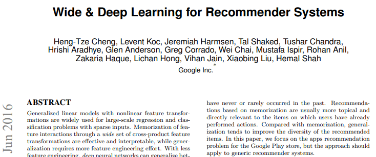
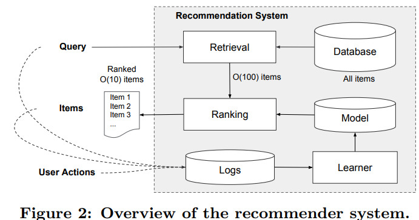
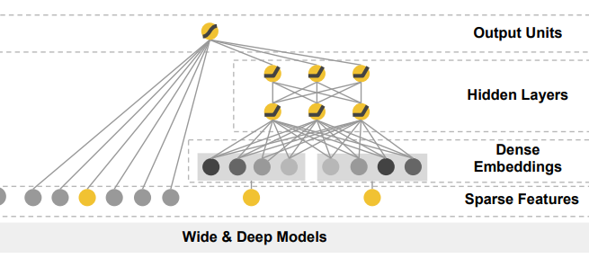
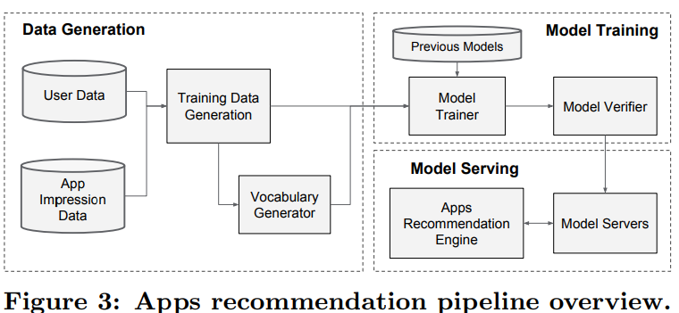
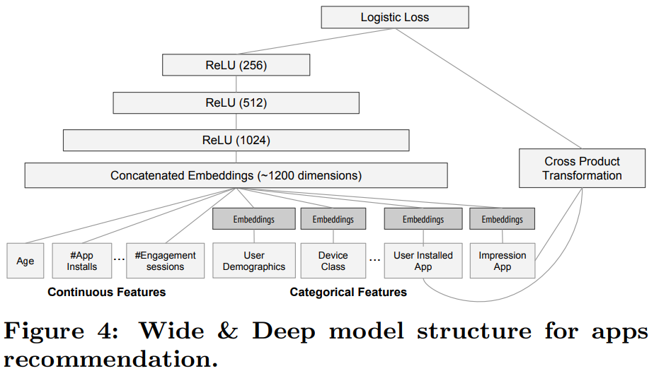
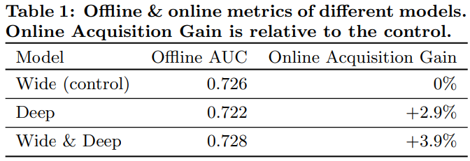
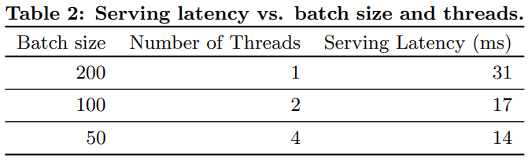

## 2016_arxiv_WDLRS [Wide & Deep Learning for Recommender Systems]

---
### ABSTRACT  
* 비선형 feature 변환 포함 일반화 된 선형 모델: 희소 입력이 있는 대규모 회귀/분류 문제 사용  
  * 일반화: feature 엔지니어링 노력 필요  
    * feature 엔지니어링 ↓, (희소, 저차원 고밀도 임베딩) DNN 일반화 ↑   
* Wide & Deep learning 제안  
  * memorization + generalization  
  * wide linear models + deep neural networks  
* Google Play 제작 평가  
* TensorFlow 오픈 소스  

#### CCS Concepts 비교 사례 연구  
* Computing methodologies → Machine learning; Neural networks; Supervised learning;  
* Information systems → Recommender systems;  

#### Keywords
* Wide & Deep Learning, Recommender Systems.  

---
### 1. INTRODUCTION
|input query | RS | output |
|---|---|---|
|user / contextual info|ranking system|a ranked list of items|

* challenge: 두가지 모두 달성  
  * memorization: items/features 동시 발생 학습, 과거 데이터에서 correlation 활용  
    * based) topical and directly    
  * generalization: 상관 관계의 전이성을 기반, 과거에 한 번도 발생X/거의 발생X 새로운 features 조합 탐색    
    * based) 다양성을 향상  
* 원-핫 인코딩 > 이진화 된 희소 특성  

* 임베딩 기반 모델(FM, DNN) query-item > 저차원 고밀도 임베딩 벡터 학습 > 일반화(쿼리 항목 feature)    
  * query-item matrix(sparse) & high-rank > 저차원 표현 학습 어려움 => 지나친 일반화     

* 교차 제품 변환(cross-product transformations)  
  * (sparse features) > morization ↑ (“exception rules”) 기억 - 더 적은 매개변수    
    * feature pair 동시 발생 - target label 연관 설명  
  * 제한: 학습 데이터에 없는 feature pairs(query, item)으로 일반화 X   

  * 선형모델 + 신경망 학습 > 암기 + 일반화  

* The Wide & Deep learning framework  
  * 1) feed-forward NN(임베딩) + 선형 모델(feature transformations(일반 RS(sparse input)))  
  * 2) Google Play에서 제작된 RS 구현/평가  
  * 3) TensorFlow 상위 수준 API 오픈 소스  

---
### 2. RECOMMENDER SYSTEM OVERVIEW
* 앱 추천 시스템 개요  
  *   
    * 사용자 앱 스토어 방문 > 쿼리 생성(user/contextual features) in 학습 데이터 로그     
      * 추천 대기 요구 시간(O(10) ms)
        * DB에서 모든 쿼리에 대해 모든 앱 점수 매길 시간 X  
          * 쿼리 - 검색(ML + 사용자 정의 규칙) : 짧은 목록 반환(후보 풀 ↓) > scoring     
            * 점수 = P(y|x)  
              * x: user / contextual / impression features  
              * y: 사용자 action label  
    * RS return: 앱 목록(impression)     

---
### 3. WIDE & DEEP LEARNING
#### 3.1 The Wide Component
  
  * Wide Models:  일반화된 선형 모델   
  * feature set ⊃ raw input features / transformed features   
  * 가장 중요한 변환: cross-product transformation   
    * .PNG)  
      * : i번째 feature이 k번째 변환  일부 = 1 / 일부X = 0 (boolean 변수)  
* cross-product transformation[binary features]:  
  * 구성 features 모두 1이면 1, 아니면 0  
    * => 상호작용 캡처, 일반화된 선형 모델에 비선형성 추가   

#### 3.2 The Deep Component
  
  * Deep Models: feed-forward NN  
    * 희소, 고차원 범주형 features > 임베딩 벡터(저차원 조밀한 실수값 벡터) > feed-forward NN hidden layers  
      * 임베딩 차원: O(10) ~ O(100)   
      * hidden layer 계산  
        * .PNG)  
          * l: 레이어 번호  
          * f: 활성화 함수  

#### 3.3 Joint Training of Wide & Deep Model
* wide component + deep component:  
  * 출력 log odds 가중 합 예측 결합 > joint training(logistic loss function)  

* joint training - ensemble 차이점  
  * joint training: 학습 시, ∑ 가중치 / 모든 매개변수 동시 최적화   
    * wide model 적은 수 cross-product feature transformations > deep model 약점 보완   
    * mini-batch stochastic optimization > backpropagating   
  * ensemble: 개별 학습(서로 알지 X), 학습 결합 X > 예측 결합 ㅇ  
    * 훈련 분리 > 각 개별 모델 크기 커야 합리적 정확도  

* 
  * wide: Follow-the-regularized-leader(FTRL) + L1  
  * deep: AdaGrad  

* 로지스틱 회귀 문제 모델 예측  
  * .PNG)  
    * Y: 이진 클래스 레이블  
    * σ(·): 시그모이드 함수  
    * φ(x): original features - cross product transformations  
    * : 모든 와이드 모델 가중치 벡터  
    * : 최종 활성화 에 적용된 가중치  

---
### 4. SYSTEM IMPLEMENTATION
* 앱 추천 파이프라인 구현  
*   
  * 4.1 생성 > 4.2 모델 학습 > 4.3 모델 제공    

#### 4.1 Data Generation
* 일정 기간 내, 사용자 / 앱 노출 데이터 > 학습 데이터 생성(정규화)  
* 노출(impression) > 앱 획득(label): 설치 1 / 아니면 0  

#### 4.2 Model Training
* 모델 구조  
  *   
    * (training) input layer: training data / vocabularies > sparse  dense features + label  
    * (wide) 사용자가 설치 한 앱 + 노출 앱 cross-product transformation: 
    * (deep) 32차원 임베딩 벡터 각 범주형 특징 학습
    * 연결 1200 차원 dense vector > ReLU(3) > logistic output unit       
* 새로운 학습 데이터 세트 도착 > 모델 다시 학습: 계산 비용 및 시간 지연 발생(문제)   
  * (해결) 웜 스타트 시스템: 이전 모델 임베딩/선형 모델 가중치로 새 모델 초기화       
    * 모델 서빙 전, dry run(모의 테스트): 라이브 트래픽 제공에 문제 없는지 확인(sanity check)     

#### 4.3 Model Serving
* 모델 학습 > 검증 > 서버 로드  
* 요청 > 앱 검색 시스템/사용자 features: 후보 세트 수신 > [서버]: 앱 점수 산정(순위 도출) > 순서로 앱 표시      
* 속도(10ms)/트랜잭션: 모든 후보 앱 점수 산정 X, 더 작은 배치 병렬(다중 스레딩 병렬 처리) => 성능 최적화  

---
### 5. EXPERIMENT RESULTS
* 평가 기준: 5.1 앱 획득 + 5.2 서비스 성능  

#### 5.1 App Acquisitions
*   
  * 메인 랜딩 페이지 앱 획득 률 +3.9% (통계적 유의미함)  
  * 온라인 트래픽에 미치는 영향 ↑: 오프라인 고정인 반면, 온라인 generalization + memorization 새 추천 생성   

#### 5.2 Serving Performance
*   

---
### 6. RELATED WORK
* 내적 대신 신경망으로 임베딩 간 비선형 상호 작용 학습 > 모델 capacity 확장  
* 언어 모델, RNN 복작성(은닉 계층 크기) ↓ > joint training(RNN/n-gram 최대 entropy 모델) 제안됨  
* CV(비전), deep residual learning : 심층 학습 어려움 ↓, 계층 건너뛰어(shortcut) 정확도 향상  
* Joint training(NN/그래픽 모델): 이미지에서 사람 포즈 추정  
* joint training(feed-forward NN/선형): 희소 features - 출력의 직접 연결   
* CF 딥러닝: CF(ratings matrix) + 딥러닝(content information)  
---
