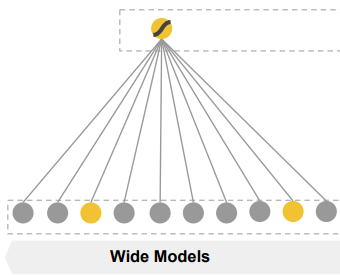

## 2016_arxiv_WDLRS [Wide & Deep Learning for Recommender Systems]

---
### ABSTRACT  
* 비선형 feature 변환 포함 일반화 된 선형 모델: 희소 입력이 있는 대규모 회귀/분류 문제 사용  
  * 일반화: feature 엔지니어링 노력 필요  
    * feature 엔지니어링 ↓, (희소, 저차원 고밀도 임베딩) DNN 일반화 ↑   
* Wide & Deep learning 제안  
  * memorization + generalization  
  * wide linear models + deep neural networks  
* Google Play 제작 평가  
* TensorFlow 오픈 소스  

#### CCS Concepts 비교 사례 연구  
* Computing methodologies → Machine learning; Neural networks; Supervised learning;  
* Information systems → Recommender systems;  

#### Keywords
* Wide & Deep Learning, Recommender Systems.  

---
### 1. INTRODUCTION
|input query | RS | output |
|---|---|---|
|user / contextual info|ranking system|a ranked list of items|

* challenge: 두가지 모두 달성  
  * memorization: items/features 동시 발생 학습, 과거 데이터에서 correlation 활용  
    * based) topical and directly    
  * generalization: 상관 관계의 전이성을 기반, 과거에 한 번도 발생X/거의 발생X 새로운 features 조합 탐색    
    * based) 다양성을 향상  
* 원-핫 인코딩 > 이진화 된 희소 특성  

* 임베딩 기반 모델(FM, DNN) query-item > 저차원 고밀도 임베딩 벡터 학습 > 일반화(쿼리 항목 feature)    
  * query-item matrix(sparse) & high-rank > 저차원 표현 학습 어려움 => 지나친 일반화     

* 교차 제품 변환(cross-product transformations)  
  * (sparse features) > morization ↑ (“exception rules”) 기억 - 더 적은 매개변수    
    * feature pair 동시 발생 - target label 연관 설명  
  * 제한: 학습 데이터에 없는 feature pairs(query, item)으로 일반화 X   

  * 선형모델 + 신경망 학습 > 암기 + 일반화  

* The Wide & Deep learning framework  
  * 1) feed-forward NN(임베딩) + 선형 모델(feature transformations(일반 RS(sparse input)))  
  * 2) Google Play에서 제작된 RS 구현/평가  
  * 3) TensorFlow 상위 수준 API 오픈 소스  

---
### 2. RECOMMENDER SYSTEM OVERVIEW
* 앱 추천 시스템 개요  
  *   
    * 사용자 앱 스토어 방문 > 쿼리 생성(user/contextual features) in 학습 데이터 로그     
      * 추천 대기 요구 시간(O(10) ms)
        * DB에서 모든 쿼리에 대해 모든 앱 점수 매길 시간 X  
          * 쿼리 - 검색(ML + 사용자 정의 규칙) : 짧은 목록 반환(후보 풀 ↓) > scoring     
            * 점수 = P(y|x)  
              * x: user / contextual / impression features  
              * y: 사용자 action label  
    * RS return: 앱 목록(impression)     

---
### 3. WIDE & DEEP LEARNING
#### 3.1 The Wide Component
  
  * Wide Models:  일반화된 선형 모델   
  * feature set ⊃ raw input features / transformed features   
  * 가장 중요한 변환: cross-product transformation   
    * .PNG)  
      * : i번째 feature이 k번째 변환  일부 = 1 / 일부X = 0 (boolean 변수)  
* cross-product transformation[binary features]:  
  * 구성 features 모두 1이면 1, 아니면 0  
    * => 상호작용 캡처, 일반화된 선형 모델에 비선형성 추가   

#### 3.2 The Deep Component
  
  * Deep Models: feed-forward NN  

For categorical features, the original inputs are feature strings (e.g., “language=en”). 
범주 형 특성의 경우 원래 입력은 특성 문자열 (예 : "language = en")입니다.

Each of these sparse, high-dimensional categorical features are first converted into a low-dimensional and dense real-valued vector, often referred to as an embedding vector. 
이러한 희소, 고차원 범주 형 특성 각각은 먼저 임베딩 벡터라고도하는 저 차원의 조밀 한 실수 값 벡터로 변환됩니다.

The dimensionality of the embeddings are usually on the order of O(10) to O(100). 
임베딩의 차원은 일반적으로 O (10) ~ O (100) 정도입니다.

The embedding vectors are initialized randomly and then the values are trained to minimize the final loss function during model training. 
임베딩 벡터는 무작위로 초기화 된 다음 모델 학습 중에 최종 손실 함수를 최소화하기 위해 값이 학습됩니다.

These low-dimensional dense embedding vectors are then fed into the hidden layers of a neural network in the forward pass. 
이러한 저 차원 고밀도 임베딩 벡터는 순방향 패스에서 신경망의 숨겨진 레이어로 공급됩니다.

Specifically, each hidden layer performs the following computation: 
특히 각 숨겨진 레이어는 다음 계산을 수행합니다.
.PNG)
where l is the layer number and f is the activation function, often rectified linear units (ReLUs). 
여기서 l은 레이어 번호이고 f는 활성화 함수이며 종종 ReLU (정류 된 선형 단위)입니다.

a(l), b(l), and W(l) are the activations, bias, and model weights at l-th layer. 
a (l), b (l) 및 W (l)은 l 번째 계층의 활성화, 편향 및 모델 가중치입니다.

#### 3.3 Joint Training of Wide & Deep Model

The wide component and deep component are combined using a weighted sum of their output log odds as the pre-iction, which is then fed to one common logistic loss function for joint training. 
넓은 구성 요소와 깊은 구성 요소는 출력 로그 배당률의 가중 합계를 예측으로 사용하여 결합 된 다음 공동 훈련을 위해 하나의 공통 로지스틱 손실 함수에 공급됩니다.

Note that there is a distinction between joint training and ensemble. 
합동 훈련과 앙상블에는 차이가 있습니다.

In an ensemble, individual models are trained separately without knowing each other, and their predictions are combined only at inference time but not at training time. 
앙상블에서 개별 모델은 서로 알지 못하는 상태에서 개별적으로 학습되며, 예측 시간에만 결합되고 학습 시간에는 결합되지 않습니다.

In contrast, joint training optimizes all parameters simultaneously by taking both the wide and deep part as well as the weights of their sum into account at training time. 
대조적으로, 관절 훈련은 훈련 시간에 합의 가중치는 물론 넓고 깊은 부분을 모두 고려하여 모든 매개 변수를 동시에 최적화합니다.

There are implications on model size too: For an ensemble, since the training is disjoint, each individual model size usually needs to be larger (e.g., with more features and transformations) to achieve reasonable accuracy for an ensemble to work. 
모델 크기에도 영향이 있습니다. 앙상블의 경우 훈련이 분리되어 있기 때문에 일반적으로 각 개별 모델 크기가 더 커야 (예 : 더 많은 기능 및 변환 포함) 앙상블이 작동하기 위해 합리적인 정확도를 얻을 수 있습니다.

In comparison, for joint training the wide part only needs to complement the weaknesses of the deep part with a small number of cross-product feature transformations, rather than a full-size wide model.
이에 비해 공동 훈련의 경우 넓은 부분은 전체 크기의 넓은 모델이 아닌 적은 수의 제품 간 기능 변환으로 깊은 부분의 약점 만 보완하면됩니다.

Joint training of a Wide & Deep Model is done by backpropagating the gradients from the output to both the wide and deep part of the model simultaneously using mini-batch stochastic optimization. 
와이드 및 딥 모델의 공동 훈련은 미니 배치 확률 적 최적화를 사용하여 출력에서 ​​모델의 와이드 및 딥 부분으로 기울기를 동시에 역 전파하여 수행됩니다.

In the experiments, we used Followthe-regularized-leader (FTRL) algorithm [3] with L1 regularization as the optimizer for the wide part of the model, and AdaGrad [1] for the deep part.
실험에서 우리는 모델의 넓은 부분에 대한 최적화 도구로 L1 정규화와 함께 FTRL (Followthe-regularized-leader) 알고리즘 [3]을 사용하고 깊은 부분에 대해서는 AdaGrad [1]을 사용했습니다.

The combined model is illustrated in Figure 1 (center).
결합 된 모델은 그림 1 (가운데)에 나와 있습니다.

For a logistic regression problem, the model’s prediction is:
로지스틱 회귀 문제의 경우 모델의 예측은 다음과 같습니다.
.PNG)
where Y is the binary class label, σ(·) is the sigmoid function, φ(x) are the cross product transformations of the original features x, and b is the bias term. 
여기서 Y는 이진 클래스 레이블, σ (·)는 시그 모이 드 함수, φ (x)는 원래 특성 x의 외적 변환, b는 편향 항입니다.

w_wide is the vector of all wide model weights, and wdeep are the weights applied on the final activations a^(lf ).
w_wide는 모든 와이드 모델 가중치의 벡터이고 wdeep은 최종 활성화 a ^ (lf)에 적용된 가중치입니다.

---
### 4. SYSTEM IMPLEMENTATION

The implementation of the apps recommendation pipeline consists of three stages: data generation, model training, and model serving as shown in Figure 3. 
앱 추천 파이프 라인의 구현은 그림 3과 같이 데이터 생성, 모델 학습 및 모델 제공의 세 단계로 구성됩니다.

#### 4.1 Data Generation

In this stage, user and app impression data within a period of time are used to generate training data. 
이 단계에서는 일정 기간 내의 사용자 및 앱 노출 데이터를 사용하여 학습 데이터를 생성합니다.

Each example corresponds to one impression. 
각 예는 하나의 노출에 해당합니다.

The label is app acquisition:
레이블은 앱 획득입니다.

1 if the impressed app was installed, and 0 otherwise.
인상적인 앱이 설치된 경우 1이고 그렇지 않은 경우 0입니다.

Vocabularies, which are tables mapping categorical feature strings to integer IDs, are also generated in this stage.
범주 형 특성 문자열을 정수 ID로 매핑하는 테이블 인 어휘도이 단계에서 생성됩니다.

The system computes the ID space for all the string features that occurred more than a minimum number of times. 
시스템은 최소 횟수 이상 발생한 모든 문자열 기능에 대한 ID 공간을 계산합니다.

Continuous real-valued features are normalized to [0, 1] by mapping a feature value x to its cumulative distribution function P(X ≤ x), divided into nq quantiles. 
연속 실수 특성은 특성 값 x를 nq 분위수로 나눈 누적 분포 함수 P (X ≤ x)에 매핑하여 [0, 1]로 정규화됩니다.

The normalized value is i−1 nq−1 for values in the i-th quantiles. Quantile boundaries are computed during data generation.
정규화 된 값은 i 번째 분위수 값에 대해 i-1 nq-1입니다. 분위수 경계는 데이터 생성 중에 계산됩니다.

#### 4.2 Model Training

The model structure we used in the experiment is shown in Figure 4. 
실험에서 사용한 모델 구조는 그림 4에 나와 있습니다.

During training, our input layer takes in training data and vocabularies and generate sparse and dense features together with a label. 
훈련 중에 입력 계층은 훈련 데이터와 어휘를 가져와 레이블과 함께 희소하고 조밀 한 기능을 생성합니다.

The wide component consists of the cross-product transformation of user installed apps and impression apps. 
넓은 구성 요소는 사용자가 설치 한 앱과 노출 앱의 제품 간 변환으로 구성됩니다.

For the deep part of the model, A 32- dimensional embedding vector is learned for each categorical feature. 
모델의 깊은 부분에 대해 각 범주 형 특징에 대해 32 차원 임베딩 벡터를 학습합니다.

We concatenate all the embeddings together with the dense features, resulting in a dense vector of approximately 1200 dimensions. 
모든 임베딩을 조밀 한 특징과 함께 연결하여 약 1200 차원의 조밀 한 벡터를 생성합니다.

The concatenated vector is then fed into 3 ReLU layers, and finally the logistic output unit. 
연결된 벡터는 3 개의 ReLU 계층과 마지막으로 로지스틱 출력 단위로 공급됩니다.

The Wide & Deep models are trained on over 500 billion examples. 
Wide & Deep 모델은 5 천억 개가 넘는 예제에서 훈련되었습니다.

Every time a new set of training data arrives, the model needs to be re-trained. 
새로운 학습 데이터 세트가 도착할 때마다 모델을 다시 학습해야합니다.

However, retraining from scratch every time is computationally expensive and delays the time from data arrival to serving an updated model.
그러나 매번 처음부터 다시 학습하는 것은 계산 비용이 많이 들고 데이터 도착부터 업데이트 된 모델 제공까지의 시간이 지연됩니다.

To tackle this challenge, we implemented a warm-starting system which initializes a new model with the embeddings and the linear model weights from the previous model. 
이 문제를 해결하기 위해 이전 모델의 임베딩과 선형 모델 가중치로 새 모델을 초기화하는 웜 스타트 시스템을 구현했습니다.

Before loading the models into the model servers, a dry run of the model is done to make sure that it does not cause problems in serving live traffic. 
모델을 모델 서버에로드하기 전에 모델의 드라 이런을 수행하여 라이브 트래픽을 제공하는 데 문제가 없는지 확인합니다.

We empirically validate the model quality against the previous model as a sanity check. 
우리는 온 전성 검사로 이전 모델과 비교하여 모델 품질을 경험적으로 검증합니다.

#### 4.3 Model Serving

Once the model is trained and verified, we load it into the model servers. 
모델이 학습되고 확인되면 모델 서버에로드합니다.

For each request, the servers receive a set of app candidates from the app retrieval system and user features to score each app. 
각 요청에 대해 서버는 앱 검색 시스템 및 사용자 기능에서 앱 후보 세트를 수신하여 각 앱에 점수를 매 깁니다.

Then, the apps are ranked from the highest scores to the lowest, and we show the apps to the users in this order. 
그런 다음 앱은 가장 높은 점수에서 가장 낮은 점수로 순위가 매겨지며이 순서로 사용자에게 앱을 표시합니다.

The scores are calculated by running a forward inference pass over the Wide & Deep model. 
점수는 Wide & Deep 모델에 대해 순방향 추론 패스를 실행하여 계산됩니다.

In order to serve each request on the order of 10 ms, we optimized the performance using multithreading parallelism by running smaller batches in parallel, instead of scoring all candidate apps in a single batch inference step. 
10ms 단위로 각 요청을 처리하기 위해 단일 배치 추론 단계에서 모든 후보 앱의 점수를 매기는 대신 더 작은 배치를 병렬로 실행하여 다중 스레딩 병렬 처리를 사용하여 성능을 최적화했습니다.

---
### 5. EXPERIMENT RESULTS

To evaluate the effectiveness of Wide & Deep learning in a real-world recommender system, we ran live experiments and evaluated the system in a couple of aspects: app acquisitions and serving performance.
실제 추천 시스템에서 Wide & Deep Learning의 효과를 평가하기 위해 라이브 실험을 실행하고 앱 획득 및 서비스 성능이라는 두 가지 측면에서 시스템을 평가했습니다.

#### 5.1 App Acquisitions

We conducted live online experiments in an A/B testing framework for 3 weeks. 
3 주 동안 A / B 테스트 프레임 워크에서 라이브 온라인 실험을 수행했습니다.

For the control group, 1% of users were randomly selected and presented with recommendations generated by the previous version of ranking model, which is a highly-optimized wide-only logistic regression model with rich cross-product feature transformations.
통제 그룹의 경우, 사용자의 1 %가 무작위로 선택되었고, 풍부한 교차 제품 기능 변환이있는 고도로 최적화 된 와이드 전용 로지스틱 회귀 모델 인 순위 모델의 이전 버전에서 생성 된 권장 사항이 제시되었습니다.

For the experiment group, 1% of users were presented with recommendations generated by the Wide & Deep model, trained with the same set of features. 
실험 그룹의 경우 1 %의 사용자에게 동일한 기능 세트로 훈련 된 Wide & Deep 모델에서 생성 된 권장 사항이 제공되었습니다.

As shown in Table 1, Wide & Deep model improved the app acquisition rate on the main landing page of the app store by +3.9% relative to the control group (statistically significant). 
표 1에서 볼 수 있듯이 Wide & Deep 모델은 앱 스토어의 메인 랜딩 페이지에서 앱 획득 률을 통제 그룹에 비해 + 3.9 % 향상 시켰습니다 (통계적으로 유의미 함).

The results were also compared with another 1% group using only the deep part of the model with the same features and neural network structure, and the Wide & Deep mode had +1% gain on top of the deep-only model (statistically significant). 
결과는 동일한 기능과 신경망 구조를 가진 모델의 깊은 부분 만 사용하는 다른 1 % 그룹과도 비교되었으며 Wide & Deep 모드는 딥 전용 모델에 비해 + 1 % 이득을 얻었습니다 (통계적으로 유의미 함). .

Besides online experiments, we also show the Area Under Receiver Operator Characteristic Curve (AUC) on a holdout set offline. 
온라인 실험 외에도 오프라인으로 설정된 홀드 아웃에서 AUC (Area Under Receiver Operator Characteristic Curve)를 보여줍니다.

While Wide & Deep has a slightly higher offline AUC, the impact is more significant on online traffic. 
Wide & Deep은 오프라인 AUC가 약간 더 높지만 온라인 트래픽에 미치는 영향이 더 큽니다.

One possible reason is that the impressions and labels in offline data sets are fixed, whereas the online system can generate new exploratory recommendations by blending generalization with memorization, and learn from ne user responses.
한 가지 가능한 이유는 오프라인 데이터 세트의 노출 및 레이블이 고정되어있는 반면 온라인 시스템은 일반화와 암기를 혼합하여 새로운 탐색 권장 사항을 생성하고 사용자 응답을 통해 학습 할 수 있기 때문입니다.

#### 5.2 Serving Performance

Serving with high throughput and low latency is challenging with the high level of traffic faced by our commercial mobile app store. 
높은 처리량과 짧은 지연 시간으로 서비스를 제공하는 것은 상업용 모바일 앱 스토어가 직면 한 높은 수준의 트래픽으로 인해 어렵습니다.

At peak traffic, our recommender servers score over 10 million apps per second. 
트래픽이 가장 많을 때 추천 서버는 초당 1,000 만 개 이상의 앱을 기록합니다.

With single threading, scoring all candidates in a single batch takes 31 ms. 
단일 스레딩을 사용하면 단일 배치에서 모든 후보의 점수를 매기는 데 31ms가 걸립니다.

We implemented multithreading and split each batch into smaller sizes, which significantly reduced the client-side latency to 14 ms (including serving overhead) as shown in Table 2.
멀티 스레딩을 구현하고 각 배치를 더 작은 크기로 분할하여 표 2에 표시된대로 클라이언트 측 지연 시간을 14ms (서빙 오버 헤드 포함)로 크게 줄였습니다.

---
### 6. RELATED WORK

The idea of combining wide linear models with crossproduct feature transformations and deep neural networks with dense embeddings is inspired by previous work, such as factorization machines [5] which add generalization to linear models by factorizing the interactions between two variables as a dot product between two low-dimensional embedding vectors. 
넓은 선형 모델을 교차 곱 특성 변환 및 고밀도 임베딩이있는 심층 신경망과 결합하는 아이디어는 두 변수 간의 상호 작용을 두 변수 사이의 내적 (dot product)으로 분해하여 선형 모델에 일반화를 추가하는 분해 기계 [5]와 같은 이전 작업에서 영감을 받았습니다. 저 차원 임베딩 벡터.

In this paper, we expanded the model capacity by learning highly nonlinear interactions between embeddings via neural networks instead of dot products.
이 논문에서는 내적 대신 신경망을 통해 임베딩 간의 고도의 비선형 상호 작용을 학습하여 모델 용량을 확장했습니다.

In language models, joint training of recurrent neural networks (RNNs) and maximum entropy models with n-gram features has been proposed to significantly reduce the RNN complexity (e.g., hidden layer sizes) by learning direct weights between inputs and outputs [4]. 
언어 모델에서는 입력과 출력 사이의 직접적인 가중치를 학습하여 RNN 복잡성 (예 : 은닉 계층 크기)을 크게 줄이기 위해 RNN (recurrent neural network) 및 n-gram 기능이있는 최대 엔트로피 모델의 공동 훈련이 제안되었습니다 [4].

In computer vision, deep residual learning [2] has been used to reduce the difficulty of training deeper models and improve accuracy with shortcut connections which skip one or more layers. 
컴퓨터 비전에서 심층 잔차 학습 [2]은 심층 모델 학습의 어려움을 줄이고 하나 이상의 계층을 건너 뛰는 바로 가기 연결로 정확도를 향상시키는 데 사용되었습니다.

Joint training of neural networks with graphical models has also been applied to human pose estimation from images [6]. 
그래픽 모델과 함께 신경망의 공동 훈련은 이미지에서 사람의 포즈 추정에도 적용되었습니다 [6].

In this work we explored the joint training of feed-forward neural networks and linear models, with direct connections between sparse features and the output unit, for generic recommendation and ranking problems with sparse input data.
이 작업에서 우리는 희소 입력 데이터의 일반적인 권장 사항 및 순위 문제에 대해 희소 특성과 출력 단위 사이의 직접적인 연결을 통해 피드 포워드 신경망과 선형 모델의 공동 훈련을 탐색했습니다.

In the recommender systems literature, collaborative deep learning has been explored by coupling deep learning for content information and collaborative filtering (CF) for the ratings matrix [7]. 
추천 시스템 문헌에서 콘텐츠 정보에 대한 딥 러닝과 등급 매트릭스에 대한 협업 필터링 (CF)을 결합하여 협업 딥 러닝을 탐색했습니다 [7].

There has also been previous work on mobile app recommender systems, such as AppJoy which used CF on users’ app usage records [8]. 
사용자의 앱 사용 기록에 CF를 사용한 AppJoy와 같은 모바일 앱 추천 시스템에 대한 이전 작업도있었습니다 [8].

Different from the CF-based or content-based approaches in the previous work, we jointly train Wide & Deep models on user and impression data for app recommender systems.
이전 작업의 CF 기반 또는 콘텐츠 기반 접근 방식과 달리 앱 추천 시스템의 사용자 및 노출 데이터에 대한 Wide & Deep 모델을 공동으로 훈련합니다.

---
### 7. CONCLUSION

Memorization and generalization are both important for recommender systems. 
추천 시스템에서는 암기와 일반화가 모두 중요합니다.

Wide linear models can effectively memorize sparse feature interactions using cross-product feature transformations, while deep neural networks can generalize to previously unseen feature interactions through lowdimensional embeddings. 
넓은 선형 모델은 교차 제품 특성 변환을 사용하여 희소 특성 상호 작용을 효과적으로 기억할 수 있으며, 심층 신경망은 저 차원 임베딩을 통해 이전에는 볼 수 없었던 특성 상호 작용으로 일반화 할 수 있습니다.

We presented the Wide & Deep learning framework to combine the strengths of both types of model. 
우리는 두 모델 유형의 강점을 결합하기 위해 Wide & Deep Learning 프레임 워크를 제시했습니다.

We productionized and evaluated the framework on the recommender system of Google Play, a massive-scale commercial app store. 
대규모 상용 앱 스토어 인 Google Play의 추천 시스템에서 프레임 워크를 제작하고 평가했습니다.

Online experiment results showed that the Wide & Deep model led to significant improvement on app acquisitions over wide-only and deep-only models.
온라인 실험 결과는 Wide & Deep 모델이 와이드 전용 및 딥 전용 모델에 비해 앱 획득을 크게 개선 한 것으로 나타났습니다.

---
