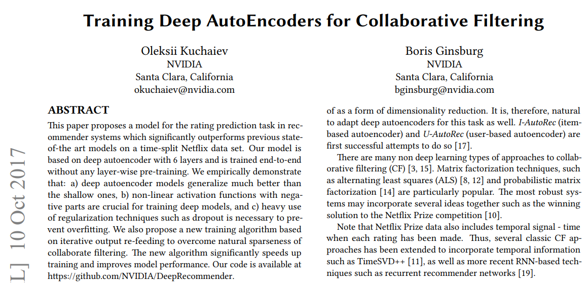
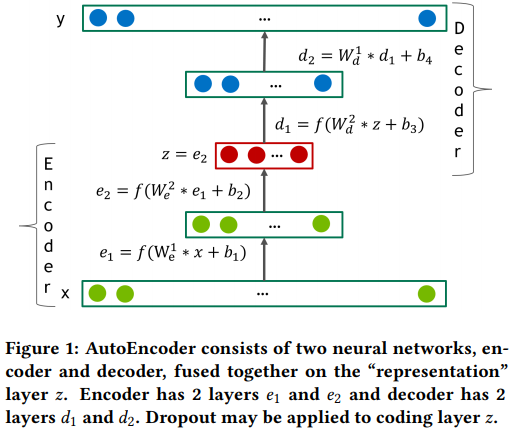
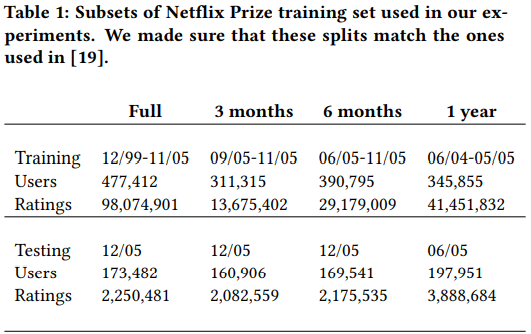
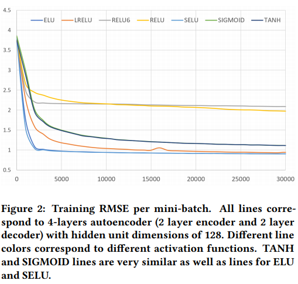
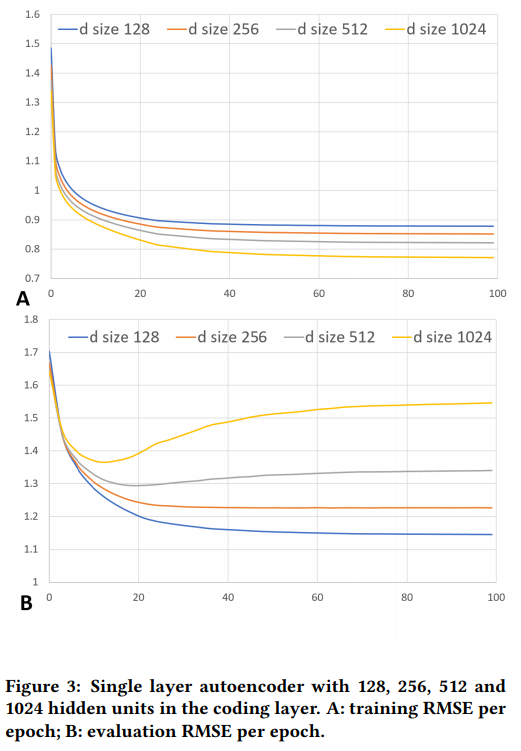
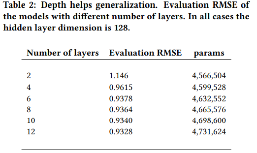
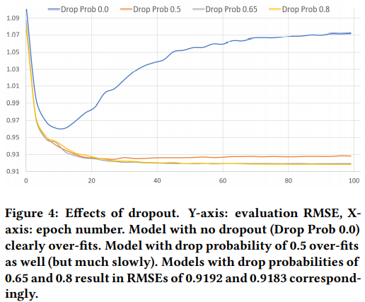
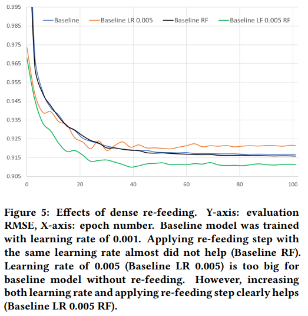
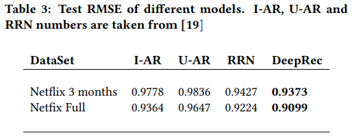

## 2017_DAE_CF [Training Deep AutoEncoders for Collaborative Filtering]

---

### ABSTRACT
* dataset: time-split Netflix     
* model: based deep autoencoder(6 layers), end-to-end(층별 pre-training X)  
  * a) 일반화: deep autoencoder > shallow  
  * b) training deep models, 비선형 활성화 함수(negative) 중요  
  * c) overfitting 방지: 규제 기술(dropout)  
* iterative output re-feeding 훈련모델 제안 > CF sparseness 극복  
* 코드ㅣ https://github.com/NVIDIA/DeepRecommender  

### 1. INTRODUCTION
* 추천시스템(2):  
  * context-based: contextual factors(지역, 날짜, 시간)   
  * personalized: CF 접근법; user(취향/선호도-implicit)=> 유사성 추론     

* 목표: 정확성 ↑  

* 고전적 CF 문제: m x n martix 누락 항목 추론(성능: RMSE)   

---

### 2. MODEL
* U-AutoRec 접근법 + deeper(*사전훈련 X*)    
  * a) scaled exponential linear units”(SELUs)  
  * b) dropout ↑  
  * d) iterative output re-feeding   

* autoencoder network  
  * 변환(2):   
    *     
    *     
  * 목표: f(x)=decode(encode(x)); 오류 최소화 - d차원 표현    
  *   
    * 4-layer autoencoder network  
    * [encoding step] 노이즈 추가 => [autoencoder] de-noising(called)   

* encoder/decoder: feed-forward NN, classical fully connected layers   
  * l = f(W ∗ x + b) 계산    
    * f: 비선형 활성화 함수  
      * 활성화 함수 범위 < 데이터 범위; decoder 마지막 레이어: 선형 유지    
      * 은닉층 활성화 함수 : 0이 아닌 음수 포함; SELU 단위 사용  
  * decoder mirror encoder > 디코더 가중치는 전치된 인코더 가중치와 동일하게 제한/연결 가능 (free parameters 2배 적어짐)    

#### Forward pass and inference  
* 사용자 등급 벡터 $ x \in R^n $  
  * n: 항목 수   
  * x: sparse  
* decoder output $ f(x) \in R^n $  
  * dense, corpus 모든 항목 등급 예측 포함  

#### 2.1 Loss function
* .PNG)  
  * : 실제 등급  
  * : 예측 등급  
  * : mask,  ≠ 0면 1, 아니면 0  
* RMSE = √MMSE  

#### 2.2 Dense re-feeding
* $ x \in R^n $: input (sparse)     
* f(x): 오토인코더 출력 (dense)    
* f 시나리오(ideal)   
  *  아이템에 대한 모든 사용자 미래 등급 정확히 예측   
  * 새 item k(새 벡터 x') 평가 =>   
  * ∴ y=f(x) ⇔ f(x)=y; 훈련된 오토인코더 point fix   
  * iterative dense re-feeding steps(4): fixed-point 제약조건 명시 적용 & dense 훈련 업데이트   
    * (1) 희소 x가 주어지면, 조밀한 f(x)와 등식 1(forward pass) 사용, 손실 계산  
    * (2) 기울기 계산 및 가중치 업데이트 수행 (backward pass)  
    * (3) f(x)를 새로운 예제로 취급, f(f(x)) 계산  
      * f(x), f(f(x)): dense, 등식 1 손실은 모든 m ≠ 0 (second forward pass)  
    * (4) 기울기 계산, 가중치 업데이트 수행 (second backward pass)  
      * (3)(4) 모든 반복에 대해 두 번 이상 수행 가능  

--- 

### 3 EXPERIMENTS AND RESULTS
#### 3.1 Experiment setup

* 
  * 데이터세트에 대한 세부사항  
  * batch size: 128; SGD; momentum: 0.9; learning rate: 0.001; 파라미터 초기화: xavier, 층별 사전훈련 X     

#### 3.2 Effects of the activation types
*   
  * rating scale: 1~5  
  * 활성화함수: 각 은닉층 128 units, 4 layer autoencoder  
    * sigmoid  
    * rectified linear units (RELU)  
    * max(relu(x), 6) or RELU6  
    * hyperbolic tangent (TANH)  
    * exponential linear units (ELU)  
    * leaky relu (LRELU)   
    * scaled exponential linear units (SELU)  
* (성공적 훈련을 위한) 활성화 수행 구분짓는 속성(2):       
  * a) non-zero negative part    
  * b) unbounded positive part  
* ∴ SELU 사용     

#### 3.3 Over-fitting the data
* 인코더의 첫 번째 계층 가중치:  
  * d * n + d   
    * d: 계층의 단위 수   
      * 단일 레이어 인코더/디코더; d(≒512) => 오버피팅    
        * 
  
#### 3.4 Going deeper
#### 3.4 자세히 알아보기
* layers wider: loss ↓  
* adding layers: 일반화 ↓   

*   
  * 모든 은닉층 차원 = 128(작은 크기로 과적합 회피); 레이어 추가 비교   

#### 3.5 Dropout
* 규제를 위한 하이퍼파라미터(드롭아웃) 비교    
*   
  * encoder 출력만 dropout 적용 f(x) = decode(dropout(encode(x)))    
*추가 적용으론 수렴 억제와 일반화 개선 안됨*  
 
#### 3.6 Dense re-feeding  
*   
  * dp(0.8): 드롭 확률 0.8 인 드롭아웃 레이어  
  * 출력 re-feeding > 모델 성능에 큰 영향 X  
  * (+) higher learning rate > 모델 성능 ↑  

#### 3.7 Comparison with other methods
*   
  * 100 epoch; RMSE  
  * T-SVD, RRN: 등급의 temporal dynamics을 명시적 고려  

---