## 2017_DeepFM [DeepFM: A Factorization-Machine based Neural Network for CTR Prediction]

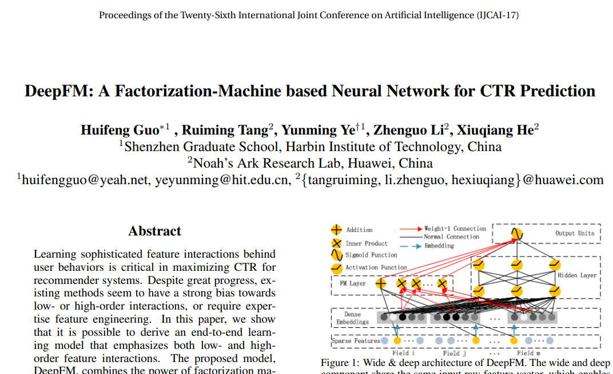

---
### Abstract  
* 추천시스템: CTR 최대화  
* 기존 방법: 강한 bias, 전문적인 feature 엔지니어링 요구  
* DeepFM: 딥러닝 + FM    
    * 종단간 학습 모델(end-to-end learning)  
    * low/high order feature interactions 모두 강조  
* Wide & Deep 과 비교   
  * feature engineering 필요 X > “wide” and “deep” 부분, 공유 입력    

---

### 1. Introduction
* 추천시스템에서 CTR   
  * 사용자 추천 항목 클릭 할 확률 추정   

* 목표: 클릭 수 최대화  
  * 사용자 반환 항목 > 예상 CTR 순위   
  * 수익 개선 중요한 경우, 순위 전략: CTR X bid(: 클릭할 경우 시스템이 받는 혜택)  
  
* CTR 예측  
  * 사용자 클릭 동작 뒤에 implicit feature (상호작용) 학습  
    * (order-2): 식사시간 배달 앱 다운 ↑ (앱 카테고리 - 타임스탬프)    
    * (order-3): 슈팅게임 남자 청소년 다운 ↑ (앱 카테고리 - 성별 - 연령)    

* Wide & Deep 통찰     
  * low/high-order feature interactions 동시 고려  
  * Wide: 전문가 feature 엔지니어링   

* 과제: feature 상호작용 모델링   
  * (일부) 전문가 설계, feature 수 많을수록 어려움      
  * (대부분) 사전 식별 어려움(hidden)   

* FTRL[McMahan et al., 2013]  
  * 단순, 일반화 된 선형 모형 > 성능 decent  
    * 선형 모델: feature 상호작용 학습 능력 X > feature 벡터에서 쌍별 feature 상호 작용 수동 포함   
      * 고차(high-order) feature 상호작용/훈련 데이터에 거의 나타나지 않는 상호 작용 모델링 시, 일반화 어려움[Rendle, 2010]      

* FM[Rendle, 2010]  
  * 잠재 벡터 내적 > 쌍별 feature 상호작용  
  * high-order feature 상호작용 모델링 가능하나, 높은 복잡성으로 order-2 일반적  

* Feature representation 학습    
  * DNN 
  * CNN-based models: neighboring features 상호작용에 편향  
  * RNN-based models: 순차적 종속성 있는 클릭 데이터 > 적합  
  * FNN(Factorization-machine supported Neural Network): FM 사전 훈련 > DNN  

* Feature interaction  
  * PNN(Product-based Neural Network): embedding-product-fully-connected layer  

* DeepFM  
  * feature 엔지니어링 X, 모든 차원 feature 상호작용 end-to-end manner  
  * 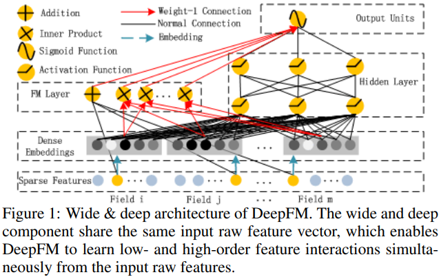 
    * FM + DNN  
      * FM: low-order feature 상호작용 모델링
      * DNN: high-order feature 상호작용 모델링
  * Wide & Deep 모델과 차이점   
    * feature 엔지니어링 없이 엔드 투 엔드 학습 가능  
    * Wide / Deep: 동일 입력/임베딩 벡터 공유  
      * W&D 모델 입력 벡터는 wide 수동 설계 쌍별 feature 상호작용 포함(크기 ↑)> 복잡도 ↑   

---

### 2. Our Approach
* 학습 데이터: n개 인스턴스 (χ, y)   
  * χ: m-fields ⊃ (user, item)  
    * categorical fields: 원-핫 인코딩 벡터  
    * continuous fields: 값 자체, 이산화(discretization) 후 원-핫 인코딩 벡터   
  * y ∈ {0, 1}: label(user click behaviors): 클릭 1 / 아니면 0  
  * => 각 인스턴스 (x, y)로 변환  
    * x: 고차원, 극도로 희소  

* CTR 예측 모델: 사용자가 주어진 context 에서 특정 앱을 클릭 확률 예측    
  *  구축  

#### 2.1 DeepFM
* 목표: low-order + high-order feature 상호작용 모두 학습      
* 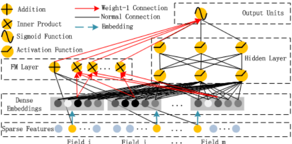  
  * 동일 입력 공유 > Deep / FM Layer   

* 예측모델:  
  * .PNG) 
    * : 예측 CTR   
    * : FM component 출력   
        * FM component: 
    * : 깊은 구성 요소의 출력   

  * feature i:
    *  : 스칼라, order-1 중요성 평가   
    *  : 잠재 벡터, 다른 features와 상호작용 영향 측정  
      * [FM component] order-2 feature 상호작용 모델링, [deep component] high-order feature 상호작용 모델링       
    * : 네트워크 파라미터  

* [FM component]  
  * feature 상호작용 학습  
  * 특성 간 선형 (order-1) 상호작용 + 쌍별 (order-2) feature 상호작용을(각 **잠재 벡터 내적**)(sparse에도 효과적)   
    * 잠재 벡터 내적: 유연한 설계, i or j 가 나타날 떄마다 잠재 벡터 훈련 가능(훈련 데이터 (거의)나타나지 않아도 잘 학습)    

  * 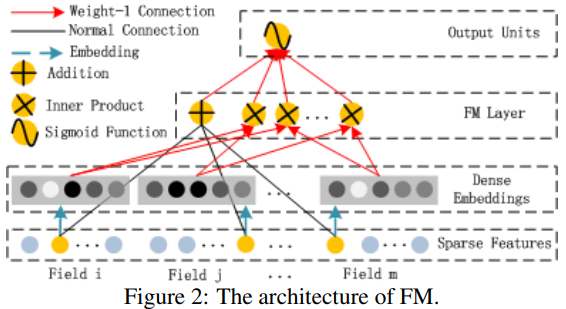   
    * output: Addition unit + 내적 units  
  * .PNG)  
    *    
    *    
    * 덧셈 단위(<w, x>): order-1 feature 중요성 반영   
    * 내적 단위: order-2 feature 상호작용 영향    

* [Deep Component]  
  *  high-order feature 상호작용 학습, a feed-forward NN      
  * 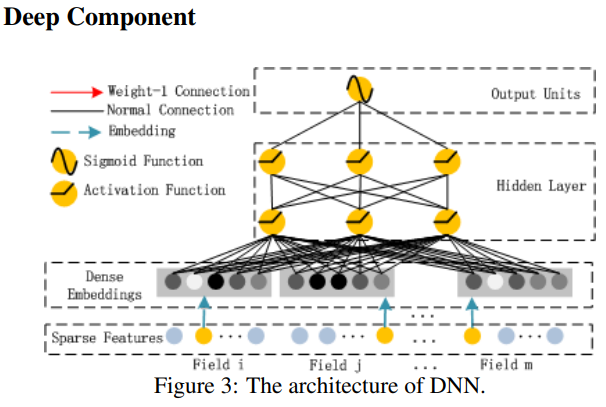   
  * data record(vector) > NN   

* CTR 예측을 위한 raw feature input vector: 매우 희소, 초 고차원, categorical-continuous-mixed, grouped in fields(e.g. 성별, 지역, 연령)   
  * 입력벡터 > (압축) > 저차원 고밀도 실수 벡터[임베딩 계층] > 첫 hidden layer   
  * 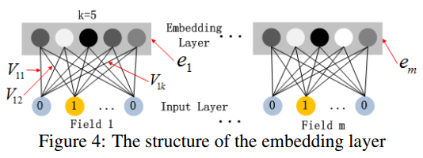   
    * 입력 계층 ~ 임베딩 계층, 하위 네트워크 구조  
    * 특징(2):  
      * 1) 입력 필드 벡터의 길이 달라도 > 임베딩 동일한 크기(k)   
      * 2) 입력 필드 벡터를 임베딩 벡터로 압축 네트워크 가중치 역할: FM 잠재 feature 벡터(V: 사전학습, 초기화로 사용됨)  
    * 전체 학습 아키텍처의 일부로 FM 모델을 포함(DNN):  
      * FM에 의한 사전 교육 필요 X >> 전체 네트워크 종단간 jointly 교육     

* 임베딩 레이어 출력  
  * .PNG)   
    *  : i번째 필드 임베딩  
    * m: 필드 수  
    * 심층 신경망에 입력 전달 프로세스 >      
  * .PNG)   
    * l: 레이어 깊이  
    * σ: 활성화 함수  
    *  : l번째 레이어 출력, 모델 가중치, 편향  
    * => 결과: 고밀도 실수 feature 벡터 > 시그모이드 함수 입력 > 
  *       
    * |H|: hidden layers 수  

* FM 컴포넌트 + 딥 컴포넌트 동일 feature 임베딩 공유 이점(2):  
  * 1) raw feature에서 low/high-order feature 상호작용 모두 학습   
  * 2) Wide & Deep처럼 전문 feature 엔지니어링이 필요 X  

#### 2.2 Relationship with Other Neural Networks
* CTR 예측을 위해 제안된 DeepFM v.s 기존 딥 모델  
  * 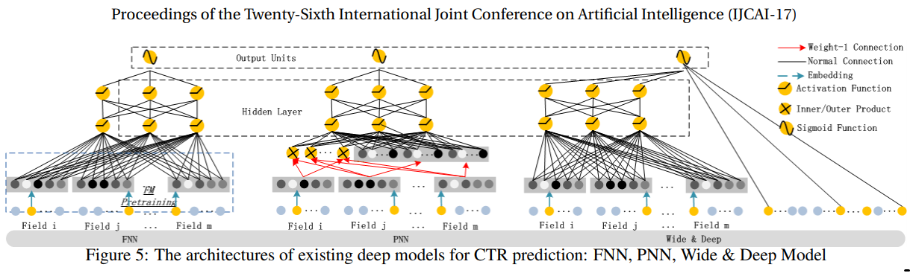  

##### FNN
* FM-initialized feedforward neural network  
  * 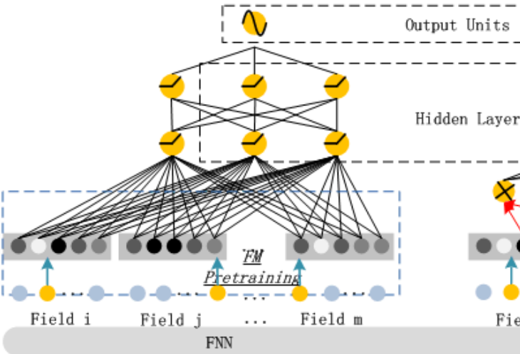   
* 사전 훈련 전략에 따른 제한(2):  
  * 1) 임베딩 매개변수가 FM에 영향 ↑↑   
  * 2) 오버 헤드 > 효율성 ↓  
* high-order feature 상호작용만 캡처  
* DeepFM: 사전 교육 필요 X, 고차-저차 상호작용 모두 학습 가능  

##### PNN
* 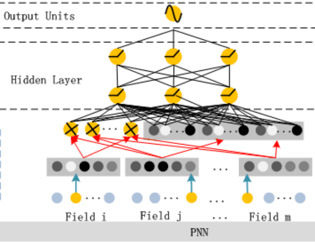 
* embedding layer > *product layer* > first hidden layer: high-order feature 상호작용 캡처     
* product layer 타입에 따른 변형(3):  
  * IPNN: 벡터 내적 기반  
  * OPNN: 외적(outer product) 기반  
  * PNN*: 내적/외적 모두 기반  
* low-order feature 상호작용 무시  

##### Wide & Deep
* low-/high-order feature 상호작용 동시 모델링   
* 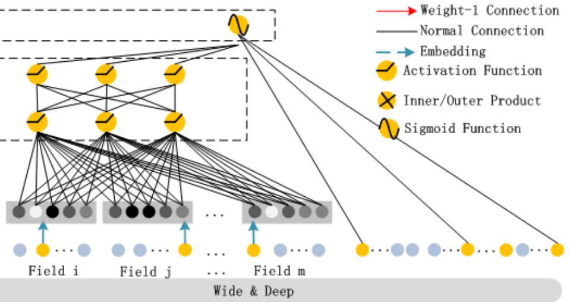  
* Wide: 전문 feature 엔지니어링 필요  
* DeepFM: 전문 지식 필요 X, raw features 직접 학습, FM/딥 - 임베딩 Feature 공유(backpropagate) > feature representation ↑         
  
##### Summarizations
* 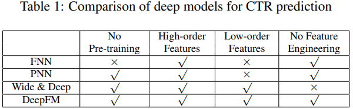  

---

### 3. Experiments
#### 3.1 Experiment Setup Datasets
* Dataset(2): Criteo, Company  
* Evaluation Metrics: AUC, Logloss(cross entropy)  
* Model Comparison(9): LR, FM, FNN, PNN(3), Wide&Deep(2: LR&DNN, FM&DNN), DeepFM  
* Parameter Settings:  
  * dropout(0.5), 네트워크 구조(400-400-400), optimizer(LR-FTRL, others-Adam), 활성화함수(tanh-IPNN, relu-other), FM 잠재차원(10)    

#### 3.2 Performance Evaluation
##### Efficiency Comparison 
* 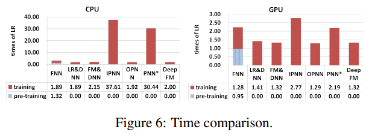   
  * 공식: 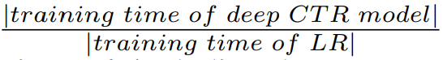   
    * 1) FNN 사전 훈련 > 효율성 ↓  
    * 2) (GPU) IPNN/PNN* 속도 ↑ , 계산비용 ↓ (비효율적 내적)  
    * 3) DeepFM 거의 가장 효율적  

##### Effectiveness Comparison
* 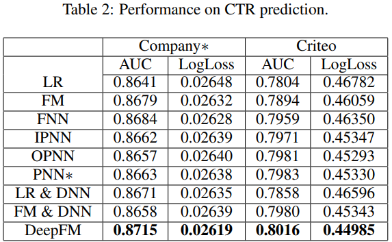 
  * 5 회 교육 테스트 실행의 평균(AUC, Logloss 분산)   
  * 1) 학습 feature 상호작용 > CTR 예측 모델 성능 ↑   
    * LR(feature 상호작용 고려X 유일한 모델) > 성능 ↓  
  * 2) high-/low-order feature 상호작용 동시 학습 > CTR 예측 모델 성능 ↑   
    * DeepFM > (low only) FM / (high only) FNN, IPNN, OPNN, PNN*  
  * 3) 동일 feature 임베딩 공유 > high-/low-order feature 상호작용 동시 학습 > CTR 예측 모델 성능 ↑    
    * DeepFM > (별도 feature 임베딩) LR & DNN, FM & DNN  

#### 3.3 Hyper-Parameter Study
* 하이퍼파라미터 영향 연구 순서:    
  * 1) 활성화 함수  
    * (deep) relu(희소성 유발)/tanh > sigmoid  
    * 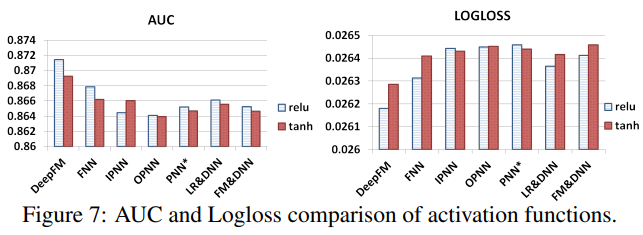 
  * 2) dropout rate: 뉴런이 네트워크에 유지될 확률, 정규화 기술(정밀도/복잡성 ↓)   
    * 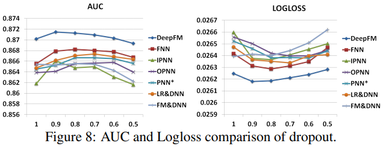 
      * 0.6 ~ 0.9 적정  
  * 3) 뉴런 수/layer: 뉴런 수 ∝ 복잡도, 복잡도 ↑ > overfitting      
    * 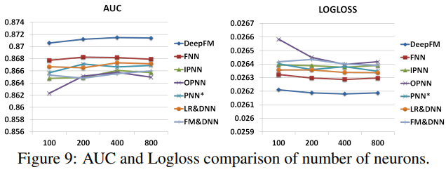  
      * 200 / 400 적정  
  * 4) hidden layers 수  
    * 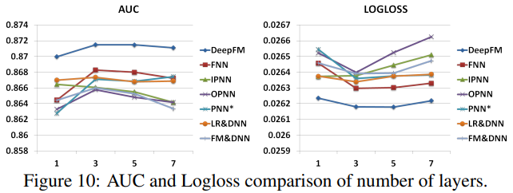   
  * 5) network shape: constant, increasing, decreasing, diamond    
    * 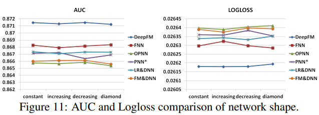   
      * constant 네트워크 모양 경험적으로 더 나음  

---
