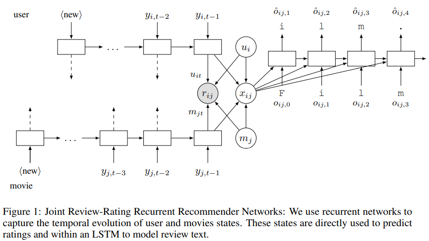
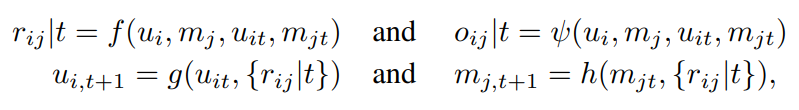
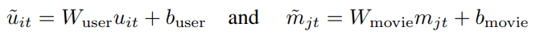
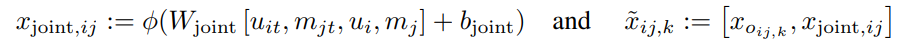
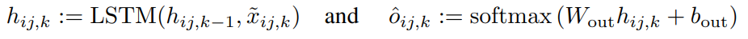
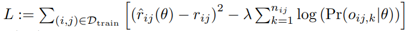

## 2017_JT_RRN [JOINT TRAINING OF RATINGS AND REVIEWS WITH RECURRENT RECOMMENDER NETWORKS]

---

### ABSTRACT
* ratings + reviews + temporal patterns => NN 모델  
  * recurrent architecture: user/itme dynamic components states   
  * numerical ratings + NL(natural language) reviews  

---

### 1. INTRODUCTION
* 목표: 이전 데이터 & 리뷰 DB > 특정 사용자 항목 선호도 예측  

* 이전 연구(bag-of-words 모델)의 한계(2):  
  * 1) 예측 정확도: 미래 등급 예측으로 거의 측정 X  
    * 무작위 분할된 데이터에서 평가 > 모델 유용성 이해 훼손  
    * 리뷰 시간적 패턴 탐구 ↓  
  * 2) 추천 시스템 리뷰 모델 기술(리뷰 이해 ↓) < 자연어 처리 최신 기술  
    * 리뷰: 일반 문서보다 다양, 구조화 X  
* LSTM, RNN 결합 제안  
  * Joint generative model: 상호작용 반복 네트워크(특히 LSTM) > 평가/리뷰 공동 모델 제안  
  * Nonlinear nonparametric review model: 사용자, 영화 state dynamics 함수 학습, 시간 경과에 따른 리뷰 진화 캡처    

---

### 2. MODEL
* Joint Review-Rating Recurrent Recommender Network
  *   
    * 입력: user/movie history  
    * 알고리즘: LSTM/RNNs  
    * user/movie states temporal dynamics 캡처  

 

  * generator functions  
  * 
    * (input) i: user / j: movie의 고정/동적 상태(stationary and dynamic states)  
    * (output) time step(t),   
      * : 등급  
      * : 리뷰  
    * : 고정 상태  
    * : t에서 동적 상태   
    * states 직접 학습 X -> states 찾는 *함수* 학습   

#### Dynamic User and Movie State    
* 입력: user/movie rating history > states update   
* user-state RNN 각 단계, 네트워크:   
  *     

    * : rating vector    
      * j-th 요소: 시간 t, 영화 j 사용자 등급; 없으면 0    
    * : indicator for new users    
    * : wall-clock time    
* state update    
  * 표준   
    * user index 생략  

#### Rating Emissions 
* 프로파일 벡터  
  * 시간에 따라 변화($ u_{it}, m_{jt} $) > [보완] > 고정()<encode> > 시간 불변 속성(사용자 장기적 선호, 영화 장르)  
    * ∴ review rating: dynamic and stationary states 함수로 모델링  
    * .PNG)  
      * : 의 affine functions  
        *   

#### Review Text Model  
* Review text: character-level LSTM network  
  * 동일한 user/movie latent states, rating model 공유  
* : 병목 레이어; 영화/사용자 동적 상태 + 고정 상태  
  *   
    * : 사용자 i, 영화 j 의 리뷰 k 위치 문자  
    * : 문자 embedding    
    * φ: 비선형 함수  

* review text emission model ≒    
  * RNN, character-level LSTM generative model   
  *   
    * softmax: LSTM 출력; 다음 문자 예측  

#### Training & Prediction 
* 목표: ratings, reviews 예측; 
  * (min)      
    * : (i, j) 쌍 학습셋  
    * θ: 모든 모델 파라미터  
    * : 사용자(i)가 영화(j)에 제공하는 리뷰 문자 수  
    * λ: 가중치 제어  
* [prediction time] 예측된 미래 상태 기반 등급 예측(≠ 기존 접근법)   
  * 최신 등급(입력) > 상태 업데이트 > 등급 예측    
  
---

### 3. EXPERIMENTS
* dataset: IMDb   
* model:   
  * PMF(Mnih & Salakhutdinov, 2007)  
  * Time-SVD++(Koren, 2010); the state-of-the-art temporal model  
  * AutoRec(Sedhain et al., 2015); state-of-the-art neural network-based model  

#### Rating prediction 
*     
  * joint-modeling ratings and reviews > rating-only RRN  
    * 평점과 리뷰간에 통계적 강도 공유; 리뷰> 잠재요인 추정 ↑  

#### Text modeling 
* 난이도가 향상됨; 

---