## 2017_Neural_CF [Neural Collaborative Filtering]

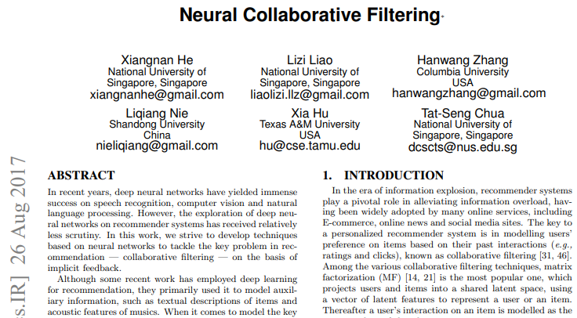

---

### ABSTRACT    
* implicit feedback, 협업 필터링 문제 해결 위한 신경망  
* 협업 필터링: user item 상호작용-MF/잠재 특성-내적(dot product) 의존  
* **NCF**(Neural networkbased Collaborative Filtering): 내적 신경 아키텍처로 대체한 프레임워크 제안  
  * 일반적, MF 표현 가능, 비선형성, MLP로 user-item 상호작용 학습  

---

### Keywords  
* Collaborative Filtering, Neural Networks, Deep Learning, Matrix Factorization, Implicit Feedback
---

### 1. INTRODUCTION  
* 개인화 된 추천 시스템의 핵심: 협업 필터링(과거 상호 작용)> item에 대한 user의 선호도를 모델링  
  * 협업 필터링 기술
    * MF: user item latent space 투영(project)> 잠재 특징 벡터> 내적 = user item 상호작용    
      * MF 향상: neighbor-based 모델과 통합, 항목 콘텐츠의 topic model 과 결합, features 모델링을 위해 factorization machines  
      * inner product로 인한 성능 저하 가능성 존재: 복잡한 구조를 캡처하는데 충분치 않을 수 있음  

* 신경망: 수작업 아닌 데이터에서 상호작용 학습        
  * DNN: (보조 정보) item의 텍스트 설명, 음악의 오디오 기능, 이미지의 시각적 콘텐츠 등=> 여전히 MF 사용(내적으로 user item 잠재 피쳐 벡터 결합)     

* explicit feedback  
  * 자동 추적(수집 용이), 사용자 선호도 간접 반영(만족도 관찰X), 부정적 피드백 부족  

* 목표: DNN 활용 잡음 있는 암시적 피드백 모델링  
  * 1. NCF 고안: 신경망 기반 CF 일반 프레임워크   
  * 2. MPL 활용  

---

### 2. PRELIMINARIES  
#### 2.1 Learning from Implicit Data  
* 사용자 암시적 피드백 , user item 상호 작용 행렬 Y   
*   

  * M: 사용자 수  
  * N: 항목 수  
* 사용자 u, 항목 i 상호작용   

  * 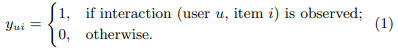  
    * 상호작용 ≠ 선호도  
    * 암시적 데이터(noisy signals) => 관찰X/결측치 존재 => 부정적 피드백 부족    

* 관찰되지 않은 항목 점수 추정 문제(추상화)  
  * 접근: Model-based approaches  
    * 가정: 데이터가 기본 모델에 의해 생성/설명  
  *     

    * : 상호 작용 예측 점수  
    * Θ: 모델 매개 변수  
    * f: 모델 매개 변수를 예측 점수 함수(상호 작용 함수)  
  * Θ 추정 접근 방식: 목적함수 최적화하는 기계 학습 사용   

* 목적함수(2)  
  * 점 손실(pointwise loss): 제곱 오차 최소화(회귀)  
    *      
    * 관찰X: 부정 간주  
  * 쌍 손실(pairwise loss): 관찰 항목 순위 > 관찰 X 항목 순위 => 여백 최대화  
    *        

 

* NCF: 상호작용 함수 f 매개 변수화  
  * pointwise/pairwise loss 모두 지원  

#### 2.2 Matrix Factorization   
* MF: user item < (연결) > 잠재 피쳐 실수 값 벡터   
*  = 상호작용  = 잠재벡터 내적  
  * 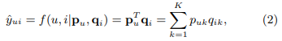  
    * user, item 잠재 벡터: , 
    * K: 잠재 공간 차원  
  * 가정: 양방향 상호 작용 모델링(two-way interaction) => **선형 모델**   
    * 잠재 공간의 각 차원이 서로 독립(independent)  
    * 동일한 가중치로 선형 결합(linearly combining with same weight)   

* MF(내적) 표현 한계: 단순하고 고정된 내적으로 저차원 잠재 벡터 공간에서 사용자 항목간의 복잡한 상호작용 추정 시 제한 존재
  * 설정(2)   
    * 1. user item 동일 잠재 공간 매핑, 두 사용자 간 유사성 = 내적(코사인) 측정  
    * 2. 자카드 지수(Jaccard coefficient)를 두 사용자의 근거 유사성(groundtruth similarity)으로 사용  
  * 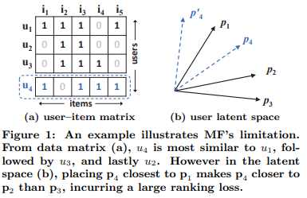   
    * (a) 사용자 간 유사성 s23(0.66) > s12(0.5) > s13(0.4)  
    * (b) 잠재공간에서 p1, p2, p3 관계 표현   
    * user4 예측
      * (a) s41(0.6)> s43(0.4)> s42(0.2): user1과 가장 유사, user2와 가장 거리가 멂       
      * (b) p4를 p1에 가장 가깝게 배치하면 순위 손실 발생   
* 극복: 
  * 1) 많은 수의 잠재 요인 K 사용  
    * 희소 벡터에서 과적합 등 문제 발생  
  * 2) **DNN**  

---

### 3. NEURAL COLLABORATIVE FILTERING(NCF)  
#### 3.1 General Framework  
* 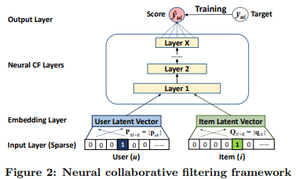   
  * 다중 레이어(아래에서 위로)  
    * 입력 레이어(희소)  
      * : 사용자 u 피쳐 벡터  
      * : 항목 i 피쳐 벡터  
      * 사용자, 항목 ID만 원-핫 입력으로 사용=> 이진 희소 벡터(cold-start 해결 위한 조정 쉬움)  
    * 임베딩 레이어 => 사용자 (항목)에 대한 잠재 벡터     
      * 희소 표현 -> dense vector 투영 => 완전 연결 계층(a fully connected layer)  
    * 신경 협업 필터링 레이어: 예측 점수에 매핑  
      * 사용자-항목 상호 작용의 특정 잠재 구조를 발견  
      * Layer X: model’s capability 결정  
    * 출력 레이어: 예측 점수()  
    * 점별 손실 최소화:    
     
* *다른 모델 훈련 방법:* 쌍별 학습(베이지안 개인화 순위, 마진 기반 손실을 사용)  

 

* NCF 예측 모델 공식화  
  * 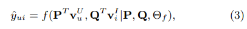   
    * 사용자 잠재 인자 행렬:   
    * 항목 잠재 인자 행렬:    
    * : 상호 작용 **함수 f**의 모델 매개 변수  

     

    * 함수 f: 다층 신경망, X개의 NCF 레이어로 구성  
      * 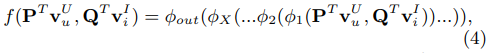   
        * : 출력 레이어 매핑 함수    
        * : x번째 NCF 레이어 매핑 함수   

##### 3.1.1 Learning NCF  
* 점별 방법: 회귀(오차 제곱)  
  * 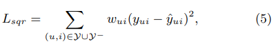    
    * : 에서 관찰된 상호 작용 집합  
    * : 관찰되지 않은 모든 상호 작용(negative instances set)   
    * : (u, i) 가중치, 하이퍼파라미터

 

  * 한계: 암시적 데이터의 경우 가 이진화 된 0/1 로 u, i 상호작용 여부만 나타냄    

* 확률적 접근방식  
  * : 레이블, 1=관련 있음 0=관련 없음  
  * : i u 관련 예측 점수  

*  범위 제한  
  * [0, 1]: NCF 확률적 설명(e.g., the Logistic or Probit function)  

* min(NCF 목적함수) = 우도함수 + 음의 로그, 최적화(SGD)  
  * 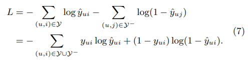    
    * binary cross-entropy loss -> 이진 분류 문제로 사용  

#### 3.2 Generalized Matrix Factorization (GMF)  
* MF: NCF 프레임워크의 특별한 경우로 해석    
  * NCF 대규모 factorization models군 모방  

* 임베딩 벡터: <- 입력 레이어(원-핫), 사용자/항목 잠재 벡터      
  * : 사용자 잠재 벡터 =>   
  * : 항목 잠재 벡터 =>    

* 첫번째 NCF 레이어 매핑 함수  
  * 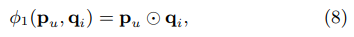    
    * : 벡터의 요소 별 곱> 출력 레이어에 투영  
  * 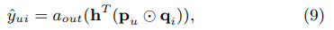    
    * :출력 레이어 활성화 함수   
    * h: 출력 레이어 edge 가중치 
  * (9)를 MF 모델로 복구  
    *  = 항등함수  
    * h = 1(균일 벡터)  

* 쉽게 일반화/확장 가능=> GMF    

#### 3.3 Multi-Layer Perceptron (MLP)  
* 벡터 연결 구조 한계: user - item 간 잠재 피쳐 상호 작용 고쳐 X, CF 효과 모델링에 부족  
* 극복: 표준 MLP: user - item 간 잠재 피쳐 상호 작용 학습, 연결된 벡터에 숨겨진 레이어 추가  
  * 유연성, 비선형성을 부여  

* NCF 프레임워크의 MLP 모델  
  * 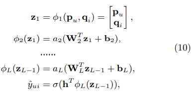    
    * : x번째 레이어 퍼셉트론에 대한 가중치 행렬  
    * : x번째 레이어 퍼셉트론에 대한 바이어스 벡터  
    * : x번째 레이어 퍼셉트론에 대한 활성화 함수(sigmoid, tanh => ReLU)  

* 네트워크 구조 설계: tower pattern(하단 레이어가 가장 넓고 점점 적은 뉴런 배치) => 추상화  

#### 3.4 Fusion of GMF and MLP  
* NCF 인스턴스(2)  
  * GMF: 선형 커널, 잠재 피쳐 상호 작용을 모델링  
  * MLP: 비선형 커널, 데이터에서 상호 작용 함수를 학습  

* NeuMF = GMF(선형) + MLP(비선형)   
  * 1) 동일한 임베딩 레이어 공유
    * .PNG)    
    * 성능 제한: 최적 임베팅 크기가 달라 최적의 앙상블 얻지 X    
  * 2) 상호 작용 함수의 출력을 결합  
    * .PNG)      
      * : GMF 사용자 임베딩  
      * : MLP 사용자 임베딩  
  * 매개변수: back-propagation로 계산  

##### 3.4.1 Pre-training  
* NeuMF 초기화: 사전 훈련 된 GMF / MLP 사용  
  * 1. 수렴 될 때까지 무작위 초기화로 GMF와 MLP를 훈련  
  * 2. 해당 모델 매개 변수를 NeuMF 매개 변수의 해당 부분에 대한 초기화로 사용  
  * 3. 출력 레이어에서 가중치 조정  
    * .PNG)     
      * : 사전 훈련된 GMF 모델 h 벡터  
      * : 사전 훈련된 MLP 모델 h 벡터   
      * : 사전 학습 된 두 모델 간의 절충을 결정하는 하이퍼 파라미터    
  * 4. 최적화: Adam  
  * 5. 사전 훈련 된 매개 변수를 NeuMF에 입력
  * 6. 최적화: vanilla SGD    

---

### 4. EXPERIMENTS  
#### 4.1 Experimental Settings  
* datasets: MovieLens, Pinterest     
* 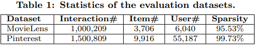    

#### 4.2 Performance Comparison (RQ1)  
* RQ1. NCF 가 stateof-the-art implicit CF 능가?
* 1. NeuMF > stateof-the-art implicit CF(eALS, BPR)   
* 2. GMF/MLP 약간 낮은 성능을 보이나 MLP(3)는 층을 추가하여 향상 가능  

* 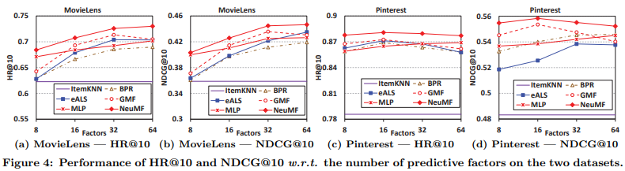     
* 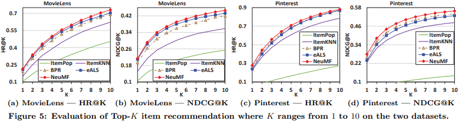     

##### 4.2.1 Utility of Pre-training  
* 사전 훈련 NeuMF 대부분 성능 ↑  
* 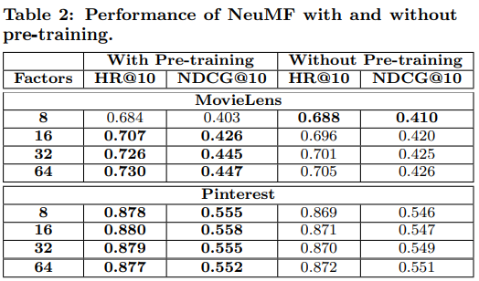    

#### 4.3 Log Loss with Negative Sampling (RQ2)  
* RQ2. 제안 된 최적화 프레임워크(네거티브 샘플링을 사용한 로그 손실)가 추천 작업에 어떻게 작동?

* 1. 반복 횟수 ↑ > NCF 모델의 학습 손실 ↓ > 추천 성능 ↑  
  * 적정 넘어서면 과적합  
* 2. 훈련 손실 적은 순/권장 성능 순: NeuMF > MLP > GMF  

* 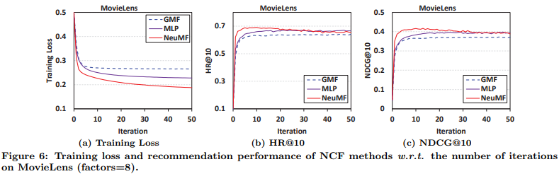     
* 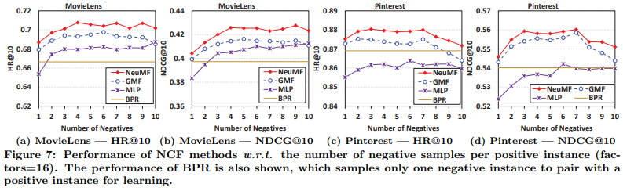     

#### 4.4 Is Deep Learning Helpful? (RQ3)  
* RQ3. 은닉 유닛의 더 깊은 계층이 사용자 항목 상호 작용 데이터에서 학습하는 데 도움?
* 더 많은 레이어를 쌓는 것이 성능에 도움  

* 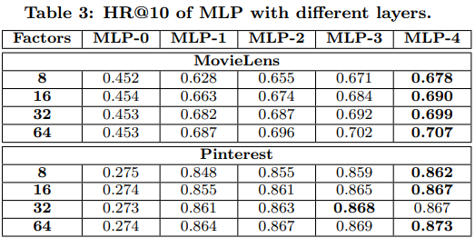  
* 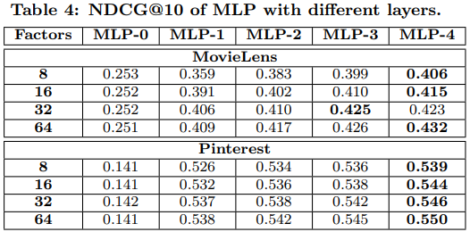  

---

### 5. RELATED WORK  
* implicit data > explicit feedback  
* missing data  
  * implicit - ignored  
  * explicit - 균일 가중치, 부정적인 인스턴스/샘플링  
  * 가중치를 부여하는 전용 모델을 제안  
  * implicit coordinate descent (iCD) solution  
* 신경망    
  * 2 계층 RBM (Restricted Boltzmann Machine)  
  * autoencoders  
    * 사용자 기반 AutoRec  
    * DAE(denoising autoencoder): 의도적으로 손상된 입력으로부터 학습  
  * DNN 학습 <- CF + MF  
    * CF 용 CDAE(Collaborative denoising autoencoder): 사용자 노드를 자동 인코더 입력에 추가로 연결  
* Google: Wide & Deep Learning  

---