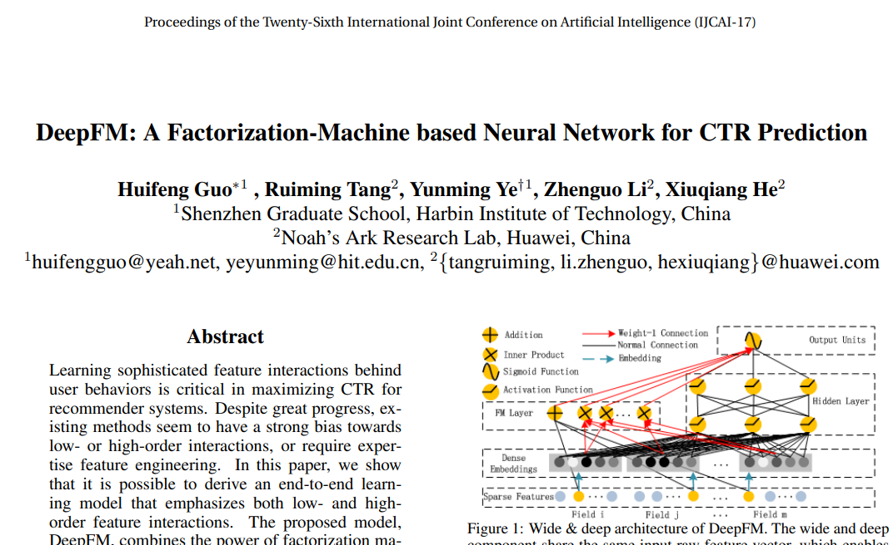

## 2017_arXiv_DeepFM [DeepFM: A Factorization-Machine based Neural Network for CTR Prediction]

---
### Abstract  
* 추천시스템: CTR 최대화  

Despite great progress, existing methods seem to have a strong bias towards low- or high-order interactions, or require expertise feature engineering. 
큰 발전에도 불구하고 기존 방법은 저차 또는 고차 상호 작용에 대한 강한 편견을 가지고 있거나 전문 기능 엔지니어링이 필요한 것 같습니다.

In this paper, we show that it is possible to derive an end-to-end learning model that emphasizes both low- and highorder feature interactions. 
이 논문에서 우리는 하위 및 상위 기능 상호 작용을 모두 강조하는 종단 간 학습 모델을 도출 할 수 있음을 보여줍니다.

The proposed model, DeepFM, combines the power of factorization machines for recommendation and deep learning for feature learning in a new neural network architecture. 
제안 된 모델 인 DeepFM은 새로운 신경망 아키텍처에서 기능 학습을위한 추천 및 딥 러닝을위한 인수 분해 기계의 힘을 결합합니다.

Compared to the latest Wide & Deep model from Google, DeepFM has a shared input to its “wide” and “deep” parts, with no need of feature engineering besides raw features. 
Google의 최신 Wide & Deep 모델과 비교하여 DeepFM은 원시 기능 외에 기능 엔지니어링이 필요없이 "와이드"및 "딥"부분에 대한 공유 입력을 가지고 있습니다.

Comprehensive experiments are conducted to demonstrate the effectiveness and efficiency of DeepFM over the existing models for CTR prediction, on both benchmark data and commercial data. 
벤치 마크 데이터와 상업 데이터 모두에서 CTR 예측을위한 기존 모델에 비해 DeepFM의 효과와 효율성을 입증하기 위해 포괄적 인 실험이 수행됩니다.

---

### 1. Introduction

The prediction of click-through rate (CTR) is critical in recommender system, where the task is to estimate the probability a user will click on a recommended item. 
클릭률 (CTR) 예측은 사용자가 추천 항목을 클릭 할 확률을 추정하는 추천 시스템에서 매우 중요합니다.

In many recommender systems the goal is to maximize the number of clicks, so the items returned to a user should be ranked by estimated CTR; while in other application scenarios such as online advertising it is also important to improve revenue, so the ranking strategy can be adjusted as CTR×bid across all candidates, where “bid” is the benefit the system receives if the item is clicked by a user. 
많은 추천 시스템에서 목표는 클릭 수를 최대화하는 것이므로 사용자에게 반환되는 항목은 예상 CTR에 따라 순위가 지정되어야합니다. 온라인 광고와 같은 다른 애플리케이션 시나리오에서는 수익을 개선하는 것도 중요하므로 순위 전략을 모든 후보에 대해 CTR × bid로 조정할 수 있습니다. 여기서 "입찰"은 사용자가 항목을 클릭 할 경우 시스템이받는 혜택입니다. .

In either case, it is clear that the key is in estimating CTR correctly.
두 경우 모두 CTR을 올바르게 추정하는 데 핵심이 있음이 분명합니다.

It is important for CTR prediction to learn implicit feature interactions behind user click behaviors. 
CTR 예측은 사용자 클릭 동작 뒤에있는 암시 적 기능 상호 작용을 학습하는 것이 중요합니다.

By our study in a mainstream apps market, we found that people often download apps for food delivery at meal-time, suggesting that the (order-2) interaction between app category and time-stamp can be used as a signal for CTR. 
주류 앱 시장을 대상으로 한 연구에 따르면 사람들은 식사 시간에 음식 배달용 앱을 다운로드하는 경우가 많으며 앱 카테고리와 타임 스탬프 간의 (주문 -2) 상호 작용이 CTR의 신호로 사용될 수 있음을 시사합니다.

As a second observation, male teenagers like shooting games and RPG games, which means that the (order-3) interaction of app category, user gender and age is another signal for CTR. 
두 번째 관찰로, 슈팅 게임과 RPG 게임을 좋아하는 남성 청소년은 앱 카테고리, 사용자 성별 및 연령의 (3 차) 상호 작용이 CTR의 또 다른 신호임을 ​​의미합니다.

In general, such interactions of features behind user click behaviors can be highly sophisticated, where both low- and high-order feature interactions should play important roles. 
일반적으로 사용자 클릭 동작 뒤에있는 기능의 이러한 상호 작용은 매우 정교 할 수 있으며, 여기서 하위 및 상위 기능 상호 작용이 모두 중요한 역할을해야합니다.

According to the insights of the Wide & Deep model [Cheng et al., 2016] from google, considering low- and high-order feature interactions simultaneously brings additional improvement over the cases of considering either alone.
Google의 Wide & Deep 모델 [Cheng et al., 2016]의 통찰에 따르면 저차 및 고차 기능 상호 작용을 동시에 고려하면 둘 중 하나만 고려하는 경우에 추가 개선이 이루어집니다.

The key challenge is in effectively modeling feature interactions. 
핵심 과제는 기능 상호 작용을 효과적으로 모델링하는 것입니다.

Some feature interactions can be easily understood, thus can be designed by experts (like the instances above).
일부 기능 상호 작용은 쉽게 이해할 수 있으므로 위의 사례와 같이 전문가가 설계 할 수 있습니다.

However, most other feature interactions are hidden in data and difficult to identify a priori (for instance, the classic association rule “diaper and beer” is mined from data, instead of discovering by experts), which can only be captured automatically by machine learning. 
그러나 대부분의 다른 기능 상호 작용은 데이터에 숨겨져있어 사전 식별이 어렵습니다 (예 : 고전적인 연관 규칙 "기저귀와 맥주"는 전문가가 발견하는 대신 데이터에서 채굴 됨). 이는 기계 학습을 통해서만 자동으로 캡처 할 수 있습니다. .

Even for easy-to-understand interactions, it seems unlikely for experts to model them exhaustively, especially when the number of features is large. 
이해하기 쉬운 상호 작용의 경우에도 전문가가이를 철저하게 모델링하기는 어려울 것 같습니다. 특히 기능 수가 많은 경우에는 더욱 그렇습니다.

Despite their simplicity, generalized linear models, such as FTRL [McMahan et al., 2013], have shown decent performance in practice. 
단순성에도 불구하고 FTRL [McMahan et al., 2013]과 같은 일반화 된 선형 모델은 실제로 괜찮은 성능을 보여주었습니다.

However, a linear model lacks the ability to learn feature interactions, and a common practice is to manually include pairwise feature interactions in its feature vector. 
그러나 선형 모델에는 기능 상호 작용을 학습하는 기능이 없으며 일반적인 관행은 기능 벡터에 쌍별 기능 상호 작용을 수동으로 포함하는 것입니다.

Such a method is hard to generalize to model high-order feature interactions or those never or rarely appear in the training data [Rendle, 2010]. 
이러한 방법은 고차 기능 상호 작용 또는 훈련 데이터에 나타나지 않거나 거의 나타나지 않는 상호 작용을 모델링하기 위해 일반화하기 어렵습니다 [Rendle, 2010].

Factorization Machines (FM) [Rendle, 2010] model pairwise feature interactions as inner product of latent vectors between features and show very promising results. 
Factorization Machines (FM) [Rendle, 2010]은 쌍별 특징 상호 작용을 특징 간 잠재 벡터의 내적 제품으로 모델링하고 매우 유망한 결과를 보여줍니다.

While in principle FM can model high-order feature interaction, in practice usually only order2 feature interactions are considered due to high complexity. 
원칙적으로 FM은 고차 기능 상호 작용을 모델링 할 수 있지만 실제로는 높은 복잡성으로 인해 일반적으로 order2 기능 상호 작용 만 고려됩니다.

As a powerful approach to learning feature representation, deep neural networks have the potential to learn sophisticated feature interactions. 
특징 표현 학습에 대한 강력한 접근 방식으로 심층 신경망은 정교한 특징 상호 작용을 학습 할 수있는 잠재력을 가지고 있습니다.

Some ideas extend CNN and RNN for CTR predition [Liu et al., 2015; Zhang et al., 2014], but CNN-based models are biased to the interactions between neighboring features while RNN-based models are more suitable for click data with sequential dependency. 
일부 아이디어는 CTR 포식을 위해 CNN과 RNN을 확장합니다 [Liu et al., 2015; Zhang et al., 2014], 그러나 CNN 기반 모델은 인접 기능 간의 상호 작용에 편향되는 반면 RNN 기반 모델은 순차 종속성이있는 클릭 데이터에 더 적합합니다.

[Zhang et al., 2016] studies feature representations and proposes Factorization-machine supported Neural Network (FNN). 
[Zhang et al., 2016]은 특징 표현을 연구하고 Factorization-machine 지원 신경망 (FNN)을 제안합니다.

This model pre-trains FM before applying DNN, thus limited by the capability of FM. 
이 모델은 DNN을 적용하기 전에 FM을 사전 훈련하므로 FM의 기능에 의해 제한됩니다.

Feature interaction is studied in [Qu et al., 2016], by introducing a product layer between embedding layer and fully-connected layer, and proposing the Product-based Neural Network (PNN). 
기능 상호 작용은 [Qu et al., 2016]에서 임베딩 레이어와 완전 연결 레이어 사이에 제품 레이어를 도입하고 제품 기반 신경망 (PNN)을 제안함으로써 연구되었습니다.

As noted in [Cheng et al., 2016], PNN and FNN, like other deep models, capture little low-order feature interactions, which are also essential for CTR prediction. 
[Cheng et al., 2016]에서 언급했듯이 PNN과 FNN은 다른 심층 모델과 마찬가지로 CTR 예측에도 필수적인 저차 기능 상호 작용을 거의 캡처하지 않습니다.

To model both lowand high-order feature interactions, [Cheng et al., 2016] proposes an interesting hybrid network structure (Wide & Deep) that combines a linear (“wide”) model and a deep model. 
저차 및 고차 기능 상호 작용을 모두 모델링하기 위해 [Cheng et al., 2016]은 선형 ( "와이드") 모델과 심층 모델을 결합한 흥미로운 하이브리드 네트워크 구조 (Wide & Deep)를 제안합니다.

In this model, two different inputs are required for the “wide part” and “deep part”, respectively, and the input of “wide part” still relies on expertise feature engineering. 
이 모델에서 "와이드 파트"와 "딥 파트"에 대해 각각 두 가지 다른 입력이 필요하며 "와이드 파트"의 입력은 여전히 ​​전문 기능 엔지니어링에 의존합니다.

One can see that existing models are biased to low- or highorder feature interaction, or rely on feature engineering. 
기존 모델이 하위 또는 상위 기능 상호 작용에 편향되어 있거나 기능 엔지니어링에 의존한다는 것을 알 수 있습니다.

In this paper, we show it is possible to derive a learning model that is able to learn feature interactions of all orders in an endto-end manner, without any feature engineering besides raw features. 
이 논문에서 우리는 원시 기능 외에 어떠한 기능 엔지니어링 없이도 모든 주문의 기능 상호 작용을 엔드 투 엔드 방식으로 학습 할 수있는 학습 모델을 도출 할 수 있음을 보여줍니다.

Our main contributions are summarized as follows:
우리의 주요 기여는 다음과 같이 요약됩니다.

 

• We propose a new neural network model DeepFM (Figure 1) that integrates the architectures of FM and deep neural networks (DNN). 
• FM과 딥 신경망 (DNN)의 아키텍처를 통합하는 새로운 신경망 모델 DeepFM (그림 1)을 제안합니다.

It models low-order feature interactions like FM and models high-order feature interactions like DNN. 
FM과 같은 하위 기능 상호 작용을 모델링하고 DNN과 같은 상위 기능 상호 작용을 모델링합니다.

Unlike the wide & deep model [Cheng et al., 2016], DeepFM can be trained endto-end without any feature engineering.
Wide & Deep 모델 [Cheng et al., 2016]과 달리 DeepFM은 기능 엔지니어링없이 엔드 투 엔드 학습이 가능합니다.

• DeepFM can be trained efficiently because its wide part and deep part, unlike [Cheng et al., 2016], share the same input and also the embedding vector. 
• DeepFM은 [Cheng et al., 2016]과 달리 넓은 부분과 깊은 부분이 동일한 입력과 임베딩 벡터를 공유하므로 효율적으로 훈련 할 수 있습니다.

In [Cheng et al., 2016], the input vector can be of huge size as it includes manually designed pairwise feature interactions in the input vector of its wide part, which also greatly increases its complexity.
[Cheng et al., 2016]에서 입력 벡터는 넓은 부분의 입력 벡터에 수동으로 설계된 쌍별 특징 상호 작용을 포함하므로 크기가 매우 클 수 있으며, 이는 복잡성도 크게 증가시킵니다.

• We evaluate DeepFM on both benchmark data and commercial data, which shows consistent improvement over existing models for CTR prediction.
• 벤치 마크 데이터와 상용 데이터 모두에서 DeepFM을 평가하여 CTR 예측을 위해 기존 모델보다 일관된 개선을 보여줍니다..

---

### 2. Our Approach

Suppose the data set for training consists of n instances (χ, y), where χ is an m-fields data record usually involving a pair of user and item, and y ∈ {0, 1} is the associated label indicating user click behaviors (y = 1 means the user clicked the item, and y = 0 otherwise). 
학습용 데이터 세트가 n 개의 인스턴스 (χ, y)로 구성되어 있다고 가정합니다. 여기서 χ는 일반적으로 한 쌍의 사용자와 항목을 포함하는 m- 필드 데이터 레코드이고 y ∈ {0, 1}은 사용자 클릭 동작을 나타내는 관련 레이블입니다. (y = 1은 사용자가 항목을 클릭했음을 의미하고, 그렇지 않으면 y = 0).

χ may include categorical fields (e.g., gender, location) and continuous fields (e.g., age). 
χ에는 범주 필드 (예 : 성별, 위치) 및 연속 필드 (예 : 연령)가 포함될 수 있습니다.

Each categorical field is represented as a vector of one-hot encoding, and each continuous field is represented as the value itself, or a vector of one-hot encoding after discretization. 
각 범주 형 필드는 원-핫 인코딩의 벡터로 표시되고 각 연속 필드는 값 자체 또는 이산화 후 원-핫 인코딩의 벡터로 표시됩니다.

Then, each instance is converted to (x, y) where x = [xf ield1 , xf ield2 , ..., xf iledj , ..., xf ieldm] is a ddimensional vector, with xf ieldj being the vector representation of the j-th field of χ. 
그런 다음 각 인스턴스는 (x, y)로 변환됩니다. 여기서 x = [xf ield1, xf ield2, ..., xf iledj, ..., xf ieldm]은 d 차원 벡터이며 xf ieldj는 χ의 j 번째 필드.

Normally, x is high-dimensional and extremely sparse. 
일반적으로 x는 고차원이며 극도로 희소합니다.

The task of CTR prediction is to build a prediction model yˆ = CT R model(x) to estimate the probability of a user clicking a specific app in a given context. 
CTR 예측의 임무는 주어진 컨텍스트에서 사용자가 특정 앱을 클릭 할 확률을 추정하기 위해 예측 모델 yˆ = CT R 모델 (x)을 구축하는 것입니다.

#### 2.1 DeepFM
We aim to learn both low- and high-order feature interactions.
우리는 하위 및 상위 기능 상호 작용을 모두 배우는 것을 목표로합니다.

To this end, we propose a Factorization-Machine based neural network (DeepFM). 
이를 위해 우리는 Factorization-Machine 기반 신경망 (DeepFM)을 제안합니다.

 

As depicted in Figure 1 , DeepFM consists of two components, FM component and deep component, that share the same input. 
그림 11에 표시된 것처럼 DeepFM은 동일한 입력을 공유하는 FM 구성 요소와 딥 구성 요소의 두 구성 요소로 구성됩니다.

For feature i, a scalar wi is used to weigh its order-1 importance, a latent vector Vi is used to measure its impact of interactions with other features.
특성 i의 경우 스칼라 wi는 차수 1 중요성을 평가하는 데 사용되며, 잠복 벡터 Vi는 다른 특성과의 상호 작용의 영향을 측정하는 데 사용됩니다.

Vi is fed in FM component to model order-2 feature interactions, and fed in deep component to model high-order feature interactions. 
Vi는 FM 구성 요소에서 주문 2 기능 상호 작용을 모델링하고 깊은 구성 요소를 공급하여 고차 기능 상호 작용을 모델링합니다.

All parameters, including wi, Vi, and the network parameters (W(l), b(l) below) are trained jointly for the combined prediction model:
wi, Vi 및 네트워크 매개 변수 (아래의 W (l), b (l))를 포함한 모든 매개 변수는 결합 된 예측 모델에 대해 공동으로 학습됩니다.

.PNG) 

where yˆ ∈ (0, 1) is the predicted CTR, yFM is the output of FM component, and yDNN is the output of deep component.
여기서 yˆ ∈ (0, 1)은 예측 CTR, yFM은 FM 구성 요소의 출력, yDNN은 깊은 구성 요소의 출력입니다.

The FM component is a factorization machine, which is proposed in [Rendle, 2010] to learn feature interactions for recommendation. 
FM 컴포넌트는 추천을위한 기능 상호 작용을 학습하기 위해 [Rendle, 2010]에서 제안 된 인수 분해 기계입니다.

Besides a linear (order-1) interactions among features, FM models pairwise (order-2) feature interactions as inner product of respective feature latent vectors. 
특성 간의 선형 (차수 -1) 상호 작용 외에도 FM 모델은 쌍별 (차수 -2) 상호 작용을 각 특성 잠재 벡터의 내적로서 특성화합니다.

It can capture order-2 feature interactions much more effectively than previous approaches especially when the dataset is sparse. 
특히 데이터 세트가 드문 경우 이전 접근 방식보다 훨씬 더 효과적으로 2 차 기능 상호 작용을 캡처 할 수 있습니다.

In previous approaches, the parameter of an interaction of features i and j can be trained only when feature i and feature j both appear in the same data record. 
이전 접근 방식에서는 특성 i와 j의 상호 작용 매개 변수는 특성 i와 특성 j가 모두 동일한 데이터 레코드에 나타날 때만 훈련 될 수 있습니다.

While in FM, it is measured via the inner product of their latent vectors Vi and Vj . 
FM에서는 잠복 벡터 Vi 및 Vj의 내적을 통해 측정됩니다.

Thanks to this flexible design, FM can train latent vector Vi (Vj ) whenever i (or j) appears in a data record. 
이 유연한 설계 덕분에 FM은 i (또는 j)가 데이터 레코드에 나타날 때마다 잠복 벡터 Vi (Vj)를 훈련 할 수 있습니다.

Therefore, feature interactions, which are never or rarely appeared in the training data, are better learnt by FM. 
따라서 훈련 데이터에 나타나지 않거나 거의 나타나지 않는 기능 상호 작용은 FM에서 더 잘 학습됩니다.

 

As Figure 2 shows, the output of FM is the summation of an Addition unit and a number of Inner Product units:
그림 2에서 볼 수 있듯이 FM의 출력은 추가 단위와 여러 내부 제품 단위의 합계입니다.

.PNG) 

where w ∈ Rd and Vi ∈ Rk (k is given)2. 
여기서 w ∈ Rd 및 Vi ∈ Rk (k가 주어짐) 2.

The Addition unit (hw, xi) reflects the importance of order-1 features, and the Inner Product units represent the impact of order-2 feature interactions.
덧셈 단위 (hw, xi)는 order-1 기능의 중요성을 반영하고 Inner Product 단위는 order-2 기능 상호 작용의 영향을 나타냅니다.

Deep Component The deep component is a feed-forward neural network, which is used to learn high-order feature interactions. 
심층 구성 요소 심층 구성 요소는 고차 기능 상호 작용을 학습하는 데 사용되는 피드 포워드 신경망입니다.

 

As shown in Figure 3, a data record (a vector) is fed into the neural network. 
그림 3에 표시된 것처럼 데이터 레코드 (벡터)가 신경망에 입력됩니다.

Compared to neural networks with image [He et al., 2016] or audio [Boulanger-Lewandowski et al., 2013] data as input, which is purely continuous and dense, the input of CTR prediction is quite different, which requires a new network architecture design. 
순전히 연속적이고 조밀 한 이미지 [He et al., 2016] 또는 오디오 [Boulanger-Lewandowski et al., 2013] 데이터를 입력으로 사용하는 신경망과 비교할 때 CTR 예측의 입력은 매우 다르며 새로운 네트워크 아키텍처 디자인.

Specifically, the raw feature input vector for CTR prediction is usually highly sparse3, super high-dimensional4 , categorical-continuous-mixed, and grouped in fields (e.g., gender, location, age). 
특히, CTR 예측을위한 원시 특성 입력 벡터는 일반적으로 매우 희소 3, 초고 차원 4, 범주 연속 혼합 및 필드 (예 : 성별, 위치, 연령)로 그룹화됩니다.

This suggests an embedding layer to compress the input vector to a lowdimensional, dense real-value vector before further feeding into the first hidden layer, otherwise the network can be overwhelming to train. 
이것은 첫 번째 은닉층에 추가로 공급하기 전에 입력 벡터를 저 차원의 밀도가 높은 실수 벡터로 압축하는 임베딩 계층을 제안합니다. 그렇지 않으면 네트워크가 훈련하기에 압도적 일 수 있습니다.

 

Figure 4 highlights the sub-network structure from the input layer to the embedding layer. 
그림 4는 입력 계층에서 임베딩 계층까지의 하위 네트워크 구조를 강조합니다.

We would like to point out the two interesting features of this network structure: 1) while the lengths of different input field vectors can be different, their embeddings are of the same size (k); 2) the latent feature vectors (V ) in FM now serve as network weights which are learned and used to compress the input field vectors to the embedding vectors. 
우리는이 네트워크 구조의 두 가지 흥미로운 특징을 지적하고 싶습니다. 1) 다른 입력 필드 벡터의 길이는 다를 수 있지만 임베딩은 동일한 크기 (k)입니다. 2) FM의 잠재 특징 벡터 (V)는 이제 입력 필드 벡터를 임베딩 벡터로 압축하는 데 학습되고 사용되는 네트워크 가중치 역할을합니다.

In [Zhang et al., 2016], V is pre-trained by FM and used as initialization. 
[Zhang et al., 2016]에서 V는 FM에 의해 사전 학습되어 초기화로 사용됩니다.

In this work, rather than using the latent feature vectors of FM to initialize the networks as in [Zhang et al., 2016], we include the FM model as part of our overall learning architecture, in addition to the other DNN model. 
이 작업에서는 [Zhang et al., 2016]에서와 같이 FM의 잠재 특징 벡터를 사용하여 네트워크를 초기화하는 대신 다른 DNN 모델과 함께 전체 학습 아키텍처의 일부로 FM 모델을 포함합니다.

As such, we eliminate the need of pre-training by FM and instead jointly train the overall network in an end-to-end manner. 
따라서 FM에 의한 사전 교육의 필요성을 없애고 대신 전체 네트워크를 종단 간 방식으로 공동 교육합니다.

Denote the output of the embedding layer as:
임베딩 레이어의 출력을 다음과 같이 표시합니다.

.PNG) 

where ei is the embedding of i-th field and m is the number of fields. 
여기서 ei는 i 번째 필드의 임베딩이고 m은 필드의 수입니다.

Then, a (0) is fed into the deep neural network, and the forward process is:
그런 다음 (0)이 심층 신경망에 입력되고 전달 프로세스는 다음과 같습니다.

.PNG) 

where l is the layer depth and σ is an activation function. 
여기서 l은 레이어 깊이이고 σ는 활성화 함수입니다.

a(l), W(l), b(l) are the output, model weight, and bias of the l-th layer. 
a (l), W (l), b (l)은 l 번째 레이어의 출력, 모델 가중치 및 편향입니다.

After that, a dense real-value feature vector is generated, which is finally fed into the sigmoid function for CTR prediction: yDNN = W|H|+1 · a |H| + b |H|+1, where |H| is the number of hidden layers.
그 후, 밀도가 높은 실수 값 특징 벡터가 생성되어 최종적으로 CTR 예측을위한 시그 모이 드 함수에 입력됩니다. yDNN = W | H | +1 · a | H | + b | H | +1, 여기서 | H | 숨겨진 레이어의 수입니다.

It is worth pointing out that FM component and deep component share the same feature embedding, which brings two important benefits: 1) it learns both low- and high-order feature interactions from raw features; 2) there is no need for expertise feature engineering of the input, as required in Wide & Deep [Cheng et al., 2016].
FM 컴포넌트와 딥 컴포넌트는 동일한 기능 임베딩을 공유하므로 두 가지 중요한 이점이 있습니다. 1) 원시 기능에서 하위 및 상위 기능 상호 작용을 모두 학습합니다. 2) Wide & Deep [Cheng et al., 2016]에서 요구하는 것처럼 입력의 전문 기능 엔지니어링이 필요하지 않습니다.

#### 2.2 Relationship with Other Neural Networks

Inspired by the enormous success of deep learning in various applications, several deep models for CTR prediction are developed recently. 
다양한 애플리케이션에서 딥 러닝의 엄청난 성공에 영감을 받아 최근 CTR 예측을위한 몇 가지 딥 모델이 개발되었습니다.

This section compares the proposed DeepFM with existing deep models for CTR prediction.
이 섹션에서는 CTR 예측을 위해 제안 된 DeepFM을 기존 딥 모델과 비교합니다.

FNN

 

As Figure 5 (left) shows, FNN is a FM-initialized feedforward neural network [Zhang et al., 2016]. 
FNN
그림 5 (왼쪽)에서 알 수 있듯이 FNN은 FM 초기화 피드 포워드 신경망입니다 [Zhang et al., 2016].

The FM pretraining strategy results in two limitations: 1) the embedding parameters might be over affected by FM; 2) the efficiency is reduced by the overhead introduced by the pre-training stage.
FM 사전 훈련 전략은 두 가지 제한을 초래합니다. 1) 임베딩 매개 변수가 FM에 의해 과도하게 영향을받을 수 있습니다. 2) 사전 훈련 단계에서 발생하는 오버 헤드로 인해 효율성이 감소합니다.

In addition, FNN captures only high-order feature interactions. 
또한 FNN은 고차 기능 상호 작용 만 캡처합니다.

In contrast, DeepFM needs no pre-training and learns both high- and low-order feature interactions.
반대로 DeepFM은 사전 교육이 필요하지 않으며 고차 및 저차 기능 상호 작용을 모두 학습합니다.

PNN
For the purpose of capturing high-order feature interactions, PNN imposes a product layer between the embedding layer and the first hidden layer [Qu et al., 2016]. 
PNN
고차 기능 상호 작용을 포착하기 위해 PNN은 임베딩 레이어와 첫 번째 은닉 레이어 사이에 제품 레이어를 부과합니다 [Qu et al., 2016].

According to different types of product operation, there are three variants:
IPNN, OPNN, and PNN∗, where IPNN is based on inner product of vectors, OPNN is based on outer product, and PNN∗ is based on both inner and outer products. 
다양한 유형의 제품 작동에 따라 세 가지 변형이 있습니다.
IPNN, OPNN 및 PNN *, 여기서 IPNN은 벡터의 내적을 기반으로하고, OPNN은 외부 곱을 기반으로하며, PNN *은 내적과 외부 곱을 모두 기반으로합니다.

Like FNN, all PNNs ignore low-order feature interactions.
FNN과 마찬가지로 모든 PNN은 하위 기능 상호 작용을 무시합니다.

Wide & Deep
Wide & Deep (Figure 5 (right)) is proposed by Google to model low- and high-order feature interactions simultaneously. 
넓고 깊은
Wide & Deep (그림 5 (오른쪽))은 Google에서 저차 및 고차 기능 상호 작용을 동시에 모델링하기 위해 제안했습니다.

As shown in [Cheng et al., 2016], there is a need for expertise feature engineering on the input to the “wide” part (for instance, cross-product of users’ install apps and impression apps in app recommendation). 
[Cheng et al., 2016]에서 볼 수 있듯이 '와이드'부분에 대한 입력에 대한 전문 기능 엔지니어링이 필요합니다 (예 : 앱 추천에서 사용자의 설치 앱 및 노출 앱의 교차 제품).

In contrast, DeepFM needs no such expertise knowledge to handle the input by learning directly from the input raw features.
대조적으로 DeepFM은 입력 원시 기능에서 직접 학습하여 입력을 처리하는 데 그러한 전문 지식이 필요하지 않습니다.

A straightforward extension to this model is replacing LR by FM (we also evaluate this extension in Section 3). 
이 모델의 간단한 확장은 LR을 FM으로 대체하는 것입니다 (섹션 3에서도이 확장을 평가합니다).

This extension is similar to DeepFM, but DeepFM shares the feature embedding between the FM and deep component. 
이 확장은 DeepFM과 유사하지만 DeepFM은 FM과 딥 컴포넌트 사이에 임베딩 기능을 공유합니다.

The sharing strategy of feature embedding influences (in backpropagate manner) the feature representation by both lowand high-order feature interactions, which models the representation more precisely.
특징 임베딩의 공유 전략은 (역 전파 방식으로) 저차 및 고차 기능 상호 작용 모두에 의해 특징 표현에 영향을 미치며, 이는 표현을보다 정확하게 모델링합니다.

Summarizations
To summarize, the relationship between DeepFM and the other deep models in four aspects is presented in Table 1. 
요약
요약하면 네 가지 측면에서 DeepFM과 다른 딥 모델 간의 관계가 표 1에 나와 있습니다.

As can be seen, DeepFM is the only model that requires no pretraining and no feature engineering, and captures both lowand high-order feature interactions. 
보시다시피 DeepFM은 사전 훈련과 기능 엔지니어링이 필요하지 않은 유일한 모델이며 하위 및 상위 기능 상호 작용을 모두 캡처합니다.

---

### 3. Experiments
In this section, we compare our proposed DeepFM and the other state-of-the-art models empirically. 
이 섹션에서는 제안 된 DeepFM과 다른 최신 모델을 경험적으로 비교합니다.

The evaluation result indicates that our proposed DeepFM is more effective than any other state-of-the-art model and the efficiency of DeepFM is comparable to the best ones among all the deep models.
평가 결과 우리가 제안한 DeepFM이 다른 최첨단 모델보다 더 효과적이며 DeepFM의 효율성은 모든 딥 모델 중에서 가장 좋은 모델과 비슷하다는 것을 보여줍니다.

#### 3.1 Experiment Setup Datasets

We evaluate the effectiveness and efficiency of our proposed DeepFM on the following two datasets.
다음 두 데이터 세트에서 제안 된 DeepFM의 효과와 효율성을 평가합니다.

1) Criteo Dataset: Criteo dataset includes 45 million users’ click records. 
1) Criteo 데이터 세트 : Criteo 데이터 세트에는 4 천 5 백만 사용자의 클릭 기록이 포함됩니다.

There are 13 continuous features and 26 categorical ones. 
13 개의 연속 특성과 26 개의 범주 특성이 있습니다.

We split the dataset into two parts: 90% is for training, while the rest 10% is for testing.
데이터 세트를 두 부분으로 분할했습니다. 90 %는 학습용이고 나머지 10 %는 테스트 용입니다.

2) Company Dataset: In order to verify the performance of DeepFM in real industrial CTR prediction, we conduct experiment on Company∗ dataset. 
2) 회사 데이터 셋 : 실제 산업 CTR 예측에서 DeepFM의 성능을 검증하기 위해 회사 * 데이터 셋에 대한 실험을 수행합니다.

We collect 7 consecutive days of users’ click records from the game center of the Company∗ App Store for training, and the next 1 day for testing. 
교육을 위해 회사 * 앱 스토어의 게임 센터에서 7 일 연속 사용자 클릭 기록을 수집하고 테스트를 위해 다음 1 일을 수집합니다.

There are around 1 billion records in the whole collected dataset.
수집 된 전체 데이터 세트에는 약 10 억 개의 레코드가 있습니다.

In this dataset, there are app features (e.g., identification, category, and etc), user features (e.g., user’s downloaded apps, and etc), and context features (e.g., operation time, and etc).
이 데이터 세트에는 앱 기능 (예 : 식별, 카테고리 등), 사용자 기능 (예 : 사용자가 다운로드 한 앱 등), 컨텍스트 기능 (예 : 작동 시간 등)이 있습니다.

Evaluation Metrics
We use two evaluation metrics in our experiments: AUC(Area Under ROC) and Logloss (cross entropy).
평가 지표
실험에서 AUC (Area Under ROC)와 Logloss (교차 엔트로피)의 두 가지 평가 메트릭을 사용합니다.

Model Comparison
We compare 9 models in our experiments: LR, FM, FNN, PNN (three variants), Wide & Deep (two variants), and DeepFM. 
모델 비교
실험에서 LR, FM, FNN, PNN (3 가지 변형), Wide & Deep (2 가지 변형) 및 DeepFM의 9 가지 모델을 비교합니다.

In the Wide & Deep model, for the purpose of eliminating feature engineering effort, we also adapt the original Wide & Deep model by replacing LR by FM as the wide part.
Wide & Deep 모델에서는 기능 엔지니어링 노력을 제거하기 위해 LR을 와이드 부품으로 FM으로 대체하여 원래의 Wide & Deep 모델도 적용합니다.

In order to distinguish these two variants of Wide & Deep, we name them LR & DNN and FM & DNN, respectively.
Wide & Deep의이 두 가지 변형을 구별하기 위해 각각 LR & DNN과 FM & DNN으로 이름을 지정합니다.

Parameter Settings
To evaluate the models on Criteo dataset, we follow the parameter settings in [Qu et al., 2016] for FNN and PNN: 
(1) dropout: 0.5; (2) network structure: 400-400-400; (3) optimizer: Adam; (4) activation function: tanh for IPNN, relu for other deep models. 
매개 변수 설정
Criteo 데이터 세트에서 모델을 평가하기 위해 FNN 및 PNN에 대한 [Qu et al., 2016]의 매개 변수 설정을 따릅니다.
(1) 탈락 : 0.5; (2) 네트워크 구조 : 400-400-400; (3) 최적화 : Adam; (4) 활성화 함수 : IPNN의 경우 tanh, 다른 심층 모델의 경우 relu.

To be fair, our proposed DeepFM uses the same setting. 
공정하게 말하면 제안 된 DeepFM은 동일한 설정을 사용합니다.

The optimizers of LR and FM are FTRL and Adam respectively, and the latent dimension of FM is 10. 
LR과 FM의 옵티마이 저는 각각 FTRL과 Adam이고 FM의 잠재 차원은 10입니다.

To achieve the best performance for each individual model on Company∗ dataset, we conducted carefully parameter study, which is discussed in Section 3.3.
Company * 데이터 세트의 각 개별 모델에 대해 최상의 성능을 달성하기 위해 3.3 절에서 논의 된 매개 변수 연구를 신중하게 수행했습니다.

#### 3.2 Performance Evaluation

In this section, we evaluate the models listed in Section 3.1 on the two datasets to compare their effectiveness and efficiency.
이 섹션에서는 효과와 효율성을 비교하기 위해 두 데이터 세트에서 섹션 3.1에 나열된 모델을 평가합니다.

Efficiency Comparison
효율성 비교

The efficiency of deep learning models is important to realworld applications. 
딥 러닝 모델의 효율성은 실제 응용 프로그램에 중요합니다.

We compare the efficiency of different models on Criteo dataset by the following formula: |training time of deep CT R model| |training time of LR|. 
다음 공식에 따라 Criteo 데이터 세트에서 다양한 모델의 효율성을 비교합니다. | 심층 CT R 모델의 훈련 시간 | | LR의 훈련 시간 |.

 

The results are shown in Figure 6, including the tests on CPU (left) and GPU (right), where we have the following observations: 
1) pre-training of FNN makes it less efficient; 
2) Although the speed up of IPNN and PNN∗ on GPU is higher than the other models, they are still computationally expensive because of the inefficient inner product operations; 
3) The DeepFM achieves almost the most efficient in both tests.
결과는 CPU (왼쪽) 및 GPU (오른쪽)에 대한 테스트를 포함하여 그림 6에 나와 있으며 다음과 같은 관찰 결과가 있습니다.
1) FNN의 사전 훈련은 효율성을 떨어 뜨립니다.
2) GPU에서 IPNN 및 PNN *의 속도가 다른 모델보다 높지만 비효율적 인 내부 제품 작업으로 인해 여전히 계산 비용이 많이 듭니다.
3) DeepFM은 두 테스트에서 거의 가장 효율적입니다.

Effectiveness Comparison
The performance for CTR prediction of different models on Criteo dataset and Company∗ dataset is shown in Table 2 (note that the numbers in the table are averaged by 5 runs of training-testing, and the variances of AUC and Logloss are in the order of 1E-5), where we have the following observations:
효과 비교
Criteo 데이터 세트 및 Company * 데이터 세트에 대한 다양한 모델의 CTR 예측 성능은 표 2에 나와 있습니다 (표의 숫자는 5 회 교육 테스트 실행의 평균이며 AUC 및 Logloss의 분산은 다음과 같습니다. 1E-5), 다음과 같은 관찰이 있습니다.

• Learning feature interactions improves the performance of CTR prediction model. 
• 학습 기능 상호 작용은 CTR 예측 모델의 성능을 향상시킵니다.

This observation is from the fact that LR (which is the only model that does not consider feature interactions) performs worse than the other models. 
이 관찰은 LR (특징 상호 작용을 고려하지 않는 유일한 모델)이 다른 모델보다 성능이 나쁘다는 사실에서 비롯됩니다.

As the best model, DeepFM outperforms LR by 0.82% and 2.6% in terms of AUC (1.1% and 4.0% in terms of Logloss) on Company∗ and Criteo datasets.
최고의 모델 인 DeepFM은 Company * 및 Criteo 데이터 세트에서 AUC 측면에서 LR (Logloss 측면에서 1.1 % 및 4.0 %) 측면에서 LR보다 0.82 % 및 2.6 % 우수한 성능을 보입니다.

• Learning high- and low-order feature interactions simultaneously and properly improves the performance of CTR prediction model. 
• 고차 및 저차 기능 상호 작용을 동시에 학습하면 CTR 예측 모델의 성능이 향상됩니다.

DeepFM outperforms the models that learn only low-order feature interactions (namely, FM) or high-order feature interactions (namely, FNN, IPNN, OPNN, PNN∗). 
DeepFM은 하위 기능 상호 작용 (즉, FM) 또는 상위 기능 상호 작용 (즉, FNN, IPNN, OPNN, PNN *) 만 학습하는 모델보다 성능이 뛰어납니다.

Compared to the second best model, DeepFM achieves more than 0.34% and 0.41% in terms of AUC (0.34% and 0.76% in terms of Logloss) on Company∗ and Criteo datasets.
두 번째로 좋은 모델과 비교할 때 DeepFM은 Company * 및 Criteo 데이터 세트에서 AUC (Logloss의 경우 0.34 % 및 0.76 %) 측면에서 0.34 % 및 0.41 % 이상을 달성했습니다.

• Learning high- and low-order feature interactions simultaneously while sharing the same feature embedding for high- and low-order feature interactions learning improves the performance of CTR prediction model.
• 고차 및 저차 기능 상호 작용 학습을 위해 동일한 기능 임베딩을 공유하면서 동시에 고차 및 하위 기능 상호 작용을 학습하면 CTR 예측 모델의 성능이 향상됩니다.

DeepFM outperforms the models that learn high- and low-order feature interactions using separate feature embeddings (namely, LR & DNN and FM & DNN). 
DeepFM은 별도의 기능 임베딩 (즉, LR 및 DNN 및 FM 및 DNN)을 사용하여 고차 및 하위 기능 상호 작용을 학습하는 모델을 능가합니다.

Compared to these two models, DeepFM achieves more than 0.48% and 0.44% in terms of AUC (0.58% and 0.80% in terms of Logloss) on Company∗ and Criteo datasets.
이 두 모델과 비교하여 DeepFM은 Company * 및 Criteo 데이터 세트에서 AUC 측면에서 0.48 % 및 0.44 % (Logloss 측면에서 0.58 % 및 0.80 %) 이상을 달성했습니다.

Overall, our proposed DeepFM model beats the competitors by more than 0.34% and 0.35% in terms of AUC and Logloss on Company∗ dataset, respectively. 
전반적으로 우리가 제안한 DeepFM 모델은 Company * 데이터 세트의 AUC 및 Logloss 측면에서 경쟁사보다 각각 0.34 % 및 0.35 % 이상 뛰어납니다.

In fact, a small improvement in offline AUC evaluation is likely to lead to a significant increase in online CTR. 
실제로 오프라인 AUC 평가가 약간 개선되면 온라인 CTR이 크게 증가 할 수 있습니다.

As reported in [Cheng et al., 2016], compared with LR, Wide & Deep improves AUC by 0.275% (offline) and the improvement of online CTR is 3.9%. 
[Cheng et al., 2016]에보고 된 바와 같이 Wide & Deep은 LR에 비해 AUC를 0.275 % (오프라인) 개선하고 온라인 CTR의 개선은 3.9 %입니다.

The daily turnover of Company∗’s App Store is millions of dollars, therefore even several percents lift in CTR brings extra millions of dollars each year. 
Company *의 App Store의 일일 매출액은 수백만 달러이므로 CTR이 몇 퍼센트 상승해도 매년 수백만 달러가 추가로 발생합니다.

Moreover, we also conduct t-test between our proposed DeepFM and the other compared models. 
또한 제안 된 DeepFM과 다른 비교 모델간에 t- 테스트를 수행합니다.

The p-value of DeepFM against FM & DNN under Logloss metric on Company∗ is less than 1.5 × 10−3, and the others’ p-values on both datasets are less than 10−6, which indicates that our improvement over existing models is significant.
회사 *의 Logloss 메트릭에서 FM 및 DNN에 대한 DeepFM의 p- 값은 1.5 × 10-3 미만이고 두 데이터 세트의 다른 p- 값은 10-6 미만으로 기존 모델보다 개선되었음을 나타냅니다. 중요합니다.

#### 3.3 Hyper-Parameter Study

We study the impact of different hyper-parameters of different deep models, on Company∗ dataset. 
우리는 회사 * 데이터 세트에 대한 다양한 심층 모델의 다양한 하이퍼 매개 변수가 미치는 영향을 연구합니다.

The order is: 
1) activation functions; 
2) dropout rate; 
3) number of neurons per
layer; 
4) number of hidden layers; 
5) network shape.
순서는 다음과 같습니다.
1) 활성화 기능;
2) 중퇴율;
3) 당 뉴런의 수
층;
4) 숨겨진 레이어의 수;
5) 네트워크 모양.

Activation Function
According to [Qu et al., 2016], relu and tanh are more suitable for deep models than sigmoid. 
활성화 기능
[Qu et al., 2016]에 따르면 relu와 tanh는 시그 모이 드보다 깊은 모델에 더 적합합니다.

In this paper, we compare the performance of deep models when applying relu and tanh.
이 논문에서는 relu와 tanh를 적용 할 때 딥 모델의 성능을 비교합니다.

 

As shown in Figure 7, relu is more appropriate than tanh for all the deep models, except for IPNN. 
그림 7에서 볼 수 있듯이 relu는 IPNN을 제외한 모든 심층 모델에 tanh보다 더 적합합니다.

Possible reason is that relu induces sparsity.
가능한 이유는 relu가 희소성을 유발하기 때문입니다.

Dropout
Dropout [Srivastava et al., 2014] refers to the probability that a neuron is kept in the network. 
드롭 아웃
드롭 아웃 [Srivastava et al., 2014]은 뉴런이 네트워크에 유지 될 확률을 나타냅니다.

Dropout is a regularization technique to compromise the precision and the complexity of the neural network. 
드롭 아웃은 신경망의 정밀도와 복잡성을 손상시키는 정규화 기술입니다.

We set the dropout to be 1.0, 0.9, 0.8, 0.7, 0.6, 0.5. 
드롭 아웃을 1.0, 0.9, 0.8, 0.7, 0.6, 0.5로 설정했습니다.

 

As shown in Figure 8, all the models are able to reach their own best performance when the dropout is properly set (from 0.6 to 0.9). 
그림 8에서 볼 수 있듯이 드롭 아웃이 적절하게 설정되면 (0.6에서 0.9로) 모든 모델이 최상의 성능에 도달 할 수 있습니다.

The result shows that adding reasonable randomness to model can strengthen model’s robustness.
결과는 모델에 합리적인 임의성을 추가하면 모델의 견고성을 강화할 수 있음을 보여줍니다.

Number of Neurons per Layer When other factors remain the same, increasing the number of neurons per layer introduces complexity. 
레이어 당 뉴런 수 다른 요소가 동일하게 유지되면 레이어 당 뉴런 수를 늘리면 복잡성이 발생합니다.

 

As we can observe from Figure 9, increasing the number of neurons does not always bring benefit. 
그림 9에서 볼 수 있듯이 뉴런의 수를 늘리는 것이 항상 이점을 가져 오는 것은 아닙니다.

For instance, DeepFM performs stably when the number of neurons per layer is increased from 400 to 800; even worse, OPNN performs worse when we increase the number of neurons from 400 to 800. 
예를 들어, DeepFM은 레이어 당 뉴런 수가 400 개에서 800 개로 증가 할 때 안정적으로 수행됩니다. 더 나쁜 것은 OPNN이 뉴런의 수를 400 개에서 800 개로 늘릴 때 더 나쁘다는 것입니다.

This is because an over-complicated model is easy to overfit. 
이는 지나치게 복잡한 모델은 과적 합하기 쉽기 때문입니다.

In our dataset, 200 or 400 neurons per layer is a good choice.
데이터 세트에서 레이어 당 200 개 또는 400 개의 뉴런이 좋은 선택입니다.

 

Number of Hidden Layers As presented in Figure 10, increasing number of hidden layers improves the performance of the models at the beginning, however, their performance is degraded if the number of hidden layers keeps increasing, because of overfitting.
숨겨진 레이어의 수 그림 10에서 볼 수 있듯이 숨겨진 레이어의 수를 늘리면 처음에는 모델의 성능이 향상되지만 과적 합으로 인해 숨겨진 레이어의 수가 계속 증가하면 성능이 저하됩니다.

Network Shape
네트워크 모양

We test four different network shapes: constant, increasing, decreasing, and diamond. 
상수, 증가, 감소 및 다이아몬드의 네 가지 네트워크 모양을 테스트합니다.

When we change the network shape, we fix the number of hidden layers and the total number of neurons. 
네트워크 모양을 변경할 때 숨겨진 레이어의 수와 총 뉴런의 수를 수정합니다.

For instance, when the number of hidden layers is 3 and the total number of neurons is 600, then four different shapes are: constant (200-200-200), increasing (100-200-300), decreasing (300-200-100), and diamond (150-300-150). 
예를 들어 은닉층의 수가 3 개이고 총 뉴런 수가 600 개이면 상수 (200-200-200), 증가 (100-200-300), 감소 (300-200- 100), 다이아몬드 (150-300-150).

 

As we can see from Figure 11, the “constant” network shape is empirically better than the other three options, which is consistent with previous studies [Larochelle et al., 2009].
그림 11에서 볼 수 있듯이 "일정한"네트워크 모양은 이전 연구와 일치하는 다른 세 가지 옵션보다 경험적으로 더 좋습니다 [Larochelle et al., 2009].

---

### 4. Related Work

In this paper, a new deep neural network is proposed for CTR prediction. 
이 논문에서는 CTR 예측을위한 새로운 심층 신경망을 제안합니다.

The most related domains are CTR prediction and deep learning in recommender system.
가장 관련성이 높은 도메인은 추천 시스템의 CTR 예측 및 딥 러닝입니다.

CTR prediction plays an important role in recommender system [Richardson et al., 2007; Juan et al., 2016]. 
CTR 예측은 추천 시스템에서 중요한 역할을합니다 [Richardson et al., 2007; Juan et al., 2016].

Besides generalized linear models and FM, a few other models are proposed for CTR prediction, such as tree-based model [He et al., 2014], tensor based model [Rendle and Schmidt-Thieme, 2010], support vector machine [Chang et al., 2010], and bayesian model [Graepel et al., 2010]. 
일반화 된 선형 모델과 FM 외에도 트리 기반 모델 [He et al., 2014], 텐서 기반 모델 [Rendle and Schmidt-Thieme, 2010], 지원 벡터 머신 [Chang et al., 2010], 베이지안 모델 [Graepel et al., 2010].

The other related domain is deep learning in recommender systems. 
다른 관련 도메인은 추천 시스템의 딥 러닝입니다.

In Section 1 and Section 2.2, several deep learning models for CTR prediction are already mentioned, thus we do not discuss about them here. 
섹션 1과 섹션 2.2에서는 CTR 예측을위한 몇 가지 딥 러닝 모델이 이미 언급되었으므로 여기서는 이에 대해 논의하지 않습니다.

Several deep learning models are proposed in recommendation tasks other than CTR prediction (e.g., [Covington et al., 2016; Salakhutdinov et al., 2007; van den Oord et al., 2013; Wu et al., 2016; Zheng et al., 2016; Wu et al., 2017; Zheng et al., 2017]). 
CTR 예측 이외의 추천 작업에서 몇 가지 딥 러닝 모델이 제안됩니다 (예 : [Covington et al., 2016; Salakhutdinov et al., 2007; van den Oord et al., 2013; Wu et al., 2016; Zheng et al. ., 2016; Wu et al., 2017; Zheng et al., 2017]).

[Salakhutdinov et al., 2007; Sedhain et al., 2015; Wang et al., 2015] propose to improve Collaborative Filtering via deep learning. 
[Salakhutdinov et al., 2007; Sedhain et al., 2015; Wang et al., 2015]는 딥 러닝을 통해 협업 필터링을 개선 할 것을 제안합니다.

The authors of [Wang and Wang, 2014; van den Oord et al., 2013] extract content feature by deep learning to improve the performance of music recommendation. 
저자 [왕과 왕, 2014; van den Oord et al., 2013] 음악 추천 성능을 향상시키기 위해 딥 러닝을 통해 콘텐츠 특성을 추출했습니다.

[Chen et al., 2016] devises a deep learning network to consider both image feature and basic feature of display adverting. [Covington et al., 2016] develops a two-stage deep learning framework for YouTube video recommendation.
[Chen et al., 2016]은 디스플레이 광고의 이미지 특성과 기본 특성을 모두 고려한 딥 러닝 네트워크를 고안했습니다. [Covington et al., 2016]은 YouTube 동영상 추천을위한 2 단계 딥 러닝 프레임 워크를 개발합니다.

---

### 5. Conclusions

In this paper, we proposed DeepFM, a factorization-machine based neural network for CTR prediction, to overcome the shortcomings of the state-of-the-art models. 
이 논문에서 우리는 최첨단 모델의 단점을 극복하기 위해 CTR 예측을위한 분해 기계 기반 신경망 인 DeepFM을 제안했습니다.

DeepFM trains a deep component and an FM component jointly. 
DeepFM은 딥 컴포넌트와 FM 컴포넌트를 공동으로 훈련합니다.

It gains performance improvement from these advantages: 
1) it does not need any pre-training; 
2) it learns both high- and loworder feature interactions; 
3) it introduces a sharing strategy of feature embedding to avoid feature engineering. 
다음과 같은 이점으로 인해 성능이 향상됩니다.
1) 사전 교육이 필요하지 않습니다.
2) 상위 및 하위 기능 상호 작용을 모두 학습합니다.
3) 기능 엔지니어링을 피하기 위해 기능 임베딩의 공유 전략을 도입합니다.

The experiments on two real-world datasets demonstrate that 
1) DeepFM outperforms the state-of-the-art models in terms of AUC and Logloss on both datasets; 
2) The efficiency of DeepFM is comparable to the most efficient deep model in the state-of-the-art.
두 개의 실제 데이터 세트에 대한 실험은
1) DeepFM은 두 데이터 세트 모두에서 AUC 및 Logloss 측면에서 최첨단 모델을 능가합니다.
2) DeepFM의 효율성은 최첨단의 가장 효율적인 딥 모델과 비슷합니다.

---