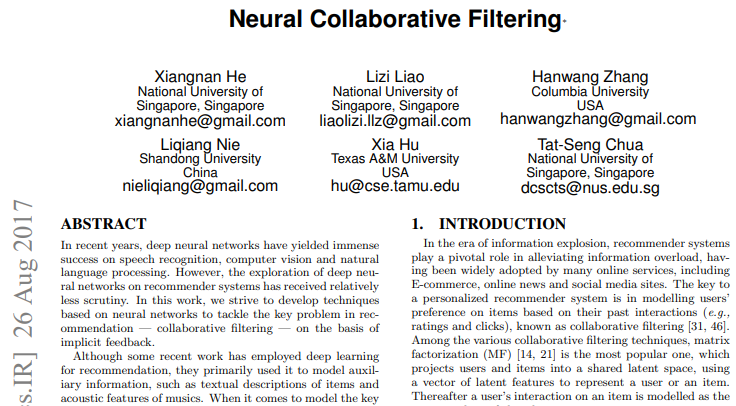
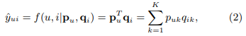
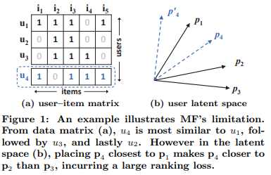

## 2017_arXiv_Neural_CF [Neural Collaborative Filtering]

---

### ABSTRACT    
* implicit feedback, 협업 필터링 문제 해결 위한 신경망  
* 협업 필터링: user item 상호작용-MF/잠재 특성-내적(dot product) 의존  
* **NCF**(Neural networkbased Collaborative Filtering): 내적 신경 아키텍처로 대체한 프레임워크 제안  
  * 일반적, MF 표현 가능, 비선형성, MLP로 user-item 상호작용 학습  

---

### Keywords  
* Collaborative Filtering, Neural Networks, Deep Learning, Matrix Factorization, Implicit Feedback
---

### 1. INTRODUCTION  
* 개인화 된 추천 시스템의 핵심: 협업 필터링(과거 상호 작용)> item에 대한 user의 선호도를 모델링  
  * 협업 필터링 기술
    * MF: user item latent space 투영(project)> 잠재 특징 벡터> 내적 = user item 상호작용    
      * MF 향상: neighbor-based 모델과 통합, 항목 콘텐츠의 topic model 과 결합, features 모델링을 위해 factorization machines  
      * inner product로 인한 성능 저하 가능성 존재: 복잡한 구조를 캡처하는데 충분치 않을 수 있음  

* 신경망: 수작업 아닌 데이터에서 상호작용 학습        
  * DNN: (보조 정보) item의 텍스트 설명, 음악의 오디오 기능, 이미지의 시각적 콘텐츠 등=> 여전히 MF 사용(내적으로 user item 잠재 피쳐 벡터 결합)     

* explicit feedback  
  * 자동 추적(수집 용이), 사용자 선호도 간접 반영(만족도 관찰X), 부정적 피드백 부족  

* 목표: DNN 활용 잡음 있는 암시적 피드벡 모델링  
  * 1. NCF 고안: 신경망 기반 CF 일반 프레임워크   
  * 2. MPL 활용  

---

### 2. PRELIMINARIES  
#### 2.1 Learning from Implicit Data  
* 사용자 암시적 피드백 , user item 상호 작용 행렬 Y   
*   

  * M: 사용자 수  
  * N: 항목 수  
* 사용자 u, 항목 i 상호작용   

  *   
    * 상호작용 ≠ 선호도  
    * 암시적 데이터(noisy signals) => 관찰X/결측치 존재 => 부정적 피드백 부족    

* 관찰되지 않은 항목 점수 추정 문제(추상화)  
  * 접근: Model-based approaches  
    * 가정: 데이터가 기본 모델에 의해 생성/설명  
  *     

    * : 상호 작용 예측 점수  
    * Θ: 모델 매개 변수  
    * f: 모델 매개 변수를 예측 점수 함수(상호 작용 함수)  
  * Θ 추정 접근 방식: 목적함수 최적화하는 기계 학습 사용   

* 목적함수(2)  
  * 점 손실(pointwise loss): 제곱 오차 최소화(회귀)  
    *      
    * 관찰X: 부정 간주  
  * 쌍 손실(pairwise loss): 관찰 항목 순위 > 관찰 X 항목 순위 => 여백 최대화  
    *        

 

* NCF: 상호작용 함수 f 매개 변수화  
  * pointwise/pairwise loss 모두 지원  

#### 2.2 Matrix Factorization   
* MF: user item < (연결) > 잠재 피쳐 실수 값 벡터   
*  = 상호작용  = 잠재벡터 내적  
  *   
    * user, item 잠재 벡터: , 
    * K: 잠재 공간 차원  
  * 가정: 양방향 상호 작용 모델링(two-way interaction) => **선형 모델**   
    * 잠재 공간의 각 차원이 서로 독립(independent)  
    * 동일한 가중치로 선형 결합(linearly combining with same weight)   

* MF(내적) 표현 한계: 단순하고 고정된 내적으로 저차원 잠재 벡터 공간에서 사용자 항목간의 복잡한 상호작용 추정 시 제한 존재
  * 설정(2)   
    * 1. user item 동일 잠재 공간 매핑, 두 사용자 간 유사성 = 내적(코사인) 측정  
    * 2. 자카드 지수(Jaccard coefficient)를 두 사용자의 근거 유사성(groundtruth similarity)으로 사용  
  *    
    * (a) 사용자 간 유사성 s23(0.66) > s12(0.5) > s13(0.4)  
    * (b) 잠재공간에서 p1, p2, p3 관계 표현   
    * user4 예측
      * (a) s41(0.6)> s43(0.4)> s42(0.2): user1과 가장 유사, user2와 가장 거리가 멂       
      * (b) p4를 p1에 가장 가깝게 배치하면 순위 손실 발생   
* 극복: 
  * 1) 많은 수의 잠재 요인 K 사용  
    * 희소 벡터에서 과적합 등 문제 발생  
  * 2) **DNN**  

---

### 3. NEURAL COLLABORATIVE FILTERING  

We first present the general NCF framework, elaborating how to learn NCF with a probabilistic model that emphasizes the binary property of implicit data. 
먼저 일반적인 NCF 프레임 워크를 제시하고 암시 적 데이터의 이진 속성을 강조하는 확률 모델을 사용하여 NCF를 학습하는 방법을 자세히 설명합니다.

We then show that MF can be expressed and generalized under NCF.
그런 다음 MF가 NCF 하에서 표현되고 일반화 될 수 있음을 보여줍니다.

To explore DNNs for collaborative filtering, we then propose an instantiation of NCF, using a multi-layer perceptron (MLP) to learn the user–item interaction function. 
협업 필터링을위한 DNN을 탐색하기 위해 사용자 항목 상호 작용 기능을 학습하기 위해 다중 레이어 퍼셉트론 (MLP)을 사용하여 NCF의 인스턴스화를 제안합니다.

Lastly, we present a new neural matrix factorization model, which ensembles MF and MLP under the NCF framework; it unifies the strengths of linearity of MF and non-linearity of MLP for modelling the user–item latent structures.
마지막으로 NCF 프레임 워크에서 MF와 MLP를 앙상블하는 새로운 신경 매트릭스 분해 모델을 제시합니다. 사용자 항목 잠재 구조를 모델링하기 위해 MF의 선형성과 MLP의 비선형 성의 강점을 통합합니다.

#### 3.1 General Framework  

To permit a full neural treatment of collaborative filtering, we adopt a multi-layer representation to model a user–item interaction yui as shown in Figure 2, where the output of one layer serves as the input of the next one. 
협업 필터링의 완전한 신경 처리를 허용하기 위해 그림 2에 표시된 것처럼 다중 레이어 표현을 채택하여 사용자 항목 상호 작용 yui를 모델링합니다. 여기서 한 레이어의 출력이 다음 레이어의 입력으로 사용됩니다.

The bottom input layer consists of two feature vectors vUu and vIi that describe user u and item i, respectively; they can be customized to support a wide range of modelling of users and items, such as context-aware, content-based, and neighborbased. 
하단 입력 계층은 사용자 u와 항목 i를 각각 설명하는 두 개의 특징 벡터 vUu 및 vIi로 구성됩니다. 컨텍스트 인식, 컨텐츠 기반 및 이웃 기반과 같은 사용자 및 항목의 광범위한 모델링을 지원하도록 사용자 정의 할 수 있습니다.

Since this work focuses on the pure collaborative filtering setting, we use only the identity of a user and an item as the input feature, transforming it to a binarized sparse vector with one-hot encoding. 
이 작업은 순수 협업 필터링 설정에 초점을 맞추기 때문에 사용자와 항목의 ID 만 입력 기능으로 사용하여 원-핫 인코딩을 사용하는 이진화 된 희소 벡터로 변환합니다.

Note that with such a generic feature representation for inputs, our method can be easily adjusted to address the cold-start problem by using content features to represent users and items.
입력에 대한 이러한 일반 기능 표현을 사용하면 콘텐츠 기능을 사용하여 사용자 및 항목을 표시함으로써 콜드 스타트 ​​문제를 해결하도록 방법을 쉽게 조정할 수 있습니다.

Above the input layer is the embedding layer; it is a fully connected layer that projects the sparse representation to a dense vector. 
입력 레이어 위에는 임베딩 레이어가 있습니다. 희소 표현을 조밀 한 벡터로 투영하는 완전 연결 계층입니다.

The obtained user (item) embedding can be seen as the latent vector for user (item) in the context of latent factor model. 
획득 한 사용자 (항목) 임베딩은 잠재 인자 모델의 맥락에서 사용자 (항목)에 대한 잠재 벡터로 볼 수 있습니다.

The user embedding and item embedding are then fed into a multi-layer neural architecture, which we term as neural collaborative filtering layers, to map the latent vectors to prediction scores. 
그런 다음 사용자 임베딩 및 항목 임베딩은 잠재 벡터를 예측 점수에 매핑하기 위해 신경 협업 필터링 레이어라고하는 다중 레이어 신경 아키텍처에 입력됩니다.

Each layer of the neural CF layers can be customized to discover certain latent structures of user–item interactions. 
신경 CF 계층의 각 계층은 사용자-항목 상호 작용의 특정 잠재 구조를 발견하도록 사용자 지정할 수 있습니다.

The dimension of the last hidden layer X determines the model’s capability. 
마지막 은닉층 X의 차원은 모델의 기능을 결정합니다.

The final output layer is the predicted score ˆyui, and training is performed by minimizing the pointwise loss between ˆyui and its target value yui. 
최종 출력 레이어는 예측 된 점수 ˆyui이고 ˆyui와 목표 값 yui 사이의 점별 손실을 최소화하여 훈련을 수행합니다.

We note that another way to train the model is by performing pairwise learning, such as using the Bayesian Personalized Ranking and margin-based loss. 
모델을 훈련하는 또 다른 방법은 베이지안 개인화 순위 및 마진 기반 손실을 사용하는 것과 같은 쌍별 학습을 수행하는 것입니다.

As the focus of the paper is on the neural network modelling part, we leave the extension to pairwise learning of NCF as a future work.
논문의 초점이 신경망 모델링 부분에 있으므로 향후 작업으로 NCF의 쌍별 학습에 대한 확장을 남겨 둡니다.

We now formulate the NCF’s predictive model as
이제 NCF의 예측 모델을 다음과 같이 공식화합니다.
(3)
where P ∈ R M×K and Q ∈ R N×K, denoting the latent factor matrix for users and items, respectively; and Θf denotes the model parameters of the interaction function f. 
여기서 P ∈ R MxK 및 Q ∈ R NxK, 각각 사용자 및 항목에 대한 잠재 인자 행렬을 나타냅니다. Θf는 상호 작용 함수 f의 모델 매개 변수를 나타냅니다.

Since the function f is defined as a multi-layer neural network, it can be formulated as
함수 f는 다층 신경망으로 정의되므로 다음과 같이 공식화 할 수 있습니다.
(4)
where φout and φx respectively denote the mapping function for the output layer and x-th neural collaborative filtering (CF) layer, and there are X neural CF layers in total.
여기서 φout과 φx는 각각 출력 레이어와 x 번째 신경 협력 필터링 (CF) 레이어에 대한 매핑 함수를 나타내며 총 X 개의 신경 CF 레이어가 있습니다.

##### 3.1.1 Learning NCF

To learn model parameters, existing pointwise methods largely perform a regression with squared loss:
모델 매개 변수를 학습하기 위해 기존의 점별 방법은 대체로 손실 제곱으로 회귀를 수행합니다.
(5)
where Y denotes the set of observed interactions in Y, and Y − denotes the set of negative instances, which can be all (or sampled from) unobserved interactions; and wui is a hyperparameter denoting the weight of training instance (u, i).
여기서 Y는 Y에서 관찰 된 상호 작용의 집합을 나타내고, Y-는 관찰되지 않은 상호 작용 모두 (또는 샘플링) 될 수있는 음성 인스턴스의 집합을 나타냅니다. wui는 훈련 인스턴스 (u, i)의 가중치를 나타내는 하이퍼 파라미터입니다.

While the squared loss can be explained by assuming that observations are generated from a Gaussian distribution, we point out that it may not tally well with implicit data.
제곱 손실은 관측 값이 가우스 분포에서 생성된다고 가정하여 설명 할 수 있지만 암시 적 데이터에서는 잘 집계되지 않을 수 있음을 지적합니다.

This is because for implicit data, the target value yui is a binarized 1 or 0 denoting whether u has interacted with i. 
이는 암시 적 데이터의 경우 대상 값 yui가 u가 i와 상호 작용했는지 여부를 나타내는 이진화 된 1 또는 0이기 때문입니다.

In what follows, we present a probabilistic approach for learning the pointwise NCF that pays special attention to the binary property of implicit data.
다음에서는 암시 적 데이터의 이진 속성에 특별한주의를 기울이는 포인트 별 NCF 학습을위한 확률 적 접근 방식을 제시합니다.

Considering the one-class nature of implicit feedback, we can view the value of yui as a label — 1 means item i is relevant to u, and 0 otherwise. 
암시 적 피드백의 단일 클래스 특성을 고려하면 yui의 값을 레이블로 볼 수 있습니다. 1은 항목 i가 u와 관련이 있음을 의미하고 그렇지 않으면 0을 의미합니다.

The prediction score ˆyui then represents how likely i is relevant to u. 
예측 점수 ˆyui는 i가 u와 얼마나 관련이 있는지를 나타냅니다.

To endow NCF with such a probabilistic explanation, we need to constrain the output ˆyui in the range of [0, 1], which can be easily achieved by using a probabilistic function (e.g., the Logistic or Probit function) as the activation function for the output layer φout. 
NCF에 이러한 확률 적 설명을 부여하려면 출력 ˆyui를 [0, 1] 범위로 제한해야합니다. 이는 확률 적 함수 (예 : Logistic 또는 Probit 함수)를 활성화 함수로 사용하여 쉽게 얻을 수 있습니다. 출력 레이어 φout.

With the above settings, we then define the likelihood function as 
위의 설정을 사용하여 우도 함수를 다음과 같이 정의합니다.
(6)
Taking the negative logarithm of the likelihood, we reach
우도의 음의 로그를 취하면
(7)
This is the objective function to minimize for the NCF methods, and its optimization can be done by performing stochastic gradient descent (SGD). 
이것은 NCF 방법에 대해 최소화하는 목적 함수이며 확률 적 경사 하강 법 (SGD)을 수행하여 최적화 할 수 있습니다.

Careful readers might have realized that it is the same as the binary cross-entropy loss, also known as log loss. 
주의 깊은 독자라면 이것이 로그 손실이라고도하는 이진 교차 엔트로피 손실과 동일하다는 것을 깨달았을 것입니다.

By employing a probabilistic treatment for NCF, we address recommendation with implicit feedback as a binary classification problem. 
NCF에 대한 확률 적 처리를 사용하여 암시 적 피드백을 이진 분류 문제로 사용하여 권장 사항을 해결합니다.

As the classificationaware log loss has rarely been investigated in recommendation literature, we explore it in this work and empirically show its effectiveness in Section 4.3. 
분류 인식 로그 손실은 추천 문헌에서 거의 조사되지 않았기 때문에이 작업에서이를 탐색하고 4.3 절에서 그 효과를 경험적으로 보여줍니다.

For the negative instances Y−, we uniformly sample them from unobserved interactions in each iteration and control the sampling ratio w.r.t. the number of observed interactions. 
음의 인스턴스 Y-의 경우 각 반복에서 관찰되지 않은 상호 작용에서 균일하게 샘플링하고 샘플링 비율 w.r.t를 제어합니다. 관찰 된 상호 작용의 수.

While a nonuniform sampling strategy (e.g., item popularity-biased) might further improve the performance, we leave the exploration as a future work.
불균일 한 샘플링 전략 (예 : 항목 인기도 편향)이 성능을 더욱 향상시킬 수 있지만, 우리는 탐색을 향후 작업으로 남겨 둡니다.

#### 3.2 Generalized Matrix Factorization (GMF)  
#### 3.3 Multi-Layer Perceptron (MLP)  
#### 3.4 Fusion of GMF and MLP  
##### 3.4.1 Pre-training  

---

### 4. EXPERIMENTS  
#### 4.1 Experimental Settings  
#### 4.2 Performance Comparison (RQ1)  
##### 4.2.1 Utility of Pre-training  

#### 4.3 Log Loss with Negative Sampling (RQ2)  
#### 4.4 Is Deep Learning Helpful? (RQ3)  

---

### 5. RELATED WORK  

---

### 6. CONCLUSION AND FUTURE WORK  

---

### 7. REFERENCES  

3.2 Generalized Matrix Factorization (GMF) 

We now show how MF can be interpreted as a special case of our NCF framework. 
이제 MF가 NCF 프레임 워크의 특별한 경우로 어떻게 해석 될 수 있는지 보여줍니다.

As MF is the most popular model for recommendation and has been investigated extensively in literature, being able to recover it allows NCF to mimic a large family of factorization models.
MF는 추천을위한 가장 인기있는 모델이고 문헌에서 광범위하게 조사되었으므로이를 복구 할 수 있으면 NCF가 대규모 인수 분해 모델 제품군을 모방 할 수 있습니다.

Due to the one-hot encoding of user (item) ID of the input layer, the obtained embedding vector can be seen as the latent vector of user (item). 
입력 레이어의 사용자 (아이템) ID의 원-핫 인코딩으로 인해 획득 된 임베딩 벡터는 사용자 (아이템)의 잠재 벡터로 볼 수 있습니다.

Let the user latent vector pu be PT vUu and item latent vector qi be QT vIi. 
사용자 잠재 벡터 pu를 PT vUu로하고 항목 잠재 벡터 qi를 QT vIi로 설정합니다.

We define the mapping function of the first neural CF layer as
첫 번째 신경 CF 레이어의 매핑 기능을 다음과 같이 정의합니다.
(8)
where  denotes the element-wise product of vectors. 
여기서는 벡터의 요소 별 곱을 나타냅니다.

We then project the vector to the output layer:
그런 다음 벡터를 출력 레이어에 투영합니다.
(9)
where aout and h denote the activation function and edge weights of the output layer, respectively. 
여기서 aout과 h는 각각 출력 레이어의 활성화 함수와 간선 가중치를 나타냅니다.

Intuitively, if we use an identity function for aout and enforce h to be a uniform vector of 1, we can exactly recover the MF model.
직관적으로 aout에 대해 항등 함수를 사용하고 h를 1의 균일 벡터로 강제하면 MF 모델을 정확하게 복구 할 수 있습니다.

Under the NCF framework, MF can be easily generalized and extended. 
NCF 프레임 워크에서 MF는 쉽게 일반화되고 확장 될 수 있습니다.

For example, if we allow h to be learnt from data without the uniform constraint, it will result in a variant of MF that allows varying importance of latent dimensions. 
예를 들어, 균일 한 제약없이 데이터에서 h를 학습 할 수 있도록 허용하면 잠재 차원의 다양한 중요성을 허용하는 MF 변형이 생성됩니다.

And if we use a non-linear function for aout, it will generalize MF to a non-linear setting which might be more expressive than the linear MF model. 
그리고 우리가 aout에 대해 비선형 함수를 사용하면 MF를 선형 MF 모델보다 더 표현력이있을 수있는 비선형 설정으로 일반화합니다.

In this work, we implement a generalized version of MF under NCF that uses the sigmoid function σ(x) = 1/(1 + e−x) as aout and learns h from data with the log loss (Section 3.1.1). 
이 작업에서는 시그 모이 드 함수 σ (x) = 1 / (1 + e-x)를 aout으로 사용하고 로그 손실이있는 데이터에서 h를 학습하는 NCF 하에서 일반화 된 버전의 MF를 구현합니다 (섹션 3.1.1).

We term it as GMF, short for Generalized Matrix Factorization.
우리는 이것을 Generalized Matrix Factorization의 줄임말 인 GMF라고합니다.

3.3 Multi-Layer Perceptron (MLP)

Since NCF adopts two pathways to model users and items, it is intuitive to combine the features of two pathways by concatenating them. 
NCF는 사용자와 항목을 모델링하기 위해 두 가지 경로를 채택하고 있기 때문에 두 경로를 연결하여 두 경로의 특징을 결합하는 것이 직관적입니다.

This design has been widely adopted in multimodal deep learning work. 
이 디자인은 멀티 모달 딥 러닝 작업에 널리 채택되었습니다.

However, simply a vector concatenation does not account for any interactions between user and item latent features, which is insufficient for modelling the collaborative filtering effect. 
그러나 단순히 벡터 연결은 사용자와 항목 잠재 기능 간의 상호 작용을 고려하지 않으므로 협업 필터링 효과를 모델링하는 데 충분하지 않습니다.

To address this issue, we propose to add hidden layers on the concatenated vector, using a standard MLP to learn the interaction between user and item latent features. 
이 문제를 해결하기 위해 표준 MLP를 사용하여 사용자와 항목 잠재 기능 간의 상호 작용을 학습하여 연결된 벡터에 숨겨진 레이어를 추가 할 것을 제안합니다.

In this sense, we can endow the model a large level of flexibility and non-linearity to learn the interactions between pu and qi , rather than the way of GMF that uses only a fixed element-wise product on them. 
이러한 의미에서 우리는 모델에 고정 된 요소 별 제품 만 사용하는 GMF 방식이 아니라 pu와 qi 간의 상호 작용을 학습하기 위해 모델에 큰 수준의 유연성과 비선형 성을 부여 할 수 있습니다.

More precisely, the MLP model under our NCF framework is defined as
보다 정확하게는 NCF 프레임 워크의 MLP 모델은 다음과 같이 정의됩니다.
(10)
where Wx, bx, and ax denote the weight matrix, bias vector, and activation function for the x-th layer’s perceptron, respectively. 
여기서 Wx, bx 및 ax는 각각 x 번째 레이어의 퍼셉트론에 대한 가중치 행렬, 바이어스 벡터 및 활성화 함수를 나타냅니다.

For activation functions of MLP layers, one can freely choose sigmoid, hyperbolic tangent (tanh), and Rectifier (ReLU), among others. 
MLP 레이어의 활성화 기능의 경우, 무엇보다도 시그 모이 드, 쌍곡 탄젠트 (tanh) 및 정류기 (ReLU)를 자유롭게 선택할 수 있습니다.

We would like to analyze each function: 
각 기능을 분석하고 싶습니다.

1) The sigmoid function restricts each neuron to be in (0,1), which may limit the model’s performance; and it is known to suffer from saturation, where neurons stop learning when their output is near either 0 or 1. 
1) 시그 모이 드 함수는 각 뉴런이 (0,1)에 있도록 제한하여 모델의 성능을 제한 할 수 있습니다. 뉴런의 출력이 0 또는 1에 가까울 때 학습을 중단하는 포화 상태로 고통받는 것으로 알려져 있습니다.

2) Even though tanh is a better choice and has been widely adopted [6, 44], it only alleviates the issues of sigmoid to a certain extent, since it can be seen as a rescaled version of sigmoid (tanh(x/2) = 2σ(x) − 1).  
2) tanh가 더 나은 선택이고 널리 채택되었지만 [6, 44], 시그 모이 드의 크기가 조정 된 버전으로 볼 수 있기 때문에 시그 모이 드 문제를 어느 정도 완화 할뿐입니다 (tanh (x / 2) = 2σ (x) − 1).

과
And 
3) as such, we opt for ReLU, which is more biologically plausible and proven to be non-saturated [9]; moreover, it encourages sparse activations, being well-suited for sparse data and making the model less likely to be overfitting. 

3) 따라서 우리는 생물학적으로 더 타당하고 포화되지 않은 것으로 입증 된 ReLU를 선택합니다 [9]; 또한 희소 활성화를 장려하고 희소 데이터에 적합하며 모델이 과적 합 될 가능성을 줄입니다.

Our empirical results show that ReLU yields slightly better performance than tanh, which in turn is significantly better than sigmoid.
우리의 경험적 결과에 따르면 ReLU는 tanh보다 약간 더 나은 성능을 제공하며, 이는 시그 모이 드보다 훨씬 우수합니다.

As for the design of network structure, a common solution is to follow a tower pattern, where the bottom layer is the widest and each successive layer has a smaller number of neurons (as in Figure 2). 
네트워크 구조의 설계와 관련하여 일반적인 솔루션은 타워 패턴을 따르는 것입니다. 여기서 하단 레이어는 가장 넓고 연속되는 각 레이어에는 더 적은 수의 뉴런이 있습니다 (그림 2 참조).

The premise is that by using a small number of hidden units for higher layers, they can learn more abstractive features of data [10]. 
전제는 상위 계층에 대해 적은 수의 은닉 유닛을 사용함으로써 데이터의 더 추상적 인 특징을 학습 할 수 있다는 것입니다 [10].

We empirically implement the tower structure, halving the layer size for each successive higher layer.
우리는 타워 구조를 경험적으로 구현하여 연속적인 상위 레이어마다 레이어 크기를 절반으로 줄입니다.

3.4 Fusion of GMF and MLP

So far we have developed two instantiations of NCF — GMF that applies a linear kernel to model the latent feature interactions, and MLP that uses a non-linear kernel to learn the interaction function from data. 
지금까지 NCF의 두 가지 인스턴스화를 개발했습니다. 선형 커널을 적용하여 잠재 기능 상호 작용을 모델링하는 GMF와 비선형 커널을 사용하여 데이터에서 상호 작용 함수를 학습하는 MLP입니다.

The question then arises:
그런 다음 질문이 발생합니다.

how can we fuse GMF and MLP under the NCF framework, so that they can mutually reinforce each other to better model the complex user-iterm interactions?
NCF 프레임 워크에서 GMF와 MLP를 융합하여 복잡한 사용자 -iterm 상호 작용을 더 잘 모델링하기 위해 서로를 강화할 수있는 방법은 무엇입니까?

A straightforward solution is to let GMF and MLP share the same embedding layer, and then combine the outputs of their interaction functions. 
간단한 해결책은 GMF와 MLP가 동일한 임베딩 레이어를 공유하도록 한 다음 상호 작용 함수의 출력을 결합하는 것입니다.

This way shares a similar spirit with the well-known Neural Tensor Network (NTN).
이 방식은 잘 알려진 NTN (Neural Tensor Network)과 유사한 정신을 공유합니다.

Specifically, the model for combining GMF with a one-layer MLP can be formulated as
구체적으로 GMF와 1 계층 MLP를 결합하는 모델은 다음과 같이 공식화 할 수 있습니다.
(11)
However, sharing embeddings of GMF and MLP might limit the performance of the fused model. 
그러나 GMF 및 MLP의 임베딩을 공유하면 융합 모델의 성능이 제한 될 수 있습니다.

For example, it implies that GMF and MLP must use the same size of embeddings; for datasets where the optimal embedding size of the two models varies a lot, this solution may fail to obtain the optimal ensemble.
예를 들어, GMF와 MLP는 동일한 크기의 임베딩을 사용해야 함을 의미합니다. 두 모델의 최적 임베딩 크기가 많이 다른 데이터 세트의 경우이 솔루션은 최적의 앙상블을 얻지 못할 수 있습니다.

To provide more flexibility to the fused model, we allow GMF and MLP to learn separate embeddings, and combine the two models by concatenating their last hidden layer.
융합 모델에 더 많은 유연성을 제공하기 위해 GMF와 MLP가 별도의 임베딩을 학습하고 마지막 숨겨진 레이어를 연결하여 두 모델을 결합 할 수 있습니다.

Figure 3 illustrates our proposal, the formulation of which is given as follows
그림 3은 우리의 제안을 보여 주며, 그 공식은 다음과 같습니다.
(12)
where pGu and pMu denote the user embedding for GMF and MLP parts, respectively; and similar notations of qGi and qMi for item embeddings. 
여기서 pGu 및 pMu는 각각 GMF 및 MLP 부분에 대한 사용자 임베딩을 나타냅니다. 및 항목 임베딩에 대한 qGi 및 qMi의 유사한 표기법.

As discussed before, we use ReLU as the activation function of MLP layers. 
앞서 논의했듯이 MLP 계층의 활성화 기능으로 ReLU를 사용합니다.

This model combines the linearity of MF and non-linearity of DNNs for modelling user–item latent structures. 
이 모델은 사용자 항목 잠재 구조를 모델링하기 위해 MF의 선형성과 DNN의 비선형 성을 결합합니다.

We dub this model “NeuMF”, short for Neural Matrix Factorization. 
이 모델을 Neural Matrix Factorization의 약자로 "NeuMF"라고합니다.

The derivative of the model w.r.t. each model parameter can be calculated with standard back-propagation, which is omitted here due to space limitation.
모델 w.r.t. 각 모델 매개 변수는 표준 역전 파로 계산할 수 있으며 공간 제한으로 인해 여기서 생략됩니다.

3.4.1 Pre-training

Due to the non-convexity of the objective function of NeuMF, gradient-based optimization methods only find locally-optimal solutions. 
NeuMF의 목적 함수가 볼록하지 않기 때문에 그래디언트 기반 최적화 방법은 로컬에서 최적화 된 솔루션 만 찾습니다.

It is reported that the initialization plays an important role for the convergence and performance of deep learning models [7]. 
초기화는 딥 러닝 모델의 수렴 및 성능에 중요한 역할을하는 것으로보고되었습니다 [7].

Since NeuMF is an ensemble of GMF nd MLP, we propose to initialize NeuMF using the pretrained models of GMF and MLP.
NeuMF는 GMF 및 MLP의 앙상블이므로 사전 훈련 된 GMF 및 MLP 모델을 사용하여 NeuMF를 초기화 할 것을 제안합니다.

We first train GMF and MLP with random initializations until convergence. 
먼저 수렴 될 때까지 무작위 초기화로 GMF와 MLP를 훈련합니다.

We then use their model parameters as the initialization for the corresponding parts of NeuMF’s parameters. 
그런 다음 해당 모델 매개 변수를 NeuMF 매개 변수의 해당 부분에 대한 초기화로 사용합니다.

The only tweak is on the output layer, where we concatenate weights of the two models with 
유일한 조정은 출력 레이어에 있습니다. 여기서 두 모델의 가중치를
(13)
where hGMF and hMLP denote the h vector of the pretrained GMF and MLP model, respectively; and α is a hyper-parameter determining the trade-off between the two pre-trained models.
여기서 hGMF 및 hMLP는 각각 사전 훈련 된 GMF 및 MLP 모델의 h 벡터를 나타냅니다. α는 사전 학습 된 두 모델 간의 절충을 결정하는 하이퍼 매개 변수입니다.

For training GMF and MLP from scratch, we adopt the Adaptive Moment Estimation (Adam) [20], which adapts the learning rate for each parameter by performing smaller updates for frequent and larger updates for infrequent parameters. 
GMF 및 MLP를 처음부터 훈련하기 위해 적응 형 모멘트 추정 (Adam) [20]을 채택합니다.이 방법은 자주 사용하지 않는 매개 변수에 대해 더 작은 업데이트를 수행하고 더 큰 업데이트를 수행하여 각 매개 변수에 대한 학습률을 조정합니다.

The Adam method yields faster convergence for both models than the vanilla SGD and relieves the pain of tuning the learning rate. 
Adam 방법은 바닐라 SGD보다 두 모델에 대해 더 빠른 수렴을 제공하고 학습 속도를 조정하는 데 따른 고통을 덜어줍니다.

After feeding pre-trained parameters into NeuMF, we optimize it with the vanilla SGD, rather than Adam. 
사전 훈련 된 매개 변수를 NeuMF에 입력 한 후 Adam이 아닌 바닐라 SGD를 사용하여 최적화합니다.

This is because Adam needs to save momentum information for updating parameters properly. 
이는 Adam이 매개 변수를 올바르게 업데이트하기 위해 운동량 정보를 저장해야하기 때문입니다.

As we initialize NeuMF with pre-trained model parameters only and forgo saving the momentum information, it is unsuitable to further optimize NeuMF with momentum-based methods.
사전 훈련 된 모델 매개 변수로만 NeuMF를 초기화하고 운동량 정보를 저장하지 않기 때문에 운동량 기반 방법으로 NeuMF를 더 최적화하는 것은 적합하지 않습니다.

4. EXPERIMENTS

In this section, we conduct experiments with the aim of answering the following research questions:
이 섹션에서는 다음 연구 질문에 답하기 위해 실험을 수행합니다.

RQ1 Do our proposed NCF methods outperform the stateof-the-art implicit collaborative filtering methods?
RQ1 제안 된 NCF 방법이 최첨단 암시 적 협업 필터링 방법을 능가합니까?

RQ2 How does our proposed optimization framework (log loss with negative sampling) work for the recommendation task?
RQ2 제안 된 최적화 프레임 워크 (네거티브 샘플링을 사용한 로그 손실)가 추천 작업에 어떻게 작동합니까?

RQ3 Are deeper layers of hidden units helpful for learning from user–item interaction data?
RQ3 은닉 유닛의 더 깊은 계층이 사용자 항목 상호 작용 데이터에서 학습하는 데 도움이됩니까?

In what follows, we first present the experimental settings, followed by answering the above three research questions.
다음에서는 먼저 실험 설정을 제시 한 다음 위의 세 가지 연구 질문에 답합니다.

4.1 Experimental Settings Datasets. 

We experimented with two publicly accessible datasets: MovieLens4 and Pinterest5. 
공개적으로 액세스 할 수있는 두 개의 데이터 세트 인 MovieLens4 및 Pinterest5를 실험했습니다.

The characteristics of the two datasets are summarized in Table 1.
두 데이터 세트의 특성은 표 1에 요약되어 있습니다.

1. MovieLens. This movie rating dataset has been widely used to evaluate collaborative filtering algorithms.
1. MovieLens. 이 영화 등급 데이터 세트는 협업 필터링 알고리즘을 평가하는 데 널리 사용되었습니다.

We used the version containing one million ratings, where each user has at least 20 ratings. 
100 만 개의 평가가 포함 된 버전을 사용했으며 각 사용자는 최소 20 개의 평가를 받았습니다.

While it is an explicit feedback data, we have intentionally chosen it to investigate the performance of learning from the implicit signal of explicit feedback. 
명시 적 피드백 데이터이지만 명시 적 피드백의 암시 적 신호로부터 학습 성능을 조사하기 위해 의도적으로 선택했습니다.

To this end, we transformed it into implicit data, where each entry is marked as 0 or 1 indicating whether the user has rated the item.
이를 위해이를 암시 적 데이터로 변환했습니다. 여기서 각 항목은 사용자가 항목을 평가했는지 여부를 나타내는 0 또는 1로 표시됩니다.

2. Pinterest. This implicit feedback data is constructed by for evaluating content-based image recommendation.
2. 핀터 레스트. 이 암시 적 피드백 데이터는 콘텐츠 기반 이미지 추천을 평가하기 위해에서 구성됩니다.

The original data is very large but highly sparse. 
원본 데이터는 매우 크지 만 매우 희소합니다.

For example, over 20% of users have only one pin, making it difficult to evaluate collaborative filtering algorithms. 
예를 들어 사용자의 20 % 이상이 핀이 하나뿐이므로 협업 필터링 알고리즘을 평가하기가 어렵습니다.

As such, we filtered the dataset in the same way as the MovieLens data that retained only users with at least 20 interactions (pins).
따라서 20 개 이상의 상호 작용 (핀)이있는 사용자 만 보유한 MovieLens 데이터와 동일한 방식으로 데이터 세트를 필터링했습니다.

This results in a subset of the data that contains 55, 187 users and 1, 500, 809 interactions. 
그 결과 55, 187 명의 사용자와 1, 500, 809 개의 상호 작용이 포함 된 데이터의 하위 집합이 생성됩니다.

Each interaction denotes whether the user has pinned the image to her own board.
각 상호 작용은 사용자가 자신의 보드에 이미지를 고정했는지 여부를 나타냅니다.

Evaluation Protocols. 
평가 프로토콜. 

To evaluate the performance of item recommendation, we adopted the leave-one-out evaluation, which has been widely used in literature.
항목 추천의 성과를 평가하기 위해 문헌에서 널리 사용되는 Leave-one-out 평가를 채택했습니다.

For each user, we held-out her latest interaction as the test set and utilized the remaining data for training. 
각 사용자에 대해 그녀의 최신 상호 작용을 테스트 세트로 유지하고 나머지 데이터를 훈련에 활용했습니다.

Since it is too time-consuming to rank all items for every user during evaluation, we followed the common strategy that randomly samples 100 items that are not interacted by the user, ranking the test item among the 100 items. 
평가하는 동안 모든 사용자에 대해 모든 항목의 순위를 매기는 데 너무 많은 시간이 소요되므로 사용자가 상호 작용하지 않는 100 개의 항목을 무작위로 샘플링하여 100 개 항목 중 테스트 항목의 순위를 지정하는 공통 전략을 따랐습니다.

The performance of a ranked list is judged by Hit Ratio (HR) and Normalized Discounted Cumulative Gain (NDCG). 
순위 목록의 성과는 적중률 (HR) 및 정규화 된 할인 누적 이득 (NDCG)으로 판단됩니다.

Without special mention, we truncated the ranked list at 10 for both metrics. 
특별한 언급없이 두 측정 항목 모두에 대해 순위 목록을 10 개로 줄였습니다.

As such, the HR intuitively measures whether the test item is present on the top-10 list, and the NDCG accounts for the position of the hit by assigning higher scores to hits at top ranks. 
따라서 HR은 테스트 항목이 상위 10 개 목록에 있는지 여부를 직관적으로 측정하고 NDCG는 상위 순위의 히트에 더 높은 점수를 할당하여 히트의 위치를 설명합니다.

We calculated both metrics for each test user and reported the average score.
우리는 각 테스트 사용자에 대한 두 측정 항목을 모두 계산하고 평균 점수를보고했습니다.

Baselines. 

We compared our proposed NCF methods (GMF, MLP and NeuMF) with the following methods: - ItemPop. 
제안 된 NCF 방법 (GMF, MLP 및 NeuMF)을 다음 방법과 비교했습니다.-ItemPop.

Items are ranked by their popularity judged by the number of interactions. 
항목은 상호 작용 횟수로 판단되는 인기도에 따라 순위가 매겨집니다.

This is a non-personalized method to benchmark the recommendation performance.- ItemKNN. 
추천 성능을 벤치마킹하기위한 개인화되지 않은 방법입니다 .- ItemKNN.

This is the standard item-based collaborative filtering method. 
이것은 표준 항목 기반 협업 필터링 방법입니다.

We followed the setting of to adapt it for implicit data.- BPR. 
암시 적 데이터에 맞게 조정하기 위해의 설정을 따랐습니다.

This method optimizes the MF model of Equation 2 with a pairwise ranking loss, which is tailored to learn from implicit feedback. 
이 방법은 암시 적 피드백에서 학습하도록 조정 된 쌍별 순위 손실로 방정식 2의 MF 모델을 최적화합니다.

It is a highly competitive baseline for item recommendation. 
항목 추천에 대한 경쟁이 심한 기준입니다.

We used a fixed learning rate, varying it and reporting the best performance. - eALS. 
우리는 고정 된 학습률을 사용하여이를 다양하게하고 최고의 성과를보고했습니다. -eALS.

This is a state-of-the-art MF method for item recommendation. 
아이템 추천을위한 최첨단 MF 방식입니다.

It optimizes the squared loss of Equation 5, treating all unobserved interactions as negative instances and weighting them non-uniformly by the item popularity. 
이는 방정식 5의 제곱 손실을 최적화하여 관찰되지 않은 모든 상호 작용을 부정적인 인스턴스로 처리하고 항목 인기도에 따라 균일하지 않게 가중치를 부여합니다.

Since eALS shows superior performance over the uniform-weighting method WMF, we do not further report WMF’s performance.
eALS는 균일 가중치 방식 인 WMF보다 우수한 성능을 보여주기 때문에 WMF의 성능을 더 이상보고하지 않습니다.

As our proposed methods aim to model the relationship between users and items, we mainly compare with user–item models. 
우리가 제안한 방법은 사용자와 항목 간의 관계를 모델링하는 것을 목표로하므로 주로 사용자 항목 모델과 비교합니다.

We leave out the comparison with item–item models, such as SLIM and CDAE, because the performance difference may be caused by the user models for personalization (as they are item–item model).
SLIM 및 CDAE와 같은 항목-항목 모델과의 비교는 생략합니다. 성능 차이는 개인화를위한 사용자 모델 (항목-항목 모델이므로)에 의해 발생할 수 있기 때문입니다.

Parameter Settings. 
매개 변수 설정.

We implemented our proposed methods based on Keras6. 
Keras6를 기반으로 제안 된 방법을 구현했습니다.

To determine hyper-parameters of NCF methods, we randomly sampled one interaction for each user as the validation data and tuned hyper-parameters on it. 
NCF 방법의 하이퍼 파라미터를 결정하기 위해 각 사용자에 대해 하나의 상호 작용을 검증 데이터로 무작위로 샘플링하고 하이퍼 파라미터를 조정했습니다.

All NCF models are learnt by optimizing the log loss of Equation 7, where we sampled four negative instances per positive instance. 
모든 NCF 모델은 공식 7의 로그 손실을 최적화하여 학습합니다. 여기서 양의 인스턴스 당 네 개의 음의 인스턴스를 샘플링했습니다.

For NCF models that are trained from scratch, we randomly initialized model parameters with a Gaussian distribution (with a mean of 0 and standard deviation of 0.01), optimizing the model with mini-batch Adam. 
처음부터 훈련 된 NCF 모델의 경우 가우스 분포 (평균 0 및 표준 편차 0.01)로 모델 매개 변수를 무작위로 초기화하여 미니 배치 Adam으로 모델을 최적화했습니다.

We tested the batch size of [128, 256, 512, 1024], and the learning rate of [0.0001 ,0.0005, 0.001, 0.005]. 
배치 크기는 [128, 256, 512, 1024]이고 학습률은 [0.0001,0.0005, 0.001, 0.005]입니다.

Since the last hidden layer of NCF determines the model capability, we term it as predictive factors and evaluated the factors of [8, 16, 32, 64]. 
NCF의 마지막 은닉층이 모델 능력을 결정하므로이를 예측 요인이라고하고 [8, 16, 32, 64]의 요인을 평가했습니다.

It is worth noting that large factors may cause overfitting and degrade the performance. 
큰 요인이 과적 합을 유발하고 성능을 저하시킬 수 있다는 점은 주목할 가치가 있습니다.

Without special mention, we employed three hidden layers for MLP; for example, if the size of predictive factors is 8, then the architecture of the neural CF layers is 32 → 16 → 8, and the embedding size is 16. 
특별한 언급없이 우리는 MLP를 위해 3 개의 히든 레이어를 사용했습니다. 예를 들어 예측 인자의 크기가 8이면 신경 CF 계층의 아키텍처는 32 → 16 → 8이고 임베딩 크기는 16입니다.

For the NeuMF with pre-training, α was set to 0.5, allowing the pre-trained GMF and MLP to contribute equally to NeuMF’s initialization.
사전 훈련이있는 NeuMF의 경우 α가 0.5로 설정되어 사전 훈련 된 GMF 및 MLP가 NeuMF의 초기화에 동일하게 기여할 수 있습니다.

4.2 Performance Comparison (RQ1)
Figure 4 shows the performance of HR@10 and NDCG@10 with respect to the number of predictive factors. 
그림 4는 예측 요인 수에 대한 HR @ 10 및 NDCG @ 10의 성능을 보여줍니다.

For MF methods BPR and eALS, the number of predictive factors is equal to the number of latent factors. 
MF 방법 BPR 및 eALS의 경우 예측 요인의 수는 잠재 요인의 수와 같습니다.

For ItemKNN, we tested different neighbor sizes and reported the best performance. 
ItemKNN의 경우 다양한 이웃 크기를 테스트하고 최상의 성능을보고했습니다.

Due to the weak performance of ItemPop, it is omitted in Figure 4 to better highlight the performance difference of personalized methods.
ItemPop의 성능이 약하기 때문에 그림 4에서는 개인화 방법의 성능 차이를 더 잘 강조하기 위해 생략했습니다.

First, we can see that NeuMF achieves the best performance on both datasets, significantly outperforming the stateof-the-art methods eALS and BPR by a large margin (on average, the relative improvement over eALS and BPR is 4.5% and 4.9%, respectively). 
첫째, NeuMF가 두 데이터 세트 모두에서 최고의 성능을 달성하여 최첨단 방법 인 eALS 및 BPR을 크게 능가한다는 것을 알 수 있습니다 (평균적으로 eALS 및 BPR에 대한 상대적 개선은 각각 4.5 % 및 4.9 %입니다). ).

For Pinterest, even with a small predictive factor of 8, NeuMF substantially outperforms that of eALS and BPR with a large factor of 64. 
Pinterest의 경우 예측 계수가 8로 작더라도 NeuMF는 64의 큰 계수로 eALS 및 BPR의 성능을 크게 능가합니다.

This indicates the high expressiveness of NeuMF by fusing the linear MF and non-linear MLP models. 
이것은 선형 MF 및 비선형 MLP 모델을 융합하여 NeuMF의 높은 표현력을 나타냅니다.

Second, the other two NCF methods — GMF and MLP — also show quite strong performance. 
둘째, 다른 두 가지 NCF 방법 인 GMF와 MLP도 매우 강력한 성능을 보여줍니다.

Between them, MLP slightly underperforms GMF. 
그들 사이에서 MLP는 GMF보다 약간 낮은 성능을 보입니다.

Note that MLP can be further improved by adding more hidden layers (see Section 4.4), and here we only show the performance of three layers. 
MLP는 더 많은 히든 레이어를 추가하여 (4.4 절 참조) 더욱 향상 될 수 있으며 여기에서는 세 레이어의 성능 만 보여줍니다.

For small predictive factors, GMF outperforms eALS on both datasets; although GMF suffers from overfitting for large factors, its best performance obtained is better than (or on par with) that of eALS. 
작은 예측 요인의 경우 GMF는 두 데이터 세트 모두에서 eALS를 능가합니다. GMF는 큰 요인에 대해 과적 합으로 어려움을 겪지 만, 얻은 최상의 성능은 eALS의 성능보다 우수합니다.

Lastly, GMF shows consistent improvements over BPR, admitting the effectiveness of the classificationaware log loss for the recommendation task, since GMF and BPR learn the same MF model but with different objective functions.
마지막으로 GMF와 BPR은 동일한 MF 모델을 학습하지만 목적 함수가 다르기 때문에 GMF는 BPR에 비해 지속적으로 개선되어 추천 작업에 대한 분류 인식 로그 손실의 효과를 인정합니다.

Figure 5 shows the performance of Top-K recommended lists where the ranking position K ranges from 1 to 10. 
그림 5는 순위 순위 K가 1에서 10까지의 범위 인 Top-K 권장 목록의 성과를 보여줍니다.

To make the figure more clear, we show the performance of NeuMF rather than all three NCF methods. 
그림을 더 명확하게하기 위해 세 가지 NCF 방법 모두가 아닌 NeuMF의 성능을 보여줍니다.

As can be seen, NeuMF demonstrates consistent improvements over other methods across positions, and we further conducted one-sample paired t-tests, verifying that all improvements are statistically significant for p < 0.01. 
보시다시피, NeuMF는 위치 전반에 걸쳐 다른 방법에 비해 일관된 개선을 보여 주며, 추가로 1 표본 쌍 t- 검정을 수행하여 모든 개선이 p <0.01에 대해 통계적으로 유의하다는 것을 확인했습니다.

For baseline methods, eALS outperforms BPR on MovieLens with about 5.1% relative improvement, while underperforms BPR on Pinterest in terms of NDCG. 
기준 방법의 경우 eALS는 약 5.1 %의 상대적 개선으로 MovieLens에서 BPR을 능가하는 반면 NDCG 측면에서 Pinterest의 BPR보다 성능이 낮습니다.

This is consistent with [14]’s finding that BPR can be a strong performer for ranking performance owing to its pairwise ranking-aware learner. 
이는 BPR이 쌍별 순위 인식 학습자 덕분에 성과 순위를 매기는 데있어 강력한 성과를 거둘 수 있다는 [14]의 발견과 일치합니다.

The neighborbased ItemKNN underperforms model-based methods. 
이웃 기반 ItemKNN은 모델 기반 방법보다 성능이 낮습니다.

And ItemPop performs the worst, indicating the necessity of modeling users’ personalized preferences, rather than just recommending popular items to users.
그리고 아이템 팝은 사용자에게 인기있는 아이템을 추천하는 것보다 사용자의 개인화 된 선호도를 모델링 할 필요가 있음을 나타내는 최악의 성능을 보입니다.

4.2.1 Utility of Pre-training

To demonstrate the utility of pre-training for NeuMF, we compared the performance of two versions of NeuMF — with and without pre-training. 
NeuMF에 대한 사전 교육의 유용성을 입증하기 위해 사전 교육을 사용하거나 사용하지 않은 두 가지 버전의 NeuMF 성능을 비교했습니다.

For NeuMF without pretraining, we used the Adam to learn it with random initializations. 
사전 훈련이없는 NeuMF의 경우 Adam을 사용하여 무작위 초기화로 학습했습니다.

As shown in Table 2, the NeuMF with pretraining achieves better performance in most cases; only for MovieLens with a small predictive factors of 8, the pretraining method performs slightly worse. 
표 2에서 볼 수 있듯이 사전 훈련 기능이있는 NeuMF는 대부분의 경우 더 나은 성능을 달성합니다. 예측 인자가 8 인 MovieLens의 경우에만 사전 훈련 방법이 약간 더 나쁩니다.

The relative improvements of the NeuMF with pre-training are 2.2% and 1.1% for MovieLens and Pinterest, respectively. 
사전 학습을 통한 NeuMF의 상대적 개선은 MovieLens 및 Pinterest의 경우 각각 2.2 % 및 1.1 %입니다.

This result justifies the usefulness of our pre-training method for initializing NeuMF.
이 결과는 NeuMF를 초기화하기위한 사전 훈련 방법의 유용성을 정당화합니다.

4.3 Log Loss with Negative Sampling (RQ2)

To deal with the one-class nature of implicit feedback, we cast recommendation as a binary classification task. 
암시 적 피드백의 단일 클래스 특성을 처리하기 위해 권장 사항을 이진 분류 작업으로 캐스팅합니다.

By viewing NCF as a probabilistic model, we optimized it with the log loss. 
NCF를 확률 모델로보고 로그 손실을 최적화했습니다.

Figure 6 shows the training loss (averaged over all instances) and recommendation performance of NCF methods of each iteration on MovieLens. 
그림 6은 MovieLens에서 각 반복의 NCF 방법에 대한 훈련 손실 (모든 인스턴스에 대한 평균) 및 권장 성능을 보여줍니다.

Results on Pinterest show the same trend and thus they are omitted due to space limitation. 
Pinterest의 결과는 동일한 추세를 보여 주므로 공간 제한으로 인해 생략되었습니다.

First, we can see that with more iterations, the training loss of NCF models gradually decreases and the recommendation performance is improved. 
첫째, 반복 횟수가 많을수록 NCF 모델의 학습 손실이 점차 감소하고 추천 성능이 향상됨을 알 수 있습니다.

The most effective updates are occurred in the first 10 iterations, and more iterations may overfit a model (e.g., although the training loss of NeuMF keeps decreasing after 10 iterations, its recommendation performance actually degrades). 
가장 효과적인 업데이트는 처음 10 회 반복에서 발생하며 더 많은 반복이 모델에 과적 합 될 수 있습니다 (예 : NeuMF의 학습 손실이 10 회 반복 후에 계속 감소하더라도 실제로 권장 성능이 저하됨).

Second, among the three NCF methods, NeuMF achieves the lowest training loss, followed by MLP, and then GMF. 
둘째, 세 가지 NCF 방법 중 NeuMF가 가장 낮은 훈련 손실을 달성하고 MLP, GMF 순입니다.

The recommendation performance also shows the same trend that NeuMF > MLP > GMF. 
권장 성능은 NeuMF> MLP> GMF와 동일한 추세를 보여줍니다.

The above findings provide empirical evidence for the rationality and effectiveness of optimizing the log loss for learning from implicit data.
위의 결과는 암시 적 데이터에서 학습하기 위해 로그 손실을 최적화하는 합리성과 효과에 대한 경험적 증거를 제공합니다.

An advantage of pointwise log loss over pairwise objective functions is the flexible sampling ratio for negative instances. 
쌍별 목적 함수에 비해 점별 로그 손실의 장점은 음의 인스턴스에 대한 유연한 샘플링 비율입니다.

While pairwise objective functions can pair only one sampled negative instance with a positive instance, we can flexibly control the sampling ratio of a pointwise loss. 
쌍별 목적 함수는 하나의 샘플링 된 음수 인스턴스와 양수 인스턴스 만 쌍을 이룰 수 있지만 점별 손실의 샘플링 비율을 유연하게 제어 할 수 있습니다.

To illustrate the impact of negative sampling for NCF methods, we show the performance of NCF methods w.r.t. different negative sampling ratios in Figure 7. 
NCF 방법에 대한 네거티브 샘플링의 영향을 설명하기 위해 NCF 방법의 성능을 w.r.t. 그림 7에서 다른 네거티브 샘플링 비율.

It can be clearly seen that just one negative sample per positive instance is insufficient to achieve optimal performance, and sampling more negative instances is beneficial. 
포지티브 인스턴스 당 하나의 네거티브 샘플만으로는 최적의 성능을 달성하는 데 충분하지 않으며 더 많은 네거티브 인스턴스를 샘플링하는 것이 유리하다는 것을 분명히 알 수 있습니다.

Comparing GMF to BPR, we can see the performance of GMF with a sampling ratio of one is on par with BPR, while GMF significantly betters BPR with larger sampling ratios. This shows the advantage of pointwise log loss over the pairwise BPR loss. 
GMF와 BPR을 비교하면 샘플링 비율이 1 인 GMF의 성능이 BPR과 동등한 반면 GMF는 샘플링 비율이 클수록 BPR이 훨씬 더 우수하다는 것을 알 수 있습니다. 이것은 쌍별 BPR 손실에 비해 점별 로그 손실의 이점을 보여줍니다.

For both datasets, the optimal sampling ratio is around 3 to 6.
두 데이터 세트의 최적 샘플링 비율은 약 3 ~ 6입니다.

On Pinterest, we find that when the sampling ratio is larger than 7, the performance of NCF methods starts to drop. 
Pinterest에서 샘플링 비율이 7보다 크면 NCF 방법의 성능이 떨어지기 시작합니다.

It reveals that setting the sampling ratio too aggressively may adversely hurt the performance.
샘플링 비율을 너무 공격적으로 설정하면 성능이 저하 될 수 있음을 보여줍니다.

4.4 Is Deep Learning Helpful? (RQ3)

As there is little work on learning user–item interaction function with neural networks, it is curious to see whether using a deep network structure is beneficial to the recommendation task. 
신경망과 사용자-항목 상호 작용 기능을 배우는 작업이 거의 없기 때문에 딥 네트워크 구조를 사용하는 것이 추천 작업에 도움이되는지 궁금합니다.

Towards this end, we further investigated MLP with different number of hidden layers. 
이를 위해 우리는 숨겨진 레이어 수가 다른 MLP를 추가로 조사했습니다.

The results are summarized in Table 3 and 4. 
결과는 표 3과 4에 요약되어 있습니다.

The MLP-3 indicates the MLP method with three hidden layers (besides the embedding layer), and similar notations for others. 
MLP-3은 3 개의 은닉 계층 (임베딩 계층 외에)과 유사한 표기법이있는 MLP 방법을 나타냅니다.

As we can see, even for models with the same capability, stacking more layers are beneficial to performance. 
보시다시피 동일한 기능을 가진 모델의 경우에도 더 많은 레이어를 쌓는 것이 성능에 도움이됩니다.

This result is highly encouraging, indicating the effectiveness of using deep models for collaborative recommendation. 
이 결과는 매우 고무적이며 공동 추천을 위해 딥 모델을 사용하는 효과를 나타냅니다.

We attribute the improvement to the high non-linearities brought by stacking more non-linear layers. 
우리는 더 많은 비선형 레이어를 쌓아서 가져온 높은 비선형 성 덕분에 개선되었다고 생각합니다.

To verify this, we further tried stacking linear layers, using an identity function as the activation function. 
이를 확인하기 위해 활성화 함수로 식별 함수를 사용하여 선형 레이어를 쌓아 두었습니다.

The performance is much worse than using the ReLU unit.
성능은 ReLU 장치를 사용하는 것보다 훨씬 나쁩니다.

For MLP-0 that has no hidden layers (i.e., the embedding layer is directly projected to predictions), the performance is very weak and is not better than the non-personalized ItemPop. 
숨겨진 레이어가없는 MLP-0의 경우 (즉, 임베딩 레이어가 예측에 직접 투영 됨) 성능이 매우 약하고 개인화되지 않은 ItemPop보다 좋지 않습니다.

This verifies our argument in Section 3.3 that simply concatenating user and item latent vectors is insufficient for modelling their feature interactions, and thus the necessity of transforming it with hidden layers.\
이는 3.3 절에서 단순히 사용자와 항목 잠재 벡터를 연결하는 것만으로는 기능 상호 작용을 모델링하는 데 충분하지 않으므로 숨겨진 레이어로 변환해야한다는 우리의 주장을 확인합니다. \

5. RELATED WORK

While early literature on recommendation has largely focused on explicit feedback [30, 31], recent attention is increasingly shifting towards implicit data [1, 14, 23]. 
추천에 관한 초기 문헌은 주로 명시 적 피드백에 초점을 맞추고 있지만 [30, 31], 최근 관심은 암시 적 데이터로 점차 이동하고 있습니다 [1, 14, 23].

The collaborative filtering (CF) task with implicit feedback is usually formulated as an item recommendation problem, for which the aim is to recommend a short list of items to users.
암시 적 피드백이있는 CF (협업 필터링) 작업은 일반적으로 항목 추천 문제로 공식화되며, 그 목적은 사용자에게 짧은 항목 목록을 추천하는 것입니다.

In contrast to rating prediction that has been widely solved by work on explicit feedback, addressing the item recommendation problem is more practical but challenging [1, 11]. 
명시 적 피드백에 대한 작업을 통해 광범위하게 해결 된 평가 예측과 달리 항목 추천 문제를 해결하는 것은 더 실용적이지만 도전적입니다 [1, 11].

One key insight is to model the missing data, which are always ignored by the work on explicit feedback [21, 48]. 
한 가지 중요한 통찰은 누락 된 데이터를 모델링하는 것인데, 이는 명시 적 피드백에 대한 작업에서 항상 무시됩니다 [21, 48].

To tailor latent factor models for item recommendation with implicit feedback, early work applies a uniform weighting where two strategies have been proposed — which either treated all missing data as negative instances or sampled negative instances from missing data. 
암시 적 피드백을 사용하여 항목 추천에 대한 잠재 요인 모델을 조정하기 위해 초기 작업에서는 두 가지 전략이 제안 된 균일 가중치를 적용합니다.이 전략은 모든 누락 된 데이터를 부정적인 인스턴스로 처리하거나 누락 된 데이터에서 샘플링 된 부정적인 인스턴스입니다.

Recently, He et al. and Liang et al. proposed dedicated models to weight missing data, and Rendle et al. developed an implicit coordinate descent (iCD) solution for feature-based factorization models, achieving state-of-the-art performance for item recommendation. 
최근 He et al. 및 Liang et al. 누락 된 데이터에 가중치를 부여하는 전용 모델을 제안했으며 Rendle et al. 기능 기반 분해 모델을위한 암시 적 좌표 하강 (iCD) 솔루션을 개발하여 항목 추천을위한 최첨단 성능을 달성했습니다.

In the following, we discuss recommendation works that use neural networks.
다음에서는 신경망을 사용하는 추천 작업에 대해 설명합니다.

The early pioneer work by Salakhutdinov et al. proposed a two-layer Restricted Boltzmann Machines (RBMs) to model users’ explicit ratings on items. 
Salakhutdinov 등의 초기 개척자 작업. 항목에 대한 사용자의 명시 적 등급을 모델링하기 위해 2 계층 RBM (Restricted Boltzmann Machine)을 제안했습니다.

The work was been later extended to model the ordinal nature of ratings [36].
작업은 나중에 등급의 서 수적 성격을 모델로 확장되었습니다 [36].

Recently, autoencoders have become a popular choice for building recommendation systems [32, 22, 35]. 
최근 자동 인코더는 추천 시스템 구축을위한 인기있는 선택이되었습니다 [32, 22, 35].

The idea of user-based AutoRec is to learn hidden structures that can reconstruct a user’s ratings given her historical ratings as inputs. 
사용자 기반 AutoRec의 아이디어는 과거 등급을 입력으로 고려하여 사용자의 등급을 재구성 할 수있는 숨겨진 구조를 학습하는 것입니다.

In terms of user personalization, this approach shares a similar spirit as the item–item model that represents a user as her rated items. 
사용자 개인화 측면에서이 접근 방식은 사용자를 평가 항목으로 나타내는 항목-항목 모델과 유사한 정신을 공유합니다.

To avoid autoencoders learning an identity function and failing to generalize to unseen data, denoising autoencoders (DAEs) have been applied to learn from intentionally corrupted inputs [22, 35]. 
자동 인코더가 식별 기능을 학습하고 보이지 않는 데이터로 일반화하지 못하도록하기 위해 의도적으로 손상된 입력으로부터 학습하기 위해 DAE (denoising autoencoder)가 적용되었습니다 [22, 35].

More recently, Zheng et al. [48] presented a neural autoregressive method for CF. While the previous effort has lent support to the effectiveness of neural networks for addressing CF, most of them focused on explicit ratings and modelled the observed data only. 
최근에는 Zheng et al. [48]은 CF에 대한 신경 자기 회귀 방법을 제시했습니다. 이전의 노력은 CF를 해결하기위한 신경망의 효율성을 지원했지만 대부분은 명시 적 등급에 초점을 맞추고 관찰 된 데이터 만 모델링했습니다.

As a result, they can easily fail to learn users’ preference from the positive-only implicit data. 
결과적으로 긍정 전용 암시 적 데이터에서 사용자의 선호도를 쉽게 파악하지 못할 수 있습니다.

Although some recent works [6, 37, 38, 43, 45] have explored deep learning models for recommendation based on implicit feedback, they primarily used DNNs for modelling auxiliary information, such as textual description of items, acoustic features of musics [37, 43], cross-domain behaviors of users [6], and the rich information in knowledge bases.
일부 최근 연구 [6, 37, 38, 43, 45]에서는 암시 적 피드백을 기반으로 추천을위한 딥 러닝 모델을 탐색했지만 주로 항목의 텍스트 설명, 음악의 음향 적 특징과 같은 보조 정보를 모델링하기 위해 DNN을 사용했습니다 [37, 43], 사용자의 교차 도메인 행동 [6], 지식 기반의 풍부한 정보.

The features learnt by DNNs are then integrated with MF for CF. 
DNN에서 학습 한 기능은 CF 용 MF와 통합됩니다.

The work that is most relevant to our work is, which presents a collaborative denoising autoencoder (CDAE) for CF with implicit feedback. 
우리 작업과 가장 관련이있는 작업은 암시 적 피드백과 함께 CF 용 CDAE (Collaborative denoising autoencoder)를 제공하는 것입니다.

In contrast to the DAE-based CF, CDAE additionally plugs a user node to the input of autoencoders for reconstructing the user’s ratings.  
DAE 기반 CF와 달리 CDAE는 사용자의 등급을 재구성하기 위해 사용자 노드를 자동 인코더 입력에 추가로 연결합니다.

As shown by the authors, CDAE is equivalent to the SVD++ model when the identity function is applied to activate the hidden layers of CDAE. 
저자가 보여준 것처럼 CDAE는 CDAE의 숨겨진 레이어를 활성화하기 위해 ID 기능이 적용될 때 SVD ++ 모델과 동일합니다.

This implies that although CDAE is a neural modelling approach for CF, it still applies a linear kernel (i.e., inner product) to model user–item interactions. 
이것은 CDAE가 CF에 대한 신경 모델링 접근 방식이지만 여전히 선형 커널 (즉, 내부 곱)을 사용자-항목 상호 작용을 모델링하는 데 적용한다는 것을 의미합니다.

This may partially explain why using deep layers for CDAE does not improve the performance (cf. Section 6 of). 
이것은 CDAE에 딥 레이어를 사용하는 것이 성능을 향상시키지 못하는 이유를 부분적으로 설명 할 수 있습니다 (섹션 6 참조).

Distinct from CDAE, our NCF adopts a two-pathway architecture, modelling user–item interactions with a multilayer feedforward neural network. 
CDAE와는 다른 NCF는 2- 경로 아키텍처를 채택하여 다중 레이어 피드 포워드 신경망과 사용자 항목 상호 작용을 모델링합니다.

This allows NCF to learn an arbitrary function from the data, being more powerful and expressive than the fixed inner product function.
이를 통해 NCF는 고정 내적 함수보다 더 강력하고 표현력이 뛰어난 데이터에서 임의의 함수를 학습 할 수 있습니다.

Along a similar line, learning the relations of two entities has been intensively studied in literature of knowledge lexible and generic than NTN, in terms of allowing MF and MLP learning different sets of embeddings.
비슷한 맥락에서 두 개체의 관계를 학습하는 것은 MF 및 MLP가 서로 다른 임베딩 세트를 학습 할 수 있다는 점에서 NTN보다 유연하고 일반적인 지식의 문헌에서 집중적으로 연구되었습니다.

More recently, Google publicized their Wide & Deep learning approach for App recommendation.  
최근에 Google은 앱 추천에 대한 Wide & Deep Learning 접근 방식을 공개했습니다.

The deep component similarly uses a MLP on feature embeddings, which has been reported to have strong generalization ability. 
딥 컴포넌트는 마찬가지로 강력한 일반화 능력이있는 것으로보고 된 기능 임베딩에 MLP를 사용합니다.

While their work has focused on incorporating various features of users and items, we target at exploring DNNs for pure collaborative filtering systems. 
그들의 작업은 사용자 및 항목의 다양한 기능을 통합하는 데 중점을 두었지만 순수 협업 필터링 시스템을위한 DNN 탐색을 목표로합니다.

We show that DNNs are a promising choice for modelling user–item interactions, which to our knowledge has not been investigated before.
우리는 DNN이 사용자-항목 상호 작용을 모델링하기위한 유망한 선택임을 보여줍니다. 우리가 아는 한 이전에는 조사되지 않았습니다.

6. CONCLUSION AND FUTURE WORK

In this work, we explored neural network architectures for collaborative filtering. 
이 작업에서는 협업 필터링을위한 신경망 아키텍처를 탐색했습니다.

We devised a general framework NCF and proposed three instantiations — GMF, MLP and NeuMF — that model user–item interactions in different ways. 
우리는 일반적인 프레임 워크 NCF를 고안하고 서로 다른 방식으로 사용자-항목 상호 작용을 모델링하는 GMF, MLP 및 NeuMF의 세 가지 인스턴스화를 제안했습니다.

Our framework is simple and generic; it is not limited to the models presented in this paper, but is designed to serve as a guideline for developing deep learning methods for recommendation. 
우리의 프레임 워크는 간단하고 일반적입니다. 본 백서에 제시된 모델에 국한되지 않고 추천을위한 딥 러닝 방법 개발을위한 가이드 라인 역할을하도록 설계되었습니다.

This work complements the mainstream shallow models for collaborative filtering, opening up a new avenue of research possibilities for recommendation based on deep learning.
이 작업은 협업 필터링을위한 주류 얕은 모델을 보완하여 딥 러닝을 기반으로 한 추천을위한 새로운 연구 가능성을 열어줍니다.

In future, we will study pairwise learners for NCF models and extend NCF to model auxiliary information, such as user reviews, knowledge bases, and temporal signals. 
앞으로 우리는 NCF 모델에 대한 쌍별 학습자를 연구하고 NCF를 사용자 리뷰, 지식 기반 및 시간 신호와 같은 모델 보조 정보로 확장 할 것입니다.

While existing personalization models have primarily focused on individuals, it is interesting to develop models for groups of users, which help the decision-making for social groups. 
기존 개인화 모델은 주로 개인에 초점을 맞추었지만 사용자 그룹을위한 모델을 개발하여 소셜 그룹의 의사 결정을 돕는 것은 흥미 롭습니다.

Moreover, we are particularly interested in building recommender systems for multi-media items, an interesting task but has received relatively less scrutiny in the recommendation community. 
더욱이, 우리는 특히 흥미로운 작업 인 멀티미디어 항목에 대한 추천 시스템을 구축하는 데 관심이 있지만 추천 커뮤니티에서 상대적으로 덜 조사되었습니다.

Multi-media items, such as images and videos, contain much richer visual semantics that can reflect users’ interest. 
이미지 및 비디오와 같은 멀티미디어 항목에는 사용자의 관심을 반영 할 수있는 훨씬 더 풍부한 시각적 의미가 포함되어 있습니다.

To build a multi-media recommender system, we need to develop effective methods to learn from multi-view and multi-modal data. 
멀티미디어 추천 시스템을 구축하기 위해서는 멀티 뷰 및 멀티 모달 데이터에서 학습 할 수있는 효과적인 방법을 개발해야합니다.

Another emerging direction is to explore the potential of recurrent neural networks and hashing methods [46] for providing efficient online recommendation.
또 다른 새로운 방향은 효율적인 온라인 추천을 제공하기위한 반복적 인 신경망과 해싱 방법 [46]의 잠재력을 탐구하는 것입니다.
