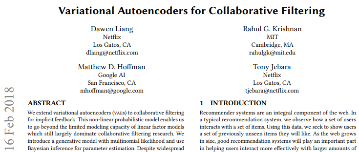
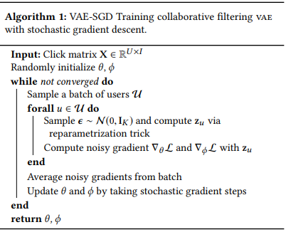
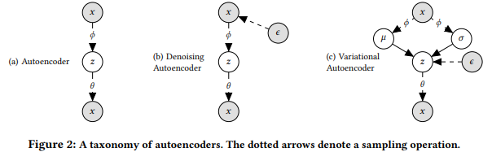
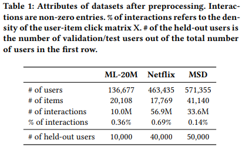
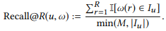
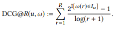
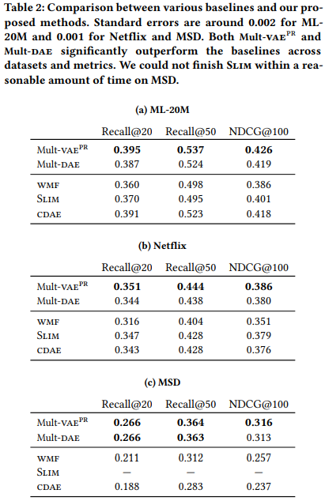
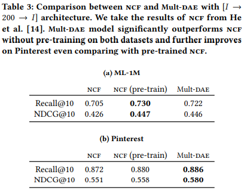
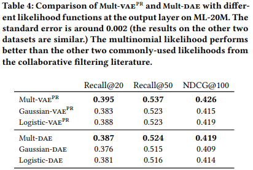
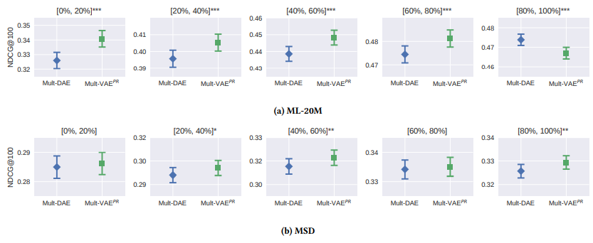

## 2018_VACF [Variational Autoencoders for Collaborative Filtering]

---

### ABSTRACT
* 암시적 피드백을 위한 변형 자동 인코더(VAEs) > [확장] > 협업 필터링  
  * non-linear probabilistic model  
  * 파라미터 추론: multinomial likelihood 생성적 모델, 베이지안 추론  
  * learning objective: regularization parameter  
  * 파라미터 조정: annealing  
  * 결과 모델/학습 알고리즘: 최대 엔트로피 판별, 정보 병목 원리  

---

### KEYWORDS
* Recommender systems, collaborative filtering, implicit feedback, variational autoencoder, Bayesian models  

---

### 1. INTRODUCTION
* 기존 모델의 특성: 선형, 모델링 용량 제한됨  
* VAEs: 선형 잠재 요인 모델 일반화, 대규모 데이터 세트에서 신경망으로 구동되는 비선형 확률적 잠재 변수 모델 탐색  
  * a neural generative model with multinomial conditional likelihood  
    * multinomial likelihood: implicit feedback 적합, 순위 손실에 더 가까운 프록시  
* “small-data” problem: 대부분 사용자 - 작은 부분의 항목과 상호작용 > 각 사용자 선호도 추론  
* (user-item 통계적 강도 공유) 확률적 latent-variable model: 사용자 sparse signals 사용, 과적합 방지   
* VAEs 필수적 조정(2):  
  * 데이터 분포: multinomial likelihood  
  * (over-정규화) standard vae objective: 재해석 및 조정 > 학습 알고리즘 - 정보 병목 원리 및 최대 엔트로피 판별 간 연결 도출   

---

### 2. METHOD  
* user-by-item matrix  
  *    

    * : 사용자의 각 항목에 대한 클릭 수를 갖는 bag-of-words 벡터(이진화)  

#### 2.1 Model
* 사용자 model: standard Gaussian prior > (샘플링) > k-차원 잠재 표현()  
  * : 비선형 함수() > (변환) > 아이템(I) 클릭 기록( 확률분포   
  * .PNG)     
    * : 비선형함수, 매개변수 θ를 갖는 다층 퍼셉트론  
    * 출력: softmax 함수(정규화)
      * : (I-1)-simplex    
* : 사용자 총 클릭 수       
  * : 관찰된 bag-of-words vector  
    * (가정) 확률이  인 다항분포에서 샘플링  

This generative model generalizes the latentfactor model — we can recover classical matrix factorization by setting fθ(·) to be linear and using a Gaussian likelihood.
이 생성 모델은 잠재 인자 모델을 일반화합니다. fθ(·)를 선형으로 설정하고 가우스 우도를 사용하여 고전적인 행렬 분해를 복구할 수 있습니다. 

* .PNG)    

The log-likelihood for user u (conditioned on the latent representation) is:
This multinomial likelihood is commonly used in language models, e.g., latent Dirichlet allocation, and economics, e.g., multinomial logit choice model. 
사용자 u의 로그 가능성(잠재 표현에 따라 결정됨)은 다음과 같습니다.
이 다항 가능성은 언어 모델(예: 잠재 Dirichlet 할당) 및 경제학(예: 다항 로짓 선택 모델)에서 일반적으로 사용됩니다.

It is also used in the cross-entropy loss2 for multi-class classification. 
다중 클래스 분류를 위한 교차 엔트로피 손실2에도 사용됩니다.

For example, it has been used in recurrent neural networks for session-based sequential recommendation and in feedward neural networks applied to Youtube recommendation. 
예를 들어, 세션 기반 순차 추천을 위한 순환 신경망과 유튜브 추천에 적용된 피드워드 신경망에서 사용되었습니다.

The multinomial likelihood is less well studied in the context of latent-factor models such as matrix factorization and autoencoders. 
다항 가능성은 행렬 분해 및 자동 인코더와 같은 잠재 요인 모델의 맥락에서 덜 연구됩니다.

A notable exception is the collaborative competitive filtering (CCF) model and its successors, which take advantage of more fine-grained information about what options were presented to which users. 
(If such information is available, it can also be incorporated into our vae-based approach.)
주목할만한 예외는 CCF(Collaborative Competitive Filtering) 모델과 그 후속 모델로, 어떤 사용자에게 어떤 옵션이 제공되었는지에 대한 보다 세분화된 정보를 활용합니다.
(이러한 정보를 사용할 수 있는 경우 vae 기반 접근 방식에도 통합할 수 있습니다.)

We believe the multinomial distribution is well suited to modeling click data. 
다항 분포는 클릭 데이터를 모델링하는 데 적합합니다.

The likelihood of the click matrix (Eq. 2) rewards the model for putting probability mass on the non-zero entries in xu . 
클릭 행렬의 가능성(Eq. 2)은 xu 의 0이 아닌 항목에 확률 질량을 두는 모델에 대해 보상합니다.

But the model has a limited budget of probability mass, since π(zu ) must sum to 1; the items must compete for this limited budget. 
그러나 π(zu )의 합이 1이 되어야 하기 때문에 모델에는 확률 질량의 제한된 예산이 있습니다. 품목은 이 제한된 예산을 놓고 경쟁해야 합니다.

The model should therefore assign more probability mass to items that are more likely to be clicked. 
따라서 모델은 클릭할 가능성이 더 높은 항목에 더 많은 확률 질량을 할당해야 합니다.

To the extent that it can, it will perform well under the top-N ranking loss that recommender systems are commonly evaluated on.
가능한 한 추천 시스템이 일반적으로 평가되는 상위 N 순위 손실 아래에서 잘 수행됩니다.

By way of comparison, we present two popular choices of likelihood functions used in latent-factor collaborative filtering: Gaussian and logistic likelihoods. Define fθ(zu ) ≡ [fu1, . . . , fu I]⊤ as the output of the generative function fθ(·). 
비교를 위해 잠재 요인 협업 필터링에 사용되는 가능성 함수의 두 가지 인기 있는 선택인 가우스 및 로지스틱 가능성을 제시합니다. fθ(zu ) ≡ [fu1, . . . , fu I]⊤는 생성 함수 fθ(·)의 출력입니다.

The Gaussian log-likelihood for user u is 
사용자 u에 대한 가우스 로그 가능성은 다음과 같습니다. 

* .PNG)    

We adopt the convention in Hu et al. and introduce a “confidence” weight cxu i ≡ cui where c1 > c0 to balance the unobserved 0’s which far outnumber the observed 1’s in most click data. 
우리는 Hu et al. 그리고 대부분의 클릭 데이터에서 관찰된 1보다 훨씬 많은 관찰되지 않은 0의 균형을 맞추기 위해 "신뢰도" 가중치 cxu i ≡ cui를 도입합니다. 여기서 c1 > c0입니다.

This is also equivalent to training the model with unweighted Gaussian likelihood and negative sampling. 
이는 가중치가 적용되지 않은 가우스 우도 및 음수 샘플링으로 모델을 훈련하는 것과 동일합니다.

The logistic log-likelihood 3 for user u is 
사용자 u에 대한 로지스틱 로그 가능성 3은 다음과 같습니다.
* .PNG)   
where σ(x) = 1/(1 + exp(−x)) is the logistic function. 
여기서 σ(x) = 1/(1 + exp(−x))는 로지스틱 함수입니다.

We compare multinomial likelihood with Gaussian and logistic in Section 4.
섹션 4에서 다항 가능성을 가우스 및 로지스틱과 비교합니다. 

#### 2.2 Variational inference
To learn the generative model in Eq. 1, we are interested in estimating θ (the parameters of fθ(·)). 
Eq.에서 생성 모델을 학습하려면 1, 우리는 θ(fθ(·)의 매개변수)를 추정하는 데 관심이 있습니다.

To do so, for each data point we need to approximate the intractable posterior distribution p(zu | xu ). 
그렇게 하려면 각 데이터 포인트에 대해 다루기 힘든 사후 분포 p(zu | xu )를 근사해야 합니다.

We resort to variational inference. 
우리는 변이 추론에 의존합니다.

Variational inference approximates the true intractable posterior with a simpler variational distribution q(zu ). 
변형 추론은 더 간단한 변형 분포 q(zu )를 사용하여 실제 다루기 힘든 사후값을 근사합니다.

We set q(zu ) to be a fully factorized (diagonal) Gaussian distribution:
(수식)
The objective of variational inference is to optimize the free variational parameters {µu,σ2u} so that the Kullback-Leiber divergence KL(q(zu )∥p(zu |xu )) is minimized.
q(zu )를 완전히 인수분해(대각선) 가우스 분포로 설정합니다.
(수식)
변동 추론의 목적은 자유 변동 매개변수 {µu,σ2u}를 최적화하여 Kullback-Leiber 발산 KL(q(zu )∥p(zu |xu))이 최소화되도록 하는 것입니다. 

##### 2.2.1 Amortized inference and the variational autoencoder: 

With variational inference the number of parameters to optimize {µu,σ2u} grows with the number of users and items in the dataset. 
변형 추론을 통해 {µu,σ2u}를 최적화하기 위한 매개변수의 수는 데이터세트의 사용자 및 항목 수와 함께 증가합니다.

This can become a bottleneck for commercial recommender systems with millions of users and items. 
이는 수백만 명의 사용자와 항목이 있는 상업용 추천 시스템에 병목 현상이 될 수 있습니다.

The variational autoencoder (vae) replaces individual variational parameters with a data-dependent function (commonly called an inference model):
(수식)
변형 자동 인코더(vae)는 개별 변형 매개변수를 데이터 종속 함수(일반적으로 추론 모델이라고 함)로 바꿉니다.
(수식)

parametrized by ϕ with both µϕ(xu ) and σϕ(xu ) being K-vectors and sets the variational distribution as follows:
(수식)
µϕ(xu ) 및 σϕ(xu )가 모두 K-벡터인 ϕ로 매개변수화되고 다음과 같이 변동 분포를 설정합니다.
(수식)

That is, using the observed data xu as input, the inference model outputs the corresponding variational parameters of variational distribution qϕ(zu | xu ), which, when optimized, approximates the intractable posterior p(zu | xu ).
즉, 관찰된 데이터 xu를 입력으로 사용하여 추론 모델은 최적화될 때 다루기 힘든 사후 p(zu | xu)에 근접하는 변동 분포 qϕ(zu | xu)의 해당 변동 매개변수를 출력합니다.

Putting qϕ(zu | xu ) and the generative model pθ (xu | zu ) together in Figure 2c, we end up with a neural architecture that resembles an autoencoder — hence the name variational autoencoder.
그림 2c에서 qϕ(zu | xu ) 및 생성 모델 pθ(xu | zu )를 함께 넣으면 자동 인코더와 유사한 신경 아키텍처가 생성됩니다. 따라서 변형 자동 인코더라는 이름이 붙습니다.

VAEs make use of amortized inference: they flexibly reuse inferences to answer related new problems. 
VAEs는 분할된 추론을 사용합니다. 추론을 유연하게 재사용하여 관련된 새로운 문제에 답합니다.

This is well aligned with the ethos of collaborative filtering: analyze user preferences by exploiting the similarity patterns inferred from past experiences.
이는 협업 필터링의 정신과 잘 일치합니다. 과거 경험에서 추론된 유사성 패턴을 활용하여 사용자 선호도를 분석합니다.

In Section 2.4, we discuss how this enables us to perform prediction efficiently.
2.4절에서 이것이 어떻게 우리가 예측을 효율적으로 수행할 수 있게 하는지 논의합니다.

Learning VAEs: As is standard when learning latent-variable models with variational inference , we can lower-bound the log marginal likelihood of the data. 
학습 변수: 변동 추론으로 잠재 변수 모델을 학습할 때 표준으로 데이터의 로그 한계 가능성을 하한으로 설정할 수 있습니다.

This forms the objective we seek to maximize for user u (the objective function of the dataset is obtained by averaging the objective function over all the users):
이것은 우리가 사용자 u에 대해 최대화하려는 목적을 형성합니다(데이터 세트의 목적 함수는 모든 사용자에 대한 목적 함수의 평균을 냄으로써 얻음). 

* .PNG)   

This is commonly known as the evidence lower bound (elbo). 
이것은 일반적으로 증거 하한(elbo)으로 알려져 있습니다.

Note that the elbo is a function of both θ and ϕ. 
엘보는 θ와 ϕ 모두의 함수입니다.

We can obtain an unbiased estimate of elbo by sampling zu ∼ qϕ and perform stochastic gradient ascent to optimize it. 
zu ~ qϕ를 샘플링하여 elbo의 편향되지 않은 추정치를 얻고 이를 최적화하기 위해 확률적 기울기 상승을 수행할 수 있습니다.

However, the challenge is that we cannot trivially take gradients with respect to ϕ through this sampling process. 
그러나 문제는 이 샘플링 프로세스를 통해 ϕ에 대한 기울기를 사소하게 취할 수 없다는 것입니다.

The reparametrization trick sidesteps this issue: we sample ϵ ∼ N (0, IK ) and reparametrize zu = µϕ(xu ) + ϵ ⊙ σϕ(xu ).
재매개변수화 트릭은 이 문제를 회피합니다. ϵ ∼ N (0, IK )을 샘플링하고 zu = µϕ(xu ) + ϵ ⊙ σϕ(xu )를 재매개변수화합니다.

By doing so, the stochasticity in the sampling process is isolated and the gradient with respect to ϕ can be back-propagated through the sampled zu . 
그렇게 함으로써, 샘플링 과정의 확률이 격리되고 ϕ에 대한 기울기가 샘플링된 zu를 통해 역전파될 수 있습니다.

The vae training procedure is summarized in Algorithm 1. 
vae 훈련 절차는 알고리즘 1에 요약되어 있습니다. 
*     

#### 2.2.2 Alternative interpretation of elbo. 

We can view elbo defined in Eq5 from a different perspective: the first term can be interpreted as (negative) reconstruction error, while the second KL term can be viewed as regularization. 
Eq.5에 정의된 elbo를 다른 관점에서 볼 수 있습니다. 첫 번째 항은 (음의) 재구성 오류로 해석될 수 있고 두 번째 KL 항은 정규화로 볼 수 있습니다.

It is this perspective we work with because it allows us to make a trade-off that forms the crux of our method. 
우리가 작업하는 것은 이 관점이 우리 방법의 핵심을 형성하는 절충안을 만들 수 있게 해주기 때문입니다.

From this perspective, it is natural to extend the elbo by introducing a parameter β to control the strength of
regularization:
이러한 관점에서 β의 강도를 제어하기 위해 파라미터 β를 도입하여 엘보를 확장하는 것은 당연하다.
정규화:
* .PNG)    
While the original vae (trained with elbo in Eq. 5) is a powerful generative model; we might ask whether we need all the statistical properties of a generative model for tackling problems in recommender systems. 
원래 vae(Eq. 5에서 elbo로 훈련됨)는 강력한 생성 모델입니다. 추천 시스템의 문제를 해결하기 위해 생성 모델의 모든 통계적 속성이 필요한지 여부를 물어볼 수 있습니다.

In particular, if we are willing to sacrifice the ability to perform ancestral sampling, can we improve our performance? The regularization view of the elbo (Eq. 6) introduces a trade-off between how well we can fit the data and how close the approximate posterior stays to the prior during learning.
특히, 조상 샘플링을 수행하는 능력을 기꺼이 희생한다면 성능을 향상시킬 수 있습니까? 엘보의 정규화 보기(Eq. 6)는 데이터를 얼마나 잘 맞출 수 있는지와 학습하는 동안 대략적인 사후 사후가 사전에 얼마나 가깝게 유지되는지 사이의 절충안을 소개합니다.

We propose using β , 1. 
우리는 β , 1을 사용할 것을 제안합니다. 

This means we are no longer optimizing a lower bound on the log marginal likelihood. 
이것은 우리가 더 이상 로그 한계 가능성의 하한을 최적화하지 않는다는 것을 의미합니다.

If β < 1, then we are also weakening the influence of the prior constraint 1 U Í u q(z | xu ) ≈ p(z) = N (z; 0, IK ); this means that the model is less able to generate novel user histories by ancestral sampling.
β < 1이면 이전 제약 조건 1 U Í u q(z | xu ) ≈ p(z) = N (z; 0, IK )의 영향도 약화됩니다. 이는 모델이 조상 샘플링을 통해 새로운 사용자 기록을 생성할 수 없음을 의미합니다.

But ultimately our goal is to make good recommendations, not to maximize likelihood or generate imagined user histories. 
그러나 궁극적으로 우리의 목표는 가능성을 최대화하거나 상상의 사용자 기록을 생성하는 것이 아니라 좋은 추천을 하는 것입니다.

Treating β as a free regularization parameter therefore costs us nothing, and, as we will see, yields significant improvements in performance. 
따라서 β를 자유 정규화 매개변수로 취급하는 것은 비용이 들지 않으며 앞으로 보게 되겠지만 성능이 크게 향상됩니다.

Selecting β: We propose a simple heuristic for setting β: we start training with β = 0, and gradually increase β to 1. 
β 선택: β 설정을 위한 간단한 휴리스틱을 제안합니다. β = 0으로 훈련을 시작하고 점차적으로 β를 1로 증가시킵니다.

We linearly anneal the KL term slowly over a large number of gradient updates to θ,ϕ and record the best β when its performance reaches the peak.
KL 항을 θ, ϕ에 대한 많은 기울기 업데이트에 걸쳐 천천히 선형으로 어닐링하고 성능이 최고점에 도달할 때 최상의 β를 기록합니다.

We found this method to work well and it does not require the need for training multiple models with different values of β, which can be time-consuming. 
우리는 이 방법이 잘 작동하며 β 값이 다른 여러 모델을 훈련할 필요가 없다는 것을 알았습니다. 이는 시간이 많이 소요될 수 있습니다.

Our procedure is inspired by KL annealing, a common heuristic used for training VAEs when there is concern that the model is being underutilized.
우리의 절차는 모델이 충분히 활용되지 않는다는 우려가 있을 때 VAEs를 훈련하는 데 사용되는 일반적인 휴리스틱인 KL 어닐링에서 영감을 받았습니다.

igure 1 illustrates the basic idea (we observe the same trend consistently across datasets). 
그림 1은 기본 아이디어를 보여줍니다(데이터 세트 전체에서 동일한 추세를 일관되게 관찰함).

Here we plot the validation ranking metric without KL annealing (blue solid) and with KL annealing all the way to β = 1 (green dashed, β reaches 1 at around 80 epochs). 
여기에서 KL 어닐링(파란색 실선)을 사용하지 않고 KL 어닐링을 사용하여 β = 1(녹색 점선, β는 약 80 epoch에서 1에 도달)까지 검증 순위 메트릭을 플로팅합니다.

As we can see, the performance is poor without any KL annealing.
보시다시피, KL 어닐링이 없으면 성능이 좋지 않습니다.

With annealing, the validation performance first increases as the training proceeds and then drops as β gets close to 1 to a value that is only slightly better than doing no annealing at all.
어닐링을 사용하면 먼저 훈련이 진행됨에 따라 검증 성능이 증가하고 β가 1에 가까워지면 어닐링을 전혀 수행하지 않는 것보다 약간 더 나은 값으로 떨어집니다. 

Having identified the best β based on the peak validation metric, we can retrain the model with the same annealing schedule, but stop increasing β after reaching that value (shown as red dot-dashed in Figure 1).5 
피크 검증 메트릭을 기반으로 최상의 β를 식별하면 동일한 어닐링 일정으로 모델을 재학습할 수 있지만 해당 값에 도달한 후 β 증가를 중지할 수 있습니다(그림 1에서 빨간색 점선으로 표시).5

This might be sub-optimal compared to a thorough grid search. 
이것은 철저한 그리드 검색에 비해 차선책일 수 있습니다.

However, it is much more efficient, and gives us competitive empirical performance. 
그러나 훨씬 더 효율적이며 경쟁력 있는 경험적 성능을 제공합니다.

If the computational budget is scarce, then within a single run, we can stop increasing β when we notice the validation metric dropping. 
계산 예산이 부족한 경우 단일 실행 내에서 검증 메트릭이 떨어지는 것을 알아차릴 때 β 증가를 멈출 수 있습니다.

Such a procedure incurs no additional runtime to learning a standard vae. 
이러한 절차는 표준 vae 학습에 추가 런타임을 발생시키지 않습니다.

We denote this partially regularized vae with multinomial likelihood as Mult-vae^{pr}.
다항 가능성이 있는 이 부분적으로 정규화된 vae를 Mult-vae^{pr}로 표시합니다. 
FIg1

#### 2.2.3 Computational Burden. 

Previous collaborative filtering models with neural networks are trained with stochastic gradient descent where in each step a single (user, item) entry from the click matrix is randomly sampled to perform a gradient update. 
신경망이 있는 이전 협업 필터링 모델은 각 단계에서 클릭 행렬의 단일(사용자, 항목) 항목이 무작위로 샘플링되어 기울기 업데이트를 수행하는 확률적 기울기 하강법으로 훈련되었습니다.

In Algorithm 1 we subsample users and take their entire click history (complete rows of the click matrix) to update model parameters. 
알고리즘 1에서는 사용자를 하위 샘플링하고 전체 클릭 기록(클릭 매트릭스의 전체 행)을 가져와 모델 매개변수를 업데이트합니다.

This eliminates the necessity of negative sampling (and consequently the hyperparameter tuning for picking the number of negative examples), commonly used in the (user, item) entry subsampling scheme.
이것은 (user, item) entry subsampling 방식에서 일반적으로 사용되는 negative 샘플링의 필요성을 없애줍니다.

A computational challenge that comes with our approach, however, is that when the number of items is huge, computing the multinomial probability π(zu ) could be computationally expensive, since it requires computing the predictions for all the items for normalization. 
그러나 우리의 접근 방식과 함께 제공되는 계산 문제는 항목 수가 많을 때 정규화를 위해 모든 항목에 대한 예측을 계산해야 하기 때문에 다항 확률 π(zu )을 계산하는 것이 계산 비용이 많이 들 수 있다는 것입니다.

This is a common challenge for language modeling where the size of the vocabulary is in the order of millions or more. 
이것은 어휘의 크기가 수백만 이상인 언어 모델링의 일반적인 문제입니다.

In our experiments on some medium-to-large datasets with less than 50K items (Section 4.1), this has not yet come up as a computational bottleneck. 
항목이 50,000개 미만인 일부 중대형 데이터 세트에 대한 실험(섹션 4.1)에서 이것은 아직 계산상의 병목 현상으로 나타나지 않았습니다.

If this becomes a bottleneck when working with larger item sets, one can easily apply the simple and effective method proposed by Botev et al. to approximate the normalization factor for π(zu ).
이것이 더 큰 항목 세트로 작업할 때 병목 현상이 발생하면 Botev et al.에서 제안한 간단하고 효과적인 방법을 쉽게 적용할 수 있습니다. π(zu )에 대한 정규화 인수를 근사화합니다. 

### 2.3 A taxonomy of autoencoders
In Section 2.2, we introduced maximum marginal likelihood estimation of VAEs using approximate Bayesian inference under a non-linear generative model (Eq. 1). 
2.2절에서 우리는 비선형 생성 모델(식 1)에서 근사 베이지안 추론을 사용하여 VAEs의 최대 한계 우도 추정을 소개했습니다.

We now describe our work from the perspective of learning autoencoders. 
이제 오토인코더 학습의 관점에서 작업을 설명합니다.

Maximum-likelihood estimation in a regular autoencoder takes the following form:
일반 자동 인코더의 최대 가능성 추정은 다음 형식을 취합니다. 

* .PNG)    

There are two key distinctions of note: (1) The autoencoder (and denoising autoencoder) effectively optimizes the first term in the vae objective (Eq. 5 and Eq. 6) using a delta variational distribution qϕ(zu | xu ) = δ(zu − дϕ(xu )) — it does not regularize qϕ(zu | xu ) towards any prior distribution as the vae does. 
참고 사항에는 두 가지 주요 차이점이 있습니다. (1) 자동 인코더(및 잡음 제거 자동 인코더)는 델타 변동 분포 qϕ(zu | xu ) = δ( zu − дϕ(xu )) — vae가 하는 것처럼 사전 분포에 대해 qϕ(zu | xu )를 정규화하지 않습니다.

(2) the δ(zu −дϕ(xu )) is a δ distribution with mass only at the output of дϕ(xu ). 
(2) δ(zu −дϕ(xu ))는 дϕ(xu )의 출력에서만 질량을 갖는 δ 분포입니다.

Contrast this to the vae, where the learning is done using a variational distribution, i.e., дϕ(xu ) outputs the parameters (mean and variance) of a Gaussian distribution. 
학습이 변이 분포를 사용하여 수행되는 vae와 대조됩니다. 즉, дϕ(xu )는 가우스 분포의 매개변수(평균 및 분산)를 출력합니다.

This means that vae has the ability to capture per-data-point variances in the latent state zu .
이는 vae가 잠재 상태 zu 에서 데이터 포인트별 변동을 캡처할 수 있음을 의미합니다.

In practice, we find that learning autoencoders is extremely prone to overfitting as the network learns to put all the probability mass to the non-zero entries in xu . 
실제로, 우리는 네트워크가 xu 의 0이 아닌 항목에 모든 확률 질량을 넣는 방법을 배우기 때문에 학습 오토인코더가 과적합되기 매우 쉽다는 것을 발견했습니다.

By introducing dropout at the input layer, the denoising autoencoder (dae) is less prone to overfitting and we find that it also gives competitive empirical results. 
입력 레이어에 드롭아웃을 도입함으로써 노이즈 제거 자동 인코더(dae)가 과적합되는 경향이 줄어들고 경쟁력 있는 경험적 결과를 얻을 수도 있습니다.

In addition to the Mult-vaepr, we also study a denoising autoencoder with a multinomial likelihood. 
Mult-vaepr 외에도 다항 가능성이 있는 잡음 제거 자동 인코더도 연구합니다.

We denote this model Mult-dae. 
우리는 이 모델을 물대라고 표시합니다.

In Section 4 we characterize the tradeoffs in what is gained and lost by explicitly parameterizing the per-user variance with Mult-vaepr versus using a point-estimation in Mult-dae.
섹션 4에서 우리는 Mult-vaepr과 Mult-dae의 포인트 추정을 사용하여 사용자별 분산을 명시적으로 매개변수화하여 얻은 것과 손실되는 것의 트레이드오프를 특성화합니다.

To provide a unified view of different variants of autoencoders and clarify where our work stands, we depict variants of autoencoders commonly found in the literature in Figure 2. 
다양한 자동 인코더 변형에 대한 통합된 보기를 제공하고 작업의 위치를 ​​명확히 하기 위해 그림 2의 문헌에서 일반적으로 발견되는 자동 인코더 변형을 설명합니다.

For each one, we specify the model (dotted arrows denote a sampling operation) and describe the training objective used in parameter estimation.
각각에 대해 모델을 지정하고(점선 화살표는 샘플링 작업을 나타냄) 매개변수 추정에 사용되는 훈련 목표를 설명합니다.

In Figure 2a we have autoencoder. 
그림 2a에는 자동 인코더가 있습니다.

It is trained to reconstruct input with the same objective as in Eq. 7. 
Eq.와 같은 목적으로 입력을 재구성하도록 훈련됩니다. 7. 

Adding noise to the input (or the intermediate hidden representation) of an autoencoder yields the denoising autoencoder in Figure 2b. 
자동 인코더의 입력(또는 중간 숨겨진 표현)에 노이즈를 추가하면 그림 2b의 잡음 제거 자동 인코더가 생성됩니다.

The training objective is the same as that of an autoencoder. 
훈련 목표는 자동 인코더의 목표와 동일합니다.

Mult-dae belongs to this model class. 
멀티대는 이 모델 클래스에 속합니다.

Collaborative denoising autoencoder is a variant of this model class. 
Collaborative denoising autoencoder는 이 모델 클래스의 변형입니다.

The vae is depicted in Figure 2c. 

Rather than using a delta variational distribution, it uses an inference model parametrized by ϕ to produce the mean and variance of the approximating variational distribution. 
vae는 그림 2c에 나와 있습니다.

델타 변동 분포를 사용하는 대신 ϕ로 매개변수화된 추론 모델을 사용하여 근사 변동 분포의 평균과 분산을 생성합니다.

The training objective of the vae is given in Eq. 6. 
vae의 훈련 목표는 Eq. 6.

Setting β to 1 recovers the original vae formulation. 
β를 1로 설정하면 원래의 vae 공식이 복구됩니다.

Higgins et al. study the case where β > 1. 
Higgins et al. β > 1인 경우를 연구합니다.

Our model, Mult-vaepr corresponds to learning VAEs with β ∈ [0, 1]. 
우리 모델 Mult-vaepr은 β ∈ [0, 1]인 학습 VAEs에 해당합니다. 

#### 2.4 Prediction
We now describe how we make predictions given a trained generative model of the form Eq. 1. 
이제 Eq 형식의 훈련된 생성 모델이 주어졌을 때 예측을 하는 방법을 설명합니다. 1.

For both, Mult-vaepr (Section 2.2) 
둘 다에 대해 멀티 베이프(섹션 2.2)

*     
or Mult-dae (Section 2.3), we make predictions in the same way. 
무화과2
또는 물대(2.3절)에서도 같은 방식으로 예측합니다.

Given a user’s click history x, we rank all the items based on the un-normalized predicted multinomial probability fθ(z). 
사용자의 클릭 기록 x가 주어지면 정규화되지 않은 예측된 다항 확률 fθ(z)를 기반으로 모든 항목의 순위를 지정합니다.

The latent representation z for x is constructed as follows: For Mult-vaepr, we simply take the mean of the variational distribution z = µϕ(x); for Mult-dae, we take the output z = дϕ(x). 
x에 대한 잠재 표현 z는 다음과 같이 구성됩니다. Mult-vaepr의 경우 단순히 변동 분포 z = µϕ(x)의 평균을 취합니다. Mult-dae의 경우 출력 z = дϕ(x)를 취합니다.

It is easy to see the advantage of using autoencoders. 
오토인코더를 사용하는 이점은 쉽게 알 수 있습니다.

We can effectively make predictions for users by evaluating two functions – the inference model (encoder) дϕ(·) and the generative model (decoder) fθ(·). 
추론 모델(인코더) дϕ(·) 및 생성 모델(디코더) fθ(·)의 두 가지 기능을 평가하여 사용자를 효과적으로 예측할 수 있습니다.

For most of the latent factor collaborative filtering model, e.g., matrix factorization, when given the click history of a user that is not present in the training data, normally we need to perform some form of optimization to obtain the latent factor for this user. 
행렬 분해와 같은 대부분의 잠재 요인 협업 필터링 모델의 경우 훈련 데이터에 없는 사용자의 클릭 기록이 주어지면 일반적으로 이 사용자에 대한 잠재 요인을 얻기 위해 어떤 형태의 최적화를 수행해야 합니다.

This makes the use of autoencoders particularly attractive in industrial applications, where it is important that predictions be made cheaply and with low latency.
따라서 자동인코더의 사용은 저렴하고 짧은 대기 시간으로 예측을 수행하는 것이 중요한 산업 응용 분야에서 특히 매력적입니다. 

---
### 3. RELATED WORK
VAEs on sparse data. 
희소 데이터에 대한 VAEs.

Variational autoencoders (VAEs) have seen much application to images since their inception. 
Variational autoencoder(VAEs)는 처음부터 이미지에 많이 적용되었습니다.

Doersch presents a review on different applications of vae to image data. 
Doersch는 이미지 데이터에 대한 다양한 응용 프로그램에 대한 리뷰를 제공합니다.

Miao et al. study VAEs on text data. 
Miao et al. 텍스트 데이터를 연구합니다.

More recent results from Krishnan et al. find that VAEs (trained with Eq. 5) suffer from underfitting when modeling large, sparse, high-dimensional data. 
Krishnan et al.의 최근 결과. VAEs(Eq. 5로 훈련됨)는 크고 희소한 고차원 데이터를 모델링할 때 underfitting 문제를 겪습니다.

We notice similar issues when fitting vae without annealing (Figure 1) or annealing to β = 1. 
어닐링 없이(그림 1) vae를 피팅하거나 β = 1로 어닐링할 때 유사한 문제가 있음을 알 수 있습니다.

By giving up the ability to perform ancestral sampling in the model, and setting β ≤ 1, the resulting model is no longer a proper generative model though for collaborative filtering tasks we always make predictions conditional on users’ click history.
모델에서 조상 샘플링을 수행하는 기능을 포기하고 β ≤ 1로 설정하면 결과 모델은 더 이상 적절한 생성 모델이 아니지만 협업 필터링 작업의 경우 항상 사용자의 클릭 기록을 조건으로 예측합니다.

Information-theoretic connection with vae. 
vae와의 정보 이론적 연결.

The regularization view of the elbo in Eq. 6 resembles maximum-entropy discrimination. 
Eq.에서 엘보의 정규화 보기. 6은 최대 엔트로피 판별과 유사합니다.

Maximum-entropy discrimination attempts to combine discriminative estimation with Bayesian inference and generative modeling. 
최대 엔트로피 판별은 판별 추정과 베이지안 추론 및 생성 모델링을 결합하려고 시도합니다.

In our case, in Eq. 6, β acts as a knob to balance discriminative and generative aspects of the model. 
우리의 경우 Eq. 6, β는 모델의 차별적 측면과 생성적 측면의 균형을 맞추는 손잡이 역할을 합니다.

The procedure in Eq. 6 has information-theoretic connections described in Alemi et al. 
식의 절차 6은 Alemi et al.에 설명된 정보 이론적인 연결을 가지고 있습니다.

The authors propose the deep variational information bottleneck, which is a variational approximation to the information bottleneck principle . 
저자는 정보 병목 현상 원리에 대한 변형 근사치인 깊은 변형 정보 병목 현상을 제안합니다.

They show that as a special case they can recover the learning objective used by VAEs. 
그들은 특별한 경우로 VAEs가 사용하는 학습 목표를 복구할 수 있음을 보여줍니다.

They report more robust supervised classification performance with β < 1. 
그들은 β < 1로 더 강력한 지도 분류 성능을 보고합니다.

This is consistent with our findings as well. 
이것은 우리의 연구 결과와도 일치합니다. 

Higgins et al. proposed β-vae, which leads to the same objective as Eq. 6. 
Higgins et al. 제안된 β-vae는 Eq6과 동일한 목적으로 이어집니다.

They motivate β-vae for the goal of learning disentangled representations from images (basic visual concepts, such as shape, scale, and color). 
그것들은 이미지에서 분리된 표현(모양, 규모, 색상과 같은 기본 시각적 개념)을 학습하는 목표를 위해 β-va에 동기를 부여합니다.

Their work, however, sets β ≫ 1, effectively imposing a stronger independent prior assumption on the latent code z. 
그러나 그들의 작업은 β ≫ 1을 설정하여 잠재적인 코드 z에 대해 더 강력하고 독립적인 사전 가정을 효과적으로 부과합니다.

While their motivations are quite different from ours, it is interesting to note orthogonal lines of research emerging from exploring the full spectrum of values for β.
그들의 동기는 우리와 상당히 다르지만 β 값의 전체 스펙트럼을 탐색하면서 나타나는 직교 연구 라인에 주목하는 것은 흥미로울 것입니다.

Neural networks for collaborative filtering. 
협업 필터링을 위한 신경망.

Early work on neural-network-based collaborative filtering models focus on explicit feedback data and evaluates on the task of rating predictions . 
신경망 기반 협업 필터링 모델에 대한 초기 작업은 명시적 피드백 데이터에 중점을 두고 예측 평가 작업을 평가합니다.

The importance of implicit feedback has been gradually recognized, and consequently most recent research, such as this work, has focused on it. 
암묵적 피드백의 중요성은 점차 인식되고 있으며, 이에 따라 본 연구와 같은 가장 최근의 연구에서도 이에 초점을 맞추고 있다.

The two papers that are most closely related to our approaches are collaborative denoising autoencoder and neural collaborative filtering.
우리의 접근 방식과 가장 밀접하게 관련된 두 개의 논문은 협업 잡음 제거 자동 인코더와 신경 협업 필터링입니다.

Collaborative denoising autoencoder (cdae) augments the standard denoising autoencoder, described in Section 2.3, by adding a per-user latent factor to the input. 
cdae(Collaborative denoising autoencoder)는 입력에 사용자별 잠재 요소를 추가하여 섹션 2.3에 설명된 표준 잡음 제거 자동 인코더를 확장합니다.

The number of parameters of the cdae model grows linearly with both the number of users as well as the number of items, making it more prone to overfitting. 
cdae 모델의 매개변수 수는 사용자 수와 항목 수에 따라 선형적으로 증가하므로 과적합에 더 취약합니다.

In contrast, the number of parameters in the vae grows linearly with the number of items. 
대조적으로, vae의 매개변수 수는 항목 수에 따라 선형적으로 증가합니다.

The cdae also requires additional optimization to obtain the latent factor for unseen users to make predicion.
cdae는 또한 보이지 않는 사용자가 예측을 할 수 있는 잠재 요소를 얻기 위해 추가 최적화가 필요합니다.

In the paper, the authors investigate the Gaussian and logistic likelihood loss functions — as we show, the multinomial likelihood is significantly more robust for use in recommender systems. 
이 논문에서 저자는 가우스 및 로지스틱 우도 손실 함수를 조사했습니다. 우리가 보여주듯이 다항 우도는 추천 시스템에서 사용하기에 훨씬 더 강력합니다. 

Neural collaborative filtering (ncf) explore a model with non-linear interactions between the user and item latent factors rather than the commonly used dot product. 
Neural Collaborative Filtering(ncf)은 일반적으로 사용되는 내적보다는 사용자와 항목 잠재 요인 간의 비선형 상호 작용이 있는 모델을 탐색합니다.

The authors demonstrate improvements of ncf over standard baselines on two small datasets. 
저자는 두 개의 작은 데이터 세트에서 표준 기준보다 ncf가 개선되었음을 보여줍니다.

Similar to cdae, the number of parameters of ncf also grows linearly with both the number of users as well as items. 
cdae와 유사하게 ncf의 매개변수 수도 사용자 수와 항목 수에 따라 선형적으로 증가합니다.

We find that this becomes problematic for much larger datasets. 
우리는 이것이 훨씬 더 큰 데이터 세트에서 문제가 된다는 것을 발견했습니다.

We compare with both cdae and ncf in Section 4.
섹션 4에서 cdae와 ncf를 비교합니다.

Asymmetric matrix factorization may also be interpreted as an autoencoder, as elaborated in Steck. 
비대칭 행렬 분해는 Steck에서 자세히 설명한 대로 자동 인코더로 해석될 수도 있습니다.

We can recover this work by setting both fθ(·) and дϕ(·) to be linear.
fθ(·)와 дϕ(·)를 모두 선형으로 설정하여 이 작업을 복구할 수 있습니다.

Besides being applied in session-based sequential recommendation (see Section 2.1), various approaches have applied neural networks to incorporate side information into collaborative filtering models to better handle the cold-start problem.
세션 기반 순차 추천(섹션 2.1 참조)에 적용되는 것 외에도 다양한 접근 방식이 신경망을 적용하여 콜드 스타트 문제를 더 잘 처리하기 위해 협업 필터링 모델에 부가 정보를 통합했습니다.

These approaches are complementary to ours.
이러한 접근 방식은 우리를 보완합니다. 

*     

### 4. EMPIRICAL STUDY
We evaluate the performance of Mult-vaepr and Mult-dae. 
Mult-vaepr 및 Mult-dae의 성능을 평가합니다.

We provide insights into their performance by exploring the resulting fits. 
결과 적합성을 탐색하여 성능에 대한 통찰력을 제공합니다.

We highlight the following results:
• Mult-vaepr achieves state-of-the-art results on three realworld datasets when compared with various baselines, including recently proposed neural-network-based collaborative filtering models.
다음 결과를 강조 표시합니다.
• Mult-vaepr은 최근에 제안된 신경망 기반 협업 필터링 모델을 포함하여 다양한 기준선과 비교할 때 3개의 실제 데이터 세트에 대한 최첨단 결과를 달성합니다.

• For the denoising and variational autoencoder, the multinomial likelihood compares favorably over the more common Gaussian and logistic likelihoods.
• 잡음 제거 및 변형 자동 인코더의 경우 다항 가능성은 보다 일반적인 가우스 및 로지스틱 가능성보다 유리하게 비교됩니다.

• Both Mult-vaepr and Mult-dae produce competitive empirical results. 
• Mult-vaepr과 Mult-dae 모두 경쟁력 있는 실증적 결과를 생성합니다.

We identify when parameterizing the uncertainty explicitly as in Mult-vaepr does better/worse than the point estimate used by Mult-dae and list pros and cons for both approaches.
Mult-vaepr에서와 같이 불확실성을 명시적으로 매개변수화할 때 Mult-dae에서 사용하는 점 추정보다 더 나은/나쁜 것을 식별하고 두 접근 방식에 대한 장단점을 나열합니다.

The source code to reproduce the experimental results is available on GitHub6.
실험 결과를 재현하기 위한 소스 코드는 GitHub6에서 사용할 수 있습니다. 

#### 4.1 Datasets

We study three medium- to large-scale user-item consumption datasets from various domains:
MovieLens-20M (ML-20M): These are user-movie ratings collected from a movie recommendation service. 
다양한 도메인에서 세 가지 중대형 사용자 항목 소비 데이터 세트를 연구합니다.
MovieLens-20M(ML-20M): 영화 추천 서비스에서 수집한 사용자 영화 등급입니다.

We binarize the explicit data by keeping ratings of four or higher and interpret them as implicit feedback. 
4 이상의 등급을 유지하여 명시적 데이터를 이진화하고 암시적 피드백으로 해석합니다.

We only keep users who have watched at least five movies.
최소 5편의 영화를 본 사용자만 유지합니다.

Netflix Prize (Netflix): This is the user-movie ratings data from the Netflix Prize7. 
Netflix Prize(Netflix): Netflix Prize7의 사용자 영화 평점 데이터입니다.

Similar to ML-20M, we binarize explicit data by keeping ratings of four or higher. 
ML-20M과 유사하게 4 이상의 등급을 유지하여 명시적 데이터를 이진화합니다.

We only keep users who have watched at least five movies.
최소 5편의 영화를 본 사용자만 유지합니다.

Million Song Dataset (MSD): This data contains the user-song play counts released as part of the Million Song Dataset. 
Million Song Dataset(MSD): 이 데이터는 Million Song Dataset의 일부로 공개된 사용자 노래 재생 횟수를 포함합니다.

We binarize play counts and interpret them as implicit preference data. 
플레이 횟수를 이진화하고 암시적 선호도 데이터로 해석합니다.

We only keep users with at least 20 songs in their listening history and songs that are listened to by at least 200 users. 
사용자의 청취 기록에 최소 20곡의 노래와 최소 200명의 사용자가 청취한 노래만 보관합니다.

Table 1 summarizes the dimensions of all the datasets after preprocessing.
표 1은 전처리 후 모든 데이터 세트의 차원을 요약한 것입니다. 

#### 4.2 Metrics
We use two ranking-based metrics: Recall@R and the truncated normalized discounted cumulative gain (NDCG@R). 
두 가지 순위 기반 메트릭인 Recall@R과 잘린 정규화 할인 누적 이득(NDCG@R)을 사용합니다.

For each user, both metrics compare the predicted rank of the held-out items with their true rank. 
각 사용자에 대해 두 메트릭 모두 보류 항목의 예측 순위를 실제 순위와 비교합니다.

For both Mult-vaepr and Mult-dae, we get the predicted rank by sorting the un-normalized multinomial probability fθ(z). 
Mult-vaepr 및 Mult-dae 모두에 대해 비정규화 다항 확률 fθ(z)를 정렬하여 예측 순위를 얻습니다.

While Recall@R considers all items ranked within the first R to be equally important, NDCG@R uses a monotonically increasing discount to emphasize the importance of higher ranks versus lower ones. 
Recall@R은 첫 번째 R 내에 순위가 지정된 모든 항목이 동등하게 중요하다고 간주하는 반면 NDCG@R은 단조롭게 증가하는 할인을 사용하여 상위 순위 대 하위 순위의 중요성을 강조합니다.

Formally, define ω(r) as the item at rank r, I[·] is the indicator function, and Iu is the set of held-out items that user u clicked on.
공식적으로 ω(r)를 랭크 r의 항목으로 정의하고, I[·]는 표시기 함수, Iu는 사용자 u가 클릭한 보류 항목의 집합입니다.

Recall@R for user u is 
사용자 u에 대한 Recall@R은 다음과 같습니다.
*     
The expression in the denominator is the minimum of R and the number of items clicked on by user u. 
분모의 식은 R의 최소값과 사용자 u가 클릭한 항목 수입니다.

This normalizes Recall@R to have a maximum of 1, which corresponds to ranking all relevant items in the top R positions.
이렇게 하면 Recall@R이 최대 1이 되도록 정규화되며, 이는 상위 R 위치에서 모든 관련 항목의 순위를 지정하는 데 해당합니다.

Truncated discounted cumulative gain (DCG@R) is
잘린 할인된 누적 이득(DCG@R)은 다음과 같습니다.
*     
NDCG@R is the DCG@R linearly normalized to [0, 1] after dividing by the best possible DCG@R, where all the held-out items are ranked at the top.
NDCG@R은 가능한 최상의 DCG@R로 나눈 후 [0, 1]로 선형으로 정규화된 DCG@R입니다. 여기서 모든 보류 항목은 맨 위에 순위가 지정됩니다. 

#### 4.3 Experimental setup
We study the performance of various models under strong generalization: We split all users into training/validation/test sets. 
우리는 강력한 일반화 하에서 다양한 모델의 성능을 연구합니다. 모든 사용자를 교육/검증/테스트 세트로 분할합니다.

We train models using the entire click history of the training users. 
교육 사용자의 전체 클릭 기록을 사용하여 모델을 교육합니다.

To evaluate, we take part of the click history from held-out (validation and test) users to learn the necessary user-level representations for the model and then compute metrics by looking at how well the model ranks the rest of the unseen click history from the held-out users.
평가하기 위해 보류(검증 및 테스트) 사용자의 클릭 기록에 참여하여 모델에 필요한 사용자 수준 표현을 학습한 다음 모델이 보이지 않는 나머지 클릭 기록의 순위를 얼마나 잘 지정하는지 확인하여 메트릭을 계산합니다. 보류된 사용자로부터.

This is relatively more difficult than weak generalization where the user’s click history can appear during both training and evaluation. 
이것은 훈련과 평가 모두에서 사용자의 클릭 이력이 나타날 수 있는 약한 일반화보다 상대적으로 어렵습니다.

We consider it more realistic and robust as well. 
우리는 또한 더 현실적이고 강력하다고 생각합니다.

In the last row of Table 1, we list the number of held-out users (we use the same number of users for validation and test). 
표 1의 마지막 행에는 보류된 사용자 수가 나열되어 있습니다(검증 및 테스트에 동일한 수의 사용자를 사용함).

For each held-out user, we randomly choose 80% of the click history as the “fold-in” set to learn the necessary user-level representation and report metrics on the remaining 20% of the click history.
보류된 각 사용자에 대해 클릭 기록의 80%를 "접기" 세트로 무작위로 선택하여 필요한 사용자 수준 표현을 학습하고 클릭 기록의 나머지 20%에 대한 측정항목을 보고합니다.

We select model hyperparameters and architectures by evaluating NDCG@100 on the validation users. 
검증 사용자에 대해 NDCG@100을 평가하여 모델 하이퍼파라미터 및 아키텍처를 선택합니다.

For both Mult-vaepr and Mult-dae, we keep the architecture for the generative model fθ(·) and the inference model дϕ(·) symmetrical and explore multilayer perceptron (mlp) with 0, 1, and 2 hidden layers. 
Mult-vaepr 및 Mult-dae 모두에 대해 생성 모델 fθ(·) 및 추론 모델 дϕ(·)에 대한 아키텍처를 대칭으로 유지하고 0, 1 및 2개의 은닉층이 있는 다층 퍼셉트론(mlp)을 탐색합니다.

We set the dimension of the latent representation K to 200 and any hidden layer to 600. 
잠재 표현 K의 차원을 200으로 설정하고 숨겨진 레이어를 600으로 설정합니다.

As a concrete example, recall I is the total number of items, the overall architecture for a Mult-vaepr/Mult-dae with 1-hidden-layer mlp generative model would be [I → 600 → 200 → 600 → I]. 
구체적인 예를 들어, 리콜 I은 총 항목 수이며, 1-은닉 레이어 mlp 생성 모델이 있는 Mult-vaepr/Mult-dae의 전체 아키텍처는 [I → 600 → 200 → 600 → I]입니다.

We find that going deeper does not improve performance. 
더 깊이 들어가더라도 성능이 향상되지는 않습니다. 

The best performing architectures are mlps with either 0 or 1 hidden layers. 
가장 성능이 좋은 아키텍처는 0 또는 1개의 은닉층이 있는 mlps입니다.

We use a tanh non-linearity as the activation function between layers. 
레이어 간의 활성화 함수로 tanh 비선형성을 사용합니다.

Note that for Mult-vaepr, since the output of дϕ(·) is used as the mean and variance of a Gaussian random variable, we do not apply an activation function to it. 
Mult-vaepr의 경우 дϕ(·)의 출력이 가우스 확률 변수의 평균과 분산으로 사용되므로 활성화 함수를 적용하지 않습니다.

Thus, the Mult-vaepr with 0-hiddenlayer mlp is effectively a log-linear model. 
따라서 0-은닉층 mlp를 갖는 다중-vaepr은 효과적으로 로그 선형 모델입니다.

We tune the regularization parameter β for Mult-vaepr following the procedure described in Section 2.2.2. 
2.2.2절에 설명된 절차에 따라 Mult-vaepr에 대한 정규화 매개변수 β를 조정합니다.

We anneal the Kullback-Leibler term linearly for 200,000 gradient updates. 
200,000 그래디언트 업데이트에 대해 Kullback-Leibler 항을 선형으로 어닐링합니다.

For both Mult-vaepr and Mult-dae, we apply dropout at the input layer with probability 0.5. 
Mult-vaepr 및 Mult-dae 모두에 대해 0.5 확률로 입력 계층에 드롭아웃을 적용합니다.

We apply a weight decay of 0.01 for Mult-dae. 
물대에 0.01의 가중치 감소를 적용합니다.

We do not apply weight decay for any vae models. 
우리는 모든 va 모델에 대해 가중치 감소를 적용하지 않습니다.

We train both Mult-vaepr and Mult-dae using Adam with batch size of 500 users. 
우리는 500명의 사용자 배치 크기로 Adam을 사용하여 Mult-vaepr과 Mult-dae를 모두 교육합니다.

For ML-20M, we train for 200 epochs. 
ML-20M의 경우 200 Epoch 동안 훈련합니다.

We train for 100 epochs on the other two datasets. 
우리는 다른 두 데이터셋에 대해 100 epoch 동안 훈련합니다.

We keep the model with the best validation NDCG@100 and report test set metrics with it.
우리는 최고의 검증 NDCG@100으로 모델을 유지하고 테스트 세트 메트릭을 보고합니다. 

#### 4.4 Baselines
We compare results with the following standard state-of-the-art collaborative filtering models, both linear and non-linear:  Weighted matrix factorization (wmf): a linear low-rank factorization model. 
선형 및 비선형 모두에서 다음과 같은 최신 표준 협업 필터링 모델과 결과를 비교합니다. 가중치 행렬 분해(wmf): 선형 저순위 분해 모델.

We train wmf with alternating least squares; this generally leads to better performance than with SGD. 
우리는 최소 제곱을 교대로 사용하여 wmf를 훈련합니다. 이것은 일반적으로 SGD보다 더 나은 성능으로 이어집니다.

We set the weights on all the 0’s to 1 and tune the weights on all the 1’s in the click matrix among {2, 5, 10, 30, 50, 100}, as well as the latent representation dimension K ∈ {100, 200} by evaluating NDCG@100 on validation users.
모든 0에 대한 가중치를 1로 설정하고 {2, 5, 10, 30, 50, 100} 중 클릭 행렬의 모든 1에 대한 가중치와 잠재 표현 차원 K ∈ {100, 200 } 유효성 검사 사용자에 대해 NDCG@100을 평가합니다.

Slim [33]: a linear model which learns a sparse item-to-item similarity matrix by solving a constrained ℓ1-regularized optimization problem. 
Slim: 제한된 ℓ1 정규화 최적화 문제를 해결하여 희소 항목 간 유사성 행렬을 학습하는 선형 모델입니다.

We grid-search both of the regularization parameters over {0.1, 0.5, 1, 5} and report the setting with the best NDCG@100 on validation users. 
우리는 {0.1, 0.5, 1, 5}에 대해 두 정규화 매개변수를 모두 그리드 검색하고 검증 사용자에 대해 최고의 NDCG@100으로 설정을 보고합니다.

We did not evaluate Slim on MSD because the dataset is too large for it to finish in a reasonable amount of time (for the Netflix dataset, the parallelized grid search took about two weeks). 
데이터 세트가 너무 커서 합리적인 시간 내에 완료하기에는 MSD에서 Slim을 평가하지 않았습니다(Netflix 데이터 세트의 경우 병렬 그리드 검색이 약 2주 소요됨).

We also found that the faster approximation of Slim  did not yield competitive performance.
우리는 또한 Slim의 더 빠른 근사가 경쟁력 있는 성능을 산출하지 않는다는 것을 발견했습니다.

Collaborative denoising autoencoder (cdae): augments the standard denoising autoencoder by adding a per-user latent factor to the input. 
cdae(Collaborative denoising autoencoder): 입력에 사용자별 잠재 요소를 추가하여 표준 잡음 제거 자동 인코더를 보강합니다.

We change the (user, item) entry subsampling strategy in SGD training in the original paper to the user-level subsampling as we did with Mult-vaepr and Mult-dae. 
우리는 원본 논문의 SGD 교육에서 (사용자, 항목) 항목 하위 샘플링 전략을 Mult-vaepr 및 Mult-dae에서와 같이 사용자 수준 하위 샘플링으로 변경합니다.

We generally find that this leads to more stable convergence and better performance. 
우리는 일반적으로 이것이 더 안정적인 수렴과 더 나은 성능으로 이어진다는 것을 발견했습니다.

We set the dimension of the bottleneck layer to 200, and use a weighted square loss, equivalent to what the square loss with negative sampling used in the original paper. 
병목 레이어의 차원을 200으로 설정하고 원본 논문에서 사용된 음수 샘플링의 제곱 손실과 동일한 가중치 제곱 손실을 사용합니다.

We apply tanh activation at both the bottleneck layer as well as the output layer.8 
병목 계층과 출력 계층 모두에서 tanh 활성화를 적용합니다.

We use Adam with a batch size of 500 users. 
우리는 500명의 사용자 배치 크기로 Adam을 사용합니다. 

As mentioned in Section 3, the number of parameters for cdae grows linearly with the number of users and items. 
섹션 3에서 언급했듯이 cdae의 매개변수 수는 사용자 및 항목 수에 따라 선형적으로 증가합니다.

Thus, it is crucial to control overfitting by applying weight decay. 
따라서 가중치 감소를 적용하여 과적합을 제어하는 것이 중요합니다.

We select the weight decay parameter over {0.01, 0.1, · · · , 100} by examining the validation NDCG@100.
검증 NDCG@100을 검사하여 {0.01, 0.1, · · · , 100} 이상의 가중치 감소 매개변수를 선택합니다.

Neural collaborative filtering (ncf) : explores non-linear interactions (via a neural network) between the user and item latent factors. 
Neural Collaborative Filtering(ncf) : 사용자와 항목 잠재 요소 간의 비선형 상호 작용(신경망을 통해)을 탐색합니다.

Similar to cdae, the number of parameters for ncf grows linearly with the number of users and items. 
cdae와 유사하게 ncf의 매개변수 수는 사용자 및 항목 수에 따라 선형적으로 증가합니다.

We use the publicly available source code provided by the authors, yet cannot obtain onsistent with some other studies with similar baselines . 
우리는 저자가 제공한 공개적으로 사용 가능한 소스 코드를 사용하지만 유사한 기준을 가진 일부 다른 연구와 일관성을 얻을 수 없습니다.

Therefore, we do not include bpr in the following results and analysis.
따라서 다음 결과 및 분석에서는 bpr을 포함하지 않는다. 

#### 4.5 Experimental results and analysis
In this section, we quantitatively compare our proposed methods with various baselines. 
이 섹션에서는 제안한 방법을 다양한 기준선과 정량적으로 비교합니다.

In addition, we aim to answer the following two questions:
또한 다음 두 가지 질문에 답하는 것을 목표로 합니다.

1. How does multinomial likelihood compare with other commonly used likelihood models for collaborative filtering?
1. 다항 우도는 협업 필터링에 일반적으로 사용되는 다른 우도 모델과 어떻게 비교됩니까?

2. When does Mult-vaepr perform better/worse than Mult-dae? Quantitative results. 
2. Mult-vaepr이 Mult-dae보다 성능이 더 좋거나 나쁠 때는 언제입니까? 정량적 결과.

Table 2 summarizes the results between our proposed methods and various baselines. 
표 2는 제안된 방법과 다양한 기준선 간의 결과를 요약한 것입니다.

Each metric is averaged across all test users. 
각 메트릭은 모든 테스트 사용자의 평균입니다.

Both Mult-vaepr and Mult-dae significantly outperform the baselines across datasets and metrics. 
Mult-vaepr과 Mult-dae 모두 데이터 세트와 메트릭에서 기준선을 훨씬 능가합니다.

Multvaepr significantly outperforms Mult-dae on ML-20M and Netflix data-sets. 
Multvaepr은 ML-20M 및 Netflix 데이터 세트에서 Mult-dae를 훨씬 능가합니다.

In most of the cases, non-linear models (Mult-vaepr, Multdae, and cdae) prove to be more powerful collaborative filtering models than state-of-the-art linear models. 
대부분의 경우 비선형 모델(Mult-vaepr, Multdae 및 cdae)은 최신 선형 모델보다 더 강력한 협업 필터링 모델임이 입증되었습니다.

The inferior results of cdae on MSD are possibly due to overfitting with the huge number of users and items, as validation metrics drop within the first few epochs even though the training objective continues improving.
MSD에서 cdae의 열등한 결과는 훈련 목표가 계속 개선되더라도 처음 몇 에포크 내에서 유효성 검사 메트릭이 떨어지기 때문에 엄청난 수의 사용자 및 항목에 대한 과적합 때문일 수 있습니다.

We compare with ncf on the two relatively smaller datasets used in Hu et al. : ML-1M (6,040 users, 3,704 items, 4.47% density) and Pinterest (55,187 users, 9,916 items, 0.27% density). 
Hu et al.에서 사용된 두 개의 상대적으로 작은 데이터 세트에서 ncf와 비교합니다. : ML-1M(사용자 6,040명, 항목 3,704개, 밀도 4.47%) 및 Pinterest(사용자 55,187명, 항목 9,916개, 밀도 0.27%).

Because of the size of these two datasets, we use Mult-dae with a 0-hidden-layer mlp generative model — the overall architecture is [I → 200 → I]. 
이 두 데이터 세트의 크기 때문에 0-hidden-layer mlp 생성 모델과 함께 Mult-dae를 사용합니다. 전체 아키텍처는 [I → 200 → I]입니다. 

(Recall Mult-vaepr with a 0-hidden-layer mlp generative model is effectively a log-linear model with limited modeling capacity.)
(0-hidden-layer mlp 생성 모델이 있는 Mult-vaepr은 제한된 모델링 용량을 가진 효과적으로 로그 선형 모델입니다.)

Table 3 summarizes the results between Mult-dae and ncf. 
표 3은 Mult-dae와 ncf 간의 결과를 요약한 것이다.

Multdae significantly outperforms ncf without pre-training on both datasets. 
Multdae는 두 데이터 세트에 대한 사전 교육 없이도 ncf보다 성능이 훨씬 뛰어납니다.

On the larger Pinterest dataset, Mult-dae even improves over the pre-trained ncf model by a big margin.
더 큰 Pinterest 데이터 세트에서 Mult-dae는 사전 훈련된 ncf 모델보다 훨씬 더 향상됩니다.

How well does multinomial likelihood perform? Despite being commonly used in language models, multinomial likelihoods have typically received less attention in the collaborative filtering literature, especially with latent-factor models. 
다항 가능성은 얼마나 잘 수행됩니까? 언어 모델에서 일반적으로 사용됨에도 불구하고 다항 가능성은 일반적으로 협업 필터링 문헌, 특히 잠재 요인 모델에서 덜 주목받았습니다.

Most previous work builds on Gaussian likelihoods (square loss, Eq. 3) [19, 33, 51] or logistic likelihood (log loss, Eq. 4) [14, 51] instead. 
대부분의 이전 작업은 대신 가우스 우도(제곱 손실, 식 3)[19, 33, 51] 또는 로지스틱 우도(로그 손실, 식 4)[14, 51]를 기반으로 합니다.

We argue in Section 2.1 that multinomial likelihood is in fact a good proxy for the top-N ranking loss and is well-suited for implicit feedback data.
우리는 섹션 2.1에서 다항 가능성이 실제로 상위 N 순위 손실에 대한 좋은 프록시이며 암시적 피드백 데이터에 적합하다고 주장합니다.

To demonstrate the effectiveness of multinomial likelihood, we take the best-performing Mult-vaepr and Mult-dae model on each dataset and swap the likelihood distribution model for the data while keeping everything else exactly the same. 
다항 가능성의 효율성을 입증하기 위해 각 데이터 세트에서 최고 성능의 다중-vaepr 및 다중-대 모델을 선택하고 다른 모든 것을 정확히 동일하게 유지하면서 데이터에 대한 우도 분포 모델을 교환합니다. 

*    
*    
*    
summarizes the results of different likelihoods on ML20M (the results on the other two datasets are similar.) 
ML20M에 대한 서로 다른 가능성의 결과를 요약합니다(다른 두 데이터 세트의 결과는 유사함).

We tune the hyperparameters for each likelihood separately.9 
각 가능성에 대한 하이퍼파라미터를 개별적으로 조정합니다.

The multinomial likelihood performs better than the other likelihoods. 
다항 우도는 다른 우도보다 더 나은 성능을 보입니다.

The gap between logistic and multinomial likelihood is closer — this is understandable since multinomial likelihood can be approximated by individual binary logistic likelihood, a strategy commonly adopted in language modeling .
로지스틱 가능성과 다항식 가능성 사이의 간격이 더 가깝습니다. 다항식 가능성은 언어 모델링에서 일반적으로 채택되는 전략인 개별 이진 로지스틱 가능성으로 근사될 수 있기 때문에 이해할 수 있습니다.

We wish to emphasize that the choice of likelihood remains datadependent. 
우리는 가능성의 선택이 여전히 데이터 의존적이라는 점을 강조하고 싶습니다.

For the task of collaborative filtering, the multinomial likelihood achieves excellent empirical results. 
협업 필터링 작업의 경우 다항 가능성은 우수한 경험적 결과를 얻습니다.

The methodology behind the partial regularization in Mult-vaepr, however, is a technique we hypothesize will generalize to other domains.
그러나 Mult-vaepr의 부분 정규화 뒤에 있는 방법론은 다른 도메인으로 일반화할 것으로 가정하는 기술입니다.

When does Mult-vaepr perform better/worse than Multdae? In Table 2 we can see that both Mult-vaepr and Mult-dae produce competitive empirical results with Mult-vaepr being comparably better. 
Mult-vaepr이 Multdae보다 성능이 더 좋거나 나쁠 때는 언제입니까? 표 2에서 우리는 Mult-vaepr과 Mult-dae 모두 Mult-vaepr이 비교적 더 나은 경쟁력 있는 경험적 결과를 생성한다는 것을 알 수 있습니다.

It is natural to wonder when a variational Bayesian inference approach (Mult-vaepr) will win over using a point estimate (Mult-dae) and vice versa.
변이 베이지안 추론 접근법(Mult-vaepr)이 포인트 추정(Mult-dae)을 사용하는 경우와 그 반대의 경우가 언제인지 궁금해하는 것은 자연스러운 일입니다.

Intuitively, Mult-vaepr imposes stronger modeling assumptions and therefore could be more robust when user-item interaction data is scarce. 
직관적으로 Mult-vaepr은 더 강력한 모델링 가정을 부과하므로 사용자 항목 상호 작용 데이터가 부족할 때 더 강력할 수 있습니다.

To study this, we considered two datasets: ML-20M where Mult-vaepr has the largest margin over Mult-dae and MSD where Mult-vaepr and Mult-dae have roughly similar performance.
이를 연구하기 위해 Mult-vaepr이 Mult-dae보다 가장 큰 마진을 갖는 ML-20M과 Mult-vaepr과 Mult-dae가 거의 유사한 성능을 보이는 MSD의 두 가지 데이터 세트를 고려했습니다.

The results on the Netflix dataset are similar to ML-20M. 
Netflix 데이터 세트의 결과는 ML-20M과 유사합니다.

We break down test users into quintiles based on their activity level in the fold-in set which is provided as input to the inference model дϕ(·) to make prediction. 
예측을 위해 추론 모델 дϕ(·)에 대한 입력으로 제공되는 폴드인 세트의 활동 수준에 따라 테스트 사용자를 5분위로 분류합니다.

The activity level is simply the number of items each user has clicked on. 
활동 수준은 단순히 각 사용자가 클릭한 항목의 수입니다. 

We compute NDCG@100 for each group of users using both Mult-vaepr and Mult-dae and plot results in Figure 3.
Mult-vaepr과 Mult-dae를 모두 사용하여 각 사용자 그룹에 대해 NDCG@100을 계산하고 그림 3에 결과를 표시합니다.

This summarizes how performance differs across users with various levels of activity. 
여기에는 다양한 활동 수준을 가진 사용자 간의 성능 차이가 요약되어 있습니다.

In Figure 3, we show performance across increasing user activity. 
그림 3에서는 사용자 활동 증가에 따른 성능을 보여줍니다.

Error bars represents one standard error. 
오차 막대는 하나의 표준 오차를 나타냅니다.

For each subplot, a paired t-test is performed and statistical significance is marked.
각 서브플롯에 대해 paired t-test가 수행되고 통계적 유의성이 표시됩니다.

Although there are slight variations across datasets, Mult-vaepr consistently improves recommendation performance for users who have only clicked on a small number of items. 
데이터 세트 간에 약간의 차이가 있지만 Mult-vaepr은 적은 수의 항목만 클릭한 사용자에 대해 지속적으로 추천 성능을 향상시킵니다.

This is particularly prominent for ML-20M (Figure 3a). 
이것은 ML-20M에서 특히 두드러집니다(그림 3a).

Interestingly, Mult-dae actually
흥미롭게도 물대는 실제로 
*    

outperforms Mult-vaepr on the most active users. 
가장 활동적인 사용자에서 Mult-vaepr보다 성능이 뛰어납니다.

This indicates the stronger prior assumption could potentially hurt the performance when a lot of data is available for a user. 
이는 사용자가 사용할 수 있는 데이터가 많을 때 더 강력한 사전 가정이 잠재적으로 성능을 저하시킬 수 있음을 나타냅니다.

For MSD (Figure 3b), the least-active users have similar performance under both Multvaepr and Mult-dae. 
MSD의 경우(그림 3b), 가장 활동이 적은 사용자는 Multvaepr과 Mult-dae 모두에서 유사한 성능을 보입니다.

However, as we described in Section 4.1, MSD is pre-processed so that a user has at least listened to 20 songs.
그러나 4.1절에서 설명한 것처럼 MSD는 사용자가 20곡 이상을 들을 수 있도록 사전 처리됩니다.

Meanwhile for ML-20M, each user has to watch at least 5 movies.
한편 ML-20M의 경우 각 사용자는 최소 5편의 영화를 시청해야 합니다.

This means that the first bin of ML-20M has much lower user activity than the first bin of MSD.
이는 ML-20M의 첫 번째 빈이 MSD의 첫 번째 빈보다 훨씬 낮은 사용자 활동을 가짐을 의미합니다.

Overall, we find that Mult-vaepr, which may be viewed under the lens of a principled Bayesian inference approach, is more robust than the point estimate approach of Mult-dae, regardless of the scarcity of the data. 
전반적으로, 우리는 기본 베이지안 추론 접근법의 렌즈에서 볼 수 있는 Mult-vaepr이 데이터의 희소성에 관계없이 Mult-dae의 점 추정 접근법보다 더 강력하다는 것을 발견했습니다.

More importantly, the Mult-vaepr is less sensitive to the choice of hyperparameters – weight decay is important for Mult-dae to achieve competitive performance, yet it is not required for Mult-vaepr. 
더 중요한 것은 Mult-vaepr이 하이퍼파라미터의 선택에 덜 민감하다는 것입니다. 가중치 감소는 Mult-dae가 경쟁력 있는 성능을 달성하는 데 중요하지만 Mult-vaepr에는 필요하지 않습니다.

On the other hand, Mult-dae also has advantages: it requires fewer parameters in the bottleneck layer — Mult-vaepr requires two sets of parameters to obtain the latent representation z: one set for the variational mean µϕ(·) and another for the variational variance σϕ(·) — and Mult-dae is conceptually simpler for practitioners.
반면에 Mult-dae는 다음과 같은 장점도 있습니다. 병목 계층에서 더 적은 수의 매개변수가 필요합니다. Mult-vaepr은 잠재 표현 z를 얻기 위해 두 개의 매개변수 세트가 필요합니다. 변이분산 σϕ(·) — 그리고 Mult-dae는 개념적으로 실무자에게 더 간단합니다. 

### 5. CONCLUSION
In this paper, we develop a variant of vae for collaborative filtering on implicit feedback data. 
이 논문에서 우리는 암시적 피드백 데이터에 대한 협업 필터링을 위한 변형된 va를 개발합니다.

This enables us to go beyond linear factor models with limited modeling capacity.
이를 통해 제한된 모델링 용량으로 선형 요인 모델을 넘어설 수 있습니다.

We introduce a generative model with a multinomial likelihood function parameterized by neural network. 
신경망에 의해 매개변수화된 다항 우도 함수가 있는 생성 모델을 소개합니다.

We show that multinomial likelihood is particularly well suited to modeling user-item implicit feedback data.
우리는 다항 가능성이 사용자 항목 암시적 피드백 데이터를 모델링하는 데 특히 적합하다는 것을 보여줍니다.

Based on an alternative interpretation of the vae objective, we introduce an additional regularization parameter to partially regularize a vae (Mult-vaepr). 
vae 목적에 대한 대체 해석을 기반으로 vae를 부분적으로 정규화하기 위해 추가 정규화 매개변수를 도입합니다(Mult-vaepr).

We also provide a practical and efficient way to tune the additional parameter introduced using KL annealing.
또한 KL 어닐링을 사용하여 도입된 추가 매개변수를 조정하는 실용적이고 효율적인 방법을 제공합니다.

We compare the results obtained against a denoising autoencoder (Mult-dae).
노이즈 제거 자동 인코더(Mult-dae)에 대해 얻은 결과를 비교합니다.

Empirically, we show that the both Mult-vaepr and Mult-dae provide competitive performance with Mult-vaepr significantly outperforming the state-of-the-art baselines on several real-world datasets, including two recently proposed neural-network-based approaches.
경험적으로, 우리는 Mult-vaepr과 Mult-dae 모두 최근에 제안된 두 가지 신경망 기반 접근 방식을 포함하여 여러 실제 데이터 세트에서 최첨단 기준선을 훨씬 능가하는 Mult-vaepr로 경쟁력 있는 성능을 제공한다는 것을 보여줍니다.

Finally, we identify the pros and cons of both Mult-vaepr and Multdae and show that employing a principled Bayesian approach is more robust.
마지막으로, 우리는 Mult-vaepr과 Multdae 모두의 장단점을 식별하고 원칙에 입각한 베이지안 접근 방식을 사용하는 것이 더 강력하다는 것을 보여줍니다.

In future work, we would like to futher investigate the tradeoff introduced by the additional regularization parameter β and gain more theoretical insight into why it works so well. 
향후 작업에서 우리는 추가 정규화 매개변수 β에 의해 ​​도입된 절충안을 더 자세히 조사하고 이것이 잘 작동하는 이유에 대한 이론적 통찰력을 얻고 싶습니다.

Extending Mult-vaepr by condition on side information might also be a way to improve performance.
부가 정보의 조건에 따라 Mult-vaepr을 확장하는 것도 성능을 향상시키는 방법일 수 있습니다.

---
